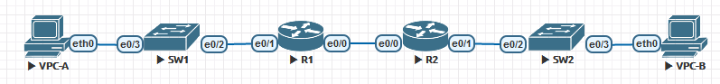

# **Lab - Implement DHCPv4**


### Topology




### Addressing Table

| Device | Interface | IP 	Address | Subnet 	Mask   | Default 	Gateway |
| ------ | --------- | -------------- | ----------------- | ------------------- |
| R1     | e0/0      | 10.0.0.1       | 255.255.255.252   | N/A                 |
| R1     | e0/1      | N/A            | N/A               | N/A                 |
| R1     | e0/1.100  | *192.168.1.1*  | *255.255.255.192* | N/A                 |
| R1     | e0/1.200  | *192.168.1.65* | *255.255.255.224* | N/A                 |
| R1     | e0/1.1000 | N/A            | N/A               | N/A                 |
| R2     | e0/0      | 10.0.0.2       | 255.255.255.252   | N/A                 |
| R2     | e0/1      | *192.168.1.97* | *255.255.255.240* | N/A                 |
| S1     | VLAN 200  | *192.168.1.66* | 255.255.255.224   | *192.168.1.65*      |
| S2     | VLAN 1    | *192.168.1.98* | *255.255.255.240* | *192.168.1.97*      |
| PC-A   | NIC       | DHCP           | DHCP              | DHCP                |
| PC-B   | NIC       | DHCP           | DHCP              | DHCP                |


### VLAN Table

| VLAN | Name        | Interface Assigned        |
| ---- | ----------- | ------------------------- |
| 1    | N/A         | S2: F0/18                 |
| 100  | Clients     | S1: F0/6                  |
| 200  | Management  | S1: VLAN 200              |
| 999  | Parking_Lot | S1: F0/1-4, F0/7-24, e1-2 |
| 1000 | Native      | N/A                       |


## Part I 

1. 1. #### Establish an addressing scheme

Subnet the network 192.168.1.0/24 to meet the following requirements:

1. 1. 1. One subnet, “Subnet A”, supporting 58 hosts (the client VLAN at R1).

Subnet A: ***192.168.1.0/26***

Record the first IP address in the Addressing Table for R1 e0/1.100. Record the second IP address in the Address Table for S1 VLAN 1 and enter the associated default gateway.

1. 1. 1. One subnet, “Subnet B”, supporting 28 hosts (the management VLAN at R1).  

Subnet B: ***192.168.1.64/27***

Record the first IP address in the Addressing Table for R1 e0/1.200. Record the second IP address in the Address Table for S1 VLAN 200 and enter the associated default gateway.

1. 1. 1. One subnet, “Subnet C”, supporting 12 hosts (the client network at R2).

Subnet C: ***192.168.1.96/28***

Record the first IP address in the Addressing Table for R2 e0/1.

1. 1. #### Cable the network as shown in the topology.

Attach the devices as shown in the topology diagram, and cable as necessary.

1. 1. #### Configure basic settings for each router

1. 1. 1. 1. Assign a device name to the router. Open configuration window

            ```
            (conf) hostname R1
            ```

1. 1. 1. 2. Disable DNS lookup to prevent the router from attempting to translate incorrectly entered commands as though they were host names.

            ```
            (conf) no ip domain-lookup
            ```

      2. 3. Assign **class** as the privileged EXEC encrypted password.

            ```
            (conf) enable secret class
            ```

      3. 4. Assign **cisco** as the console password and enable login.

            ```
            (conf) line console 0
            (conf-line) password cisco
            (conf-line) login
            ```

      4. 5. Assign **cisco** as the VTY password and enable login.

            ```
            (conf) line vty 0 4
            (conf-line) password cisco
            (conf-line) login
            ```

      5. 6. Encrypt the plaintext passwords.

            ```
            (conf) service password-encryption
            ```

      6. 7. Create a banner that warns anyone accessing the device that unauthorized access is prohibited.

            ```
            (conf) banner motd #Unauthorized access is prohibited#
            ```

      7. 8. Save the running configuration to the startup configuration file.

            ```
            # copy run start
            ```

      8. 9. Set the clock on the router to today’s time and date.

            ```
            (conf) clock set 21:12:00 11 january 2021
            ```

1. 1. #### Configure Inter-VLAN Routing on R1

   2. 1. Activate interface e0/1 on the router.

         ```
         (conf) interface e0/1
         (conf-if)no shutdown
         ```

      2. Configure sub-interfaces for each VLAN as required by the IP addressing table. All sub-interfaces use 802.1Q encapsulation and are assigned the first usable address from the IP address pool you have calculated. Ensure the sub-interface for the native VLAN does not have an IP address assigned. Include a description for each sub-interface.

         ```
         (conf) interface e0/1.100
         (conf-if) encapsulation dot1q 100
         (conf-if) ip address 192.168.1.1 255.255.255.192
         (conf-if) description Client
         (conf-if) interface e0/1.200
         (conf-if) encapsulation dot1q 200
         (conf-if) ip address 192.168.1.1 255.255.255.192
         (conf-if) description Management
         ```

      3. Verify the sub-interfaces are operational.

         ```
         R1#show ip interface brief
         Interface                  IP-Address      OK? Method Status                Prot                        ocol
         Ethernet0/0                10.0.0.1        YES NVRAM  up                    up                          
         Ethernet0/1                unassigned      YES NVRAM  up                    up                          
         Ethernet0/1.100            192.168.1.1     YES manual up                    up                          
         Ethernet0/1.200            192.168.1.65    YES manual up                    up                          
         Ethernet0/1.1000           unassigned      YES unset  up                    up                          
         Ethernet0/2                unassigned      YES NVRAM  administratively down down                        
         Ethernet0/3                unassigned      YES NVRAM  administratively down down  
         ```

   3. #### Configure e0/1 on R2, then e0/0 and static routing for both routers

   4. 1. Configure e0/1 on R2 with the first IP address of Subnet C you calculated earlier.

         ```
         R2(config)#interface e0/1
         R2(config-if)#ip address 192.168.1.97 255.255.255.240
         ```

      2. Configure interface e0/0 for each router based on the IP Addressing table above.

         ```
         R1(config)#interface e0/0
         R1(config-if)#ip address 10.0.0.1 255.255.255.252
         
         R2(config)#interface e0/0
         R2(config-if)#ip address 10.0.0.2 255.255.255.252
         ```

      3. Configure a default route on each router pointed to the IP address of e0/0 on the other router.

         ```
         R1(config)#ip route 192.168.1.96 255.255.255.240 10.0.0.2
         
         R2(config)#ip route 192.168.1.0 255.255.255.192 10.0.0.1
         R2(config)#ip route 192.168.1.64 255.255.255.224 10.0.0.1
         ```

      4. Verify static routing is working by pinging R2’s e0/1 address from R1.

         ```
         R1#ping 192.168.1.97
         Type escape sequence to abort.
         Sending 5, 100-byte ICMP Echos to 192.168.1.97, timeout is 2 seconds:
         !!!!!
         Success rate is 100 percent (5/5), round-trip min/avg/max = 1/1/2 ms
         ```

      5. Save the running configuration to the startup configuration file.

         ```
         #copy run start
         ```

Close configuration window

1. 1. #### Configure basic settings for each switch.

   2. 1. Assign a device name to the switch. Open configuration window

         ```
         (conf) hostname SW1
         ```

         2. Disable DNS lookup to prevent the router from attempting to translate incorrectly entered commands as though they were host names.

1. 1. 1. ```
         (conf) no ip domain-lookup
         ```

      2. 3. Assign **class** as the privileged EXEC encrypted password.

      3. ```
         (conf) enable secret class
         ```

      4. 4. Assign **cisco** as the console password and enable login.

      5. ```
         (conf) line console 0
         (conf-line) password cisco
         (conf-line) login
         ```

      6. 5. Assign **cisco** as the VTY password and enable login.

      7. ```
         (conf) line vty 0 4
         (conf-line) password cisco
         (conf-line) login
         ```

      8. 6. Encrypt the plaintext passwords.

      9. ```
         (conf) service password-encryption
         ```

      10. 7. Create a banner that warns anyone accessing the device that unauthorized access is prohibited.

      11. ```
          (conf) banner motd #Unauthorized access is prohibited#
          ```

      12. 1. Save the running configuration to the startup configuration file.

             ```
             # copy run start
             ```

          2. Set the clock on the switch to today’s time and date.

             ```
             (conf) clock set 21:34:00 11 january 2021
             ```

**Note**: Use the question mark (**?**) to help with the correct sequence of parameters needed to execute this command.

1. 1. 1. 9. Copy the running configuration to the startup configuration.

            ```
            # copy run start
            ```

      2. 1. #### Create VLANs on S1.

**Note**: S2 is only configured with basic settings.

1. 1. 1. 1. Create and name the required VLANs on switch 1 from the table above.

            ```
            SW1(config)#VLAN 200
            SW1(config-vlan)#name Management
            SW1(config-vlan)#VLAN 100
            SW1(config-vlan)#name Client
            SW1(config-vlan)#VLAN 999
            SW1(config-vlan)#name Parking_Lot
            SW1(config-vlan)#VLAN 1000
            SW1(config-vlan)#name Native
            ```

         2. Configure and activate the management interface on S1 (VLAN 200) using the second IP address from the subnet calculated earlier. Additionally, set the default gateway on S1.

            ```
            SW1(config)#interface VLAN 200
            SW1(config-if)#ip address 192.168.1.66 255.255.255.224
            SW1(config-if)#no shutdown
            SW1(config-if)#exit
            SW1(config)#ip route 0.0.0.0 0.0.0.0 192.168.1.65
            ```

         3. Configure and activate the management interface on S2 (VLAN 1) using the second IP address from the subnet calculated earlier. Additionally, set the default gateway on S2

            ```
            SW2(config)#interface vlan 1
            SW2(config-if)#ip address 192.168.1.98 255.255.255.240
            SW2(config-if)#no shut
            SW2(config-if)#exit
            SW2(config)#ip route 0.0.0.0 0.0.0.0 192.168.1.97
            ```

         4. Assign all unused ports on S1 to the Parking_Lot VLAN, configure them for static access mode, and administratively deactivate them. On S2, administratively deactivate all the unused ports.

            ```
            SW1(config)#interface range e0/0-1
            SW1(config-if-range)#switchport mode access
            SW1(config-if-range)#switchport access vlan 999
            SW1(config-if-range)#shutdown
            
            SW2(config)#interface range e0/0-1
            SW2(config-if-range)#shutdown
            ```

**Note**: The interface range command is helpful to accomplish this task with as few commands as necessary.

1. 1. #### Assign VLANs to the correct switch interfaces.

   2. 1. Assign used ports to the appropriate VLAN (specified in the VLAN table above) and configure them for static access mode.

```
SW1(config)#interface range e0/2-3
SW1(config-if-range)#switchport mode access
SW1(config)#interface e0/3
SW2(config-if)switchport access vlan 100

SW2(config)#interface range e0/2-3
SW2(config-if-range)#switchport mode access
```

1. 1. 1. 2. Verify that the VLANs are assigned to the correct interfaces.

            ```
            SW1#sh vlan brief
            
            VLAN Name                             Status    Ports
            ---- -------------------------------- --------- -------------------------------
            1    default                          active    Et0/2
            100  Client                           active    Et0/3
            200  Management                       active
            999  Parking_Lot                      active    Et0/0, Et0/1
            1000 Native                           active
            1002 fddi-default                     act/unsup
            1003 token-ring-default               act/unsup
            1004 fddinet-default                  act/unsup
            1005 trnet-default                    act/unsup
            
            ```

##### Question:

Why is interface Et0/2 listed under VLAN 1?

**Это VLAN по умолчанию (Native VLAN), для данного интерфейса нет VLAN для назначения.**

1. 1. #### Manually configure S1’s interface F0/5 as an 802.1Q trunk.

   2. 1. Change the switchport mode on the interface to force trunking.

         ```
         SW1(config)#interface e0/2
         SW1(config-if)#switchport trunk encapsulation dot1q
         SW1(config-if)#switchport mode trunk
         ```

      2. As a part of the trunk configuration, set the native VLAN to 1000.

         ```
         SW1(config-if)#switchport trunk native vlan 1000
         ```

      3. As another part of trunk configuration, specify that VLANs 100, 200, and 1000 are allowed to cross the trunk.

         ```
         SW1(config-if)#switchport trunk allowed vlan 100
         SW1(config-if)#switchport trunk allowed vlan add 200
         SW1(config-if)#switchport trunk allowed vlan add 1000
         ```

      4. Save the running configuration to the startup configuration file.

         ```
         SW1#copy run start
         ```

      5. Verify trunking status.

         ```
         SW1#sh interfaces trunk
         
         Port        Mode             Encapsulation  Status        Native vlan
         Et0/2       on               802.1q         trunking      1000
         
         Port        Vlans allowed on trunk
         Et0/2       100,200,1000
         
         Port        Vlans allowed and active in management domain
         Et0/2       100,200,1000
         
         Port        Vlans in spanning tree forwarding state and not pruned
         Et0/2       100,200,1000
         ```

##### Question:

At this point, what IP address would the PC’s have if they were connected to the network using DHCP?

**Так как DCHP сервера еще нет - они сгенерировали бы случайные IP адреса из сети 169.254.0.0/16**


1. ## Part II

In Part 2, you will configure and verify a DHCPv4 Server on R1. The DHCPv4 server will service two subnets, Subnet A and Subnet C.

1. 1. #### Configure R1 with DHCPv4 pools for the two supported subnets. Only the DHCP Pool for subnet A is given below

   2. 1. Exclude the first five useable addresses from each address pool.

         ```
         R1(config)#ip dhcp excluded-address 192.168.1.1 192.168.1.5
         R1(config)#ip dhcp excluded-address 192.168.1.97 192.168.1.101
         ```

1. 1. 1. 2. Create the DHCP pool (Use a unique name for each pool).

            ```
            R1(config)#ip dhcp pool CLIENT-NET-R1
            R1(dhcp-config)#ip dhcp pool CLIENT-NET-R2
            ```

      2. 3. Specify the network that this DHCP server is supporting.

            ```
            R1(dhcp-config)#ip dhcp pool CLIENT-NET-R1
            R1(dhcp-config)#network 192.168.1.0 255.255.255.192
            R1(dhcp-config)#ip dhcp pool CLIENT-NET-R2
            R1(dhcp-config)#network 192.168.1.96 255.255.255.240
            ```

      3. 4. Configure the domain name as ccna-lab.com

            ```
            R1(dhcp-config)#ip dhcp pool CLIENT-NET-R1
            R1(dhcp-config)#domain-name ccna-lab.com
            R1(dhcp-config)#ip dhcp pool CLIENT-NET-R2
            R1(dhcp-config)#domain-name ccna-lab.com
            ```

      4. 5. Configure the appropriate default gateway for each DHCP pool.

            ```
            R1(dhcp-config)#ip dhcp pool CLIENT-NET-R1
            R1(dhcp-config)#default-router 192.168.1.1
            R1(dhcp-config)#ip dhcp pool CLIENT-NET-R2
            R1(dhcp-config)#default-router 192.168.1.97
            ```

      5. 6. Configure the lease time for 2 days 12 hours and 30 minutes.

            ```
            R1(dhcp-config)#ip dhcp pool CLIENT-NET-R1
            R1(dhcp-config)#lease 2 12 30
            R1(dhcp-config)#ip dhcp pool CLIENT-NET-R2
            R1(dhcp-config)#lease 2 12 30
            ```

      6. 7. Next, configure the second DHCPv4 Pool using the pool name R2_Client_LAN and the calculated network, default-router and use the same domain name and lease time from the previous DHCP pool.

      7. 1. #### Save your configuration

Save the running configuration to the startup configuration file.

```
R1#copy run start
```

Close configuration window

1. 1. #### Verify the DHCPv4 Server configuration

   2. 1. Issue the command **show ip dhcp pool** to examine the pool details.

         ```
         R1#sh ip dhcp pool
         
         Pool CLIENT-NET-R1 :
          Utilization mark (high/low)    : 100 / 0
          Subnet size (first/next)       : 0 / 0
          Total addresses                : 62
          Leased addresses               : 0
          Pending event                  : none
          1 subnet is currently in the pool :
          Current index        IP address range                    Leased addresses
          192.168.1.1          192.168.1.1      - 192.168.1.62      0
         
         Pool CLIENT-NET-R2 :
          Utilization mark (high/low)    : 100 / 0
          Subnet size (first/next)       : 0 / 0
          Total addresses                : 14
          Leased addresses               : 0
          Pending event                  : none
          1 subnet is currently in the pool :
          Current index        IP address range                    Leased addresses
          192.168.1.97         192.168.1.97     - 192.168.1.110     0
         
         ```

      2. Issue the command **show ip dhcp bindings** to examine established DHCP address assignments.

         ```
         R1#show ip dhcp binding
         Bindings from all pools not associated with VRF:
         IP address          Client-ID/              Lease expiration        Type
                             Hardware address/
                             User name
         ```

      3. Issue the command **show ip dhcp server** **statistics** to examine DHCP messages.

         ```
         R1#sh ip dh ser statistics
         Memory usage         25119
         Address pools        2
         Database agents      0
         Automatic bindings   0
         Manual bindings      0
         Expired bindings     0
         Malformed messages   0
         Secure arp entries   0
         
         Message              Received
         BOOTREQUEST          0
         DHCPDISCOVER         0
         DHCPREQUEST          0
         DHCPDECLINE          0
         DHCPRELEASE          0
         DHCPINFORM           0
         
         Message              Sent
         BOOTREPLY            0
         DHCPOFFER            0
         DHCPACK              0
         DHCPNAK              0
         
         ```

   3. #### Attempt to acquire an IP address from DHCP on PC-A

   4. 1. Open a command prompt on PC-A and issue the command **ipconfig /renew**.

         ```
         VPCS> ip dhcp -r
         DDORA IP 192.168.1.6/26 GW 192.168.1.1
         ```

      2. Once the renewal process is complete, issue the command **ipconfig** to view the new IP information.

         ```
         VPCS> show ip
         
         NAME        : VPCS[1]
         IP/MASK     : 192.168.1.6/26
         GATEWAY     : 192.168.1.1
         DNS         :
         DHCP SERVER : 192.168.1.1
         DHCP LEASE  : 217740, 217800/108900/190575
         DOMAIN NAME : ccna-lab.com
         MAC         : 00:50:79:66:68:05
         LPORT       : 20000
         RHOST:PORT  : 127.0.0.1:30000
         MTU         : 1500
         ```

      3. Test connectivity by pinging R1’s e0/1 interface IP address.

         ```
         VPCS> ping 192.168.1.1
         
         84 bytes from 192.168.1.1 icmp_seq=1 ttl=255 time=1.100 ms
         84 bytes from 192.168.1.1 icmp_seq=2 ttl=255 time=0.942 ms
         84 bytes from 192.168.1.1 icmp_seq=3 ttl=255 time=0.902 ms
         84 bytes from 192.168.1.1 icmp_seq=4 ttl=255 time=0.789 ms
         84 bytes from 192.168.1.1 icmp_seq=5 ttl=255 time=0.855 ms
         ```

   5. 1. ## Part III

In Part 3, you will configure R2 to relay DHCP requests from the local area network on interface e0/1 to the DHCP server (R1). 

1. 1. #### Configure R2 as a DHCP relay agent for the LAN on e0/1

   2. 1. Configure the **ip helper-address** command on e0/1 specifying R1’s e0/0 IP address.

Open configuration window

```
R2(config)#int e0/1
R2(config-if)#ip helper-address 10.0.0.1
```

1. 1. 1. 2. Save your configuration.

      2. ```
         R2#copy run start
         ```

Close configuration window

1. 1. #### Attempt to acquire an IP address from DHCP on PC-B

   2. 1. Open a command prompt on PC-B and issue the command **ipconfig /renew**.

         ```
         VPCS> ip dhcp -r
         DDORA IP 192.168.1.102/28 GW 192.168.1.97
         ```

      2. Once the renewal process is complete, issue the command **ipconfig** to view the new IP information.

         ```
         VPCS> show ip
         
         NAME        : VPCS[1]
         IP/MASK     : 192.168.1.102/28
         GATEWAY     : 192.168.1.97
         DNS         :
         DHCP SERVER : 10.0.0.1
         DHCP LEASE  : 217780, 217800/108900/190575
         DOMAIN NAME : ccna-lab.com
         MAC         : 00:50:79:66:68:06
         LPORT       : 20000
         RHOST:PORT  : 127.0.0.1:30000
         MTU         : 1500
         
         ```

      3. Test connectivity by pinging R1’s e0/1 interface IP address.

         ```
         VPCS> ping 192.168.1.1
         
         84 bytes from 192.168.1.1 icmp_seq=1 ttl=254 time=1.406 ms
         84 bytes from 192.168.1.1 icmp_seq=2 ttl=254 time=1.542 ms
         84 bytes from 192.168.1.1 icmp_seq=3 ttl=254 time=1.037 ms
         84 bytes from 192.168.1.1 icmp_seq=4 ttl=254 time=1.501 ms
         84 bytes from 192.168.1.1 icmp_seq=5 ttl=254 time=0.983 ms
         ```

      4. Issue the **show ip dhcp binding** on R1 to verify DHCP bindings.

         ```
         R1#sh ip dh bin
         Bindings from all pools not associated with VRF:
         IP address          Client-ID/              Lease expiration        Type
                             Hardware address/
                             User name
         192.168.1.6         0100.5079.6668.05       Jan 14 2021 12:37 PM    Automatic
         192.168.1.102       0100.5079.6668.06       Jan 14 2021 12:42 PM    Automatic
         ```

      5. Issue the **show ip dhcp server statistics** on R1 and R2 to verify DHCP messages.

```
R1#sh ip dh ser st
Memory usage         42037
Address pools        2
Database agents      0
Automatic bindings   2
Manual bindings      0
Expired bindings     0
Malformed messages   0
Secure arp entries   0

Message              Received
BOOTREQUEST          0
DHCPDISCOVER         4
DHCPREQUEST          2
DHCPDECLINE          0
DHCPRELEASE          0
DHCPINFORM           0

Message              Sent
BOOTREPLY            0
DHCPOFFER            2
DHCPACK              2
DHCPNAK              0
```

