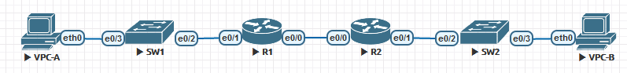

# **Lab - Configure DHCPv6**


### Topology




### Addressing Table

| Device | Interface | IPv6 Address          |
| ------ | --------- | --------------------- |
| R1     | e0/0      | 2001:db8:acad:2::1/64 |
| R1     | e0/0      | fe80::1               |
| R1     | e0/1      | 2001:db8:acad:1::1/64 |
| R1     | e0/1      | fe80::1               |
| R2     | e0/0      | 2001:db8:acad:2::2/64 |
| R2     | e0/0      | fe80::2               |
| R2     | e0/1      | 2001:db8:acad:3::1/64 |
| R2     | e0/1      | fe80::1               |
| PC-A   | NIC       | DHCP                  |
| PC-B   | NIC       | DHCP                  |

### Objectives

**Part 1: Build the Network and Configure Basic Device Settings**

**Part 2: Verify SLAAC address assignment from R1**

**Part 3: Configure and verify a Stateless DHCPv6 Server on R1**

**Part 4: Configure and verify a Stateful DHCPv6 Server on R1**

**Part 5: Configure and verify a DHCPv6 Relay on R2**

### Background / Scenario

The dynamic assignment of IPv6 global unicast addresses (GUA) can be configured the following three ways:

- Stateless Address Auoconfiguration (SLACC)
- Stateless Dynamic Host Configuration Protocol for IPv6 (DHCPv6)
- Stateful DHCPv6

When using SLACC to assign IPv6 addresses to hosts a DHCPv6 server is not used. Because a DHCPv6 server is not used when implementing SLACC, hosts are unable to receive additional critical network information, including a domain name server (DNS) address as well as a domain name.

When using Stateless DHCPv6 to assign IPv6 addresses to host, a DHCPv6 server is used to assign the additional critical network information, however the IPv6 address is assigned using SLACC.

When implementing Stateful DHCPv6, a DHCPv6 server assigns all network information, including the IPv6 address.

The determination of how hosts obtain they dynamic IPv6 addressing is dependent on flag setting contain within the router advertisement (RA) messages.

In this scenario, the company has grown in size, and the network administrators can no longer assign IP addresses to devices manually. Your job is to configure the R2 router to assign IPv6 addresses on two different subnets connected to router R1.

**Note**: The routers used with CCNA hands-on labs are Cisco 4221 with Cisco IOS XE Release 16.9.4 (universalk9 image). The switches used in the labs are Cisco Catalyst 2960s with Cisco IOS Release 15.2(2) (lanbasek9 image). Other routers, switches, and Cisco IOS versions can be used. Depending on the model and Cisco IOS version, the commands available and the output produced might vary from what is shown in the labs. Refer to the Router Interface Summary Table at the end of the lab for the correct interface identifiers.

**Note**: Ensure that the routers and switches have been erased and have no startup configurations. If you are unsure contact your instructor.

### Required Resources

- 2 Routers (Cisco 4221 with Cisco IOS XE Release 16.9.4 universal image or comparable)
- 2 Switches (Cisco 2960 with Cisco IOS Release 15.2(2) lanbasek9 image or comparable) - **Optional**
- 2 PCs (Windows with a terminal emulation program, such as Tera Term)
- Console cables to configure the Cisco IOS devices via the console ports
- Ethernet cables as shown in the topology

### Instructions


## Part I

In Part 1, you will set up the network topology and configure basic settings on the PC hosts and switches.

1. 1. #### Cable the network as shown in the topology.

Attach the devices as shown in the topology diagram, and cable as necessary.

1. 1. #### Configure basic settings for each switch. (Optional)

Open configuration window

1. 1. 1. Assign a device name to the switch.

         ```
         (conf) hostname SW1
         ```

      2. Disable DNS lookup to prevent the router from attempting to translate incorrectly entered commands as though they were host names.

         ```
         (conf) no ip domain-lookup
         ```

      3. Assign **class** as the privileged EXEC encrypted password.

         ```
         (conf) enable secret class
         ```

      4. Assign **cisco** as the console password and enable login.

         ```
         (conf) line console 0
         (conf-line) password cisco
         (conf-line) login
         ```

      5. Assign **cisco** as the VTY password and enable login.

         ```
         (conf) line vty 0 4
         (conf-line) password cisco
         (conf-line) login
         ```

      6. Encrypt the plaintext passwords.

         ```
         (conf) service password-encryption
         ```

      7. Create a banner that warns anyone accessing the device that unauthorized access is prohibited.

         ```
         (conf) banner motd #Unauthorized access is prohibited#
         ```

      8. Shutdown all unused ports

         ```
         (conf) interface range e0/0-1
         (config-if-range) shutdown
         ```

      9. Save the running configuration to the startup configuration file.

         ```
         # copy run start
         ```

Close configuration window

1. 1. #### Configure basic settings for each router.

Open configuration window

1. 1. 1. 1. Assign a device name to the router.

            ```
            (conf) hostname R1
            ```

         2. Disable DNS lookup to prevent the router from attempting to translate incorrectly entered commands as though they were host names.

            ```
            (conf) no ip domain-lookup
            ```

         3. Assign **class** as the privileged EXEC encrypted password.

            ```
            (conf) enable secret class
            ```

         4. Assign **cisco** as the console password and enable login.

            ```
            (conf) line console 0
            (conf-line) password cisco
            (conf-line) login
            ```

         5. Assign **cisco** as the VTY password and enable login.

            ```
            (conf) line vty 0 4
            (conf-line) password cisco
            (conf-line) login
            ```

         6. Encrypt the plaintext passwords.

            ```
            (conf) service password-encryption
            ```

         7. Create a banner that warns anyone accessing the device that unauthorized access is prohibited.

            ```
            (conf) banner motd #Unauthorized access is prohibited#
            ```

         8. Enable IPv6 Routing

            ```
            (conf) ipv6 unicast-routing
            ```

         9. Save the running configuration to the startup configuration file.

            ```
            # copy run start
            ```

         10. #### Configure interfaces and routing for both routers.

         11. 1. Configure the e0/0 and e0/1 interfaces on R1 and R2 with the IPv6 addresses specified in the table above.

                ```
                R1(config)#int e0/0
                R1(config-if)#ipv6 address 2001:db8:acad:2::1/64
                R1(config-if)#ipv6 address fe80::1 link-local
                R1(config-if)#no shut
                R1(config-if)#int e0/1
                R1(config-if)#ipv6 address 2001:db8:acad:1::1/64
                R1(config-if)#ipv6 address fe80::1 link-local
                R1(config-if)#no shut
                
                R2(config)#int e0/0
                R2(config-if)#ipv6 address 2001:db8:acad:2::2/64
                R2(config-if)#ipv6 address fe80::2 link-local
                R2(config-if)#no shut
                R2(config-if)#int e0/1
                R2(config-if)#ipv6 address 2001:db8:acad:3::1/64
                R2(config-if)#ipv6 address fe80::1 link-local
                R2(config-if)#no shut
                ```

             2. Configure a default route on each router pointed to the IP address of e0/0 on the other router.

                ```
                R1(config)#ipv6 route ::/0 2001:db8:acad:2::2
                
                R2(config)#ipv6 route ::/0 2001:db8:acad:2::1
                ```

             3. Verify routing is working by pinging R2’s e0/1 address from R1

                ```
                R1#ping 2001:db8:acad:3::1
                Type escape sequence to abort.
                Sending 5, 100-byte ICMP Echos to 2001:DB8:ACAD:3::1, timeout is 2 seconds:
                !!!!!
                Success rate is 100 percent (5/5), round-trip min/avg/max = 1/1/1 ms
                ```

             4. Save the running configuration to the startup configuration file.

                ```
                # copy run start
                ```

Close configuration window

1. 

2. ## Part II

In Part 2, you will verify that Host PC-A receives an IPv6 address using the SLAAC method.

Power PC-A up and ensure that the NIC is configured for IPv6 automatic configuration.

After a few moments, the results of the command **ipconfig** should show that PC-A has assigned itself an address from the 2001:db8:1::/64 network.

```
C:\Users\Student> ipconfig

Windows IP Configuration

Ethernet adapter Ethernet 2:

   Connection-specific DNS Suffix  . : 
   IPv6 Address. . . . . . . . . . . : 2001:db8:acad:1:5c43:ee7c:2959:da68
   Temporary IPv6 Address. . . . . . : 2001:db8:acad:1:3c64:e4f9:46e1:1f23
   Link-local IPv6 Address . . . . . : fe80::5c43:ee7c:2959:da68%6
   IPv4 Address. . . . . . . . . . . : 169.254.218.104
   Subnet Mask . . . . . . . . . . . : 255.255.0.0
   Default Gateway . . . . . . . . . : fe80::1%6
```

```
VPCS> show ipv6

NAME              : VPCS[1]
LINK-LOCAL SCOPE  : fe80::250:79ff:fe66:6805/64
GLOBAL SCOPE      : 2001:db8:acad:1:2050:79ff:fe66:6805/64
DNS               :
ROUTER LINK-LAYER : aa:bb:cc:00:30:10
MAC               : 00:50:79:66:68:05
LPORT             : 20000
RHOST:PORT        : 127.0.0.1:30000
MTU:              : 1500
```

#### Question:

Where did the host-id portion of the address come from?

**Хостовую часть адреса компьютер формирует сам - либо случайным образом либо используя алгоритм Modified EUI-64.**

1. 

2. ## Part III

In Part 3, you will configure and verify a stateless DHCP server on R1. The objective is to provide PC-A with DNS server and Domain information.

1. 1. #### Examine the configuration of PC-A in more detail.

   2. 1. Issue the command **ipconfig /all** on PC-A and take a look at the output.

```
C:\Users\Student> ipconfig /all

Windows IP Configuration

   Host Name . . . . . . . . . . . . : DESKTOP-3FR7RKA
   Primary Dns Suffix  . . . . . . . : 
   Node Type . . . . . . . . . . . . : Hybrid
   IP Routing Enabled. . . . . . . . : No
   WINS Proxy Enabled. . . . . . . . : No

Ethernet adapter Ethernet0:

   Connection-specific DNS Suffix  . : 
   Description . . . . . . . . . . . : Intel(R) 852574L Gigabit Network Connection
   Physical Address. . . . . . . . . : 00-50-56-83-63-6D
   IPv6 Address. . . . . . . . . . . : 2001:db8:acad:1:5c43:ee7c:2959:da68(Preferred)
   Temporary IPv6 Address. . . . . . : 2001:db8:acad:1:3c64:e4f9:46e1:1f23(Preferred)
   Link-local IPv6 Address . . . . . : fe80::5c43:ee7c:2959:da68%6(Preferred)
   IPv4 Address. . . . . . . . . . . : 169.254.218.104(Preferred)
   Subnet Mask . . . . . . . . . . . : 255.255.0.0
   Default Gateway . . . . . . . . . : fe80::1%6
   DHCPv6 IAID . . . . . . . . . . . : 50334761
   DHCPv6 Client DUID. . . . . . . . : 00-01-00-01-24-F5-CE-A2-00-50-56-B3-63-6D
   DNS Servers . . . . . . . . . . . : fec0:0:0:ffff::1%1
​                                      fec0:0:0:ffff::2%1
​                                      fec0:0:0:ffff::3%1
   NetBIOS over Tcpip. . . . . . . . : Enabled
```

```
VPCS> show ipv6

NAME              : VPCS[1]
LINK-LOCAL SCOPE  : fe80::250:79ff:fe66:6805/64
GLOBAL SCOPE      : 2001:db8:acad:1:2050:79ff:fe66:6805/64
DNS               :
ROUTER LINK-LAYER : aa:bb:cc:00:30:10
MAC               : 00:50:79:66:68:05
LPORT             : 20000
RHOST:PORT        : 127.0.0.1:30000
MTU:              : 1500
```

1. 1. 1. **Notice** that there is no Primary DNS suffix. Also note that the DNS server addresses provided are “site local anycast” addresses, and not unicast addresses, as would be expected.

      2. 1. #### Configure R1 to provide stateless DHCPv6 for PC-A.

         2. 1. Create an IPv6 DHCP pool on R1 named R1-STATELESS. As a part of that pool, assign the DNS server address as 2001:db8:acad::1 and the domain name as stateless.com.

Open configuration window

```
R1(config)# ipv6 dhcp pool R1-STATELESS
R1(config-dhcp)# dns-server 2001:db8:acad::254
R1(config-dhcp)# domain-name STATELESS.com
```

1. 1. 1. 2. Configure the e0/1 interface on R1 to provide the OTHER config flag to the R1 LAN, and specify the DHCP pool you just created as the DHCP resource for this interface.

```
R1(config)# interface e0/1
R1(config-if)# ipv6 nd other-config-flag
R1(config-if)# ipv6 dhcp server R1-STATELESS
```

1. 1. 1. 3. Save the running configuration to the startup configuration file.

            ```
            R1#copy run start
            ```

Close configuration window

1. 1. 1. 4. Restart PC-A.

      2. 5. Examine the output of **ipconfig /all** and notice the changes.

```
C:\Users\Student> ipconfig /all

Windows IP Configuration

   Host Name . . . . . . . . . . . . : DESKTOP-3FR7RKA
   Primary Dns Suffix  . . . . . . . : 
   Node Type . . . . . . . . . . . . : Hybrid
   IP Routing Enabled. . . . . . . . : No
   WINS Proxy Enabled. . . . . . . . : No
   DNS Suffix Search List. . . . . . : STATELESS.com
 
Ethernet adapter Ethernet0:
 
   Connection-specific DNS Suffix  . : STATELESS.com
   Description . . . . . . . . . . . : Intel(R) 82574L Gigabit Network Connection
   Physical Address. . . . . . . . . : 00-50-56-83-63-6D
   DHCP Enabled. . . . . . . . . . . : Yes
   Autoconfiguration Enabled . . . . : Yes
   IPv6 Address. . . . . . . . . . . : 2001:db8:acad:1:5c43:ee7c:2959:da68(Preferred)
   Temporary IPv6 Address. . . . . . : 2001:db8:acad:1:3c64:e4f9:46e1:1f23(Preferred)
   Link-local IPv6 Address . . . . . : fe80::5c43:ee7c:2959:da68%6(Preferred)
   IPv4 Address. . . . . . . . . . . : 169.254.218.104(Preferred)
   Subnet Mask . . . . . . . . . . . : 255.255.0.0
   Default Gateway . . . . . . . . . : fe80::1%6
   DHCPv6 IAID . . . . . . . . . . . : 50334761
   DHCPv6 Client DUID. . . . . . . . : 00-01-00-01-24-F5-CE-A2-00-50-56-B3-63-6D
   DNS Servers . . . . . . . . . . . : 2001:db8:acad::254
   NetBIOS over Tcpip. . . . . . . . : Enabled
   Connection-specific DNS Suffix Search List : STATELESS.com                             
```

1. 1. 1. 6. Test connectivity by pinging R2’s e0/1 interface IP address.

      2. ```
         VPCS> ping 2001:db8:acad:3::1
         
         2001:db8:acad:3::1 icmp6_seq=1 ttl=63 time=3.199 ms
         2001:db8:acad:3::1 icmp6_seq=2 ttl=63 time=2.075 ms
         2001:db8:acad:3::1 icmp6_seq=3 ttl=63 time=1.173 ms
         2001:db8:acad:3::1 icmp6_seq=4 ttl=63 time=1.090 ms
         2001:db8:acad:3::1 icmp6_seq=5 ttl=63 time=1.292 ms
         ```

      3. 

      4. ## Part IV

In Part 4, you will configure R1 to respond to DHCPv6 requests from the LAN on R2.

1. 1. 1. 1. Create a DHCPv6 pool on R1 for the 2001:db8:acad:3:aaaa::/80 network. This will provide 	addresses to the LAN connected to interface e0/1 on R2. As a part of the pool, set the DNS server to 2001:db8:acad::254, and set the domain name to STATEFUL.com.

Open configuration window

```
R1(config)# ipv6 dhcp pool R2-STATEFUL
R1(config-dhcp)# address prefix 2001:db8:acad:3:aaa::/80
R1(config-dhcp)# dns-server 2001:db8:acad::254
R1(config-dhcp)# domain-name STATEFUL.com
```


1. 1. 1. 1. Assign the DHCPv6 pool you just created to interface e0/0 on R1.

```
R1(config)# interface e0/0
R1(config-if)# ipv6 dhcp server R2-STATEFUL
```

Close configuration window

1. 

2. ## Part V

In Part 5, you will configure and verify DHCPv6 relay on R2, allowing PC-B to receive an IPv6 Address.

1. 1. #### Power on PC-B and examine the SLAAC address that it generates.

```
C:\Users\Student> ipconfig /all

Windows IP Configuration
 
   Host Name . . . . . . . . . . . . : DESKTOP-3FR7RKA
   Primary Dns Suffix  . . . . . . . : 
   Node Type . . . . . . . . . . . . : Hybrid
   IP Routing Enabled. . . . . . . . : No
   WINS Proxy Enabled. . . . . . . . : No

Ethernet adapter Ethernet0:

   Connection-specific DNS Suffix  . : 
   Description . . . . . . . . . . . : Intel(R) 82574L Gigabit Network Connection
   Physical Address. . . . . . . . . : 00-50-56-B3-7B-06
   DHCP Enabled. . . . . . . . . . . : Yes
   Autoconfiguration Enabled . . . . : Yes
   IPv6 Address. . . . . . . . . . . : 2001:db8:acad:3:a0f3:3d39:f9fb:a020(Preferred)
   Temporary IPv6 Address. . . . . . : 2001:db8:acad:3:d4f3:7b16:eeee:b2b5(Preferred)
   Link-local IPv6 Address . . . . . : fe80::a0f3:3d39:f9fb:a020%6(Preferred)
   IPv4 Address. . . . . . . . . . . : 169.254.160.32(Preferred)
   Subnet Mask . . . . . . . . . . . : 255.255.0.0
   Default Gateway . . . . . . . . . : fe80::1%6
   DHCPv6 IAID . . . . . . . . . . . : 50334761
   DHCPv6 Client DUID. . . . . . . . : 00-01-00-01-24-F2-08-38-00-50-56-B3-7B-06
   DNS Servers . . . . . . . . . . . : fec0:0:0:ffff::1%1
​                                      fec0:0:0:ffff::2%1
​                                      fec0:0:0:ffff::3%1
   NetBIOS over Tcpip. . . . . . . . : Enabled
```

```
VPCS> show ipv6

NAME              : VPCS[1]
LINK-LOCAL SCOPE  : fe80::250:79ff:fe66:6806/64
GLOBAL SCOPE      : 2001:db8:acad:3:2050:79ff:fe66:6806/64
DNS               :
ROUTER LINK-LAYER : aa:bb:cc:00:40:10
MAC               : 00:50:79:66:68:06
LPORT             : 20000
RHOST:PORT        : 127.0.0.1:30000
MTU:              : 1500
```

Notice in the output that the prefix used is 2001:db8:acad:3::

1. 1. #### Configure R2 as a DHCP relay agent for the LAN on e0/1.

   2. 1. Configure the **ipv6 dhcp relay** command on R2 interface e0/1, specifying the 	destination address of the e0/0 interface on R1. Also configure the **managed-config-flag** command.

Open configuration window

```
R2(config)# interface e0/1
R2(config-if)# ipv6 nd managed-config-flag
R2(config-if)# ipv6 dhcp relay destination 2001:db8:acad:2::1 e0/0
```

1. 1. 1. 1. Save your configuration.

            ```
            R2(config-if)#do copy run start
            ```

Close configuration window

1. 1. #### Attempt to acquire an IPv6 address from DHCPv6 on PC-B.

   2. 1. Restart PC-B.
      2. Open a command prompt on PC-B and issue the command **ipconfig /all** and examine the output to see the results of the DHCPv6 relay operation.

```
C:\Users\Student> ipconfig /all

Windows IP Configuration

   Host Name . . . . . . . . . . . . : DESKTOP-3FR7RKA
   Primary Dns Suffix  . . . . . . . : 
   Node Type . . . . . . . . . . . . : Hybrid
   IP Routing Enabled. . . . . . . . : No
   WINS Proxy Enabled. . . . . . . . : No
   DNS Suffix Search List. . . . . . : STATEFUL.com
 
Ethernet adapter Ethernet0:

   Connection-specific DNS Suffix  . : STATEFUL.com
   Description . . . . . . . . . . . : Intel(R) 852574L Gigabit Network Connection
   Physical Address. . . . . . . . . : 00-50-56-B3-7B-06
   DHCP Enabled. . . . . . . . . . . : Yes
   Autoconfiguration Enabled . . . . : Yes
   IPv6 Address. . . . . . . . . . . : 2001:db8:acad3:aaaa:7104:8b7d:5402(Preferred)
   Lease Obtained. . . . . . . . . . : Sunday, October 6, 2019 3:27:13 PM
   Lease Expires . . . . . . . . . . : Tuesday, October 8, 2019 3:27:13 PM
   Link-local IPv6 Address . . . . . : fe80::a0f3:3d39:f9fb:a020%6(Preferred)
   IPv4 Address. . . . . . . . . . . : 169.254.160.32(Preferred)
   Subnet Mask . . . . . . . . . . . : 255.255.0.0
   Default Gateway . . . . . . . . . : fe80::2%6
   DHCPv6 IAID . . . . . . . . . . . : 50334761
   DHCPv6 Client DUID. . . . . . . . : 00-01-00-01-24-F2-08-38-00-50-56-B3-7B-06
   DNS Servers . . . . . . . . . . . : 2001:db8:acad::254
   NetBIOS over Tcpip. . . . . . . . : Enabled
   Connection-specific DNS Suffix Search List  : STATEFUL.com
```

1. 1. 1. 3. Test connectivity by pinging R1’s e0/1 interface IP address.

            ```
            VPCS> ping 2001:db8:acad:1::1
            
            2001:db8:acad:1::1 icmp6_seq=1 ttl=63 time=12.394 ms
            2001:db8:acad:1::1 icmp6_seq=2 ttl=63 time=0.731 ms
            2001:db8:acad:1::1 icmp6_seq=3 ttl=63 time=1.418 ms
            2001:db8:acad:1::1 icmp6_seq=4 ttl=63 time=1.286 ms
            2001:db8:acad:1::1 icmp6_seq=5 ttl=63 time=1.511 ms
            ```

            

