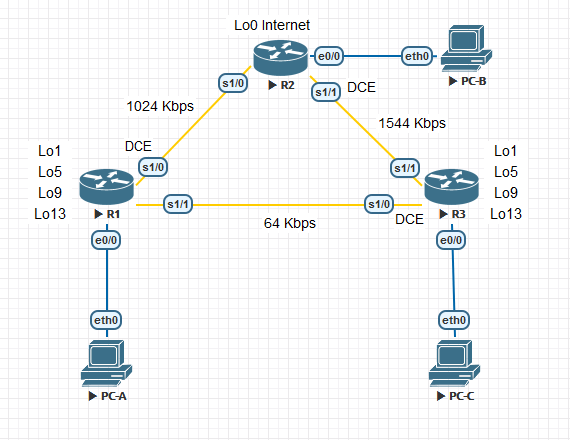

# Лабораторная работа. Настройка расширенных функций EIGRP для IPv4

### Топология



### Таблица адресации544

| Устройство | Интерфейс  | IP-адрес      | Маска подсети    | Шлюз по умолчанию |
| ---------- | ---------- | ------------- | ---------------- | ----------------- |
| R1         | e0/0       | 192.168.1.1   | 255.255.255.0    | —                 |
|            | S1/0 (DCE) | 192.168.12.1  | 255.255.255.252  | —                 |
|            | S1/1       | 192.168.13.1  | 255.255.255.252  | —                 |
|            | Lo1        | 192.168.11.1  | 255.255.255.252  | Н/Д (недоступно)  |
|            | Lo5        | 192.168.11.5  | 255.255.255.252  | —                 |
|            | Lo9        | 192.168.11.9  | 255.255.255.252  | —                 |
|            | Lo13       | 192.168.11.13 | 255.255.255.252  | —                 |
|            |            |               |                  |                   |
| R2         | e0/0       | 192.168.2.1   | 255.255.255.0    | —                 |
|            | S1/0       | 192.168.12.2  | 255.255.255.252  | —                 |
|            | S1/1 (DCE) | 192.168.23.1  | 255.255.255.252  | —                 |
|            | Lo1        | 192.168.22.1  | 255.255.255.252  | —                 |
|            |            |               |                  |                   |
| R3         | e0/0       | 192.168.3.1   | 255.255.255.0    | —                 |
|            | S1/0 (DCE) | 192.168.13.2  | 255.255.255.252  | —                 |
|            | S1/1       | 192.168.23.2  | 255.255.255.252  | —                 |
|            | Lo1        | 192.168.33.1  | 255.255.255.252  | Н/Д (недоступно)  |
|            | Lo5        | 192.168.33.5  | 255.255.255.252— |                   |
|            | Lo9        | 192.168.33.9  | 255.255.255.252  | —                 |
|            | Lo13       | 192.168.33.13 | 255.255.255.252  | —                 |
|            |            |               |                  |                   |
| PC-A       | NIC        | 192.168.1.3   | 255.255.255.0    | 192.168.1.1       |
| PC-B       | NIC        | 192.168.2.3   | 255.255.255.0    | 192.168.2.1       |
| PC-C       | NIC        | 192.168.3.3   | 255.255.255.0    | 192.168.3.1       |


### Задачи

1. Создание сети и настройка основных параметров устройства

2. Настройка EIGRP и проверка подключения

3. Настройка EIGRP для автоматического объединения

4. Настройка и распространение статического маршрута по умолчанию

5. Выполнение точной настройки EIGRP

-   Настройте параметры использования пропускной способности для EIGRP.

-   Настройте интервал отправки пакетов приветствия (hello) и таймер удержания для EIGRP.

### Общие сведения/сценарий

EIGRP поддерживает расширенный набор функций, которые позволяют вносить изменения, связанные с объединением, распространением маршрута по умолчанию, использованием пропускной способности и показателями.

В этой лабораторной работе вам предстоит настроить автоматическое объединение для EIGRP, настроить распространение маршрута EIGRP и выполнить точную настройку показателей EIGRP.

**Примечание**. В практических лабораторных работах CCNA используются маршрутизаторы с интегрированными сетевыми сервисами (ISR) Cisco 1941 с операционной системой Cisco IOS версии 15.2(4)M3 (образ universalk9). Допускается использование маршрутизаторов других моделей, а также других версий операционной системы Cisco IOS. В зависимости от модели устройства и версии Cisco IOS доступные команды и результаты их выполнения могут отличаться от тех, которые показаны в лабораторных работах. Правильные идентификаторы интерфейса см. в сводной таблице по интерфейсам маршрутизаторов в конце лабораторной работы.

**Примечание**. Убедитесь, что предыдущие настройки маршрутизаторов удалены, и на них отсутствуют файлы загрузочной конфигурации. Если вы не уверены, обратитесь к инструктору.

### Необходимые ресурсы

-   3 маршрутизатора (Cisco 1941 с операционной системой Cisco IOS версии 15.2(4)M3 (универсальный образ) или аналогичная модель)

-   3 ПК (Windows и программа эмуляции терминалов, например Tera Term)

-   Консольные кабели для настройки устройств Cisco IOS через консольные порты

-   Кабели Ethernet и последовательные кабели согласно топологии

### 1. Создание сети и настройка основных параметров устройства

В части 1 вам предстоит настроить топологию сети и сделать базовую настройку устройств.

**1.1 Создайте сеть согласно топологии.**

**1.2 Настройте узлы ПК.**

**1.3 Выполните запуск и перезагрузку маршрутизаторов.**

**1.4 Произведите базовую настройку маршрутизаторов.**

Отключите DNS-поиск.

```
(conf) no ip domain-lookup
```

Настройте имена устройств в соответствии с топологией.

```
(conf) hostname R1
```

Назначьте **cisco** в качестве паролей консоли и VTY.

```
(conf) line vty 0 4
(conf-line) password cisco
(conf-line) login

(conf) line console 0
(conf-line) password cisco
(conf-line) login
```

Назначьте **class** в качестве пароля доступа к привилегированному режиму EXEC.

```
(conf) enable secret class
```

Настройте **logging synchronous**, чтобы сообщения от консоли не могли прерывать ввод команд.

```
(conf-line) logging synchronous
```

Назначьте IP-адреса всем интерфейсам в соответствии с таблицей адресации.

```
(conf) interface s1/0
(conf-if)ip address 192.168.12.1 255.255.255.252
(conf-if) no shutdown
```

**Примечание**. На этот раз **НЕ** настраивайте интерфейсы обратной петли.

Скопируйте текущую конфигурацию в файл загрузочной конфигурации.

### 2. Настройка EIGRP и проверка подключения

В части 2 вам необходимо настроить базовые функции EIGRP для топологии и задать пропускную способность для последовательных интерфейсов.

**Примечание**. В этой лабораторной работе содержится минимальный набор команд, необходимых для настройки EIGRP. Список требуемых команд приведен в Приложении А. Проверьте свои знания: настройте устройства, не заглядывая в приложение.

**2.1 Настройте EIGRP.**

На маршрутизаторе R1 настройте маршрутизацию EIGRP с номером автономной системы (AS) 1 для всех сетей с прямым подключением. *Запишите использованные команды в поле ниже.*

```
R1(config)#router eigrp 1
R1(config-router)#network 192.168.1.0 0.0.0.255
R1(config-router)#network 192.168.12.0 0.0.0.3
R1(config-router)#network 192.168.13.0 0.0.0.3
```

Для интерфейса локальной сети маршрутизатора R1 отключите передачу пакетов приветствия (hello) EIGRP. *Ниже напишите команду, которую вы использовали.*

```
R1(config-router)#passive-interface e0/0
```

На маршрутизаторе R1 настройте пропускную способность для интерфейса S1/0 равной 1024 Кбит/с, а для интерфейса S1/1 равной 64 Кбит/с. *Запишите использованные команды в поле ниже.* **Примечание**. Команда **bandwidth** влияет только на вычисление показателя EIGRP, а не на фактическую пропускную способность последовательного канала связи.

```
R1(config)#interface s1/0
R1(config-if)#bandwidth 1024
R1(config-if)#interface s1/1
R1(config-if)#bandwidth 64
```

На маршрутизаторе R2 настройте маршрутизацию EIGRP с идентификатором AS 1 для всех сетей, отключите передачу пакетов приветствия (hello) EIGRP для интерфейса локальной сети и задайте пропускную способность для интерфейса S1/0 равной 1024 Кбит/с.

```
R2(config)#router eigrp 1
R2(config-router)#network 192.168.2.0
R2(config-router)#network 192.168.12.0 0.0.0.3
R2(config-router)#network 192.168.12.0 0.0.0.3
*May  9 11:18:38.902: %DUAL-5-NBRCHANGE: EIGRP-IPv4 1: Neighbor 192.168.12.1 (Serial1/0) is up: new adjacency
R2(config-router)#network 192.168.23.0 0.0.0.3
R2(config-router)#passive-interface e0/0
R2(config)#interface s1/0
R2(config-if)#bandwidth 1024
R2(config-if)#interface s1/1
R2(config-if)#bandwidth 1544
```

На маршрутизаторе R3 настройте маршрутизацию EIGRP с идентификатором AS 1 для всех сетей, отключите передачу пакетов приветствия (hello) EIGRP для интерфейса локальной сети и задайте пропускную способность для интерфейса S1/0 равной 64 Кбит/с.

```
R3(config)#router eigrp 1
R3(config-router)#network 192.168.3.0
R3(config-router)#network 192.168.13.0 0.0.0.3
R3(config-router)#
*May  9 11:20:49.086: %DUAL-5-NBRCHANGE: EIGRP-IPv4 1: Neighbor 192.168.13.1 (Serial1/0) is up: new adjacency
R3(config-router)#network 192.168.23.0 0.0.0.3
R3(config-router)#
*May  9 11:21:10.048: %DUAL-5-NBRCHANGE: EIGRP-IPv4 1: Neighbor 192.168.23.1 (Serial1/1) is up: new adjacency
R3(config-router)#passive-interface e0/0
R3(config)#interface s1/1
R3(config-if)#bandwidth 1544
R3(config-if)#interface s1/0
R3(config-if)#bandwidth 64
```

**2.2 Проверьте связь.**

Все компьютеры должны успешно отправлять эхо-запросы друг другу. При неудачном выполнении эхо-запросов выполните поиск и устранение неполадок.

**Примечание**. Для успешной передачи эхо-запросов может потребоваться отключение межсетевого экрана.

**PC-A**

```
VPCS> ping 192.168.2.3

84 bytes from 192.168.2.3 icmp_seq=1 ttl=62 time=9.088 ms
84 bytes from 192.168.2.3 icmp_seq=2 ttl=62 time=8.666 ms
84 bytes from 192.168.2.3 icmp_seq=3 ttl=62 time=8.689 ms
84 bytes from 192.168.2.3 icmp_seq=4 ttl=62 time=8.773 ms
84 bytes from 192.168.2.3 icmp_seq=5 ttl=62 time=8.751 ms
```

```
VPCS> ping 192.168.3.3

84 bytes from 192.168.3.3 icmp_seq=1 ttl=61 time=17.601 ms
84 bytes from 192.168.3.3 icmp_seq=2 ttl=61 time=17.094 ms
84 bytes from 192.168.3.3 icmp_seq=3 ttl=61 time=17.297 ms
84 bytes from 192.168.3.3 icmp_seq=4 ttl=61 time=17.078 ms
84 bytes from 192.168.3.3 icmp_seq=5 ttl=61 time=17.050 ms
```

**PC-B**

```
VPCS> ping 192.168.1.3

84 bytes from 192.168.1.3 icmp_seq=1 ttl=62 time=9.354 ms
84 bytes from 192.168.1.3 icmp_seq=2 ttl=62 time=8.677 ms
84 bytes from 192.168.1.3 icmp_seq=3 ttl=62 time=8.720 ms
84 bytes from 192.168.1.3 icmp_seq=4 ttl=62 time=8.639 ms
84 bytes from 192.168.1.3 icmp_seq=5 ttl=62 time=8.749 ms
```

```
VPCS> ping 192.168.3.3

84 bytes from 192.168.3.3 icmp_seq=1 ttl=62 time=8.734 ms
84 bytes from 192.168.3.3 icmp_seq=2 ttl=62 time=8.751 ms
84 bytes from 192.168.3.3 icmp_seq=3 ttl=62 time=8.809 ms
84 bytes from 192.168.3.3 icmp_seq=4 ttl=62 time=8.793 ms
84 bytes from 192.168.3.3 icmp_seq=5 ttl=62 time=8.714 ms
```

**PC-C**

```
VPCS> ping 192.168.1.3

84 bytes from 192.168.1.3 icmp_seq=1 ttl=61 time=17.223 ms
84 bytes from 192.168.1.3 icmp_seq=2 ttl=61 time=17.084 ms
84 bytes from 192.168.1.3 icmp_seq=3 ttl=61 time=17.156 ms
84 bytes from 192.168.1.3 icmp_seq=4 ttl=61 time=17.340 ms
84 bytes from 192.168.1.3 icmp_seq=5 ttl=61 time=17.472 ms
```

```
VPCS> ping 192.168.2.3

84 bytes from 192.168.2.3 icmp_seq=1 ttl=62 time=8.684 ms
84 bytes from 192.168.2.3 icmp_seq=2 ttl=62 time=8.733 ms
84 bytes from 192.168.2.3 icmp_seq=3 ttl=62 time=8.711 ms
84 bytes from 192.168.2.3 icmp_seq=4 ttl=62 time=8.743 ms
84 bytes from 192.168.2.3 icmp_seq=5 ttl=62 time=8.637 ms
```

### 3. Настройка EIGRP для автоматического объединения

В части 3 вы добавите интерфейсы обратной петли и включите автоматическое объединение EIGRP на маршрутизаторах R1 и R3. Вы также пронаблюдаете за изменениями в таблице маршрутизации R2.

**3.1 Настройте EIGRP для автоматического объединения**.

Введите команду **show ip protocols** на R1. *Как по умолчанию настроено автоматическое объединение в EIGRP?*

```
R1#show ip protocols
*** IP Routing is NSF aware ***

Routing Protocol is "application"
  Sending updates every 0 seconds
  Invalid after 0 seconds, hold down 0, flushed after 0
  Outgoing update filter list for all interfaces is not set
  Incoming update filter list for all interfaces is not set
  Maximum path: 32
  Routing for Networks:
  Routing Information Sources:
    Gateway         Distance      Last Update
  Distance: (default is 4)

Routing Protocol is "eigrp 1"
  Outgoing update filter list for all interfaces is not set
  Incoming update filter list for all interfaces is not set
  Default networks flagged in outgoing updates
  Default networks accepted from incoming updates
  EIGRP-IPv4 Protocol for AS(1)
    Metric weight K1=1, K2=0, K3=1, K4=0, K5=0
    Soft SIA disabled
    NSF-aware route hold timer is 240
    Router-ID: 192.168.13.1
    Topology : 0 (base)
      Active Timer: 3 min
      Distance: internal 90 external 170
      Maximum path: 4
      Maximum hopcount 100
      Maximum metric variance 1

  Automatic Summarization: disabled
  Maximum path: 4
  Routing for Networks:
    192.168.1.0
    192.168.12.0/30
    192.168.13.0/30
  Passive Interface(s):
    Ethernet0/0
  Routing Information Sources:
    Gateway         Distance      Last Update
    192.168.12.2          90      01:00:42
    192.168.13.2          90      01:00:42
  Distance: internal 90 external 170
```

**Выключено (disabled)**

Настройте loopback-адреса на R1.

```
R1(config)#interface l01
R1(config-if)#
*May  9 12:23:23.982: %LINEPROTO-5-UPDOWN: Line protocol on Interface Loopback1, changed state to up
R1(config-if)#ip address 192.168.11.1 255.255.255.252
R1(config-if)#no shutdown
R1(config-if)#interface l05
*May  9 12:23:58.051: %LINEPROTO-5-UPDOWN: Line protocol on Interface Loopback5, changed state to up
R1(config-if)#ip address 192.168.11.5 255.255.255.252
R1(config-if)#no shutdown
R1(config-if)#interface l09
*May  9 12:24:30.490: %LINEPROTO-5-UPDOWN: Line protocol on Interface Loopback9, changed state to up
R1(config-if)#ip address 192.168.11.9 255.255.255.252
R1(config-if)#no shutdown
R1(config-if)#interface l013
*May  9 12:24:52.335: %LINEPROTO-5-UPDOWN: Line protocol on Interface Loopback13, changed state to up
R1(config-if)#ip address 192.168.11.13 255.255.255.252
R1(config-if)#no shutdown
```

Добавьте соответствующие инструкции network для процесса EIGRP на маршрутизаторе R1. *Запишите использованные команды в поле ниже.*

```
R1(config)#router eigrp 1
R1(config-router)#network 192.168.11.0 0.0.0.3
R1(config-router)#network 192.168.11.4 0.0.0.3
R1(config-router)#network 192.168.11.8 0.0.0.3
R1(config-router)#network 192.168.11.12 0.0.0.3
```

На маршрутизаторе R2 выполните команду **show ip route** **eigrp**. *Как сети loopback представлены в результатах этой команды?*

```
R2#show ip route eigrp
Codes: L - local, C - connected, S - static, R - RIP, M - mobile, B - BGP
       D - EIGRP, EX - EIGRP external, O - OSPF, IA - OSPF inter area
       N1 - OSPF NSSA external type 1, N2 - OSPF NSSA external type 2
       E1 - OSPF external type 1, E2 - OSPF external type 2
       i - IS-IS, su - IS-IS summary, L1 - IS-IS level-1, L2 - IS-IS level-2
       ia - IS-IS inter area, * - candidate default, U - per-user static route
       o - ODR, P - periodic downloaded static route, H - NHRP, l - LISP
       a - application route
       + - replicated route, % - next hop override

Gateway of last resort is not set

D     192.168.1.0/24 [90/3037440] via 192.168.12.1, 01:09:46, Serial1/0
D     192.168.3.0/24 [90/2195456] via 192.168.23.2, 01:07:15, Serial1/1
      192.168.11.0/30 is subnetted, 4 subnets
D        192.168.11.0 [90/3139840] via 192.168.12.1, 00:01:10, Serial1/0
D        192.168.11.4 [90/3139840] via 192.168.12.1, 00:00:55, Serial1/0
D        192.168.11.8 [90/3139840] via 192.168.12.1, 00:00:50, Serial1/0
D        192.168.11.12 [90/3139840] via 192.168.12.1, 00:00:45, Serial1/0
      192.168.13.0/30 is subnetted, 1 subnets
D        192.168.13.0 [90/41024000] via 192.168.23.2, 01:07:15, Serial1/1
                      [90/41024000] via 192.168.12.1, 01:07:15, Serial1/0
```

**Каждая сеть представлена отдельно:**

```
D        192.168.11.0 [90/3139840] via 192.168.12.1, 00:01:10, Serial1/0
D        192.168.11.4 [90/3139840] via 192.168.12.1, 00:00:55, Serial1/0
D        192.168.11.8 [90/3139840] via 192.168.12.1, 00:00:50, Serial1/0
D        192.168.11.12 [90/3139840] via 192.168.12.1, 00:00:45, Serial1/0
```

На маршрутизаторе R1 выполните команду **auto-summary** в рамках процесса EIGRP.

```
R1(config)\# router eigrp 1
R1(config-router)#auto-summary
R1(config-router)#
*May  9 12:29:30.088: %DUAL-5-NBRCHANGE: EIGRP-IPv4 1: Neighbor 192.168.13.2 (Serial1/1) is resync: summary configured
*May  9 12:29:30.088: %DUAL-5-NBRCHANGE: EIGRP-IPv4 1: Neighbor 192.168.12.2 (Serial1/0) is resync: summary configured
*May  9 12:29:30.093: %DUAL-5-NBRCHANGE: EIGRP-IPv4 1: Neighbor 192.168.12.2 (Serial1/0) is resync: summary up, remove components
*May  9 12:29:30.094: %DUAL-5-NBRCHANGE: EIGRP-IPv4 1: Neighbor 192.168.12.2 (Serial1/0) is resync: summary up, remove components
*May  9 12:29:30.094: %DUAL-5-NBRCHANGE: EIGRP-IPv4 1: Neighbor 192.168.13.2 (Serial1/1) is resync: summary up, remove components
*May  9 12:29:30.095: %DUAL-5-NBRCHANGE: EIGRP-IPv4 1: Neighbor 192.168.13.2 (Serial1/1) is resync: summary up, remove components
```

*Как изменилась таблица маршрутизации на R2?*

```
R2#show ip route eigrp
Codes: L - local, C - connected, S - static, R - RIP, M - mobile, B - BGP
       D - EIGRP, EX - EIGRP external, O - OSPF, IA - OSPF inter area
       N1 - OSPF NSSA external type 1, N2 - OSPF NSSA external type 2
       E1 - OSPF external type 1, E2 - OSPF external type 2
       i - IS-IS, su - IS-IS summary, L1 - IS-IS level-1, L2 - IS-IS level-2
       ia - IS-IS inter area, * - candidate default, U - per-user static route
       o - ODR, P - periodic downloaded static route, H - NHRP, l - LISP
       a - application route
       + - replicated route, % - next hop override

Gateway of last resort is not set

D     192.168.1.0/24 [90/3037440] via 192.168.12.1, 01:11:35, Serial1/0
D     192.168.3.0/24 [90/2195456] via 192.168.23.2, 01:09:04, Serial1/1
      192.168.11.0/24 is subnetted, 1 subnets
D        192.168.11.0 [90/3139840] via 192.168.12.1, 00:00:44, Serial1/0
      192.168.12.0/24 is variably subnetted, 3 subnets, 3 masks
D        192.168.12.0/24 [90/41536000] via 192.168.23.2, 00:00:43, Serial1/1
      192.168.13.0/24 is variably subnetted, 2 subnets, 2 masks
D        192.168.13.0/24 [90/41024000] via 192.168.12.1, 00:00:44, Serial1/0
D        192.168.13.0/30 [90/41024000] via 192.168.23.2, 00:00:44, Serial1/1
```

**Теперь представлен общий, суммарный маршрут до сети 192.168.11.0**

Повторите подшаги, добавив интерфейсы обратной петли, сети процесса EIGRP и автоматическое объединение на маршрутизаторе R3.

```
R3(config)#interface lo1
*May  9 12:38:44.847: %LINEPROTO-5-UPDOWN: Line protocol on Interface Loopback1, changed state to up
R3(config-if)#ip address 192.168.33.1 255.255.255.252
R3(config-if)#no shutdown
R3(config-if)#interface lo5
*May  9 12:39:10.651: %LINEPROTO-5-UPDOWN: Line protocol on Interface Loopback5, changed state to up
R3(config-if)#ip address 192.168.33.5 255.255.255.252
R3(config-if)#no shutdown
R3(config-if)#interface lo9
*May  9 12:39:23.384: %LINEPROTO-5-UPDOWN: Line protocol on Interface Loopback9, changed state to up
R3(config-if)#ip address 192.168.33.9 255.255.255.252
R3(config-if)#no shutdown
R3(config-if)#interface lo13
*May  9 12:39:39.230: %LINEPROTO-5-UPDOWN: Line protocol on Interface Loopback13, changed state to up
R3(config-if)#ip address 192.168.33.13 255.255.255.252
R3(config-if)#no shutdown
R2(config-if)#exit
R3(config)#router eigrp 1
R3(config-router)#network 192.168.33.0 0.0.0.3
R3(config-router)#network 192.168.33.4 0.0.0.3
R3(config-router)#network 192.168.33.8 0.0.0.3
R3(config-router)#network 192.168.33.12 0.0.0.3
R3(config-router)#auto-summary
R3(config-router)#
*May  9 12:42:00.812: %DUAL-5-NBRCHANGE: EIGRP-IPv4 1: Neighbor 192.168.23.1 (Serial1/1) is resync: summary configured
*May  9 12:42:00.812: %DUAL-5-NBRCHANGE: EIGRP-IPv4 1: Neighbor 192.168.13.1 (Serial1/0) is resync: summary configured
*May  9 12:42:00.815: %DUAL-5-NBRCHANGE: EIGRP-IPv4 1: Neighbor 192.168.13.1 (Serial1/0) is resync: summary up, remove components
*May  9 12:42:00.816: %DUAL-5-NBRCHANGE: EIGRP-IPv4 1: Neighbor 192.168.13.1 (Serial1/0) is resync: summary up, remove components
*May  9 12:42:00.816: %DUAL-5-NBRCHANGE: EIGRP-IPv4 1: Neighbor 192.168.23.1 (Serial1/1) is resync: summary up, remove components
R3(config-router)#
*May  9 12:42:00.818: %DUAL-5-NBRCHANGE: EIGRP-IPv4 1: Neighbor 192.168.23.1 (Serial1/1) is resync: summary up, remove components
```

### 4. Настройка и распространение статического маршрута по умолчанию

В части 4 вам необходимо настроить статический маршрут по умолчанию на R2 и распространить его на все остальные маршрутизаторы.

Настройте loopback-адрес на R2.

```
R2(config)#interface lo0
R2(config-if)#
*May  9 12:32:59.422: %LINEPROTO-5-UPDOWN: Line protocol on Interface Loopback0, changed state to up
R2(config-if)#ip address 192.168.22.1 255.255.255.252
R2(config-if)#no shutdown
```

Настройте статический маршрут по умолчанию с выходным интерфейсом Lo0.

```
R2(config)\# ip route 0.0.0.0 0.0.0.0 Lo0
```

Выполните команду **redistribute static** в рамках процесса EIGRP, чтобы распространить статический маршрут по умолчанию на другие участвующие маршрутизаторы.

```
R2(config)\# router eigrp 1

R2(config-router)\# redistribute static
```

Используйте команду **show ip protocols** на маршрутизаторе R2, чтобы проверить, распространился ли этот статический маршрут.

```
R2#show ip protocols
*** IP Routing is NSF aware ***

Routing Protocol is "application"
  Sending updates every 0 seconds
  Invalid after 0 seconds, hold down 0, flushed after 0
  Outgoing update filter list for all interfaces is not set
  Incoming update filter list for all interfaces is not set
  Maximum path: 32
  Routing for Networks:
  Routing Information Sources:
    Gateway         Distance      Last Update
  Distance: (default is 4)

Routing Protocol is "eigrp 1"
  Outgoing update filter list for all interfaces is not set
  Incoming update filter list for all interfaces is not set
  Default networks flagged in outgoing updates
  Default networks accepted from incoming updates
  Redistributing: static
  EIGRP-IPv4 Protocol for AS(1)
    Metric weight K1=1, K2=0, K3=1, K4=0, K5=0
    Soft SIA disabled
    NSF-aware route hold timer is 240
    Router-ID: 192.168.23.1
    Topology : 0 (base)
      Active Timer: 3 min
      Distance: internal 90 external 170
      Maximum path: 4
      Maximum hopcount 100
      Maximum metric variance 1

  Automatic Summarization: disabled
  Maximum path: 4
  Routing for Networks:
    192.168.2.0
    192.168.12.0/30
    192.168.23.0/30
  Passive Interface(s):
    Ethernet0/0
  Routing Information Sources:
    Gateway         Distance      Last Update
    192.168.12.1          90      00:11:25
    192.168.23.2          90      00:11:25
  Distance: internal 90 external 170
```

На маршрутизаторе R1 выполните команду **show ip route eigrp** **\| include 0.0.0.0**, чтобы просмотреть инструкции, относящиеся к маршруту по умолчанию. *Как статический маршрут по умолчанию представлен в результатах этой команды? Укажите административную дистанцию (AD) распространяемого маршрута.*

```
R1#sho ip route eigrp | include 0.0.0.0
Gateway of last resort is 192.168.12.2 to network 0.0.0.0
D*EX  0.0.0.0/0 [170/3139840] via 192.168.12.2, 00:06:58, Serial1/0
```

**Внешний маршрут EIGRP**

**AD = 170**

### 5. Подгонка EIGRP

В части 5 вам предстоит настроить процент пропускной способности, который может быть использован интерфейсом для трафика EIGRP, а также изменить интервал приветствия и таймеры удержания для интерфейсов EIGRP.

**5.1 Настройте параметры использования пропускной способности для EIGRP.**

Настройте последовательный канал между маршрутизаторами R1 и R2, чтобы разрешить трафику EIGRP использовать только 75 % пропускной способности канала.

```
R1(config)\# interface S1/0

R1(config-if)\# ip bandwidth-percent eigrp 1 75

R2(config)\# interface S1/0

R2(config-if)\# ip bandwidth-percent eigrp 1 75
```

Настройте последовательный канал между маршрутизаторами R1 и R3, чтобы разрешить трафику EIGRP использовать только 40 % пропускной способности канала.

```
R1(config)#interface s1/1
R1(config-if)#ip bandwidth-percent eigrp 1 40
```

```
R3(config)#interface s1/0
R3(config-if)#ip bandwidth-percent eigrp 1 40
```

**5.2 Настройте интервал отправки пакетов приветствия (hello) и таймер удержания для EIGRP.**

На маршрутизаторе R2 используйте команду **show ip eigrp interfaces** **detail** для просмотра интервала приветствия и таймера задержки для EIGRP.

```
R2#show ip eigrp interfaces detail
EIGRP-IPv4 Interfaces for AS(1)
                              Xmit Queue   PeerQ        Mean   Pacing Time   Multicast    Pending
Interface              Peers  Un/Reliable  Un/Reliable  SRTT   Un/Reliable   Flow Timer   Routes
Se1/0                    1        0/0       0/0          10       0/15          68           0
  Hello-interval is 5, Hold-time is 15
  Split-horizon is enabled
  Next xmit serial <none>
  Packetized sent/expedited: 46/1
  Hello's sent/expedited: 1346/2
  Un/reliable mcasts: 0/0  Un/reliable ucasts: 44/50
  Mcast exceptions: 0  CR packets: 0  ACKs suppressed: 1
  Retransmissions sent: 0  Out-of-sequence rcvd: 0
  Topology-ids on interface - 0
  Interface BW percentage is 75
  Authentication mode is not set
Se1/1                    1        0/0       0/0          11       0/16          60           0
  Hello-interval is 5, Hold-time is 15
  Split-horizon is enabled
  Next xmit serial <none>
  Packetized sent/expedited: 37/1
  Hello's sent/expedited: 1344/2
  Un/reliable mcasts: 0/0  Un/reliable ucasts: 33/38
  Mcast exceptions: 0  CR packets: 0  ACKs suppressed: 2
  Retransmissions sent: 0  Out-of-sequence rcvd: 0
  Topology-ids on interface - 0
  Authentication mode is not set
```

*Укажите значение таймера приветствия по умолчанию.*

**5**

*Укажите значение таймера удержания по умолчанию.*

**15**

Для интерфейсов S1/0 и S1/1 маршрутизатора R1 настройте интервал приветствия равным 60 секунд, а таймер удержания равным 180 секунд, именно в этом порядке.

```
R1(config)\# interface S1/0

R1(config-if)\# ip hello-interval eigrp 1 60

R1(config-if)\# ip hold-time eigrp 1 180

R1(config)\# interface S1/1

R1(config-if)\# ip hello-interval eigrp 1 60

R1(config-if)\# ip hold-time eigrp 1 180
```

Для последовательных интерфейсах маршрутизаторов R2 и R3 настройте интервал приветствия равным 60 секунд, а таймер удержания равным 180 секунд.

```
R2(config)#interface s1/0
R2(config-if)#ip hello-interval eigrp 1 60
R2(config-if)#ip hold-time eigrp 1 180
R2(config-if)#interface s1/1
R2(config-if)#ip hello-interval eigrp 1 60
R2(config-if)#ip hold-time eigrp 1 180
```

```
R3(config)#interface s1/0
R3(config-if)#ip hello-interval eigrp 1 60
R3(config-if)#ip hold-time eigrp 1 180
R3(config-if)#interface s1/1
R3(config-if)#ip hello-interval eigrp 1 60
R3(config-if)#ip hold-time eigrp 1 180
```

### Вопросы для повторения

*В чем заключаются преимущества объединения маршрутов?*

**Уменьшение таблиц маршрутизации**

*Почему при настройке таймеров EIGRP необходимо настраивать значение времени удержания равным или больше интервала приветствия?*

**В ином случае EIGRP будет постоянно признавать соседей то доступными, то недоступными - будет лавинная рассылка изменений всем, сеть будет перегружаться, таблицы маршрутизации будут нестабильны.**                                                                               

### Приложение А. Команды конфигурации

**Маршрутизатор R1**

```
R1(config)\# router eigrp 1

R1(config-router)\# network 192.168.1.0

R1(config-router)\# network 192.168.12.0 0.0.0.3

R1(config-router)\# network 192.168.13.0 0.0.0.3

R1(config-router)\# network 192.168.11.0 0.0.0.3

R1(config-router)\# network 192.168.11.4 0.0.0.3

R1(config-router)\# network 192.168.11.8 0.0.0.3

R1(config-router)\# network 192.168.11.12 0.0.0.3

R1(config-router)\# passive-interface e0/0

R1(config-router)\# auto-summary

R1(config)\# int S1/0

R1(config-if)\# bandwidth 1024

R1(config-if)\# ip bandwidth-percent eigrp 1 75

R1(config-if)\# ip hello-interval eigrp 1 60

R1(config-if)\# ip hold-time eigrp 1 180

R1(config-if)\# int S1/1

R1(config-if)\# bandwidth 64

R1(config-if)\# ip bandwidth-percent eigrp 1 40

R1(config-if)\# ip hello-interval eigrp 1 60

R1(config-if)\# ip hold-time eigrp 1 180
```

**Маршрутизатор R2**

```
R2(config)\# router eigrp 1

R2(config-router)\# network 192.168.2.0

R2(config-router)\# network 192.168.12.0 0.0.0.3

R2(config-router)\# network 192.168.23.0 0.0.0.3

R2(config-router)\# passive-interface e0/0

R2(config-router)\# redistribute static

R2(config)\# int S1/0

R2(config-if)\# bandwidth 1024

R2(config-if)\# ip bandwidth-percent eigrp 1 75

R2(config-if)\# ip hello-interval eigrp 1 60

R2(config-if)\# ip hold-time eigrp 1 180

R2(config-if)\# int S1/1

R2(config-if)\# ip hello-interval eigrp 1 60

R2(config-if)\# ip hold-time eigrp 1 180
```

**Маршрутизатор R3**

```
R3(config)\# router eigrp 1

R3(config-router)\# network 192.168.3.0

R3(config-router)\# network 192.168.13.0 0.0.0.3

R3(config-router)\# network 192.168.23.0 0.0.0.3

R3(config-router)\# network 192.168.33.0 0.0.0.3

R3(config-router)\# network 192.168.33.4 0.0.0.3

R3(config-router)\# network 192.168.33.8 0.0.0.3

R3(config-router)\# network 192.168.33.12 0.0.0.3

R3(config-router)\# passive-interface e0/0

R3(config-router)\# auto-summary

R3(config)\# int S1/0

R3(config-if)\# bandwidth 64

R3(config-if)\# ip bandwidth-percent eigrp 1 40

R3(config-if)\# ip hello-interval eigrp 1 60

R3(config-if)\# ip hold-time eigrp 1 180

R3(config-if)\# int S1/1

R3(config-if)\# ip hello-interval eigrp 1 60

R3(config-if)\# ip hold-time eigrp 1 180
```

