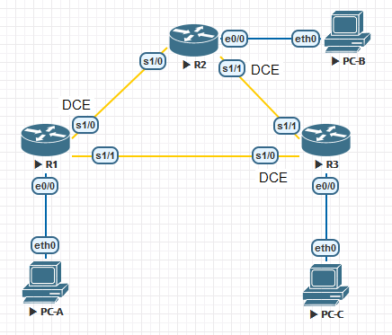

# Лабораторная работа. Базовая настройка протокола EIGRP для IPv4

### Топология



### Таблица адресации

| Устройство | Интерфейс  | IP-адрес    | Маска подсети   | Шлюз по умолчанию |
| ---------- | ---------- | ----------- | --------------- | ----------------- |
| R1         | e0/0       | 192.168.1.1 | 255.255.255.0   | —                 |
|            | S1/0 (DCE) | 10.1.1.1    | 255.255.255.252 | —                 |
|            | S1/1       | 10.3.3.1    | 255.255.255.252 | —                 |
|            |            |             |                 |                   |
| R2         | e0/0       | 192.168.2.1 | 255.255.255.0   | —                 |
|            | S1/0       | 10.1.1.2    | 255.255.255.252 | —                 |
|            | S1/1 (DCE) | 10.2.2.2    | 255.255.255.252 | —                 |
|            |            |             |                 |                   |
| R3         | e0/0       | 192.168.3.1 | 255.255.255.0   | —                 |
|            | S1/0 (DCE) | 10.3.3.2    | 255.255.255.252 | —                 |
|            | S1/1       | 10.2.2.1    | 255.255.255.252 | —                 |
|            |            |             |                 |                   |
| PC-A       | NIC        | 192.168.1.3 | 255.255.255.0   | 192.168.1.1       |
| PC-B       | NIC        | 192.168.2.3 | 255.255.255.0   | 192.168.2.1       |
| PC-C       | NIC        | 192.168.3.3 | 255.255.255.0   | 192.168.3.1       |

### Задачи

1. Построение сети и проверка соединения

2. Настройка маршрутизации EIGRP

3. Проверка маршрутизации EIGRP

4. Настройка пропускной способности и пассивных интерфейсов

### Общие сведения/сценарий

Протокол EIGRP --- это высокопроизводительный протокол маршрутизации на основе векторов расстояния, относительно несложный при настройке для базовых сетей.

В этой лабораторной работе необходимо настроить EIGRP для приведённых выше сетей и их топологии. Вам предстоит изменить пропускную способность и настроить пассивный интерфейс, чтобы повысить эффективность работы EIGRP.

**Примечание**. В практических лабораторных работах CCNA используются маршрутизаторы с интегрированными сетевыми сервисами (ISR) Cisco 1941 с операционной системой Cisco IOS версии 15.2(4)M3 (образ universalk9). Допускается использование маршрутизаторов других моделей, а также других версий операционной системы Cisco IOS. В зависимости от модели устройства и версии Cisco IOS доступные команды и результаты их выполнения могут отличаться от тех, которые показаны в лабораторных работах. Точные идентификаторы интерфейсов см. в сводной таблице по интерфейсам маршрутизаторов в конце лабораторной работы.

**Примечание**. Убедитесь, что все настройки маршрутизаторов удалены и загрузочная конфигурация отсутствует. Если вы не уверены, обратитесь к инструктору.

### Необходимые ресурсы

-   3 маршрутизатора (Cisco 1941 с операционной системой Cisco IOS версии 15.2(4)M3 (универсальный образ) или аналогичная модель)

-   3 ПК (Windows 7, Vista или XP с программой эмуляции терминала, например Tera Term)

-   Консольные кабели для настройки устройств Cisco IOS через консольные порты

-   Кабели Ethernet и последовательные кабели согласно топологии

### 1. Построение сети и проверка связи

В части 1 вы настроите топологию сети и такие базовые параметры, как IP-адреса интерфейсов, доступ к устройствам и пароли.

**1.1 Создайте сеть согласно топологии.**

**1.2 Настройте узлы ПК.**

**1.3 Выполните запуск и перезагрузку маршрутизаторов.**

**1.4 Произведите базовую настройку маршрутизаторов.**

Отключите DNS-поиск.

```
(conf) no ip domain-lookup
```

Настройте IP-адреса для маршрутизаторов в соответствии с таблицей адресации.

```
(conf) interface s1/0
(conf-if)ip address 10.1.1.1 255.255.255.252
(conf-if) no shutdown
```

Настройте имена устройств в соответствии с топологией.

```
(conf) hostname R1
```

Назначьте **cisco** в качестве паролей консоли и VTY.

```
(conf) line vty 0 4
(conf-line) password cisco
(conf-line) login

(conf) line console 0
(conf-line) password cisco
(conf-line) login
```

Назначьте **class** в качестве пароля доступа к привилегированному режиму EXEC.

```
(conf) enable secret class
```

Настройте **logging synchronous**, чтобы сообщения консоли и сообщения VTY не препятствовали вводу команд.

```
(conf-line) logging synchronous
```

Настройте сообщение дня.

```
(conf) banner motd #Unauthorized access is prohibited#
```

Скопируйте текущую конфигурацию в файл загрузочной конфигурации.

```
# copy run start
```

**1.5 Проверьте подключение.**

Маршрутизаторы должны успешно отправлять эхо-запросы друг другу, и все ПК должны успешно отправлять эхо-запросы на свои шлюзы по умолчанию. Компьютеры не смогут отправлять эхо-запросы другим компьютерам, пока не будет настроена маршрутизация EIGRP. При неудачном выполнении эхо-запросов выполните поиск и устранение неполадок.

### 2. Настройка маршрутизации EIGRP

**2.1 Включите маршрутизацию EIGRP на маршрутизаторе R1. Используйте номер автономной системы 10.**

```
R1(config)\# router eigrp 10
```

**2.2 Объявите напрямую подключенные сети на маршрутизаторе R1, используя шаблонную маску.**

```
R1(config-router)\# network 10.1.1.0 0.0.0.3
R1(config-router)\# network 192.168.1.0 0.0.0.255
R1(config-router)\# network 10.3.3.0 0.0.0.3
```

*Почему рекомендуется использовать шаблонные маски при объявлении сетей? Можно ли исключить маску в какой-нибудь из вышеприведённых инструкций network? Если да, то в какой (в каких)?*

**Чтобы избежать применение маски исходя из класса сети**

**Можно исключить маске при объявлении сети 192.168.1.0 так как в этом случае маска совпадает с классовой**

**2.3 Включите маршрутизацию EIGRP и объявите напрямую подключенные сети на маршрутизаторах R2 и R3.**

После добавления интерфейсов в процесс маршрутизации EIGRP появятся сообщения отношений смежности с соседними устройствами. В качестве примера показаны сообщения маршрутизатора R2.

```
R2(config-router)#network 10.1.1.0 0.0.0.3
R2(config-router)#
*May  9 05:49:24.289: %DUAL-5-NBRCHANGE: EIGRP-IPv4 10: Neighbor 10.1.1.1 (Serial1/0) is up: new adjacency
```

**2.4 Проверьте наличие сквозного соединения.**

Если EIGRP настроен правильно, эхо-запросы между всеми устройствами должны быть успешными.

**Примечание**. В зависимости от операционной системы, для успешной отправки эхо-запросов на ПК может потребоваться отключить брандмауэр.

**PC-A**

```
VPCS> ping 192.168.3.3

84 bytes from 192.168.3.3 icmp_seq=1 ttl=62 time=9.779 ms
84 bytes from 192.168.3.3 icmp_seq=2 ttl=62 time=7.310 ms
84 bytes from 192.168.3.3 icmp_seq=3 ttl=62 time=8.737 ms
84 bytes from 192.168.3.3 icmp_seq=4 ttl=62 time=6.289 ms
84 bytes from 192.168.3.3 icmp_seq=5 ttl=62 time=8.720 ms
```

```
VPCS> ping 192.168.2.3

84 bytes from 192.168.2.3 icmp_seq=1 ttl=62 time=9.796 ms
84 bytes from 192.168.2.3 icmp_seq=2 ttl=62 time=8.658 ms
84 bytes from 192.168.2.3 icmp_seq=3 ttl=62 time=8.830 ms
84 bytes from 192.168.2.3 icmp_seq=4 ttl=62 time=8.703 ms
84 bytes from 192.168.2.3 icmp_seq=5 ttl=62 time=8.839 ms
```

**PC-B**

```
VPCS> ping 192.168.1.3

84 bytes from 192.168.1.3 icmp_seq=1 ttl=62 time=8.660 ms
84 bytes from 192.168.1.3 icmp_seq=2 ttl=62 time=8.730 ms
84 bytes from 192.168.1.3 icmp_seq=3 ttl=62 time=7.613 ms
84 bytes from 192.168.1.3 icmp_seq=4 ttl=62 time=8.663 ms
84 bytes from 192.168.1.3 icmp_seq=5 ttl=62 time=8.670 ms
```

```
VPCS> ping 192.168.3.3

84 bytes from 192.168.3.3 icmp_seq=1 ttl=62 time=8.714 ms
84 bytes from 192.168.3.3 icmp_seq=2 ttl=62 time=8.738 ms
84 bytes from 192.168.3.3 icmp_seq=3 ttl=62 time=8.729 ms
84 bytes from 192.168.3.3 icmp_seq=4 ttl=62 time=6.080 ms
84 bytes from 192.168.3.3 icmp_seq=5 ttl=62 time=8.735 ms
```

**PC-C**

```
VPCS> ping 192.168.1.3

84 bytes from 192.168.1.3 icmp_seq=1 ttl=62 time=9.740 ms
84 bytes from 192.168.1.3 icmp_seq=2 ttl=62 time=8.728 ms
84 bytes from 192.168.1.3 icmp_seq=3 ttl=62 time=8.704 ms
84 bytes from 192.168.1.3 icmp_seq=4 ttl=62 time=8.681 ms
84 bytes from 192.168.1.3 icmp_seq=5 ttl=62 time=8.689 ms
```

```
VPCS> ping 192.168.2.3

84 bytes from 192.168.2.3 icmp_seq=1 ttl=62 time=8.806 ms
84 bytes from 192.168.2.3 icmp_seq=2 ttl=62 time=8.792 ms
84 bytes from 192.168.2.3 icmp_seq=3 ttl=62 time=8.103 ms
84 bytes from 192.168.2.3 icmp_seq=4 ttl=62 time=8.663 ms
84 bytes from 192.168.2.3 icmp_seq=5 ttl=62 time=8.710 ms
```

### 3. Проверка маршрутизации EIGRP

**3.1 Анализ таблицы соседних устройств EIGRP.**

На маршрутизаторе R1 выполните команду **show ip eigrp neighbors** для проверки отношений смежности, установленных с соседними маршрутизаторами.

```
R1#show ip eigrp neighbors
EIGRP-IPv4 Neighbors for AS(10)
H   Address                 Interface              Hold Uptime   SRTT   RTO  Q  Seq
                                                   (sec)         (ms)       Cnt Num
1   10.3.3.2                Se1/1                    12 00:04:27   14   100  0  10
0   10.1.1.2                Se1/0                    14 00:06:42   10   100  0  11
```

**3.2 Проанализируйте таблицу IP-маршрутизации EIGRP.**

```
R1#show ip route eigrp
Codes: L - local, C - connected, S - static, R - RIP, M - mobile, B - BGP
       D - EIGRP, EX - EIGRP external, O - OSPF, IA - OSPF inter area
       N1 - OSPF NSSA external type 1, N2 - OSPF NSSA external type 2
       E1 - OSPF external type 1, E2 - OSPF external type 2
       i - IS-IS, su - IS-IS summary, L1 - IS-IS level-1, L2 - IS-IS level-2
       ia - IS-IS inter area, * - candidate default, U - per-user static route
       o - ODR, P - periodic downloaded static route, H - NHRP, l - LISP
       a - application route
       + - replicated route, % - next hop override

Gateway of last resort is not set

      10.0.0.0/8 is variably subnetted, 5 subnets, 2 masks
D        10.2.2.0/30 [90/2681856] via 10.3.3.2, 00:04:57, Serial1/1
                     [90/2681856] via 10.1.1.2, 00:04:57, Serial1/0
D     192.168.2.0/24 [90/2195456] via 10.1.1.2, 00:04:57, Serial1/0
D     192.168.3.0/24 [90/2195456] via 10.3.3.2, 00:04:57, Serial1/1
```

*Почему у маршрутизатора R1 два пути к сети 10.2.2.0/30?*

**Потому что есть два пути до этой сети с одинаковой стоимостью**

**3.3 Проанализируйте таблицу соседних устройств EIGRP.**

```
R1#show ip eigrp topology
EIGRP-IPv4 Topology Table for AS(10)/ID(192.168.1.1)
Codes: P - Passive, A - Active, U - Update, Q - Query, R - Reply,
       r - reply Status, s - sia Status

P 192.168.3.0/24, 1 successors, FD is 2195456
        via 10.3.3.2 (2195456/281600), Serial1/1
P 192.168.2.0/24, 1 successors, FD is 2195456
        via 10.1.1.2 (2195456/281600), Serial1/0
P 10.2.2.0/30, 2 successors, FD is 2681856
        via 10.1.1.2 (2681856/2169856), Serial1/0
        via 10.3.3.2 (2681856/2169856), Serial1/1
P 10.3.3.0/30, 1 successors, FD is 2169856
        via Connected, Serial1/1
P 192.168.1.0/24, 1 successors, FD is 281600
        via Connected, Ethernet0/0
P 10.1.1.0/30, 1 successors, FD is 2169856
        via Connected, Serial1/0
```

*Почему в таблице топологии маршрутизатора R1 отсутствуют возможные преемники?*

**Для того чтобы стать Feasible successor необходимо чтобы выполнялось правило RD  <  FD, в нашей топологии это правило не может быть выполнено.**

**3.4 Проверьте параметры маршрутизации EIGRP и объявленные сети.**

Введите команду **show ip protocols** для проверки используемых параметров маршрутизации EIGRP.

```
R1#show ip protocols
*** IP Routing is NSF aware ***

Routing Protocol is "application"
  Sending updates every 0 seconds
  Invalid after 0 seconds, hold down 0, flushed after 0
  Outgoing update filter list for all interfaces is not set
  Incoming update filter list for all interfaces is not set
  Maximum path: 32
  Routing for Networks:
  Routing Information Sources:
    Gateway         Distance      Last Update
  Distance: (default is 4)

Routing Protocol is "eigrp 10"
  Outgoing update filter list for all interfaces is not set
  Incoming update filter list for all interfaces is not set
  Default networks flagged in outgoing updates
  Default networks accepted from incoming updates
  EIGRP-IPv4 Protocol for AS(10)
    Metric weight K1=1, K2=0, K3=1, K4=0, K5=0
    Soft SIA disabled
    NSF-aware route hold timer is 240
    Router-ID: 192.168.1.1
    Topology : 0 (base)
      Active Timer: 3 min
      Distance: internal 90 external 170
      Maximum path: 4
      Maximum hopcount 100
      Maximum metric variance 1

  Automatic Summarization: disabled
  Maximum path: 4
  Routing for Networks:
    10.1.1.0/30
    10.3.3.0/30
    192.168.1.0
  Routing Information Sources:
    Gateway         Distance      Last Update
    10.3.3.2              90      00:01:55
    10.1.1.2              90      00:01:55
  Distance: internal 90 external 170
```

*Ответьте на следующие вопросы, используя результаты команды **show ip protocols**.*

*Какой номер автономной системы используется?*

**10**

*Какие сети объявляются?* 

**10.1.1.0/30**
**10.3.3.0/30**
**192.168.1.0**

*Каково значение административной дистанции для маршрутов EIGRP?*

**90**

*Сколько маршрутов с равной стоимостью по умолчанию использует EIGRP?*

**2**

### 4. Настройка пропускной способности и пассивных интерфейсов

В EIGRP используется пропускная способность по умолчанию, основанная на типе интерфейса маршрутизатора. В части 4 необходимо изменить эту пропускную способность, поскольку пропускная способность канала между маршрутизаторами R1 и R3 ниже, чем у каналов R1/R2 и R2/R3. Кроме того, необходимо настроить на каждом маршрутизаторе пассивные интерфейсы.

**4.1 Изучите текущие настройки маршрутизации.**

Введите на маршрутизаторе R1 команду **show interface s1/0**.

```
R1#show interface s1/0
Serial1/0 is up, line protocol is up
  Hardware is M4T
  Internet address is 10.1.1.1/30
  MTU 1500 bytes, BW 1544 Kbit/sec, DLY 20000 usec,
     reliability 255/255, txload 1/255, rxload 1/255
  Encapsulation HDLC, crc 16, loopback not set
  Keepalive set (10 sec)
  Restart-Delay is 0 secs
  Last input 00:00:01, output 00:00:01, output hang never
  Last clearing of "show interface" counters never
  Input queue: 0/75/0/0 (size/max/drops/flushes); Total output drops: 0
  Queueing strategy: fifo
  Output queue: 0/40 (size/max)
  5 minute input rate 0 bits/sec, 0 packets/sec
  5 minute output rate 0 bits/sec, 0 packets/sec
     591 packets input, 42947 bytes, 0 no buffer
     Received 270 broadcasts (0 IP multicasts)
     0 runts, 0 giants, 0 throttles
     0 input errors, 0 CRC, 0 frame, 0 overrun, 0 ignored, 0 abort
     630 packets output, 44950 bytes, 0 underruns
     0 output errors, 0 collisions, 2 interface resets
     0 unknown protocol drops
     0 output buffer failures, 0 output buffers swapped out
     3 carrier transitions     DCD=up  DSR=up  DTR=up  RTS=up  CTS=up
```

*Какова пропускная способность по умолчанию для этого последовательного интерфейса?* 

**1544 Kbit/sec**

 *Сколько маршрутов к сети 10.2.2.0/30 содержит таблица маршрутизации?*

**2**

**4.1 Измените пропускную способность на маршрутизаторах.**

Измените пропускную способность для последовательных интерфейсов на маршрутизаторе R1.

```
R1(config)\# interface s1/0

R1(config-if)\# bandwidth 2000

R1(config-if)\# interface s1/1

R1(config-if)\# bandwidth 64
```

*Выполните на маршрутизаторе R1 команду **show ip route**. Появились ли изменения в таблице маршрутизации? Если да, в чем они заключаются?*

```
R1#show ip route
Codes: L - local, C - connected, S - static, R - RIP, M - mobile, B - BGP
       D - EIGRP, EX - EIGRP external, O - OSPF, IA - OSPF inter area
       N1 - OSPF NSSA external type 1, N2 - OSPF NSSA external type 2
       E1 - OSPF external type 1, E2 - OSPF external type 2
       i - IS-IS, su - IS-IS summary, L1 - IS-IS level-1, L2 - IS-IS level-2
       ia - IS-IS inter area, * - candidate default, U - per-user static route
       o - ODR, P - periodic downloaded static route, H - NHRP, l - LISP
       a - application route
       + - replicated route, % - next hop override

Gateway of last resort is not set

      10.0.0.0/8 is variably subnetted, 5 subnets, 2 masks
C        10.1.1.0/30 is directly connected, Serial1/0
L        10.1.1.1/32 is directly connected, Serial1/0
D        10.2.2.0/30 [90/2681856] via 10.1.1.2, 00:00:07, Serial1/0
C        10.3.3.0/30 is directly connected, Serial1/1
L        10.3.3.1/32 is directly connected, Serial1/1
      192.168.1.0/24 is variably subnetted, 2 subnets, 2 masks
C        192.168.1.0/24 is directly connected, Ethernet0/0
L        192.168.1.1/32 is directly connected, Ethernet0/0
D     192.168.2.0/24 [90/1817600] via 10.1.1.2, 00:00:07, Serial1/0
D     192.168.3.0/24 [90/2707456] via 10.1.1.2, 00:00:07, Serial1/0
```

**Теперь до сети 10.2.2.0 есть только 1 маршрут**

Измените пропускную способность для последовательных интерфейсов маршрутизаторов R2 и R3.

```
R2(config)\# interface s1/0

R2(config-if)\# bandwidth 2000

R2(config-if)\# interface s1/1

R2(config-if)\# bandwidth 2000

R3(config)\# interface s1/0

R3(config-if)\# bandwidth 64

R3(config-if)\# interface s1/1

R3(config-if)\# bandwidth 2000
```

**4.3 Проверьте изменения пропускной способности.**

Проверьте изменения пропускной способности. Для проверки правильности установки пропускной способности выполните на всех трех маршрутизаторах команду **show interface serial 0/0/x**, где x --- это номер соответствующего последовательного интерфейса. В качестве примера показан маршрутизатор R1.

```
R1#show interface s1/0
Serial1/0 is up, line protocol is up
  Hardware is M4T
  Internet address is 10.1.1.1/30
  MTU 1500 bytes, BW 2000 Kbit/sec, DLY 20000 usec,
     reliability 255/255, txload 1/255, rxload 1/255
  Encapsulation HDLC, crc 16, loopback not set
  Keepalive set (10 sec)
  Restart-Delay is 0 secs
  Last input 00:00:01, output 00:00:00, output hang never
  Last clearing of "show interface" counters never
  Input queue: 0/75/0/0 (size/max/drops/flushes); Total output drops: 0
  Queueing strategy: fifo
  Output queue: 0/40 (size/max)
  5 minute input rate 0 bits/sec, 0 packets/sec
  5 minute output rate 0 bits/sec, 0 packets/sec
     745 packets input, 53403 bytes, 0 no buffer
     Received 321 broadcasts (0 IP multicasts)
     0 runts, 0 giants, 0 throttles
     0 input errors, 0 CRC, 0 frame, 0 overrun, 0 ignored, 0 abort
     784 packets output, 55381 bytes, 0 underruns
     0 output errors, 0 collisions, 2 interface resets
     0 unknown protocol drops
     0 output buffer failures, 0 output buffers swapped out
     3 carrier transitions     DCD=up  DSR=up  DTR=up  RTS=up  CTS=up
```

*Исходя из заданной пропускной способности, попробуйте определить, как будут выглядеть таблицы маршрутизации маршрутизаторов R2 и R3 до выполнения команды **show ip route**. Останутся ли их таблицы маршрутизации прежними или изменятся?*

**Маршрут через соединение R1-R3 станет дороже чем маршрут R1-R2-R3, в таблице R3 будет новые маршрут R1-R2-R3 до R1 и сетей доступных через R1, для R2 ничего не изменится **

```
R2#show ip route
Codes: L - local, C - connected, S - static, R - RIP, M - mobile, B - BGP
       D - EIGRP, EX - EIGRP external, O - OSPF, IA - OSPF inter area
       N1 - OSPF NSSA external type 1, N2 - OSPF NSSA external type 2
       E1 - OSPF external type 1, E2 - OSPF external type 2
       i - IS-IS, su - IS-IS summary, L1 - IS-IS level-1, L2 - IS-IS level-2
       ia - IS-IS inter area, * - candidate default, U - per-user static route
       o - ODR, P - periodic downloaded static route, H - NHRP, l - LISP
       a - application route
       + - replicated route, % - next hop override

Gateway of last resort is not set

      10.0.0.0/8 is variably subnetted, 5 subnets, 2 masks
C        10.1.1.0/30 is directly connected, Serial1/0
L        10.1.1.2/32 is directly connected, Serial1/0
C        10.2.2.0/30 is directly connected, Serial1/1
L        10.2.2.2/32 is directly connected, Serial1/1
D        10.3.3.0/30 [90/41024000] via 10.2.2.1, 00:05:16, Serial1/1
                     [90/41024000] via 10.1.1.1, 00:05:16, Serial1/0
D     192.168.1.0/24 [90/1817600] via 10.1.1.1, 00:05:16, Serial1/0
      192.168.2.0/24 is variably subnetted, 2 subnets, 2 masks
C        192.168.2.0/24 is directly connected, Ethernet0/0
L        192.168.2.1/32 is directly connected, Ethernet0/0
D     192.168.3.0/24 [90/1817600] via 10.2.2.1, 00:05:48, Serial1/1
```

```
R3#show ip route
Codes: L - local, C - connected, S - static, R - RIP, M - mobile, B - BGP
       D - EIGRP, EX - EIGRP external, O - OSPF, IA - OSPF inter area
       N1 - OSPF NSSA external type 1, N2 - OSPF NSSA external type 2
       E1 - OSPF external type 1, E2 - OSPF external type 2
       i - IS-IS, su - IS-IS summary, L1 - IS-IS level-1, L2 - IS-IS level-2
       ia - IS-IS inter area, * - candidate default, U - per-user static route
       o - ODR, P - periodic downloaded static route, H - NHRP, l - LISP
       a - application route
       + - replicated route, % - next hop override

Gateway of last resort is not set

      10.0.0.0/8 is variably subnetted, 5 subnets, 2 masks
D        10.1.1.0/30 [90/2304000] via 10.2.2.2, 00:05:26, Serial1/1
C        10.2.2.0/30 is directly connected, Serial1/1
L        10.2.2.1/32 is directly connected, Serial1/1
C        10.3.3.0/30 is directly connected, Serial1/0
L        10.3.3.2/32 is directly connected, Serial1/0
D     192.168.1.0/24 [90/2329600] via 10.2.2.2, 00:05:26, Serial1/1
D     192.168.2.0/24 [90/1817600] via 10.2.2.2, 00:05:26, Serial1/1
      192.168.3.0/24 is variably subnetted, 2 subnets, 2 masks
C        192.168.3.0/24 is directly connected, Ethernet0/0
L        192.168.3.1/32 is directly connected, Ethernet0/0
```

**4.4 Настройте на маршрутизаторах R1, R2 и R3 интерфейс e0/0 как пассивный.**

Пассивный интерфейс не позволяет передавать исходящие и входящие обновления маршрутизации через настроенный интерфейс. Команда **passive-interface** *интерфейс* заставляет маршрутизатор прекратить отправку и получение пакетов приветствия через интерфейс, но сеть, связанная с этим интерфейсом, по-прежнему будет объявляться для других маршрутизаторов через интерфейсы, не являющиеся пассивными. Интерфейсы маршрутизатора, подключенные к локальным сетям, обычно настраиваются как пассивные.

```
R1(config)\# router eigrp 10

R1(config-router)\# passive-interface e0/0

R2(config)\# router eigrp 10

R2(config-router)\# passive-interface e0/0

R3(config)\# router eigrp 10

R3(config-router)\# passive-interface e0/0
```

**4.5 Проверьте конфигурацию пассивных интерфейсов.**

Введите на маршрутизаторах R1, R2 и R3 команду **show ip protocols** и убедитесь, что интерфейс e0/0 настроен как пассивный.

```
R1#show ip protocols
*** IP Routing is NSF aware ***

Routing Protocol is "application"
  Sending updates every 0 seconds
  Invalid after 0 seconds, hold down 0, flushed after 0
  Outgoing update filter list for all interfaces is not set
  Incoming update filter list for all interfaces is not set
  Maximum path: 32
  Routing for Networks:
  Routing Information Sources:
    Gateway         Distance      Last Update
  Distance: (default is 4)

Routing Protocol is "eigrp 10"
  Outgoing update filter list for all interfaces is not set
  Incoming update filter list for all interfaces is not set
  Default networks flagged in outgoing updates
  Default networks accepted from incoming updates
  EIGRP-IPv4 Protocol for AS(10)
    Metric weight K1=1, K2=0, K3=1, K4=0, K5=0
    Soft SIA disabled
    NSF-aware route hold timer is 240
    Router-ID: 192.168.1.1
    Topology : 0 (base)
      Active Timer: 3 min
      Distance: internal 90 external 170
      Maximum path: 4
      Maximum hopcount 100
      Maximum metric variance 1

  Automatic Summarization: disabled
  Maximum path: 4
  Routing for Networks:
    10.1.1.0/30
    10.3.3.0/30
    192.168.1.0
  Passive Interface(s):
    Ethernet0/0
  Routing Information Sources:
    Gateway         Distance      Last Update
    10.3.3.2              90      00:10:18
    10.1.1.2              90      00:10:38
  Distance: internal 90 external 170
```

### Вопросы для повторения

*При выполнении лабораторной работы можно было ограничиться только статической маршрутизацией. Каковы преимущества использования EIGRP?*

**EIGRP позволяет адаптироваться к изменениям в топологии сети и характеристиках сред передачи, избежать ошибок и петель при задании статических маршрутов.**