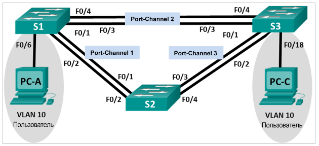

# **Лабораторная работа. Поиск и устранение неполадок в работе EtherChannel**

### **Топология**



### **Таблица адресации**

| **Устройство** | **Интерфейс** | **IP-адрес** | **Маска подсети** |
| -------------- | ------------- | ------------ | ----------------- |
| S1             | VLAN 99       | 192.168.1.11 | 255.255.255.0     |
| S2             | VLAN 99       | 192.168.1.12 | 255.255.255.0     |
| S3             | VLAN 99       | 192.168.1.13 | 255.255.255.0     |
| PC-A           | NIC           | 192.168.0.2  | 255.255.255.0     |
| PC-C           | NIC           | 192.168.0.3  | 255.255.255.0     |

### **Назначения сети VLAN**

| VLAN | Имя        |
| ---- | ---------- |
| 10   | User       |
| 99   | Management |

### **Задачи**

**1. Построение сети и загрузка настроек устройств**

**2. Отладка EtherChannel**

### **Общие сведения/сценарий**

Маршрутизаторы в сети вашей компании были настроены неопытным сетевым администратором. В результате ошибок в конфигурации возникли проблемы со скоростью и подключением. Руководитель попросил вас найти и устранить неполадки в настройке и задокументировать работу. Найдите и исправьте ошибки, используя свои знания EtherChannel и стандартные методы тестирования. Убедитесь в том, что все каналы EtherChannel используют протокол агрегирования портов (PAgP) и все узлы доступны.

**Примечание**. Используются коммутаторы Cisco Catalyst 2960s с Cisco IOS версии 15.0(2) (образ lanbasek9). Допускается использование других моделей коммутаторов и других версий Cisco IOS. В зависимости от модели устройства и версии Cisco IOS доступные команды и результаты их выполнения могут отличаться от тех, которые показаны в лабораторных работах.

**Примечание**. Убедитесь, что все настройки коммутатора удалены и загрузочная конфигурация отсутствует. Если вы не уверены, обратитесь к инструктору.

### **Необходимые ресурсы**

- 3 коммутатора (Cisco 2960 с операционной системой Cisco IOS 15.0(2) (образ lanbasek9) или аналогичная модель)
- 2 ПК (Windows 7, Vista и XP с программой эмуляции терминала, например Tera Term)
- Консольные кабели для настройки устройств Cisco IOS через консольные порты
- Кабели Ethernet, расположенные в соответствии с топологией

### **1. Построение сети и загрузка настроек устройств**

В части 1 вам предстоит настроить топологию сети и базовые параметры для ПК, а также загрузить конфигурации на коммутаторы.

**1.1 Создайте сеть согласно топологии.**

**1.2 Настройте узлы ПК.**

**1.3 Удалите загрузочную конфигурацию 	и настройки VLAN, а затем перезагрузите 	коммутаторы.**

**1.4 Загрузите конфигурации коммутаторов.**

Загрузите следующие конфигурации в соответствующий коммутатор. Все коммутаторы используют одинаковые пароли. Пароль привилегированного режима EXEC — **class**. Пароль для консоли и доступа vty — **cisco**. Поскольку все коммутаторы являются устройствами Cisco, сетевой администратор решил использовать протокол PAgP Cisco для всех агрегированных каналов, настроенных с использованием EtherChannel. Коммутатор S2 является корневым мостом для всех сетей VLAN в топологии.

**Конфигурация коммутатора S1:**

```
hostname S1

interface range f0/1-24, g0/1-2

shutdown

exit

enable secret class

no ip domain lookup

line vty 0 15

password cisco

login

line con 0

 password cisco

 logging synchronous

 login

 exit

vlan 10

 name User

vlan 99

 Name Management

interface range f0/1-2

 switchport mode trunk

 channel-group 1 mode active

 switchport trunk native vlan 99

 no shutdown

interface range f0/3-4

 channel-group 2 mode desirable

 switchport trunk native vlan 99

 no shutdown

interface f0/6

 switchport mode access

 switchport access vlan 10

 no shutdown

interface vlan 99

 ip address 192.168.1.11 255.255.255.0

interface port-channel 1

 switchport trunk native vlan 99

 switchport mode trunk

interface port-channel 2

 switchport trunk native vlan 99

 switchport mode access
```

**Конфигурация коммутатора S2:**

```
hostname S2

interface range f0/1-24, g0/1-2

 shutdown

 exit

enable secret class

no ip domain lookup

line vty 0 15

 password cisco

 login

line con 0

 password cisco

 logging synchronous

 login

 exit

vlan 10

 name User

vlan 99

 name Management

spanning-tree vlan 1,10,99 root primary

interface range f0/1-2

 switchport mode trunk

 channel-group 1 mode desirable

 switchport trunk native vlan 99

 no shutdown

interface range f0/3-4

 switchport mode trunk

 channel-group 3 mode desirable

 switchport trunk native vlan 99

interface vlan 99

 ip address 192.168.1.12 255.255.255.0

interface port-channel 1

 switchport trunk native vlan 99

 switchport trunk allowed vlan 1,99

interface port-channel 3

 switchport trunk native vlan 99

 switchport trunk allowed vlan 1,10,99

 switchport mode trunk
```

**Конфигурация коммутатора S3:**

```
hostname S3

interface range f0/1-24, g0/1-2

 shutdown

 exit

enable secret class

no ip domain lookup

line vty 0 15

 password cisco

 login

line con 0

 password cisco

 logging synchronous

 login

 exit

vlan 10

 name User

vlan 99

 name Management

interface range f0/1-2

interface range f0/3-4

 switchport mode trunk

 channel-group 3 mode desirable

 switchport trunk native vlan 99

 no shutdown

interface f0/18

 switchport mode access

 switchport access vlan 10

 no shutdown

interface vlan 99

 ip address 192.168.1.13 255.255.255.0

interface port-channel 3

 switchport trunk native vlan 99

 switchport mode trunk
```

**1.5 Сохраните настройку.**

```
# copy run start
```

### **2. Поиск и устранение неисправностей в работе EtherChannel**

В части 2 необходимо проверить конфигурации на всех коммутаторах, исправить при необходимости и проверить их работоспособность.

**2.1 Выполните поиск и устранение неполадок в работе маршрутизатора S1.**

*Используйте команду **show interfaces trunk**, чтобы убедиться в том, что агрегированные каналы работают, как транковые порты.*

*Отображаются ли агрегированные каналы 1 и 2, как транковые порты?*

**Нет**

Используйте команду **show etherchannel summary**, чтобы убедиться в том, что интерфейсы 		входят в состав соответствующего агрегированного канала, применен правильный протокол и интерфейсы задействованы.

*Есть ли в выходных данных сведения о неполадках в работе EtherChannel? В случае обнаружения неполадок запишите их в отведённом ниже месте.*

**Port-channel 1 использует LACP вместо PAgP**

Используйте команду **show run | begin interface Port-channel** для просмотра текущей конфигурации, начиная с первого интерфейса агрегированного канала.

*Устраните все ошибки, найденные в выходных данных из предыдущих команд **show**. Запишите команды, используемые для исправления конфигураций.*

```
(conf)interface port-channel 2

(conf-if)switchport mode trunk

(conf-if)switchport trunk allowed vlan 1,10,99

(conf-if)interface range f0/1-2

(conf-if-range)no channel-group 1

(conf-if-range)channel-group 1 mode desirable

(conf-if)interface port-channel 1

(conf-if)switchport trunk allowed vlan 1,10,99

(conf-if)switchport trunk native vlan 99
```

Используйте команду **show interfaces trunk** для проверки настроек транковой связи.

Используйте команду **show etherchannel summary**, чтобы убедиться в том, что агрегированные каналы работают и задействованы.

**2.2 Выполните поиск и устранение неполадок в работе маршрутизатора 	S2.**

*Выполните команду для того, чтобы убедиться, что агрегированные каналы работают в качестве транковых портов. Ниже запишите команду, которую вы использовали.*

**show interfaces trunk**

*Есть ли в выходных данных сведения о неполадках в конфигурациях? В случае обнаружения неполадок запишите их в отведённом ниже месте.*

**Только 1 транковый интерфейс  - Po1, должно быть 2 интерфейса**

Выполните команду, чтобы убедиться в том, что интерфейсы настроены в правильном агрегированном канале и настроен соответствующий протокол.

*Есть ли в выходных данных сведения о неполадках в работе EtherChannel? В случае обнаружения неполадок запишите их в отведённом ниже месте.*

**Агрегированные интерфейсы f0/3-4 выключены**

Используйте команду **show run | begin interface Port-channel** для просмотра текущей конфигурации, начиная с первого интерфейса канала порта.

*Устраните все ошибки, найденные в выходных данных из предыдущих команд **show**. Запишите 		команды, использованные для исправления настройки.*

```
(conf)interface range f0/3-4

(conf-if-range)no shutdown

(conf-if-range)interface port-channel 1

(conf-if)switchport trunk allowed vlan 1,10,99
```

Выполните команду для проверки параметров транковой связи.

Выполните команду для проверки правильного функционирования агрегированных каналов. Помните, что проблемы с агрегированным каналом могут возникнуть на любом конце канала.

**2.3 Выполните поиск и устранение неполадок в работе маршрутизатора S3.**

Выполните команду для того, чтобы убедиться, что агрегированные каналы работают в качестве транковых портов.

*Есть ли в выходных данных сведения о неполадках в конфигурациях? В случае обнаружения неполадок запишите их в отведённом ниже месте.*

**Только 1 транковый интерфейс  - Po1, должно быть 2 интерфейса**

Выполните команду, чтобы убедиться в том, что интерфейсы настроены в правильном агрегированном канале и применен соответствующий протокол.

*Есть ли в выходных данных сведения о неполадках в работе EtherChannel? В случае обнаружения неполадок запишите их в отведённом ниже месте.*

**Нет агрегированного канала для связи с S2**

Используйте команду **show run | begin interface Port-channel** для просмотра текущей конфигурации, начиная с первого интерфейса агрегированного канала.

*Устраните все обнаруженные неполадки. Запишите команды, использованные для исправления 		конфигурации.*

```
(conf)interface range f0/1-2
(conf-if-range)channel-group 1 mode desirable
(conf-if-range)no shutdown
(conf-if-range)switchport trunk native vlan 99
(conf-if-range)switchport trunk allowed vlan  1,10,99
(conf-if-range)interface port-channel 3
(conf-if)switchport trunk allowed vlan  1,10,99
```

*Выполните команду для проверки параметров транковой связи. Ниже запишите команду, которую вы использовали.*

**show interfaces trunk**

*Выполните команду для проверки правильного функционирования агрегированных каналов. Ниже запишите команду, которую вы использовали.*

**show etherchannel summary**

**2.4 Проверка EtherChannel и подключения**

Используйте команду **show interfaces etherchannel** для проверки работоспособности агрегированных каналов.

Проверьте подключение сети VLAN Management.

*Успешно ли выполняется эхо-запрос от коммутатора S1 на коммутатор S2?*  **Да**

*Успешно ли выполняется эхо-запрос от коммутатора S1 на коммутатор S3?*  **Да**

*Успешно ли выполняется эхо-запрос от коммутатора S2 на коммутатор S3?*  **Да**

Проверьте подключения компьютеров.

*Успешно ли выполняется эхо-запрос от узла ПК A на узел ПК C?* **Да**

Если каналы EtherChannel не полностью работоспособны, отсутствует соединение между коммутаторами или между узлами. Выполните окончательную отладку.

**Примечание**. Для успешной передачи эхо-запросов между компьютерами может потребоваться отключение межсетевого экрана.

