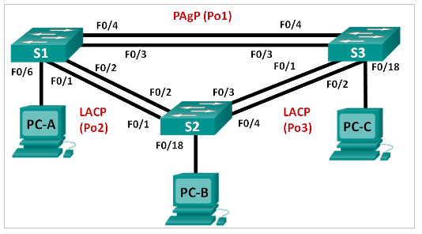

# **Лабораторная работа. Настройка EtherChannel**

### **Топология**



### **Таблица адресации**

| Устройство | Интерфейс | IP-адрес      | Маска подсети |
| ---------- | --------- | ------------- | ------------- |
| S1         | VLAN 99   | 192.168.99.11 | 255.255.255.0 |
| S2         | VLAN 99   | 192.168.99.12 | 255.255.255.0 |
| S3         | VLAN 99   | 192.168.99.13 | 255.255.255.0 |
| PC-A       | NIC       | 192.168.10.1  | 255.255.255.0 |
| PC-B       | NIC       | 192.168.10.2  | 255.255.255.0 |
| PC-C       | NIC       | 192.168.10.3  | 255.255.255.0 |

### **Цели**

**Часть 1. Настройка базовых параметров коммутатора**

**Часть 2. Настройка PAgP**

**Часть 3. Настройка LACP**

### **Общие сведения/сценарий**

Агрегирование каналов позволяет создавать логические каналы, состоящие из двух или более физических каналов. Таким образом увеличивается пропускная способность, а также используется только один физический канал. Агрегирование каналов также обеспечивает избыточность в случае сбоя одного из каналов.

В этой лабораторной работе вам предстоит настроить EtherChannel — тип агрегирования каналов, который используется в коммутируемых сетях. Вы настроите EtherChannel с помощью протокола агрегирования портов (PAgP) и протокола управления агрегированием каналов (LACP).

**Примечание**. PAgP является проприетарным протоколом Cisco, который можно использовать только на коммутаторах Cisco и коммутаторах лицензированных поставщиков, поддерживающих PAgP. Протокол LACP является протоколом агрегирования каналов, который определен стандартом IEEE 802.3ad и не связан с конкретным поставщиком.

Протокол LACP позволяет коммутаторам Cisco осуществлять управление каналами Ethernet между коммутаторами в соответствии с протоколом 802.3ad. В создании канала могут участвовать до 16 портов. Восемь из портов находятся в активном режиме (active), а остальные восемь — в режиме ожидания (standby). В случае сбоя любого из активных портов задействуется порт, пребывающий в режиме ожидания. Режим ожидания (standby mode) доступен только для протокола LACP, но не для протокола PAgP.

**Примечание**. В практических лабораторных работах CCNA используются коммутаторы Cisco Catalyst 2960s с операционной системой Cisco IOS 15.0(2) (образ lanbasek9). Допускается использование других моделей коммутаторов и других версий Cisco IOS. В зависимости от модели устройства и версии Cisco IOS доступные команды и результаты их выполнения могут отличаться от тех, которые показаны в лабораторных работах.

**Примечание**. Убедитесь, что все настройки коммутатора удалены и загрузочная конфигурация отсутствует. Если вы не уверены, обратитесь к инструктору.

### **Необходимые ресурсы**

- 3 коммутатора (Cisco 2960 с операционной системой Cisco IOS 15.0(2) (образ lanbasek9) или аналогичная модель)
- 3 ПК (Windows 7, Vista или XP с программой эмуляции терминалов, например Tera Term)
- Консольные кабели для настройки устройств Cisco IOS через консольные порты
- Кабели Ethernet, расположенные в соответствии с топологией

### **1. Настройка основных параметров коммутатора**

В части 1 вы настроите топологию сети и такие базовые параметры, как IP-адреса интерфейсов, доступ к устройствам и пароли.

**1.1 Создайте сеть согласно топологии.**

Подключите устройства, как показано в топологии, и подсоедините необходимые кабели.

**1.2 Выполните инициализацию и перезагрузку 	коммутаторов.**

**1.3 Настройте базовые параметры каждого 	коммутатора.**

Отключите поиск DNS.

```
 (conf) no ip domain-lookup
```

Настройте имя устройства в соответствии с топологией.

```
(conf) hostname SW1
```

Зашифруйте незашифрованные пароли.

```
(conf) service password-encryption
```

Создайте баннерное сообщение дня MOTD, предупреждающее пользователей о том, что 		несанкционированный доступ запрещен.

```
(conf) banner motd #Unauthorized access is prohibited#
```

Назначьте **class** в качестве зашифрованного пароля доступа к привилегированному режиму.

```
(conf) enable secret class
```

Назначьте **cisco** в качестве пароля консоли и VTY и включите запрос пароля при подключении. 

```
(conf) line vty 0 4
(conf-line) password cisco
(conf-line) login

(conf) line console 0
(conf-line) password cisco
(conf-line) login
```

Настройте logging synchronous, чтобы предотвратить прерывание ввода команд сообщениями консоли.

```
(conf-line) logging synchronous
```

Отключите все порты коммутатора, кроме портов, подключенных к компьютерам.

```
(conf) interface range e1/2-3
(conf-if-range) shutdown
```

Настройте сеть VLAN 99 и присвойте ей имя **Management**.

```
(conf) vlan 99
(conf-vlan) name Management
```

Настройте сеть VLAN 10 и присвойте ей имя **Staff**.

```
(conf) vlan 10
(conf-vlan) name Staff
```

Настройте порты коммутатора с присоединёнными узлами в качестве портов доступа в сети VLAN 10.

```
(conf) interface e1/1
(conf-if) switchport access vlan 10
```

Назначьте IP-адреса в соответствии с таблицей адресации.

```
(conf) interface vlan 99
(conf-if) ip address 192.168.99.11 255.255.255.0
(conf-if) no shutdown
```

Сохраните текущую конфигурацию в загрузочную конфигурацию. 

```
(conf) do copy run start
```

**1.4 Настройте компьютеры.**

Назначьте IP-адреса компьютерам в соответствии с таблицей адресации.

### **2 Настройка протокола PAgP**

Протокол PAgP является проприетарным протоколом агрегирования каналов Cisco. В части 2 вам предстоит настроить канал между S1 и S3 с использованием протокола PAgP.

**2.1 Настройте PAgP на S1 и S3.**

Для создания канала между S1 и S3 настройте порты на S1 с использованием рекомендуемого режима (desirable), а порты на S3 — с использованием автоматического режима (auto). Включите порты после настройки режимов PAgP.

```
S1(config)# interface range f0/3-4
S1(config-if-range)# channel-group 1 mode desirable
Creating a port-channel interface Port-channel 1

S1(config-if-range)# no shutdown
S3(config)# interface range f0/3-4
S3(config-if-range)# channel-group 1 mode auto
Creating a port-channel interface Port-channel 1

S3(config-if-range)# no shutdown
*Mar 1 00:09:12.792: %LINK-3-UPDOWN: Interface FastEthernet0/3, changed state to up
*Mar 1 00:09:12.792: %LINK-3-UPDOWN: Interface FastEthernet0/4, changed state to up
S3(config-if-range)#

*Mar 1 00:09:15.384: %LINEPROTO-5-UPDOWN: Line protocol on Interface FastEthernet0/3, changed state to up
*Mar 1 00:09:16.265: %LINEPROTO-5-UPDOWN: Line protocol on Interface FastEthernet0/4, changed state to up
S3(config-if-range)#
*Mar 1 00:09:16.357: %LINK-3-UPDOWN: Interface Port-channel1, changed state to up
*Mar 1 00:09:17.364: %LINEPROTO-5-UPDOWN: Line protocol on Interface Port-channel1, changed state to up
*Mar 1 00:09:44.383: %LINEPROTO-5-UPDOWN: Line protocol on Interface Vlan1, changed state to up
```

**2.2 Проверьте конфигурации на портах.**

В настоящее время интерфейсы F0/3, F0/4 и Po1 (Port-channel1) на коммутаторах S1 и S3 находятся в режиме доступе, а режим управления установлен на динамический автоматический режим (dynamic auto). Проверьте конфигурацию с помощью соответствующих команд **show run interface** идентификатор-интерфейса и **show interfaces** идентификатор-интерфейса **switchport**. Для интерфейса F0/3 на S1 отображаются следующие выходные данные конфигурации:

```
S1# show run interface f0/3

Building configuration...

Current configuration : 103 bytes

!

interface FastEthernet0/3

channel-group 1 mode desirable
```

```
S1# show interfaces f0/3 switchport

Name: Fa0/3

Switchport: Enabled

Administrative Mode: dynamic auto

Operational Mode: static access (member of bundle Po1)

Administrative Trunking Encapsulation: dot1q

Operational Trunking Encapsulation: native

Negotiation of Trunking: On

Access Mode VLAN: 1 (default)

Trunking Native Mode VLAN: 1 (default)

Administrative Native VLAN tagging: enabled

Voice VLAN: none

Administrative private-vlan host-association: none

Administrative private-vlan mapping: none

Administrative private-vlan trunk native VLAN: none

Administrative private-vlan trunk Native VLAN tagging: enabled

Administrative private-vlan trunk encapsulation: dot1q

Administrative private-vlan trunk normal VLANs: none

Administrative private-vlan trunk associations: none

Administrative private-vlan trunk mappings: none

Operational private-vlan: none

Trunking VLANs Enabled: ALL

Pruning VLANs Enabled: 2-1001

Capture Mode Disabled

Capture VLANs Allowed: ALL

Protected: false

Unknown unicast blocked: disabled

Unknown multicast blocked: disabled

Appliance trust: none
```

**2.3 Убедитесь, что порты объединены.**

```
S1# show etherchannel summary

Flags: D - down        P - bundled in port-channel

​        I - stand-alone s - suspended

​        H - Hot-standby (LACP only)

​        R - Layer3      S - Layer2

​        U - in use      f - failed to allocate aggregator

​        M - not in use, minimum links not met

​        u - unsuitable for bundling

​        w - waiting to be aggregated

​        d - default port

Number of channel-groups in use: 1

Number of aggregators:           1

Group Port-channel  Protocol    Ports

------+-------------+-----------+-----------------------------------------------

1     Po1(SU)         PAgP      Fa0/3(P)    Fa0/4(P)
```

```
S3# show etherchannel summary

Flags: D - down        P - bundled in port-channel

​        I - stand-alone s - suspended

​        H - Hot-standby (LACP only)

​        R - Layer3      S - Layer2

​        U - in use      f - failed to allocate aggregator

​        M - not in use, minimum links not met

​        u - unsuitable for bundling

​        w - waiting to be aggregated

​        d - default port

Number of channel-groups in use: 1

Number of aggregators:           1

Group Port-channel  Protocol    Ports

------+-------------+-----------+-----------------------------------------------

1     Po1(SU)         PAgP      Fa0/3(P)    Fa0/4(P)
```

*Что означают флаги «SU» и «P» в сводных данных по Ethernet?*


**2.4 Настройте транковые порты.**

После агрегирования портов команды, применённые на интерфейсе Port Channel, влияют на все объединённые в группу каналы. Вручную настройте порты Po1 на S1 и S3 в качестве транковых и назначьте их сети native VLAN 99.

```
S1(config)# interface port-channel 1

S1(config-if)# switchport mode trunk

S1(config-if)# switchport trunk native vlan 99
```

```
S3(config)# interface port-channel 1

S3(config-if)# switchport mode trunk

S3(config-if)# switchport trunk native vlan 99
```

**2.5 Убедитесь в том, что порты настроены в качестве транковых.**

*Выполните команды **show run** **interface** идентификатор-интерфейса на S1 и S3. Какие команды включены в список для интерфейсов F0/3 и F0/4 на обоих коммутаторах? Сравните результаты с текущей конфигурацией для интерфейса Po1. Запишите наблюдения.*


*Выполните команды **show interfaces trunk** и **show spanning-tree** на S1 и S3. Какой транковый порт включен в список? Какая используется сеть native VLAN? Какой вывод можно сделать на основе выходных данных?*


*Какие значения стоимости и приоритета порта для агрегированного канала отображены в выходных данных команды **show spanning-tree**?*


### **3. Настройка протокола LACP**

Протокол LACP является открытым протоколом агрегирования каналов, разработанным на базе стандарта IEEE. В части 3 необходимо выполнить настройку канала между S1 и S2 и канала между S2 и S3 с помощью протокола LACP. Кроме того, отдельные каналы необходимо настроить в качестве транковых, прежде чем они будут объединены в каналы EtherChannel.

**3.1 Настройте LACP между S1 и S2.**

```
S1(config)# interface range f0/1-2

S1(config-if-range)# switchport mode trunk

S1(config-if-range)# switchport trunk native vlan 99

S1(config-if-range)# channel-group 2 mode active

Creating a port-channel interface Port-channel 2

S1(config-if-range)# no shutdown
```

```
S2(config)# interface range f0/1-2

S2(config-if-range)# switchport mode trunk

S2(config-if-range)# switchport trunk native vlan 99

S2(config-if-range)# channel-group 2 mode passive

Creating a port-channel interface Port-channel 2

S2(config-if-range)# no shutdown
```

**3.2 Убедитесь, что порты объединены.**

*Какой протокол использует Po2 для агрегирования каналов? Какие порты агрегируются для образования Po2? Запишите команду, используемую для проверки.*


**3.3 Настройте LACP между S2 и S3.**

Настройте канал между S2 и S3 как Po3, используя LACP как протокол агрегирования каналов.

```
S2(config)# interface range f0/3-4

S2(config-if-range)# switchport mode trunk

S2(config-if-range)# switchport trunk native vlan 99

S2(config-if-range)# channel-group 3 mode active

Creating a port-channel interface Port-channel 3

S2(config-if-range)# no shutdown
```

```
S3(config)# interface range f0/1-2

S3(config-if-range)# switchport mode trunk

S3(config-if-range)# switchport trunk native vlan 99

S3(config-if-range)# channel-group 3 mode passive

Creating a port-channel interface Port-channel 3

S3(config-if-range)# no shutdown
```

Убедитесь в том, что канал EtherChannel образован.

**3.4 Проверьте наличие сквозного соединения.**

Убедитесь в том, что все устройства могут передавать друг другу эхо-запросы в пределах одной сети VLAN. Если нет, устраните неполадки, чтобы установить связь между конечными устройствами.

**Примечание**. Для успешной передачи эхо-запросов может потребоваться отключение межсетевого экрана.

### **Вопросы для повторения**

*Что может препятствовать образованию каналов EtherChannel?*

