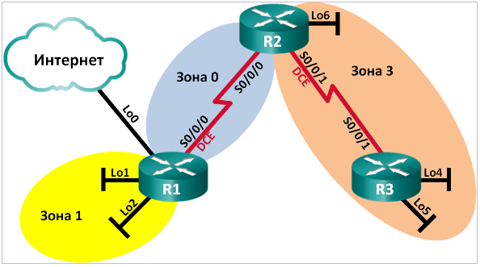

# **Лабораторная работа. Настройка OSPFv2 для нескольких областей**

### **Топология**



### **Таблица адресации**

| Устройство | Интерфейс    | IP-адрес        | Маска подсети   |
| ---------- | ------------ | --------------- | --------------- |
| R1         | Lo0          | 209.165.200.225 | 255.255.255.252 |
| R1         | Lo1          | 192.168.1.1     | 255.255.255.0   |
| R1         | Lo2          | 192.168.2.1     | 255.255.255.0   |
| R1         | S0/0/0 (DCE) | 192.168.12.1    | 255.255.255.252 |
|            |              |                 |                 |
| R2         | Lo6          | 192.168.6.1     | 255.255.255.0   |
| R2         | S0/0/0       | 192.168.12.2    | 255.255.255.252 |
| R2         | S0/0/1 (DCE) | 192.168.23.1    | 255.255.255.252 |
|            |              |                 |                 |
| R3         | Lo4          | 192.168.4.1     | 255.255.255.0   |
| R3         | Lo5          | 192.168.5.1     | 255.255.255.0   |
| R3         | S0/0/1       | 192.168.23.2    | 255.255.255.252 |

### **Задачи**

**1. Создание сети и настройка основных параметров устройства**

**2. Настройка сети OSPFv2 для нескольких областей**

**3. Настройка межобластных суммарных маршрутов**

### **Общие сведения/сценарий**

Для улучшения эффективности и масштабируемости в OSPF поддерживается иерархическая маршрутизация, использующая понятие областей. Область OSPF — это группа маршрутизаторов, использующих в своих базах данных состояний каналов (LSDB) общие и одинаковые данные о состоянии каналов. Если большая область OSPF разделена на области меньшего размера, такая архитектура называется OSPF для нескольких областей. Использование OSPF для нескольких областей является целесообразным в сетях большего размера, поскольку это позволяет сократить потребление ресурсов ЦП и памяти.

В этой лабораторной работе будет выполнена настройка сети OSPFv2 для нескольких областей с межобластными суммарными маршрутами.

**Примечание**. В практических лабораторных работах CCNA используются маршрутизаторы с интегрированными сетевыми сервисами (ISR) Cisco 1941 с операционной системой Cisco IOS версии 15.2(4)M3 (образ universalk9). Допускается использование маршрутизаторов других моделей, а также других версий операционной системы Cisco IOS. В зависимости от модели устройства и версии Cisco IOS доступные команды и результаты их выполнения могут отличаться от тех, которые показаны в лабораторных работах. Точные идентификаторы интерфейсов см. в сводной таблице по интерфейсам маршрутизаторов в конце лабораторной работы.

**Примечание**. Убедитесь, что все настройки маршрутизаторов удалены и загрузочная конфигурация отсутствует. Если вы не уверены, обратитесь к инструктору.

### **Необходимые ресурсы**

- 3 маршрутизатора (Cisco 1941 с операционной системой Cisco IOS версии 15.2(4)M3 (универсальный образ) или аналогичная модель)
- Консольные кабели для настройки устройств Cisco IOS через консольные порты
- Последовательные кабели в соответствии с топологией

### **1. Создание сети и настройка основных параметров устройства**

В части 1 необходимо настроить топологию сети и выполнить базовые настройки маршрутизаторов.

**1.1 Создайте сеть согласно топологии.**

**1.2 Выполните запуск и перезагрузку маршрутизаторов.**

**1.3 Произведите базовую настройку маршрутизаторов.**

Отключите DNS-поиск.

Задайте имя устройства в соответствии с топологией.

Назначьте **class** в качестве пароля привилегированного режима EXEC.

Назначьте **cisco** в качестве паролей консоли и VTY.

Настройте **logging synchronous** на линии консоли.

Настройте баннер MOTD (сообщение дня) для предупреждения пользователей о запрете 		несанкционированного доступа.

Назначьте IP-адреса всем интерфейсам в соответствии с таблицей адресации. Для интерфейсов 		оборудования передачи данных (DCE) следует задать тактовую частоту 128000. Пропускную способность для всех последовательных интерфейсов следует установить равной 128 Кбит/с.

Скопируйте текущую конфигурацию в файл загрузочной конфигурации.

**1.4 Проверьте наличие подключения на уровне 3.**

Выполните команду **show ip interface brief**, чтобы убедиться в правильности IP-адресации и активности интерфейсов. Убедитесь, что каждый маршрутизатор может успешно отправлять эхо-запросы соседним маршрутизаторам, подключенным с помощью последовательных интерфейсов.

### **2. Настройка сети OSPFv2 для нескольких областей**

В части 2 необходимо настроить сеть OSPFv2 для нескольких областей, используя идентификатор процесса 1. Все интерфейсы loopback локальной сети должны быть пассивными, а для всех последовательных интерфейсов должна быть настроена аутентификация MD5 с ключом **Cisco123**.

**2.1 Определите типы маршрутизаторов OSPF в топологии.**

*Определите магистральные маршрутизаторы:* 


*Определите граничные маршрутизаторы автономной системы (ASBR):* 


*Определите граничные маршрутизаторы области (ABR):* 


*Определите внутренние маршрутизаторы:*


**2.2 Настройте протокол OSPF на маршрутизаторе R1.**

Настройте идентификатор маршрутизатора 1.1.1.1 с идентификатором процесса OSPF 1.

Добавьте OSPF для сетей маршрутизатора R1.

```
R1(config-router)# network 192.168.1.0 0.0.0.255 area 1

R1(config-router)# network 192.168.2.0 0.0.0.255 area 1

R1(config-router)# network 192.168.12.0 0.0.0.3 area 0
```

Настройте все интерфейсы loopback локальной сети, Lo1 и Lo2, как пассивные.

Создайте маршрут по умолчанию к сети Интернет, используя выходной интерфейс Lo0.

**Примечание**. Может отобразиться следующее сообщение: %Default route without gateway, if not a point-to-point interface, may impact performance (Маршрут по умолчанию настроен без шлюза, если это не интерфейс «точка-точка», производительность может снизиться). Это нормальное поведение при использовании интерфейса обратной петли для моделирования маршрута по умолчанию.

Настройте для протокола OSPF распространение маршрутов в областях OSPF.

**2.3 Настройте протокол OSPF на маршрутизаторе R2.**

Настройте идентификатор маршрутизатора 2.2.2.2 с идентификатором процесса OSPF 1.

*Добавьте OSPF для сетей маршрутизатора R2. Добавьте сети в соответствующую область. Запишите использованные команды в поле ниже.*


Настройте все интерфейсы loopback локальных сетей как пассивные.

**2.4 Настройте протокол OSPF на маршрутизаторе R3.**

Настройте идентификатор маршрутизатора 3.3.3.3 с идентификатором процесса OSPF 1.		

*Добавьте OSPF для сетей маршрутизатора R3. Запишите использованные команды в поле ниже.*


Настройте все интерфейсы loopback локальных сетей как пассивные.

**2.5 Убедитесь в правильности настройки протокола OSPF и в установлении отношений смежности между маршрутизаторами.**

Выполните команду **show ip protocols** , чтобы проверить параметры OSPF на каждом маршрутизаторе. Используйте эту команду, чтобы определить типы маршрутизаторов OSPF и сети, назначенные каждой области.

```
R1# show ip protocols

*** IP Routing is NSF aware ***

Routing Protocol is "ospf 1"

  Outgoing update filter list for all interfaces is not set

  Incoming update filter list for all interfaces is not set

  Router ID 1.1.1.1

  It is an area border and autonomous system boundary router

 Redistributing External Routes from,

  Number of areas in this router is 2. 2 normal 0 stub 0 nssa

  Maximum path: 4

  Routing for Networks:

​    192.168.1.0 0.0.0.255 area 1

​    192.168.2.0 0.0.0.255 area 1

​    192.168.12.0 0.0.0.3 area 0

  Passive Interface(s):

​    Loopback1

​    Loopback2

  Routing Information Sources:

​    Gateway        Distance      Last Update

​    2.2.2.2             110      00:01:45

  Distance: (default is 110)
```

```
R2# show ip protocols

*** IP Routing is NSF aware ***

Routing Protocol is "ospf 1"

  Outgoing update filter list for all interfaces is not set

  Incoming update filter list for all interfaces is not set

  Router ID 2.2.2.2

  It is an area border router

  Number of areas in this router is 2. 2 normal 0 stub 0 nssa

  Maximum path: 4

  Routing for Networks:

​    192.168.6.0 0.0.0.255 area 3

​    192.168.12.0 0.0.0.3 area 0

​    192.168.23.0 0.0.0.3 area 3

  Passive Interface(s):

​    Loopback6

  Routing Information Sources:

​    Gateway        Distance      Last Update

​    3.3.3.3             110      00:01:20

​    1.1.1.1             110      00:10:12

  Distance: (default is 110)
```

```
R3# show ip protocols

*** IP Routing is NSF aware ***

Routing Protocol is "ospf 1"

  Outgoing update filter list for all interfaces is not set

  Incoming update filter list for all interfaces is not set

  Router ID 3.3.3.3

  Number of areas in this router is 1. 1 normal 0 stub 0 nssa

  Maximum path: 4

  Routing for Networks:

​    192.168.4.0 0.0.0.255 area 3

​    192.168.5.0 0.0.0.255 area 3

​    192.168.23.0 0.0.0.3 area 3

  Passive Interface(s):

​    Loopback4

​    Loopback5

  Routing Information Sources:

​    Gateway        Distance      Last Update

​    1.1.1.1             110      00:07:46

​    2.2.2.2             110      00:07:46

  Distance: (default is 110)
```

*К какому типу маршрутизаторов OSPF относится каждый маршрутизатор?*

**R1**: 

**R2**:

**R3**: 

Введите команду **show ip ospf neighbor**, чтобы убедиться в установлении отношений смежности OSPF между маршрутизаторами.

```
R1# show ip ospf neighbor

Neighbor ID     Pri   State           Dead Time   Address         Interface

2.2.2.2          0   FULL/  -        00:00:34   192.168.12.2    Serial0/0/0
```

```
R2# show ip ospf neighbor

Neighbor ID     Pri   State           Dead Time   Address         Interface

1.1.1.1          0   FULL/  -        00:00:36   192.168.12.1    Serial0/0/0

3.3.3.3          0   FULL/  -        00:00:36   192.168.23.2    Serial0/0/1
```

```
R3# show ip ospf neighbor

Neighbor ID     Pri   State           Dead Time   Address         Interface

2.2.2.2          0   FULL/  -        00:00:38    192.168.23.1    Serial0/0/1
```

Введите команду **show ip ospf interface brief**, чтобы отобразить сводку стоимости маршрутов интерфейсов.

```
R1# show ip ospf interface brief

Interface   PID   Area            IP Address/Mask    Cost  State Nbrs F/C

Se0/0/0     1     0               192.168.12.1/30    781  P2P   1/1

Lo1         1     1               192.168.1.1/24     1    LOOP  0/0

Lo2         1     1               192.168.2.1/24     1    LOOP  0/0
```

```
R2# show ip ospf interface brief

Interface   PID   Area            IP Address/Mask    Cost  State Nbrs F/C

Se0/0/0     1     0               192.168.12.2/30    781  P2P   1/1

Lo6         1     3               192.168.6.1/24     1    LOOP  0/0

Se0/0/1     1     3               192.168.23.1/30    781  P2P   1/1
```

```
R3# show ip ospf interface brief

Interface   PID   Area            IP Address/Mask    Cost  State Nbrs F/C

Lo4         1     3               192.168.4.1/24     1     LOOP  0/0

Lo5         1     3               192.168.5.1/24     1     LOOP  0/0

Se0/0/1     1     3               192.168.23.2/30    781   P2P   1/1
```

**2.6 Настройте аутентификацию MD5 для всех последовательных интерфейсов.**

Настройте аутентификацию MD5 для OSPF на уровне интерфейса с ключом аутентификации **Cisco123**.

*Почему перед настройкой аутентификации OSPF полезно проверить правильность работы OSPF?*


**2.7 Проверьте восстановление отношений смежности OSPF.**

Снова введите команду **show ip ospf neighbor**, чтобы убедиться в восстановлении отношений смежности OSPF между маршрутизаторами после реализации аутентификации MD5. Прежде чем перейти к части 3, устраните все найденные ошибки.

### **3. Настройка межобластных суммарных маршрутов**

OSPF не выполняет автоматическое объединение. Объединение межобластных маршрутов необходимо вручную настроить на маршрутизаторах ABR. В части 3 необходимо настроить на маршрутизаторах ABR суммарные межобластные маршруты. С помощью команд **show** можно будет наблюдать, каким образом объединение влияет на таблицу маршрутизации и базы данных LSDB.

**3.1 Просмотрите таблицы маршрутизации OSPF для всех маршрутизаторов.**

Введите команду **show ip route ospf** на маршрутизаторе R1. Для маршрутов OSPF, начинающихся в другой области, используется дескриптор (O IA), обозначающий межобластные маршруты.

```
R1# show ip route ospf

Codes: L - local, C - connected, S - static, R - RIP, M - mobile, B - BGP

​       D - EIGRP, EX - EIGRP external, O - OSPF, IA - OSPF inter area 

​       N1 - OSPF NSSA external type 1, N2 - OSPF NSSA external type 2

​       E1 - OSPF external type 1, E2 - OSPF external type 2

​       i - IS-IS, su - IS-IS summary, L1 - IS-IS level-1, L2 - IS-IS level-2

​       ia - IS-IS inter area, * - candidate default, U - per-user static route

​       o - ODR, P - periodic downloaded static route, H - NHRP, l - LISP

​       \+ - replicated route, % - next hop override

Gateway of last resort is 0.0.0.0 to network 0.0.0.0

​      192.168.4.0/32 is subnetted, 1 subnets

O IA     192.168.4.1 [110/1563] via 192.168.12.2, 00:23:49, Serial0/0/0

​      192.168.5.0/32 is subnetted, 1 subnets

O IA     192.168.5.1 [110/1563] via 192.168.12.2, 00:23:49, Serial0/0/0

​      192.168.23.0/30 is subnetted, 1 subnets

O IA     192.168.6.1 [110/782] via 192.168.12.2, 00:02:01, Serial0/0/0

​      192.168.23.0/30 is subnetted, 1 subnets

O IA     192.168.23.0 [110/1562] via 192.168.12.2, 00:23:49, Serial0/0/0
```

*Повторите команду **show ip route ospf** для R2 и R3. Запишите маршруты OSPF между областями для каждого маршрутизатора.*

**R2:**


**R3:**


**3.2 Просмотрите базы данных LSDB на всех маршрутизаторах.**

Введите команду **show ip ospf database** на маршрутизаторе R1. Маршрутизатор ведет отдельную базу данных LSDB для каждой области, участником которой является этот маршрутизатор.

```
R1# show ip ospf database

​            OSPF Router with ID (1.1.1.1) (Process ID 1)

​                Router Link States (Area 0)

Link ID         ADV Router      Age         Seq#       Checksum Link count

1.1.1.1        1.1.1.1         1295        0x80000003 0x0039CD 2

2.2.2.2        2.2.2.2         1282        0x80000002 0x00D430 2


                 Summary Net Link States (Area 0)

Link ID         ADV Router      Age         Seq#       Checksum

192.168.1.1    1.1.1.1         1387        0x80000002 0x00AC1F

192.168.2.1    1.1.1.1         1387        0x80000002 0x00A129

192.168.4.1    2.2.2.2         761         0x80000001 0x000DA8

192.168.5.1    2.2.2.2         751         0x80000001 0x0002B2

192.168.6.1    2.2.2.2         1263        0x80000001 0x00596A

192.168.23.0   2.2.2.2         1273        0x80000001 0x00297E


​                Router Link States (Area 1)

Link ID         ADV Router      Age         Seq#       Checksum Link count

1.1.1.1        1.1.1.1         1342        0x80000006 0x0094A4 2


​                Summary Net Link States (Area 1)

Link ID         ADV Router      Age         Seq#       Checksum

192.168.4.1    1.1.1.1         760         0x80000001 0x00C8E0

192.168.5.1    1.1.1.1         750         0x80000001 0x00BDEA

192.168.6.1    1.1.1.1         1262        0x80000001 0x0015A2

192.168.12.0   1.1.1.1         1387        0x80000001 0x00C0F5

192.168.23.0   1.1.1.1         1272        0x80000001 0x00E4B6


                 Type-5 AS External Link States

 Link ID         ADV Router      Age         Seq#       Checksum Tag

0.0.0.0        1.1.1.1         1343        0x80000001 0x001D91 1
```

*Повторите команду **show ip ospf database** для R2 и R3. Запишите идентификаторы каналов (Link ID) для состояний суммарных сетевых каналов (Summary Net Link State) каждой области.*

**R2:**


**R3:**


**3.3 Настройте межобластные суммарные 	маршруты.**

Рассчитайте суммарный маршрут для сетей в области.

Настройте суммарный маршрут для области 1 на маршрутизаторе R1.

```
R1(config)# router ospf 1

R1(config-router)# area 1 range 192.168.0.0 255.255.252.0
```

*Рассчитайте суммарный маршрут для сетей в области 3. Запишите результаты.*


*Настройте суммарный маршрут для области 3 на маршрутизаторе R2. Запишите использованные команды в отведённой ниже области.*


**3.4 Повторно отобразите таблицы маршрутизации OSPF для всех маршрутизаторов.**

*Выполните команду **show ip route ospf** на каждом маршрутизаторе. Запишите результаты для суммарных и межобластных маршрутов.*

**R1:**


**R2:**


**R3:**


**3.5 Просмотрите базы данных LSDB на всех маршрутизаторах.**

*Выполните команду **show ip route database** на каждом маршрутизаторе. Запишите идентификаторы каналов (Link ID) для состояний суммарных сетевых каналов (Summary Net Link State) каждой области.*

**R1:**


**R2:**


**R3:**


*Пакет LSA какого типа передается в магистраль маршрутизатором ABR, когда включено объединение межобластных маршрутов?*


**3.6 Проверьте наличие сквозного соединения.**

Убедитесь в доступности всех сетей с каждого маршрутизатора. При необходимости выполните поиск и устранение неполадок.

### **Вопросы для повторения**

Какие три преимущества при проектировании сети предоставляет OSPF для нескольких областей?