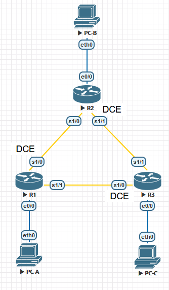

# **Лабораторная работа. Настройка базового протокола OSPFv2 для одной области**

### **Топология**



### **Таблица адресации**

| Устройство | Интерфейс  | IP-адрес     | Маска подсети   | Шлюз по умолчанию |
| ---------- | ---------- | ------------ | --------------- | ----------------- |
| R1         | e0/0       | 192.168.1.1  | 255.255.255.0   | —                 |
| R1         | S1/0 (DCE) | 192.168.12.1 | 255.255.255.252 | —                 |
| R1         | S1/1       | 192.168.13.1 | 255.255.255.252 | —                 |
|            |            |              |                 |                   |
| R2         | e0/0       | 192.168.2.1  | 255.255.255.0   | —                 |
| R2         | S1/0       | 192.168.12.2 | 255.255.255.252 | —                 |
| R2         | S1/1 (DCE) | 192.168.23.1 | 255.255.255.252 | —                 |
|            |            |              |                 |                   |
| R3         | e0/0       | 192.168.3.1  | 255.255.255.0   | —                 |
| R3         | S1/0 (DCE) | 192.168.13.2 | 255.255.255.252 | —                 |
| R3         | S1/1       | 192.168.23.2 | 255.255.255.252 | —                 |
|            |            |              |                 |                   |
| PC-A       | NIC        | 192.168.1.3  | 255.255.255.0   | 192.168.1.1       |
| PC-B       | NIC        | 192.168.2.3  | 255.255.255.0   | 192.168.2.1       |
| PC-C       | NIC        | 192.168.3.3  | 255.255.255.0   | 192.168.3.1       |

### **Задачи**

**1. Создание сети и настройка основных параметров устройства**

**2. Настройка и проверка маршрутизации OSPF**

**3. Изменение назначений идентификаторов маршрутизаторов**

**4. Настройка пассивных интерфейсов OSPF**

**5. Изменение метрик OSPF**

### **Общие сведения/сценарий**

Алгоритм кратчайшего пути (OSPF) — это протокол маршрутизации для IP-сетей на основе состояния канала. OSPFv2 определен для сетей протокола IPv4, а OSPFv3 — для сетей IPv6. OSPF обнаруживает изменения в топологии, например сбой канала, и быстро сходится в новой беспетлевой структуре маршрутизации. OSPF рассчитывает каждый маршрут с помощью алгоритма Дейкстры, т. е. алгоритма кратчайшего пути.

В этой лабораторной работе необходимо настроить топологию сети с маршрутизацией OSPFv2, изменить назначения идентификаторов маршрутизаторов, настроить пассивные интерфейсы, настроить метрики OSPF и использовать ряд команд интерфейса командной строки для вывода и проверки данных маршрутизации OSPF.

**Примечание**. В практических лабораторных работах CCNA используются маршрутизаторы с интегрированными сетевыми сервисами (ISR) Cisco 1941 с операционной системой Cisco IOS версии 15.2(4)M3 (образ universalk9). Допускается использование маршрутизаторов других моделей, а также других версий операционной системы Cisco IOS. В зависимости от модели устройства и версии Cisco IOS доступные команды и результаты их выполнения могут отличаться от тех, которые показаны в лабораторных работах. Точные идентификаторы интерфейсов см. в сводной таблице по интерфейсам маршрутизаторов в конце лабораторной работы.

**Примечание**. Убедитесь, что все настройки маршрутизаторов удалены и загрузочная конфигурация отсутствует. Если вы не уверены, обратитесь к инструктору.

### **Необходимые ресурсы**

- 3 маршрутизатора (Cisco 1941 с операционной системой Cisco IOS версии 15.2(4)M3 (универсальный образ) или аналогичная модель)
- 3 ПК (Windows и программа эмуляции терминала, такая как Tera Term)
- Консольные кабели для настройки устройств Cisco IOS через консольные порты
- Кабели Ethernet и последовательные кабели согласно топологии

### **1. Создание сети и настройка основных параметров устройства**

В части 1 вам предстоит создать топологию сети и настроить базовые параметры для ПК и маршрутизаторов.

**1.1 Создайте сеть согласно топологии.**

**1.2 Выполните запуск и перезагрузку маршрутизаторов.**

**1.3 Произведите базовую настройку маршрутизаторов.**

Отключите DNS-поиск.

```
(conf) no ip domain-lookup
```

Настройте имена устройств в соответствии с топологией.

```
(conf) hostname R1
```

Назначьте **class **в качестве пароля привилегированного режима EXEC.

```
(conf) enable secret class
```

Назначьте **cisco** в качестве паролей консоли и VTY.

```
(conf) line vty 0 4
(conf-line) password cisco
(conf-line) login

(conf) line console 0
(conf-line) password cisco
(conf-line) login
```

Настройте баннерное сообщение дня (MOTD) для предупреждения пользователей о запрете 		несанкционированного доступа.

```
(conf) banner motd #Unauthorized access is prohibited#
```

Настройте **logging synchronous** на линии консоли.

```
(conf-line) logging synchronous
```

Назначьте IP-адреса всем интерфейсам в соответствии с таблицей адресации.

```
(conf) interface s1/0
(conf-if)ip address 192.168.12.1255.255.255.252
(conf-if) no shutdown
```

Настройте тактовую частоту на всех последовательных интерфейсах DCE на **128000**.

```
(conf-if) clock rate 128000
```

Скопируйте текущую конфигурацию в файл загрузочной конфигурации.

```
# copy run start
```

**1.4 Настройте узлы ПК.**

**1.5 Проверьте связь.**

Маршрутизаторы должны успешно отправлять эхо-запросы друг другу, и все ПК должны успешно отправлять эхо-запросы на свои шлюзы по умолчанию. Компьютеры не могут отправлять эхо-запросы другим ПК, пока не настроена маршрутизация OSPF. При неудачном выполнении эхо-запросов выполните поиск и устранение неполадок.

### **2. Настройка и проверка маршрутизации OSPF**

В части 2 вам предстоит настроить маршрутизацию OSPFv2 на всех маршрутизаторах в сети, а затем убедиться, что таблицы маршрутизации правильно обновляются.

**2.1 Настройте протокол OSPF на маршрутизаторе R1.**

Используйте команду **router ospf** в режиме глобальной конфигурации, чтобы включить протокол OSPF на маршрутизаторе R1.

```
R1(config)# router ospf 1
```

**Примечание**. Идентификатор процесса OSPF хранится локально и не имеет отношения к другим маршрутизаторам в сети.

Настройте инструкции **network** для сетей на маршрутизаторе R1. Используйте идентификатор области, равный 0.

```
R1(config-router)# network 192.168.1.0 0.0.0.255 area 0

R1(config-router)# network 192.168.12.0 0.0.0.3 area 0

R1(config-router)# network 192.168.13.0 0.0.0.3 area 0
```

**2.2 Настройте OSPF на маршрутизаторах R2 и R3.**

Воспользуйтесь командой **router ospf** и добавьте инструкции **network** для сетей на маршрутизаторах R2 и R3. Когда маршрутизация OSPF будет настроена на R2 и R3, на маршрутизаторе R1 будут появятся сообщения об отношениях смежности.

```
R1#

00:22:29: %OSPF-5-ADJCHG: Process 1, Nbr 192.168.23.1 on Serial0/0/0 from LOADING to FULL, Loading Done

R1#

0:23:14: %OSPF-5-ADJCHG: Process 1, Nbr 192.168.23.2 on Serial0/0/1 from LOADING to FULL, Loading Done
```

**2.3 Проверьте информацию о соседних устройствах и маршрутизации OSPF.**

Выполните команду **show ip ospf neighbor**, чтобы убедиться, что на каждом маршрутизаторе другие маршрутизаторы сети указаны в качестве соседних устройств.

```
R1#show ip ospf neighbor

Neighbor ID     Pri   State           Dead Time   Address         Interface
192.168.23.2      0   FULL/  -        00:00:38    192.168.13.2    Serial1/1
192.168.23.1      0   FULL/  -        00:00:34    192.168.12.2    Serial1/0
```

Введите команду **show ip route**, чтобы убедиться, что все сети отображаются в таблице 		маршрутизации на всех маршрутизаторах.

```
R1#show ip route
Codes: L - local, C - connected, S - static, R - RIP, M - mobile, B - BGP
       D - EIGRP, EX - EIGRP external, O - OSPF, IA - OSPF inter area
       N1 - OSPF NSSA external type 1, N2 - OSPF NSSA external type 2
       E1 - OSPF external type 1, E2 - OSPF external type 2
       i - IS-IS, su - IS-IS summary, L1 - IS-IS level-1, L2 - IS-IS level-2
       ia - IS-IS inter area, * - candidate default, U - per-user static route
       o - ODR, P - periodic downloaded static route, H - NHRP, l - LISP
       a - application route
       + - replicated route, % - next hop override

Gateway of last resort is not set

      192.168.1.0/24 is variably subnetted, 2 subnets, 2 masks
C        192.168.1.0/24 is directly connected, Ethernet0/0
L        192.168.1.1/32 is directly connected, Ethernet0/0
O     192.168.2.0/24 [110/74] via 192.168.12.2, 00:04:40, Serial1/0
O     192.168.3.0/24 [110/74] via 192.168.13.2, 00:02:08, Serial1/1
      192.168.12.0/24 is variably subnetted, 2 subnets, 2 masks
C        192.168.12.0/30 is directly connected, Serial1/0
L        192.168.12.1/32 is directly connected, Serial1/0
      192.168.13.0/24 is variably subnetted, 2 subnets, 2 masks
C        192.168.13.0/30 is directly connected, Serial1/1
L        192.168.13.1/32 is directly connected, Serial1/1
      192.168.23.0/30 is subnetted, 1 subnets
O        192.168.23.0 [110/128] via 192.168.13.2, 00:02:08, Serial1/1
                      [110/128] via 192.168.12.2, 00:04:30, Serial1/0
```

*Какую команду вы бы применили, чтобы просмотреть в таблице маршрутизации только маршруты OSPF?*

**show ip route ospf**

```
R1#show ip route ospf
Codes: L - local, C - connected, S - static, R - RIP, M - mobile, B - BGP
       D - EIGRP, EX - EIGRP external, O - OSPF, IA - OSPF inter area
       N1 - OSPF NSSA external type 1, N2 - OSPF NSSA external type 2
       E1 - OSPF external type 1, E2 - OSPF external type 2
       i - IS-IS, su - IS-IS summary, L1 - IS-IS level-1, L2 - IS-IS level-2
       ia - IS-IS inter area, * - candidate default, U - per-user static route
       o - ODR, P - periodic downloaded static route, H - NHRP, l - LISP
       a - application route
       + - replicated route, % - next hop override

Gateway of last resort is not set

O     192.168.2.0/24 [110/74] via 192.168.12.2, 00:05:43, Serial1/0
O     192.168.3.0/24 [110/74] via 192.168.13.2, 00:03:11, Serial1/1
      192.168.23.0/30 is subnetted, 1 subnets
O        192.168.23.0 [110/128] via 192.168.13.2, 00:03:11, Serial1/1
                      [110/128] via 192.168.12.2, 00:05:33, Serial1/0
```

**2.4 Проверьте параметры протокола OSPF**

Команда **show ip protocols** — быстрый способ проверки важнейшей информации о конфигурации OSPF. Эта информация содержит идентификатор процесса OSPF, идентификатор маршрутизатора, объявляемые маршрутизатором сети, соседние устройства, от который маршрутизатор получает обновления, а также административную дистанцию по умолчанию, для OSPF равную 110.

```
R1#show ip protocols
*** IP Routing is NSF aware ***

Routing Protocol is "application"
  Sending updates every 0 seconds
  Invalid after 0 seconds, hold down 0, flushed after 0
  Outgoing update filter list for all interfaces is not set
  Incoming update filter list for all interfaces is not set
  Maximum path: 32
  Routing for Networks:
  Routing Information Sources:
    Gateway         Distance      Last Update
  Distance: (default is 4)

Routing Protocol is "ospf 1"
  Outgoing update filter list for all interfaces is not set
  Incoming update filter list for all interfaces is not set
  Router ID 192.168.13.1
  Number of areas in this router is 1. 1 normal 0 stub 0 nssa
  Maximum path: 4
  Routing for Networks:
    192.168.1.0 0.0.0.255 area 0
    192.168.12.0 0.0.0.255 area 0
    192.168.13.0 0.0.0.255 area 0
  Routing Information Sources:
    Gateway         Distance      Last Update
    192.168.23.2         110      00:04:10
    192.168.23.1         110      00:06:32
  Distance: (default is 110)
```

**2.5 Проверьте данные процесса OSPF.**

Используйте команду **show ip ospf** для проверки идентификатора процесса OSPF и идентификатора маршрутизатора. Эта команда отображает данные области OSPF и показывает время последнего расчёта алгоритма SPF.

```

R1#show ip ospf
 Routing Process "ospf 1" with ID 192.168.13.1
 Start time: 00:20:56.223, Time elapsed: 00:09:17.332
 Supports only single TOS(TOS0) routes
 Supports opaque LSA
 Supports Link-local Signaling (LLS)
 Supports area transit capability
 Supports NSSA (compatible with RFC 3101)
 Supports Database Exchange Summary List Optimization (RFC 5243)
 Event-log enabled, Maximum number of events: 1000, Mode: cyclic
 Router is not originating router-LSAs with maximum metric
 Initial SPF schedule delay 5000 msecs
 Minimum hold time between two consecutive SPFs 10000 msecs
 Maximum wait time between two consecutive SPFs 10000 msecs
 Incremental-SPF disabled
 Minimum LSA interval 5 secs
 Minimum LSA arrival 1000 msecs
 LSA group pacing timer 240 secs
 Interface flood pacing timer 33 msecs
 Retransmission pacing timer 66 msecs
 Number of external LSA 0. Checksum Sum 0x000000
 Number of opaque AS LSA 0. Checksum Sum 0x000000
 Number of DCbitless external and opaque AS LSA 0
 Number of DoNotAge external and opaque AS LSA 0
 Number of areas in this router is 1. 1 normal 0 stub 0 nssa
 Number of areas transit capable is 0
 External flood list length 0
 IETF NSF helper support enabled
 Cisco NSF helper support enabled
 Reference bandwidth unit is 100 mbps
    Area BACKBONE(0)
        Number of interfaces in this area is 3
        Area has no authentication
        SPF algorithm last executed 00:05:05.819 ago
        SPF algorithm executed 6 times
        Area ranges are
        Number of LSA 3. Checksum Sum 0x016A76
        Number of opaque link LSA 0. Checksum Sum 0x000000
        Number of DCbitless LSA 0
        Number of indication LSA 0
        Number of DoNotAge LSA 0
        Flood list length 0

```

**2.6 Проверьте параметры интерфейса OSPF.**

Введите команду **show ip ospf interface brief** для отображения сводки интерфейсов с поддержкой протокола OSPF.

```
R1# show ip ospf interface brief

Interface   PID   Area            IP Address/Mask    Cost  State Nbrs F/C

Se0/0/1     1     0               192.168.13.1/30    64    P2P   1/1

Se0/0/0     1     0               192.168.12.1/30    64    P2P   1/1

Gi0/0       1     0               192.168.1.1/24     1     DR    0/0
```

Для получения более подробного списка всех интерфейсов с поддержкой протокола OSPF введите команду **show ip ospf interface**.

```
R1# show ip ospf interface
Serial0/0/1 is up, line protocol is up 
  Internet Address 192.168.13.1/30, Area 0, Attached via Network Statement
  Process ID 1, Router ID 192.168.13.1, Network Type POINT_TO_POINT, Cost: 64
  Topology-MTID    Cost    Disabled    Shutdown      Topology Name
        0           64        no          no            Base
  Transmit Delay is 1 sec, State POINT_TO_POINT
  Timer intervals configured, Hello 10, Dead 40, Wait 40, Retransmit 5
    oob-resync timeout 40
    Hello due in 00:00:01
  Supports Link-local Signaling (LLS)
  Cisco NSF helper support enabled
  IETF NSF helper support enabled
  Index 3/3, flood queue length 0
  Next 0x0(0)/0x0(0)
  Last flood scan length is 1, maximum is 1
  Last flood scan time is 0 msec, maximum is 0 msec
  Neighbor Count is 1, Adjacent neighbor count is 1 
    Adjacent with neighbor 192.168.23.2
  Suppress hello for 0 neighbor(s)
Serial0/0/0 is up, line protocol is up 
  Internet Address 192.168.12.1/30, Area 0, Attached via Network Statement
  Process ID 1, Router ID 192.168.13.1, Network Type POINT_TO_POINT, Cost: 64
  Topology-MTID    Cost    Disabled    Shutdown      Topology Name
        0           64        no          no            Base
  Transmit Delay is 1 sec, State POINT_TO_POINT
  Timer intervals configured, Hello 10, Dead 40, Wait 40, Retransmit 5
    oob-resync timeout 40
    Hello due in 00:00:03
  Supports Link-local Signaling (LLS)
  Cisco NSF helper support enabled
  IETF NSF helper support enabled
  Index 2/2, flood queue length 0
  Next 0x0(0)/0x0(0)
  Last flood scan length is 1, maximum is 1
  Last flood scan time is 0 msec, maximum is 0 msec
  Neighbor Count is 1, Adjacent neighbor count is 1 
    Adjacent with neighbor 192.168.23.1
  Suppress hello for 0 neighbor(s)
GigabitEthernet0/0 is up, line protocol is up 
  Internet Address 192.168.1.1/24, Area 0, Attached via Network Statement
  Process ID 1, Router ID 192.168.13.1, Network Type BROADCAST, Cost: 1
  Topology-MTID    Cost    Disabled    Shutdown      Topology Name
        0           1         no          no            Base
  Transmit Delay is 1 sec, State DR, Priority 1
  Designated Router (ID) 192.168.13.1, Interface address 192.168.1.1
  No backup designated router on this network
  Timer intervals configured, Hello 10, Dead 40, Wait 40, Retransmit 5
    oob-resync timeout 40
    Hello due in 00:00:01
  Supports Link-local Signaling (LLS)
  Cisco NSF helper support enabled
  IETF NSF helper support enabled
  Index 1/1, flood queue length 0
  Next 0x0(0)/0x0(0)
  Last flood scan length is 0, maximum is 0
  Last flood scan time is 0 msec, maximum is 0 msec
  Neighbor Count is 0, Adjacent neighbor count is 0 
  Suppress hello for 0 neighbor(s)
```

**2.7 Проверьте наличие сквозного соединения.**

Все компьютеры должны успешно отправлять эхо-запросы ко всем остальным компьютерам, указанным в топологии. При неудачном выполнении эхо-запросов выполните поиск и устранение неполадок.

**Примечание**. Для успешной передачи эхо-запросов может потребоваться отключение межсетевого экрана.

```
VPCS> ping 192.168.3.3

84 bytes from 192.168.3.3 icmp_seq=1 ttl=62 time=9.784 ms
84 bytes from 192.168.3.3 icmp_seq=2 ttl=62 time=8.740 ms
84 bytes from 192.168.3.3 icmp_seq=3 ttl=62 time=8.745 ms
84 bytes from 192.168.3.3 icmp_seq=4 ttl=62 time=8.752 ms
84 bytes from 192.168.3.3 icmp_seq=5 ttl=62 time=8.714 ms

VPCS> ping 192.168.2.3

84 bytes from 192.168.2.3 icmp_seq=1 ttl=62 time=9.147 ms
84 bytes from 192.168.2.3 icmp_seq=2 ttl=62 time=8.738 ms
84 bytes from 192.168.2.3 icmp_seq=3 ttl=62 time=8.712 ms
84 bytes from 192.168.2.3 icmp_seq=4 ttl=62 time=8.698 ms
84 bytes from 192.168.2.3 icmp_seq=5 ttl=62 time=8.655 ms
```

### **3. Изменение назначенных идентификаторов маршрутизаторов**

Идентификатор OSPF-маршрутизатора используется для уникальной идентификации домена маршрутизации OSPF. Маршрутизаторам компании Cisco идентификатор назначается одним из трех способов и в следующем порядке:

1. IP-адрес, настроенный с помощью команды OSPF **router-id** (при наличии)
2. Наибольший IP-адрес любого из loopback-адресов маршрутизатора (при наличии)
3. Наибольший активный IP-адрес любого из физических интерфейсов маршрутизатора

Поскольку ни на одном из трех маршрутизаторов не настроены ID маршрутизатора или интерфейсы loopback, ID каждого маршрутизатора определяется наивысшим IP-адресом любого активного интерфейса.

В части 3 вам необходимо изменить назначение идентификатора OSPF-маршрутизатора с помощью loopback-адресов. Также мы воспользуемся командой **router-id** для смены идентификатора маршрутизатора.

**3.1 Измените идентификаторы маршрутизатора с помощью loopback-адресов.**

Назначьте IP-адрес loopback-интерфейсу 0 для маршрутизатора R1.

```
R1(config)# interface lo0

R1(config-if)# ip address 1.1.1.1 255.255.255.255

R1(config-if)# end
```

Назначьте IP-адреса loopback-интерфейсам 0 для маршрутизаторов R2 и R3. Используйте IP-адрес 2.2.2.2/32 для R2 и 3.3.3.3/32 для R3.

Сохраните текущую конфигурацию в загрузочную конфигурацию на всех трех маршрутизаторах.

Чтобы восстановить для идентификатора маршрутизатора использование loopback-адреса, необходимо перезагрузить маршрутизаторы. Выполните команду **reload** на всех трех 		маршрутизаторах. Нажмите клавишу ВВОД, чтобы подтвердить перезагрузку.

После того как маршрутизатор завершит процесс перезагрузки, введите команду **show ip 		protocols**, чтобы просмотреть новый идентификатор маршрутизатора.

```
R1#show ip prot
*** IP Routing is NSF aware ***

Routing Protocol is "application"
  Sending updates every 0 seconds
  Invalid after 0 seconds, hold down 0, flushed after 0
  Outgoing update filter list for all interfaces is not set
  Incoming update filter list for all interfaces is not set
  Maximum path: 32
  Routing for Networks:
  Routing Information Sources:
    Gateway         Distance      Last Update
  Distance: (default is 4)

Routing Protocol is "ospf 1"
  Outgoing update filter list for all interfaces is not set
  Incoming update filter list for all interfaces is not set
  Router ID 1.1.1.1
  Number of areas in this router is 1. 1 normal 0 stub 0 nssa
  Maximum path: 4
  Routing for Networks:
    192.168.1.0 0.0.0.255 area 0
    192.168.12.0 0.0.0.255 area 0
    192.168.13.0 0.0.0.255 area 0
  Routing Information Sources:
    Gateway         Distance      Last Update
    3.3.3.3              110      00:07:52
    2.2.2.2              110      00:07:52
  Distance: (default is 110)
```

Введите команду **show ip ospf neighbor**, чтобы просмотреть изменения идентификаторов соседних маршрутизаторов.

```
R1#show ip ospf neighbor

Neighbor ID     Pri   State           Dead Time   Address         Interface
3.3.3.3           0   FULL/  -        00:00:37    192.168.13.2    Serial1/1
2.2.2.2           0   FULL/  -        00:00:32    192.168.12.2    Serial1/0
```

**3.2 Измените идентификатор маршрутизатора R1 с помощью команды router-id.**

Предпочтительным методом настройки идентификатора маршрутизатора является команда **router-id**.

Чтобы переназначить идентификатор маршрутизатора R1, выполните на нем команду **router-id 		11.11.11.11**. Обратите внимание на уведомление, которое появляется при выполнении команды **router-id**.

```
R1(config)# router ospf 1
R1(config-router)#router-id 11.11.11.11
% OSPF: Reload or use "clear ip ospf process" command, for this to take effect
```

На экран будет выведено информационное сообщение о том, что необходимо либо перезагрузить маршрутизатор, либо воспользоваться командой **clear ip ospf process** для вступления этого изменения в силу. Введите команду **clear ip ospf process** на всех трех маршрутизаторах. Введите **yes**, чтобы подтвердить сброс, и нажмите клавишу ВВОД.

Для маршрутизатор R2 настройте идентификатор **22.22.22.22**, а для маршрутизатора R3 настройте идентификатор **33.33.33.33**. Затем используйте команду **clear ip ospf process** 		для сброса процесса маршрутизации ospf.

Введите команду **show ip protocols**, чтобы проверить, изменился ли идентификатор на маршрутизаторе R1.

```
R1#show ip protocols
*** IP Routing is NSF aware ***

Routing Protocol is "application"
  Sending updates every 0 seconds
  Invalid after 0 seconds, hold down 0, flushed after 0
  Outgoing update filter list for all interfaces is not set
  Incoming update filter list for all interfaces is not set
  Maximum path: 32
  Routing for Networks:
  Routing Information Sources:
    Gateway         Distance      Last Update
  Distance: (default is 4)

Routing Protocol is "ospf 1"
  Outgoing update filter list for all interfaces is not set
  Incoming update filter list for all interfaces is not set
  Router ID 11.11.11.11
  Number of areas in this router is 1. 1 normal 0 stub 0 nssa
  Maximum path: 4
  Routing for Networks:
    192.168.1.0 0.0.0.255 area 0
    192.168.12.0 0.0.0.255 area 0
    192.168.13.0 0.0.0.255 area 0
  Routing Information Sources:
    Gateway         Distance      Last Update
    33.33.33.33              110      00:03:44
    22.22.22.22              110      00:03:44
  Distance: (default is 110)
```

Выполните команду **show ip ospf neighbor** на маршрутизаторе R1, чтобы убедиться, что новые идентификаторы для маршрутизаторов R2 и R3 содержатся в списке.

```
R1#show ip ospf neighbor

Neighbor ID     Pri   State           Dead Time   Address         Interface
33.33.33.33           0   FULL/  -        00:00:36    192.168.13.2    Serial1/1
22.22.22.22           0   FULL/  -        00:00:30    192.168.12.2    Serial1/0
```

### **4. Настройка пассивных интерфейсов OSPF**

Команда **passive-interface** запрещает отправку обновлений маршрутов через указанный интерфейс маршрутизатора. В большинстве случаев команда используется для уменьшения трафика в локальных сетях, поскольку им не нужно получать сообщения протокола динамической маршрутизации. В части 4 вам предстоит использовать команду **passive-interface** для настройки интерфейса в качестве пассивного. Также вы настроите OSPF таким образом, чтобы все интерфейсы маршрутизатора были пассивными по умолчанию, а затем включите объявления протокола маршрутизации OSPF для выбранных интерфейсов.

**4.1 Настройте пассивный интерфейс.**

Введите команду **show ip ospf interface g0/0** на маршрутизаторе R1. Обратите внимание на таймер, указывающий время получения очередного пакета приветствия. Пакеты приветствия 		отправляются каждые 10 секунд и используются маршрутизаторами OSPF для проверки работоспособности соседних устройств.

```
R1#show ip os interface e0/0
Ethernet0/0 is up, line protocol is up
  Internet Address 192.168.1.1/24, Area 0, Attached via Network Statement
  Process ID 1, Router ID 11.11.11.11, Network Type BROADCAST, Cost: 10
  Topology-MTID    Cost    Disabled    Shutdown      Topology Name
        0           10        no          no            Base
  Transmit Delay is 1 sec, State DR, Priority 1
  Designated Router (ID) 11.11.11.11, Interface address 192.168.1.1
  No backup designated router on this network
  Timer intervals configured, Hello 10, Dead 40, Wait 40, Retransmit 5
    oob-resync timeout 40
    Hello due in 00:00:08
  Supports Link-local Signaling (LLS)
  Cisco NSF helper support enabled
  IETF NSF helper support enabled
  Index 1/1/1, flood queue length 0
  Next 0x0(0)/0x0(0)/0x0(0)
  Last flood scan length is 0, maximum is 0
  Last flood scan time is 0 msec, maximum is 0 msec
  Neighbor Count is 0, Adjacent neighbor count is 0
  Suppress hello for 0 neighbor(s)
```

Выполните команду **passive-interface**, чтобы интерфейс G0/0 маршрутизатора R1 стал пассивным.

```
R1(config)# router ospf 1

R1(config-router)# passive-interface g0/0
```

Повторно выполните команду **show ip ospf interface g0/0**, чтобы убедиться, что интерфейс G0/0 стал пассивным.

```
R1#sho ip os int e0/0
Ethernet0/0 is up, line protocol is up
  Internet Address 192.168.1.1/24, Area 0, Attached via Network Statement
  Process ID 1, Router ID 11.11.11.11, Network Type BROADCAST, Cost: 10
  Topology-MTID    Cost    Disabled    Shutdown      Topology Name
        0           10        no          no            Base
  Transmit Delay is 1 sec, State WAITING, Priority 1
  No designated router on this network
  No backup designated router on this network
  Timer intervals configured, Hello 10, Dead 40, Wait 40, Retransmit 5
    oob-resync timeout 40
    No Hellos (Passive interface)
    Wait time before Designated router selection 00:00:17
  Supports Link-local Signaling (LLS)
  Cisco NSF helper support enabled
  IETF NSF helper support enabled
  Index 1/1/1, flood queue length 0
  Next 0x0(0)/0x0(0)/0x0(0)
  Last flood scan length is 0, maximum is 0
  Last flood scan time is 0 msec, maximum is 0 msec
  Neighbor Count is 0, Adjacent neighbor count is 0
  Suppress hello for 0 neighbor(s)
```

Введите команду **show ip route** на маршрутизаторах R2 и R3, чтобы убедиться, что маршрут к сети 192.168.1.0/24 остается доступным.

```
R2#show ip route
Codes: L - local, C - connected, S - static, R - RIP, M - mobile, B - BGP
       D - EIGRP, EX - EIGRP external, O - OSPF, IA - OSPF inter area
       N1 - OSPF NSSA external type 1, N2 - OSPF NSSA external type 2
       E1 - OSPF external type 1, E2 - OSPF external type 2
       i - IS-IS, su - IS-IS summary, L1 - IS-IS level-1, L2 - IS-IS level-2
       ia - IS-IS inter area, * - candidate default, U - per-user static route
       o - ODR, P - periodic downloaded static route, H - NHRP, l - LISP
       a - application route
       + - replicated route, % - next hop override

Gateway of last resort is not set

      2.0.0.0/32 is subnetted, 1 subnets
C        2.2.2.2 is directly connected, Loopback1
O     192.168.1.0/24 [110/74] via 192.168.12.1, 00:06:36, Serial1/0
      192.168.2.0/24 is variably subnetted, 2 subnets, 2 masks
C        192.168.2.0/24 is directly connected, Ethernet0/0
L        192.168.2.1/32 is directly connected, Ethernet0/0
O     192.168.3.0/24 [110/74] via 192.168.23.2, 00:06:36, Serial1/1
      192.168.12.0/24 is variably subnetted, 2 subnets, 2 masks
C        192.168.12.0/30 is directly connected, Serial1/0
L        192.168.12.2/32 is directly connected, Serial1/0
      192.168.13.0/30 is subnetted, 1 subnets
O        192.168.13.0 [110/128] via 192.168.23.2, 00:06:36, Serial1/1
                      [110/128] via 192.168.12.1, 00:06:36, Serial1/0
      192.168.23.0/24 is variably subnetted, 2 subnets, 2 masks
C        192.168.23.0/30 is directly connected, Serial1/1
L        192.168.23.1/32 is directly connected, Serial1/1
```

**4.2 Настройте на маршрутизаторе пассивный интерфейс в качестве интерфейса по 	умолчанию.**

Выполните команду **show ip ospf neighbor** на маршрутизаторе R1, чтобы убедиться, что R2 указан в качестве соседнего устройства OSPF.

```
R1#show ip os neighbor

Neighbor ID     Pri   State           Dead Time   Address         Interface
33.33.33.33           0   FULL/  -        00:00:33    192.168.13.2    Serial1/1
22.22.22.22           0   FULL/  -        00:00:36    192.168.12.2    Serial1/0
```

Введите команду **passive-interface default** на маршрутизаторе R2, чтобы задать настройку по умолчанию всех интерфейсов OSPF в качестве пассивных.

```
R2(config)# router ospf 1
R2(config-router)#passive-interface default
R2(config-router)#
*May  7 10:14:50.547: %OSPF-5-ADJCHG: Process 1, Nbr 11.11.11.11 on Serial1/0 from FULL to DOWN, Neighbor Down: Interface down or detached
*May  7 10:14:50.547: %OSPF-5-ADJCHG: Process 1, Nbr 33.33.33.33 on Serial1/1 from FULL to DOWN, Neighbor Down: Interface down or detached
```

Повторно введите команду **show ip ospf neighbor** на маршрутизаторе R1. После истечения таймера простоя маршрутизатор R2 больше не будет указан как соседнее устройство OSPF.

```
R1# show ip ospf neighbor

Neighbor ID     Pri   State           Dead Time   Address         Interface

33.33.33.33      0   FULL/  -        00:00:34    192.168.13.2    Serial0/0/1
```

Выполните команду **show ip ospf interface S0/0/0** на маршрутизаторе R2, чтобы просмотреть состояние OSPF для интерфейса S1/0.

```
R2#show ip ospf interface s1/0
Serial1/0 is up, line protocol is up
  Internet Address 192.168.12.2/30, Area 0, Attached via Network Statement
  Process ID 1, Router ID 22.22.22.22, Network Type POINT_TO_POINT, Cost: 64
  Topology-MTID    Cost    Disabled    Shutdown      Topology Name
        0           64        no          no            Base
  Transmit Delay is 1 sec, State POINT_TO_POINT
  Timer intervals configured, Hello 10, Dead 40, Wait 40, Retransmit 5
    oob-resync timeout 40
    No Hellos (Passive interface)
  Supports Link-local Signaling (LLS)
  Cisco NSF helper support enabled
  IETF NSF helper support enabled
  Index 1/2/2, flood queue length 0
  Next 0x0(0)/0x0(0)/0x0(0)
  Last flood scan length is 0, maximum is 0
  Last flood scan time is 0 msec, maximum is 0 msec
  Neighbor Count is 0, Adjacent neighbor count is 0
  Suppress hello for 0 neighbor(s)
```

Если все интерфейсы маршрутизатора R2 являются пассивными, то информация маршрутизации не будет объявляться. В этом случае у маршрутизаторов R1 и R3 теперь должен отсутствовать маршрут к сети 192.168.2.0/24. Это можно проверить командой **show ip route**.

```
R1#show ip route
Codes: L - local, C - connected, S - static, R - RIP, M - mobile, B - BGP
       D - EIGRP, EX - EIGRP external, O - OSPF, IA - OSPF inter area
       N1 - OSPF NSSA external type 1, N2 - OSPF NSSA external type 2
       E1 - OSPF external type 1, E2 - OSPF external type 2
       i - IS-IS, su - IS-IS summary, L1 - IS-IS level-1, L2 - IS-IS level-2
       ia - IS-IS inter area, * - candidate default, U - per-user static route
       o - ODR, P - periodic downloaded static route, H - NHRP, l - LISP
       a - application route
       + - replicated route, % - next hop override

Gateway of last resort is not set

      1.0.0.0/32 is subnetted, 1 subnets
C        1.1.1.1 is directly connected, Loopback1
      192.168.1.0/24 is variably subnetted, 2 subnets, 2 masks
C        192.168.1.0/24 is directly connected, Ethernet0/0
L        192.168.1.1/32 is directly connected, Ethernet0/0
O     192.168.3.0/24 [110/74] via 192.168.13.2, 00:01:43, Serial1/1
      192.168.12.0/24 is variably subnetted, 2 subnets, 2 masks
C        192.168.12.0/30 is directly connected, Serial1/0
L        192.168.12.1/32 is directly connected, Serial1/0
      192.168.13.0/24 is variably subnetted, 2 subnets, 2 masks
C        192.168.13.0/30 is directly connected, Serial1/1
L        192.168.13.1/32 is directly connected, Serial1/1
      192.168.23.0/30 is subnetted, 1 subnets
O        192.168.23.0 [110/128] via 192.168.13.2, 00:01:43, Serial1/1
```

На маршрутизаторе R2 выполните команду **no passive-interface**, чтобы маршрутизатор отправлял и получал обновления маршрутизации OSPF. После ввода этой команды появится уведомление о том, что были установлены соседские отношения смежности с маршрутизатором R1.

```
R2(config)# router ospf 1
R2(config-router)#no passive-interface s1/0
R2(config-router)#
*May  7 10:22:51.206: %OSPF-5-ADJCHG: Process 1, Nbr 11.11.11.11 on Serial1/0 from LOADING to FULL, Loading Done
```

Повторно выполните команды **show ip route** и **show ip ospf neighbor** на маршрутизаторах R1 и R3 и найдите маршрут к сети 192.168.2.0/24.

```
R1#sh ip route
Codes: L - local, C - connected, S - static, R - RIP, M - mobile, B - BGP
       D - EIGRP, EX - EIGRP external, O - OSPF, IA - OSPF inter area
       N1 - OSPF NSSA external type 1, N2 - OSPF NSSA external type 2
       E1 - OSPF external type 1, E2 - OSPF external type 2
       i - IS-IS, su - IS-IS summary, L1 - IS-IS level-1, L2 - IS-IS level-2
       ia - IS-IS inter area, * - candidate default, U - per-user static route
       o - ODR, P - periodic downloaded static route, H - NHRP, l - LISP
       a - application route
       + - replicated route, % - next hop override

Gateway of last resort is not set

      1.0.0.0/32 is subnetted, 1 subnets
C        1.1.1.1 is directly connected, Loopback1
      192.168.1.0/24 is variably subnetted, 2 subnets, 2 masks
C        192.168.1.0/24 is directly connected, Ethernet0/0
L        192.168.1.1/32 is directly connected, Ethernet0/0
O     192.168.2.0/24 [110/74] via 192.168.12.2, 00:02:41, Serial1/0
O     192.168.3.0/24 [110/74] via 192.168.13.2, 00:06:22, Serial1/1
      192.168.12.0/24 is variably subnetted, 2 subnets, 2 masks
C        192.168.12.0/30 is directly connected, Serial1/0
L        192.168.12.1/32 is directly connected, Serial1/0
      192.168.13.0/24 is variably subnetted, 2 subnets, 2 masks
C        192.168.13.0/30 is directly connected, Serial1/1
L        192.168.13.1/32 is directly connected, Serial1/1
      192.168.23.0/30 is subnetted, 1 subnets
O        192.168.23.0 [110/128] via 192.168.13.2, 00:06:22, Serial1/1
                      [110/128] via 192.168.12.2, 00:02:41, Serial1/0
```

```
R1#show ip ospf neighbor

Neighbor ID     Pri   State           Dead Time   Address         Interface
33.33.33.33       0   FULL/  -        00:00:37    192.168.13.2    Serial1/1
22.22.22.22       0   FULL/  -        00:00:31    192.168.12.2    Serial1/0
```

```
R3#show ip route
Codes: L - local, C - connected, S - static, R - RIP, M - mobile, B - BGP
       D - EIGRP, EX - EIGRP external, O - OSPF, IA - OSPF inter area
       N1 - OSPF NSSA external type 1, N2 - OSPF NSSA external type 2
       E1 - OSPF external type 1, E2 - OSPF external type 2
       i - IS-IS, su - IS-IS summary, L1 - IS-IS level-1, L2 - IS-IS level-2
       ia - IS-IS inter area, * - candidate default, U - per-user static route
       o - ODR, P - periodic downloaded static route, H - NHRP, l - LISP
       a - application route
       + - replicated route, % - next hop override

Gateway of last resort is not set

      3.0.0.0/32 is subnetted, 1 subnets
C        3.3.3.3 is directly connected, Loopback1
O     192.168.1.0/24 [110/74] via 192.168.13.1, 00:04:43, Serial1/0
O     192.168.2.0/24 [110/138] via 192.168.13.1, 00:00:33, Serial1/0
      192.168.3.0/24 is variably subnetted, 2 subnets, 2 masks
C        192.168.3.0/24 is directly connected, Ethernet0/0
L        192.168.3.1/32 is directly connected, Ethernet0/0
      192.168.12.0/30 is subnetted, 1 subnets
O        192.168.12.0 [110/128] via 192.168.13.1, 00:04:43, Serial1/0
      192.168.13.0/24 is variably subnetted, 2 subnets, 2 masks
C        192.168.13.0/30 is directly connected, Serial1/0
L        192.168.13.2/32 is directly connected, Serial1/0
      192.168.23.0/24 is variably subnetted, 2 subnets, 2 masks
C        192.168.23.0/30 is directly connected, Serial1/1
L        192.168.23.2/32 is directly connected, Serial1/1
```

```
R3#show ip os neighbor

Neighbor ID     Pri   State           Dead Time   Address         Interface
11.11.11.11       0   FULL/  -        00:00:39    192.168.13.1    Serial1/
```

*Какой интерфейс использует R3 для маршрута к сети 192.168.2.0/24?* 

**Serial1/0**

*Чему равна суммарная метрика стоимости для сети 192.168.2.0/24 на R3?* 

**138**

*Отображается ли маршрутизатор R2 как соседнее устройство OSPF на маршрутизаторе R1?* 

**Да**

*Отображается ли маршрутизатор R2 как соседнее устройство OSPF на маршрутизаторе R3?* 

**Нет**

*Что дает вам эта информация?*

**У R3 нет линка с R2, маршрут до сети 192.168.2.0 проходит через R1**

*Настройте интерфейс S0/0/1 маршрутизатора R2 так, чтобы разрешить ему объявлять маршруты OSPF. Ниже запишите используемые команды.*

```
R2(config)#router ospf 1
R2(config-router)#no passive-interface s1/1
```

Повторно введите команду **show ip route** на маршрутизаторе R3.

```
R3#show ip route
Codes: L - local, C - connected, S - static, R - RIP, M - mobile, B - BGP
       D - EIGRP, EX - EIGRP external, O - OSPF, IA - OSPF inter area
       N1 - OSPF NSSA external type 1, N2 - OSPF NSSA external type 2
       E1 - OSPF external type 1, E2 - OSPF external type 2
       i - IS-IS, su - IS-IS summary, L1 - IS-IS level-1, L2 - IS-IS level-2
       ia - IS-IS inter area, * - candidate default, U - per-user static route
       o - ODR, P - periodic downloaded static route, H - NHRP, l - LISP
       a - application route
       + - replicated route, % - next hop override

Gateway of last resort is not set

      3.0.0.0/32 is subnetted, 1 subnets
C        3.3.3.3 is directly connected, Loopback1
O     192.168.1.0/24 [110/74] via 192.168.13.1, 00:13:06, Serial1/0
O     192.168.2.0/24 [110/74] via 192.168.23.1, 00:00:36, Serial1/1
      192.168.3.0/24 is variably subnetted, 2 subnets, 2 masks
C        192.168.3.0/24 is directly connected, Ethernet0/0
L        192.168.3.1/32 is directly connected, Ethernet0/0
      192.168.12.0/30 is subnetted, 1 subnets
O        192.168.12.0 [110/128] via 192.168.23.1, 00:00:36, Serial1/1
                      [110/128] via 192.168.13.1, 00:13:06, Serial1/0
      192.168.13.0/24 is variably subnetted, 2 subnets, 2 masks
C        192.168.13.0/30 is directly connected, Serial1/0
L        192.168.13.2/32 is directly connected, Serial1/0
      192.168.23.0/24 is variably subnetted, 2 subnets, 2 masks
C        192.168.23.0/30 is directly connected, Serial1/1
L        192.168.23.2/32 is directly connected, Serial1/1
```

*Какой интерфейс использует R3 для маршрута к сети 192.168.2.0/24?*

**Serial1/1**

*Чему равна суммарная метрика стоимости для сети 192.168.2.0/24 на маршрутизаторе R3? Как она была рассчитана?*

**74 = 64 стоимость пути по Serial1/1 на R3 + 10 стоимость пути по e0/0 на R2** 

*Отображается ли маршрутизатор R2 как сосед OSPF для маршрутизатора R3?*

```
R3#show ip osp neighbor

Neighbor ID     Pri   State           Dead Time   Address         Interface
22.22.22.22       0   FULL/  -        00:00:33    192.168.23.1    Serial1/1
11.11.11.11       0   FULL/  -        00:00:39    192.168.13.1    Serial1/0
```

**Да**

### **5. Изменение метрик OSPF**

В части 5 необходимо изменить метрики OSPF с помощью команд **auto-cost reference-bandwidth**, **bandwidth** и **ip ospf cost**.

**Примечание**. В части 1 на всех интерфейсах DCE нужно было установить значение тактовой частоты 128000.

**5.1 Измените заданную пропускную способность для маршрутизаторов.**

Эталонная пропускная способность по умолчанию для OSPF равна 100 Мбит/с (скорость Fast Ethernet). Но скорость каналов в большинстве современных устройств сетевой инфраструктуры превышает 100 Мбит/c. Поскольку метрика стоимости OSPF должна быть целым числом, стоимость для всех каналов со скоростью передачи 100 Мбит/c и выше равна 1. Поэтому интерфейсы Fast Ethernet, Gigabit Ethernet и 10G Ethernet имеют одинаковую стоимость. Следовательно, для учета сетей с каналами, скорость которых превышает 100 Мбит/c, необходимо более высокое значение эталонной пропускной способности.

Выполните команду **show interface** на маршрутизаторе R1, чтобы просмотреть значение пропускной способности по умолчанию для интерфейса G0/0.

```
R1#show interfaces e0/0
Ethernet0/0 is up, line protocol is up
  Hardware is AmdP2, address is aabb.cc00.1000 (bia aabb.cc00.1000)
  Internet address is 192.168.1.1/24
  MTU 1500 bytes, BW 10000 Kbit/sec, DLY 1000 usec,
     reliability 255/255, txload 1/255, rxload 1/255
  Encapsulation ARPA, loopback not set
  Keepalive set (10 sec)
  ARP type: ARPA, ARP Timeout 04:00:00
  Last input 00:47:42, output 00:00:09, output hang never
  Last clearing of "show interface" counters never
  Input queue: 0/75/0/0 (size/max/drops/flushes); Total output drops: 0
  Queueing strategy: fifo
  Output queue: 0/40 (size/max)
  5 minute input rate 0 bits/sec, 0 packets/sec
  5 minute output rate 0 bits/sec, 0 packets/sec
     3 packets input, 192 bytes, 0 no buffer
     Received 3 broadcasts (0 IP multicasts)
     0 runts, 0 giants, 0 throttles
     0 input errors, 0 CRC, 0 frame, 0 overrun, 0 ignored
     0 input packets with dribble condition detected
     507 packets output, 53098 bytes, 0 underruns
     0 output errors, 0 collisions, 1 interface resets
     0 unknown protocol drops
     0 babbles, 0 late collision, 0 deferred
     0 lost carrier, 0 no carrier
     0 output buffer failures, 0 output buffers swapped out
```

**Примечание**. Пропускная способность для интерфейса G0/0 может отличаться от значения, приведенного выше, если интерфейс ПК может поддерживать только скорость Fast Ethernet. Если интерфейс ПК не поддерживает скорость передачи 1 Гбит/с, то пропускная способность, скорее всего, будет отображаться как 100 000 Кбит/с.

Введите команду **show ip route ospf** на маршрутизаторе R1, чтобы определить маршрут к сети 192.168.3.0/24.

```
R1#show ip route osp
Codes: L - local, C - connected, S - static, R - RIP, M - mobile, B - BGP
       D - EIGRP, EX - EIGRP external, O - OSPF, IA - OSPF inter area
       N1 - OSPF NSSA external type 1, N2 - OSPF NSSA external type 2
       E1 - OSPF external type 1, E2 - OSPF external type 2
       i - IS-IS, su - IS-IS summary, L1 - IS-IS level-1, L2 - IS-IS level-2
       ia - IS-IS inter area, * - candidate default, U - per-user static route
       o - ODR, P - periodic downloaded static route, H - NHRP, l - LISP
       a - application route
       + - replicated route, % - next hop override

Gateway of last resort is not set

O     192.168.2.0/24 [110/74] via 192.168.12.2, 00:25:30, Serial1/0
O     192.168.3.0/24 [110/74] via 192.168.13.2, 00:29:11, Serial1/1
      192.168.23.0/30 is subnetted, 1 subnets
O        192.168.23.0 [110/128] via 192.168.13.2, 00:29:11, Serial1/1
                      [110/128] via 192.168.12.2, 00:25:30, Serial1/0
```

**Примечание**. Суммарная стоимость маршрута к сети 192.168.3.0/24 от маршрутизатора R1 равна **74**.

Выполните команду **show ip ospf interface** на маршрутизаторе R3, чтобы определить стоимость маршрутизации для интерфейса e0/0.

```
R3#show ip ospf int e0/0
Ethernet0/0 is up, line protocol is up
  Internet Address 192.168.3.1/24, Area 0, Attached via Network Statement
  Process ID 1, Router ID 33.33.33.33, Network Type BROADCAST, Cost: 10
  Topology-MTID    Cost    Disabled    Shutdown      Topology Name
        0           10        no          no            Base
  Transmit Delay is 1 sec, State DR, Priority 1
  Designated Router (ID) 33.33.33.33, Interface address 192.168.3.1
  No backup designated router on this network
  Timer intervals configured, Hello 10, Dead 40, Wait 40, Retransmit 5
    oob-resync timeout 40
    Hello due in 00:00:08
  Supports Link-local Signaling (LLS)
  Cisco NSF helper support enabled
  IETF NSF helper support enabled
  Index 1/1/1, flood queue length 0
  Next 0x0(0)/0x0(0)/0x0(0)
  Last flood scan length is 0, maximum is 0
  Last flood scan time is 0 msec, maximum is 0 msec
  Neighbor Count is 0, Adjacent neighbor count is 0
  Suppress hello for 0 neighbor(s)
```

Выполните команду **show ip ospf interface s1/1** на маршрутизаторе R1, чтобы просмотреть стоимость маршрутизации для интерфейса S1/1.

```
R1#show ip ospf interface s1/1
Serial1/1 is up, line protocol is up
  Internet Address 192.168.13.1/30, Area 0, Attached via Network Statement
  Process ID 1, Router ID 11.11.11.11, Network Type POINT_TO_POINT, Cost: 64
  Topology-MTID    Cost    Disabled    Shutdown      Topology Name
        0           64        no          no            Base
  Transmit Delay is 1 sec, State POINT_TO_POINT
  Timer intervals configured, Hello 10, Dead 40, Wait 40, Retransmit 5
    oob-resync timeout 40
    Hello due in 00:00:04
  Supports Link-local Signaling (LLS)
  Cisco NSF helper support enabled
  IETF NSF helper support enabled
  Index 1/3/3, flood queue length 0
  Next 0x0(0)/0x0(0)/0x0(0)
  Last flood scan length is 1, maximum is 1
  Last flood scan time is 0 msec, maximum is 0 msec
  Neighbor Count is 1, Adjacent neighbor count is 1
    Adjacent with neighbor 33.33.33.33
  Suppress hello for 0 neighbor(s)
```

Как видно из результатов команды **show ip route**, сумма метрик стоимости этих двух интерфейсов является суммарной стоимостью маршрута к сети 192.168.3.0/24 для маршрутизатора R3, рассчитываемой по формуле 10 + 64 = 74

Чтобы изменить параметр эталонной пропускной способности по умолчанию, выполните 		команду **auto-cost reference-bandwidth 10000** на маршрутизаторе R1. С этим параметром 		стоимость интерфейсов 10 Гбит/с будет равна 1, стоимость интерфейсов 1 Гбит/с будет равна 10, а стоимость интерфейсов 100 Мбит/c будет равна 100.

```
R1(config)# router ospf 1
R1(config-router)#auto-cost reference-bandwidth 10000
% OSPF: Reference bandwidth is changed.
        Please ensure reference bandwidth is consistent across all routers.
```

Выполните команду **auto-cost reference-bandwidth 10000** на маршрутизаторах R2 и R3.

Повторно выполните команду **show ip ospf interface**, чтобы просмотреть новую стоимость интерфейса e0/0 на R3 и интерфейса S1/1 на R1.

```
R3#sho ip ospf int e0/0
Ethernet0/0 is up, line protocol is up
  Internet Address 192.168.3.1/24, Area 0, Attached via Network Statement
  Process ID 1, Router ID 33.33.33.33, Network Type BROADCAST, Cost: 1000
  Topology-MTID    Cost    Disabled    Shutdown      Topology Name
        0           1000      no          no            Base
  Transmit Delay is 1 sec, State DR, Priority 1
  Designated Router (ID) 33.33.33.33, Interface address 192.168.3.1
  No backup designated router on this network
  Timer intervals configured, Hello 10, Dead 40, Wait 40, Retransmit 5
    oob-resync timeout 40
    Hello due in 00:00:03
  Supports Link-local Signaling (LLS)
  Cisco NSF helper support enabled
  IETF NSF helper support enabled
  Index 1/1/1, flood queue length 0
  Next 0x0(0)/0x0(0)/0x0(0)
  Last flood scan length is 0, maximum is 0
  Last flood scan time is 0 msec, maximum is 0 msec
  Neighbor Count is 0, Adjacent neighbor count is 0
  Suppress hello for 0 neighbor(s)
```

**Примечание**. Если устройство, подключенное к интерфейсу G0/0, не поддерживает скорость Gigabit Ethernet, то стоимость будет отличаться от показанного результата. Например, для скорости Fast Ethernet (100 Мбит/c) стоимость будет равна 100.

```
R1#show ip ospf interface s1/1
Serial1/1 is up, line protocol is up
  Internet Address 192.168.13.1/30, Area 0, Attached via Network Statement
  Process ID 1, Router ID 11.11.11.11, Network Type POINT_TO_POINT, Cost: 6476
  Topology-MTID    Cost    Disabled    Shutdown      Topology Name
        0           6476      no          no            Base
  Transmit Delay is 1 sec, State POINT_TO_POINT
  Timer intervals configured, Hello 10, Dead 40, Wait 40, Retransmit 5
    oob-resync timeout 40
    Hello due in 00:00:08
  Supports Link-local Signaling (LLS)
  Cisco NSF helper support enabled
  IETF NSF helper support enabled
  Index 1/3/3, flood queue length 0
  Next 0x0(0)/0x0(0)/0x0(0)
  Last flood scan length is 1, maximum is 1
  Last flood scan time is 0 msec, maximum is 0 msec
  Neighbor Count is 1, Adjacent neighbor count is 1
    Adjacent with neighbor 33.33.33.33
  Suppress hello for 0 neighbor(s)
```

Повторно введите команду **show ip route ospf** для просмотра новой накопленной стоимости для маршрута 192.168.3.0/24 (1000 + 6476 = 7476).

**Примечание**. Если устройство, подключённое к интерфейсу e0/0, не поддерживает скорость Gigabit Ethernet, то стоимость будет отличаться от того, что отображается в выходных данных. Например, если интерфейс e0/0 работает на скорости Fast Ethernet (100 Мбит/c), то суммарная стоимость будет равна 6576.

```
R1#show ip route ospf
Codes: L - local, C - connected, S - static, R - RIP, M - mobile, B - BGP
       D - EIGRP, EX - EIGRP external, O - OSPF, IA - OSPF inter area
       N1 - OSPF NSSA external type 1, N2 - OSPF NSSA external type 2
       E1 - OSPF external type 1, E2 - OSPF external type 2
       i - IS-IS, su - IS-IS summary, L1 - IS-IS level-1, L2 - IS-IS level-2
       ia - IS-IS inter area, * - candidate default, U - per-user static route
       o - ODR, P - periodic downloaded static route, H - NHRP, l - LISP
       a - application route
       + - replicated route, % - next hop override

Gateway of last resort is not set

O     192.168.2.0/24 [110/7476] via 192.168.12.2, 00:02:51, Serial1/0
O     192.168.3.0/24 [110/7476] via 192.168.13.2, 00:02:29, Serial1/1
      192.168.23.0/30 is subnetted, 1 subnets
O        192.168.23.0 [110/12952] via 192.168.13.2, 00:02:29, Serial1/1
                      [110/12952] via 192.168.12.2, 00:02:29, Serial1/0
```

**Примечание**. Изменение на маршрутизаторах эталонной пропускной способности по умолчанию с 100 на 10 000 меняет суммарные стоимости всех маршрутизаторов в 100 раз, но стоимость каждого канала и маршрута интерфейса теперь рассчитывается точнее.

Чтобы восстановить для эталонной пропускной способности значение по умолчанию, на всех трех маршрутизаторах выполните команду **auto-cost reference-bandwidth 100**.

```
R3(config)#router os 1
R3(config-router)#auto-cost reference-bandwidth 100
% OSPF: Reference bandwidth is changed.
        Please ensure reference bandwidth is consistent across all routers.
```

*Почему может понадобиться изменить эталонную пропускную способность OSPF по умолчанию?*

**Чтобы более точно рассчиталась стоимость интерфейсов и маршрутов.**

**5.2 Измените пропускную способность для интерфейса.**

На большинстве последовательных каналов показатель пропускной способности по умолчанию будет равен 1544 Кбит/с (как для T1). Если скорость последовательного канала в действительности отличается, то для правильного расчёта стоимости маршрута в OSPF необходимо изменить значение пропускной способности, чтобы оно было равно фактической скорости. Используйте команду **bandwidth** для регулирования настройки пропускной способности на том или ином интерфейсе.

**Примечание**. Распространенное заблуждение — предполагать, что команда **bandwidth** изменит физическую пропускную способность (или скорость) канала связи. Эта команда изменяет только метрику пропускной способности, используемую алгоритмом OSPF для расчёта стоимости маршрутизации, но не меняет фактическую пропускную способность (скорость) канала.

Выполните команду **show interface s1/0** на маршрутизаторе R1, чтобы просмотреть текущую пропускную способность на интерфейсе S0/0/0. Хотя тактовая частота (скорость передачи 		данных) для этого интерфейса была задана равной 128 Кбит/с, пропускная способность по-прежнему показывается как 1544 Кбит/с.

```
R1#show inter s1/0
Serial1/0 is up, line protocol is up
  Hardware is M4T
  Internet address is 192.168.12.1/30
  MTU 1500 bytes, BW 1544 Kbit/sec, DLY 20000 usec,
     reliability 255/255, txload 1/255, rxload 1/255
  Encapsulation HDLC, crc 16, loopback not set
  Keepalive set (10 sec)
  Restart-Delay is 0 secs
  Last input 00:00:04, output 00:00:03, output hang never
  Last clearing of "show interface" counters never
  Input queue: 0/75/0/0 (size/max/drops/flushes); Total output drops: 0
  Queueing strategy: fifo
  Output queue: 0/40 (size/max)
  5 minute input rate 0 bits/sec, 0 packets/sec
  5 minute output rate 0 bits/sec, 0 packets/sec
     970 packets input, 77925 bytes, 0 no buffer
     Received 516 broadcasts (0 IP multicasts)
     0 runts, 0 giants, 0 throttles
     0 input errors, 0 CRC, 0 frame, 0 overrun, 0 ignored, 0 abort
     1019 packets output, 81913 bytes, 0 underruns
     0 output errors, 0 collisions, 2 interface resets
     1 unknown protocol drops
     0 output buffer failures, 0 output buffers swapped out
     3 carrier transitions     DCD=up  DSR=up  DTR=up  RTS=up  CTS=up
```

Введите команду **show ip route ospf** на маршрутизаторе R1 для просмотра накопленной стоимости маршрута к сети 192.168.23.0/24 с использованием интерфейса S1/0. Обратите внимание, что к сети 192.168.23.0/24 есть два маршрута с равной стоимостью (128): один через интерфейс S1/0, а другой через S1/1.

```
R1#show ip route ospf
Codes: L - local, C - connected, S - static, R - RIP, M - mobile, B - BGP
       D - EIGRP, EX - EIGRP external, O - OSPF, IA - OSPF inter area
       N1 - OSPF NSSA external type 1, N2 - OSPF NSSA external type 2
       E1 - OSPF external type 1, E2 - OSPF external type 2
       i - IS-IS, su - IS-IS summary, L1 - IS-IS level-1, L2 - IS-IS level-2
       ia - IS-IS inter area, * - candidate default, U - per-user static route
       o - ODR, P - periodic downloaded static route, H - NHRP, l - LISP
       a - application route
       + - replicated route, % - next hop override

Gateway of last resort is not set

O     192.168.2.0/24 [110/74] via 192.168.12.2, 00:02:26, Serial1/0
O     192.168.3.0/24 [110/74] via 192.168.13.2, 00:02:14, Serial1/1
      192.168.23.0/30 is subnetted, 1 subnets
O        192.168.23.0 [110/128] via 192.168.13.2, 00:02:14, Serial1/1
                      [110/128] via 192.168.12.2, 00:02:26, Serial1/0
```

Выполните команду **bandwidth 128**, чтобы установить для интерфейса S0/0/0 пропускную способность равной 128 Кбит/c.

```
R1(config)# interface s0/0/0
R1(config-if)# bandwidth 128
```

Повторно введите команду **show ip route ospf**. В таблице маршрутизации больше не показывается маршрут к сети 192.168.23.0/24 через интерфейс S1/0. Это связано с тем, что оптимальный маршрут с наименьшей стоимостью проложен через S1/1.

```
R1#show ip route ospf
Codes: L - local, C - connected, S - static, R - RIP, M - mobile, B - BGP
       D - EIGRP, EX - EIGRP external, O - OSPF, IA - OSPF inter area
       N1 - OSPF NSSA external type 1, N2 - OSPF NSSA external type 2
       E1 - OSPF external type 1, E2 - OSPF external type 2
       i - IS-IS, su - IS-IS summary, L1 - IS-IS level-1, L2 - IS-IS level-2
       ia - IS-IS inter area, * - candidate default, U - per-user static route
       o - ODR, P - periodic downloaded static route, H - NHRP, l - LISP
       a - application route
       + - replicated route, % - next hop override

Gateway of last resort is not set

O     192.168.2.0/24 [110/138] via 192.168.13.2, 00:00:09, Serial1/1
O     192.168.3.0/24 [110/74] via 192.168.13.2, 00:03:50, Serial1/1
      192.168.23.0/30 is subnetted, 1 subnets
O        192.168.23.0 [110/128] via 192.168.13.2, 00:03:50, Serial1/1
```

Введите команду **show ip ospf interface brief**. Стоимость для интерфейса S1/0 изменилась с 64 на 781, что является точным представлением стоимости скорости канала.

```
R1#show ip ospf interface brief
Interface    PID   Area            IP Address/Mask    Cost  State Nbrs F/C
Et0/0        1     0               192.168.1.1/24     10    DR    0/0
Se1/1        1     0               192.168.13.1/30    64    P2P   1/1
Se1/0        1     0               192.168.12.1/30    781   P2P   1/1
```

Измените на маршрутизаторе R1 пропускную способность для интерфейса S1/1 на значение, равное значению для интерфейса S1/0.

Повторно введите команду **show ip route ospf** для просмотра накопленной стоимости обоих маршрутов к сети 192.168.23.0/24. Обратите внимание, что к сети 192.168.23.0/24 есть два маршрута с равной стоимостью (845): один через интерфейс S1/0, а другой через S1/1.

```
R1#show ip ospf interface brief
*May  7 11:12:32.530: %SYS-5-CONFIG_I: Configured from console by console
R1#show ip route ospf
Codes: L - local, C - connected, S - static, R - RIP, M - mobile, B - BGP
       D - EIGRP, EX - EIGRP external, O - OSPF, IA - OSPF inter area
       N1 - OSPF NSSA external type 1, N2 - OSPF NSSA external type 2
       E1 - OSPF external type 1, E2 - OSPF external type 2
       i - IS-IS, su - IS-IS summary, L1 - IS-IS level-1, L2 - IS-IS level-2
       ia - IS-IS inter area, * - candidate default, U - per-user static route
       o - ODR, P - periodic downloaded static route, H - NHRP, l - LISP
       a - application route
       + - replicated route, % - next hop override

Gateway of last resort is not set

O     192.168.2.0/24 [110/791] via 192.168.12.2, 00:00:03, Serial1/0
O     192.168.3.0/24 [110/791] via 192.168.13.2, 00:00:03, Serial1/1
      192.168.23.0/30 is subnetted, 1 subnets
O        192.168.23.0 [110/845] via 192.168.13.2, 00:00:03, Serial1/1
                      [110/845] via 192.168.12.2, 00:00:03, Serial1/0
```

*Объясните, как были рассчитаны стоимости маршрутов от маршрутизатора R1 для сетей 192.168.3.0/24 и 192.168.23.0/30.*

**192.168.3.0/24 791=781 стоимость интерфейса s1/1 на R1+ 10 стоимость интерфейса e0/0 на R3**

**192.168.23.0/30 845=781 стоимость интерфейса s1/1 на R1 + 64 стоимость интерфейса s1/1 на R3**

Введите команду **show ip route ospf** на маршрутизаторе R3. Суммарная стоимость для сети 		192.168.1.0/24 по-прежнему равна 74. В отличие от команды **clock rate**, команду **bandwidth** 		требуется применить на каждой стороне последовательного канала связи.

```
R3#show ip route ospf
Codes: L - local, C - connected, S - static, R - RIP, M - mobile, B - BGP
       D - EIGRP, EX - EIGRP external, O - OSPF, IA - OSPF inter area
       N1 - OSPF NSSA external type 1, N2 - OSPF NSSA external type 2
       E1 - OSPF external type 1, E2 - OSPF external type 2
       i - IS-IS, su - IS-IS summary, L1 - IS-IS level-1, L2 - IS-IS level-2
       ia - IS-IS inter area, * - candidate default, U - per-user static route
       o - ODR, P - periodic downloaded static route, H - NHRP, l - LISP
       a - application route
       + - replicated route, % - next hop override

Gateway of last resort is not set

O     192.168.1.0/24 [110/74] via 192.168.13.1, 00:14:44, Serial1/0
O     192.168.2.0/24 [110/74] via 192.168.23.1, 00:14:44, Serial1/1
      192.168.12.0/30 is subnetted, 1 subnets
O        192.168.12.0 [110/128] via 192.168.23.1, 00:14:44, Serial1/1
```

Выполните команду **bandwidth 128** для всех остальных последовательных интерфейсов в топологии.

*Чему равна новая суммарная стоимость для сети 192.168.23.0/24 на R1? Почему?*

```
R1#show ip route ospf
Codes: L - local, C - connected, S - static, R - RIP, M - mobile, B - BGP
       D - EIGRP, EX - EIGRP external, O - OSPF, IA - OSPF inter area
       N1 - OSPF NSSA external type 1, N2 - OSPF NSSA external type 2
       E1 - OSPF external type 1, E2 - OSPF external type 2
       i - IS-IS, su - IS-IS summary, L1 - IS-IS level-1, L2 - IS-IS level-2
       ia - IS-IS inter area, * - candidate default, U - per-user static route
       o - ODR, P - periodic downloaded static route, H - NHRP, l - LISP
       a - application route
       + - replicated route, % - next hop override

Gateway of last resort is not set

O     192.168.2.0/24 [110/791] via 192.168.12.2, 00:11:30, Serial1/0
O     192.168.3.0/24 [110/791] via 192.168.13.2, 00:11:30, Serial1/1
      192.168.23.0/30 is subnetted, 1 subnets
O        192.168.23.0 [110/1562] via 192.168.13.2, 00:00:16, Serial1/1
                      [110/1562] via 192.168.12.2, 00:00:16, Serial1/0
```

**1562 = 781 стоимость интерфейса s1/1 на R1 + 781 стоимость интерфейса s1/1 на R3**

**5.3 Измените стоимость маршрута.**

Для расчёта стоимости канала по умолчанию OSPF использует значение пропускной способности. Но этот расчёт можно изменить, вручную задав стоимость канала с помощью команды **ip ospf cost**. Подобно команде **bandwidth**, команда **ip ospf cost** влияет только на ту сторону канала, где она была применена.

Введите команду **show ip route ospf** на маршрутизаторе R1.

```
R1#show ip route ospf
Codes: L - local, C - connected, S - static, R - RIP, M - mobile, B - BGP
       D - EIGRP, EX - EIGRP external, O - OSPF, IA - OSPF inter area
       N1 - OSPF NSSA external type 1, N2 - OSPF NSSA external type 2
       E1 - OSPF external type 1, E2 - OSPF external type 2
       i - IS-IS, su - IS-IS summary, L1 - IS-IS level-1, L2 - IS-IS level-2
       ia - IS-IS inter area, * - candidate default, U - per-user static route
       o - ODR, P - periodic downloaded static route, H - NHRP, l - LISP
       a - application route
       + - replicated route, % - next hop override

Gateway of last resort is not set

O     192.168.2.0/24 [110/791] via 192.168.12.2, 00:13:47, Serial1/0
O     192.168.3.0/24 [110/791] via 192.168.13.2, 00:13:47, Serial1/1
      192.168.23.0/30 is subnetted, 1 subnets
O        192.168.23.0 [110/1562] via 192.168.13.2, 00:02:33, Serial1/1
                      [110/1562] via 192.168.12.2, 00:02:33, Serial1/0
```

Выполните команду **ip ospf cost 1565** для интерфейса s1/1 маршрутизатора R1. Стоимость 1565 оказывается выше суммарной стоимости маршрута, проходящего через маршрутизатор 		R2 (1562).

```
R1(config)# interface s0/0/1
R1(config-if)# ip ospf cost 1565
```

Повторно введите команду **show ip route ospf** на маршрутизаторе R1, чтобы отобразить изменения, внесенные в таблицу маршрутизации. Теперь все маршруты OSPF для маршрутизатора R1 проходят через маршрутизатор R2.

```
R1#show ip route ospf
Codes: L - local, C - connected, S - static, R - RIP, M - mobile, B - BGP
       D - EIGRP, EX - EIGRP external, O - OSPF, IA - OSPF inter area
       N1 - OSPF NSSA external type 1, N2 - OSPF NSSA external type 2
       E1 - OSPF external type 1, E2 - OSPF external type 2
       i - IS-IS, su - IS-IS summary, L1 - IS-IS level-1, L2 - IS-IS level-2
       ia - IS-IS inter area, * - candidate default, U - per-user static route
       o - ODR, P - periodic downloaded static route, H - NHRP, l - LISP
       a - application route
       + - replicated route, % - next hop override

Gateway of last resort is not set

O     192.168.2.0/24 [110/791] via 192.168.12.2, 00:15:18, Serial1/0
O     192.168.3.0/24 [110/1572] via 192.168.12.2, 00:00:25, Serial1/0
      192.168.23.0/30 is subnetted, 1 subnets
O        192.168.23.0 [110/1562] via 192.168.12.2, 00:04:04, Serial1/0
```

**Примечание**. Изменение метрик стоимости канала с помощью команды **ip ospf cost** — это наиболее простой и предпочтительный способ изменения стоимости маршрутов OSPF. Помимо изменения стоимости, используя пропускную способность, у сетевого администратора могут быть другие причины для изменения стоимости маршрута. Например, предпочтение конкретного поставщика услуг или фактическая стоимость канала или маршрута в денежном выражении.

*Почему маршрут к сети 192.168.3.0/24 от маршрутизатора R1 теперь проходит через R2?*

**Потому что это маршрут с наименьшей стоимостью**

### **Вопросы для повторения**

*Почему так важно управлять назначением идентификатора маршрутизатора при использовании 	протокола OSPF?*

**Для грамотного и понятного управления сетью, так же для обеспечения предсказуемого результата выборов в случае DR/BDR**

*Почему в этой лабораторной работе не рассматривается процесс выбора DR/BDR?*

**Для выбора DR/BDR необходима среда с множественным доступом, у нас все соединения между роутерами последовательные - точка-точка по определению.**

*Почему рекомендуется настраивать интерфейс OSPF как пассивный?*

 **Для уменьшения трафика, для тупиковых сетей**