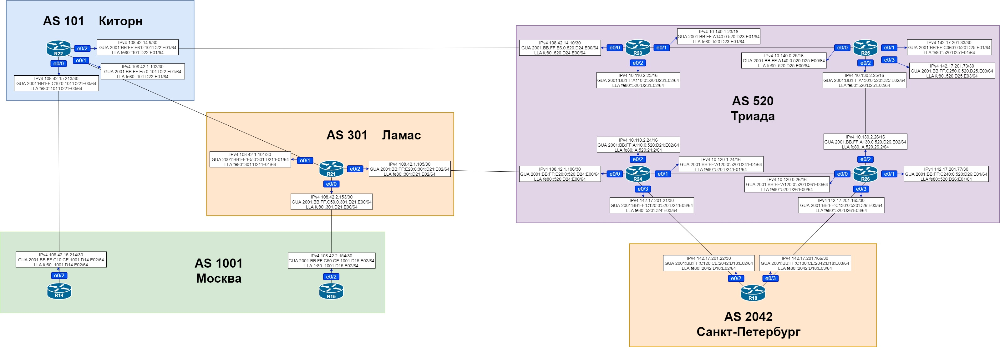

# Домашняя работа: базовая настройка BGP

### Цель: Настроить BGP между автономными системами.

### Организовать доступность между офисами Москва и С.-Петербург


- #### Настроить eBGP между офисом Москва и двумя провайдерами - Киторн и Ламас

- #### Настроить eBGP между провайдерами Киторн и Ламас

- #### Настроить eBGP между Ламас и Триада

- #### Настроить eBGP между офисом С.-Петербург и провайдером Триада

- #### Организовать IP доступность между пограничным роутерами офисами Москва и С.-Петербург


### Схема сети:




### Настройка:

**AS 101**

```
R22(config)#router bgp 101
R22(config-router)#bgp router-id 22.22.22.22
R22(config-router)#neighbor 108.42.15.214 remote-as 1001
R22(config-router)#neighbor 2001:BB:FF:C10:CE:1001:D14:E02 remote-as 1001
R22(config-router)#neighbor 108.42.1.101 remote-as 301
R22(config-router)#neighbor 2001:BB:FF:E5:0:301:D21:E01 remote-as 301
R22(config-router)#neighbor 108.42.14.10 remote-as 520
R22(config-router)#neighbor 2001:BB:FF:E6:0:520:D24:E00 remote-as 520
R22(config-router)#network 108.42.15.212 mask 255.255.255.252
R22(config-router)#network 108.42.1.100 mask 255.255.255.252
R22(config-router)#network 108.42.14.8 mask 255.255.255.252
```

**AS 301**

```
R21(config)#router bgp 301
R21(config-router)#bgp router-id 21.21.21.21
R21(config-router)#neighbor 108.42.2.154 remote-as 1001
R21(config-router)#neighbor 2001:BB:FF:C50:CE:1001:D15:E02 remote-as 1001
R21(config-router)#neighbor 108.42.1.102 remote-as 101
R21(config-router)#neighbor 2001:BB:FF:E5:0:101:D22:E01 remote-as 101
R21(config-router)#neighbor 108.42.1.106 remote-as 520
R21(config-router)#neighbor 2001:BB:FF:E20:0:520:D24:E00 remote-as 520
R21(config-router)#network 108.42.1.104 mask 255.255.255.252
R21(config-router)#network 108.42.2.152 mask 255.255.255.252
R21(config-router)#network 108.42.1.100 mask 255.255.255.252
```

**AS 520**

```
R23(config)#router bgp 520
R23(config-router)#bgp router-id 23.23.23.23
R23(config-router)#neighbor 108.42.14.9 remote-as 101
R23(config-router)#neighbor 2001:BB:FF:E6:0:101:D22:E01 remote-as 101
R23(config-router)#network 108.42.14.8 mask 255.255.255.252
```

```
R24(config)#router bgp 520
R24(config-router)#bgp router-id 24.24.24.24
R24(config-router)#neighbor 108.42.1.105 remote-as 301
R24(config-router)#neighbor 2001:BB:FF:E20:0:301:D21:E02 remote-as 301
R24(config-router)#network 108.42.1.104 mask 255.255.255.252
R24(config-router)#neighbor 142.17.201.22 remote-as 2042
R24(config-router)#neighbor 2001:BB:FF:C120:CE:2042:D18:E02 remote-as 2042
R24(config-router)#network 142.17.201.20 mask 255.255.255.252
```

```
R26(config)#router bgp 520
R26(config-router)#bgp router-id 26.26.26.26
R26(config-router)#neighbor 142.17.201.166 remote-as 2042
R26(config-router)#neighbor 2001:BB:FF:C130:CE:2042:D18:E03 remote-as 2042
R26(config-router)#network 142.17.201.164 mask 255.255.255.252
```

**AS 1001**

```
R14(config)#router bgp 1001
R14(config-router)#bgp router-id 14.14.14.14
R14(config-router)#neighbor 108.42.15.213 remote-as 101
R14(config-router)#neighbor 2001:BB:FF:C10:0:101:D22:E00 remote-as 101
R14(config-router)#network 108.42.15.212 mask 255.255.255.252
```

```
R15(config)#router bgp 1001
R15(config-router)#bgp router-id 15.15.15.15
R15(config-router)#neighbor 108.42.2.153 remote-as 301
R15(config-router)#neighbor 2001:BB:FF:C50:0:301:D21:E00 remote-as 301
R15(config-router)#network 108.42.2.152 mask 255.255.255.252
```

**AS 2042**

```
R18(config)#router bgp 2042
R18(config-router)#bgp router-id 18.18.18.18
R18(config-router)#neighbor 142.17.201.21 remote-as 520
R18(config-router)#neighbor 2001:BB:FF:C120:0:520:D24:E03 remote-as 520
R18(config-router)#network 142.17.201.20 mask 255.255.255.252
R18(config-router)#neighbor 142.17.201.165 remote-as 520
R18(config-router)#neighbor 2001:BB:FF:C130:0:520:D26:E03 remote-as 520
R18(config-router)#network 142.17.201.164 mask 255.255.255.252
```

Для проверки посмотрим базу данных BGP на R18 и R22

```
R18#show ip bgp
BGP table version is 8, local router ID is 18.18.18.18
Status codes: s suppressed, d damped, h history, * valid, > best, i - internal,
              r RIB-failure, S Stale, m multipath, b backup-path, f RT-Filter,
              x best-external, a additional-path, c RIB-compressed,
Origin codes: i - IGP, e - EGP, ? - incomplete
RPKI validation codes: V valid, I invalid, N Not found

     Network          Next Hop            Metric LocPrf Weight Path
 *>  108.42.1.100/30  142.17.201.21                          0 520 301 i
 *>  108.42.1.104/30  142.17.201.21            0             0 520 i
 *>  108.42.2.152/30  142.17.201.21                          0 520 301 i
 *>  108.42.14.8/30   142.17.201.21                          0 520 301 101 i
 *>  108.42.15.212/30 142.17.201.21                          0 520 301 101 i
 *   142.17.201.20/30 142.17.201.21            0             0 520 i
 *>                   0.0.0.0                  0         32768 i
 *   142.17.201.164/30
                       142.17.201.165           0             0 520 i
 *>                   0.0.0.0                  0         32768 i
```

```
R22#show ip bgp
BGP table version is 8, local router ID is 22.22.22.22
Status codes: s suppressed, d damped, h history, * valid, > best, i - internal,
              r RIB-failure, S Stale, m multipath, b backup-path, f RT-Filter,
              x best-external, a additional-path, c RIB-compressed,
Origin codes: i - IGP, e - EGP, ? - incomplete
RPKI validation codes: V valid, I invalid, N Not found

     Network          Next Hop            Metric LocPrf Weight Path
 *   108.42.1.100/30  108.42.1.101             0             0 301 i
 *>                   0.0.0.0                  0         32768 i
 *>  108.42.1.104/30  108.42.1.101             0             0 301 i
 *>  108.42.2.152/30  108.42.1.101             0             0 301 i
 *   108.42.14.8/30   108.42.14.10             0             0 520 i
 *>                   0.0.0.0                  0         32768 i
 *   108.42.15.212/30 108.42.15.214            0             0 1001 i
 *>                   0.0.0.0                  0         32768 i
 *>  142.17.201.20/30 108.42.1.101                           0 301 520 i
 *>  142.17.201.164/30
                       108.42.1.101                           0 301 520 2042 i
```

**Выполним последнюю часть работы сделав пинг с роутера R18 на роутеры R14 и R15:**

```
R18#ping 108.42.15.214
Type escape sequence to abort.
Sending 5, 100-byte ICMP Echos to 108.42.15.214, timeout is 2 seconds:
!!!!!
Success rate is 100 percent (5/5), round-trip min/avg/max = 1/1/1 ms
R18#ping 108.42.2.154
Type escape sequence to abort.
Sending 5, 100-byte ICMP Echos to 108.42.2.154, timeout is 2 seconds:
!!!!!
Success rate is 100 percent (5/5), round-trip min/avg/max = 1/1/2 ms
```

