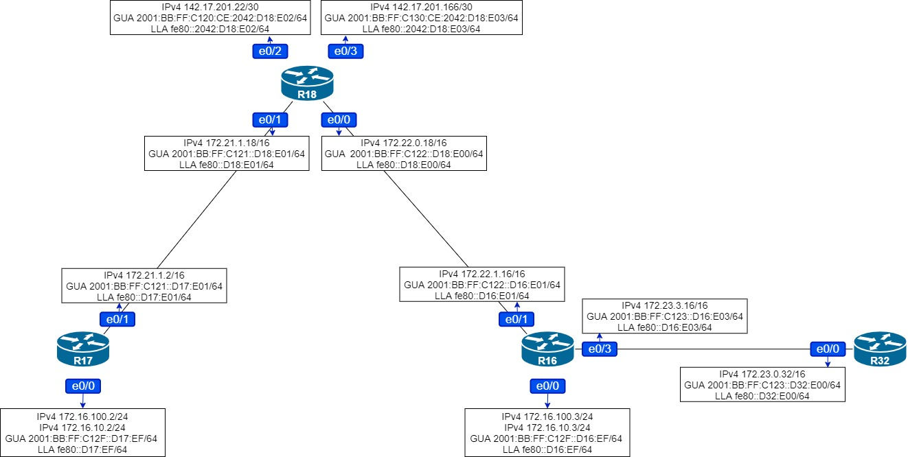

# Домашняя работа: настройка EIGRP 

### Цель: В офисе С.-Петербург настроить EIGRP

- #### R32 получает только маршрут по-умолчанию

- #### R16-17 анонсируют только суммарные префиксы

- #### Использовать EIGRP named-mode для настройки сети


### Схема сети:




#### Выполним начальную настройку протокола EIGRP для IPv4:

```
R17(config)#router eigrp PITER
R17(config-router)#address-family ipv4 autonomous-system 1
R17(config-router-af)#network 172.16.100.0 255.255.255.0
R17(config-router-af)#network 172.16.10.0 255.255.255.0
R17(config-router-af)#network 172.21.0.0 255.255.0.0
R17(config-router-af)#eigrp router-id 17.17.17.17
R17(config-router-af)#af-interface e0/0.1
R17(config-router-af-interface)#passive-interface
R17(config-router-af)#af-interface e0/0.2
R17(config-router-af-interface)#passive-interface
R17(config-router)#address-family ipv6 autonomous-system 1
R17(config-router-af)#eigrp router-id 17.17.17.17
R17(config-router-af)#af-interface e0/0.2
R17(config-router-af-interface)#passive-interface
```

```
R18(config)#router eigrp PITER
R18(config-router)#address-family ipv4 autonomous-system 1
R18(config-router-af)#network 172.22.0.0 255.255.0.0
R18(config-router-af)#network 172.21.0.0 255.255.0.0
R18(config-router-af)#network 142.17.201.20 255.255.255.252
R18(config-router-af)#network 142.17.201.164 255.255.255.252
R18(config-router-af)#eigrp router-id 18.18.18.18
R18(config-router-af)#af-interface e0/2
R18(config-router-af-interface)#passive-interface
R18(config-router-af)#af-interface e0/3
R18(config-router-af-interface)#passive-interface
R18(config-router)#address-family ipv6 autonomous-system 1
R18(config-router-af)#eigrp router-id 18.18.18.18
R18(config-router-af)#af-interface e0/2
R18(config-router-af-interface)#passive-interface
R18(config-router-af)#af-interface e0/3
R18(config-router-af-interface)#passive-interface
```

```
R16(config)#router eigrp PITER
R16(config-router)#address-family ipv4 autonomous-system 1
R16(config-router-af)#network 172.16.100.0 255.255.255.0
R16(config-router-af)#network 172.16.10.0 255.255.255.0
R16(config-router-af)#network 172.22.0.0 255.255.0.0
R16(config-router-af)#network 172.23.0.0 255.255.0.0
R16(config-router-af)#eigrp router-id 16.16.16.16
R16(config-router-af)#af-interface e0/0.1
R16(config-router-af-interface)#passive-interface
R16(config-router-af)#af-interface e0/0.2
R16(config-router-af-interface)#passive-interface
R16(config-router)#address-family ipv6 autonomous-system 1
R16(config-router-af)#eigrp router-id 16.16.16.16
R16(config-router-af)#af-interface e0/0.2
R16(config-router-af-interface)#passive-interface
```

```
R32(config)#router eigrp PITER
R32(config-router)#address-family ipv4 autonomous-system 1
R32(config-router-af)#network 172.23.0.0 255.255.0.0
R32(config-router-af)#eigrp router-id 32.32.32.32
R32(config-router)#address-family ipv6 autonomous-system 1
R32(config-router-af)#eigrp router-id 32.32.32.32
```

**Пропишем маршруты по умолчанию на R18 и включим редистрибьюцию статических маршрутов в EIGRP. Необходимо чтобы R32 получал только маршрут по-умолчанию, для этого изменить AD внутреннего EIGRP на 255 т.е. недостижимо, для внешнего оставим стандартную 170. Так как редистрибьюция других источников в EIGRP будет внешним маршрутом то полученный маршрут по-умолчанию останется в таблице маршрутизации.** 

```
R18(config)#ip route 0.0.0.0 0.0.0.0 142.17.201.21
R18(config)#ip route 0.0.0.0 0.0.0.0 142.17.201.165
R18(config)#ipv6 route ::0/0 2001:BB:FF:C130:0:520:D26:E03
R18(config)#ipv6 route ::0/0 2001:BB:FF:C120:0:520:D24:E03
R18(config)#router eigrp PITER
R18(config-router)#address-family ipv4 autonomous-system 1
R18(config-router-af)#topology base
R18(config-router-af-topology)#redistribute static
R18(config-router)#address-family ipv6 autonomous-system 1
R18(config-router-af)#topology base
R18(config-router-af-topology)#redistribute static
```

```
R32(config)#router eigrp PITER
R32(config-router)#address-family ipv4 autonomous-system 1
32(config-router-af)#topology base
R32(config-router-af-topology)#distance eigrp 255 170
R32(config-router)#address-family ipv6 autonomous-system 1
R32(config-router-af)#topology base
R32(config-router-af-topology)#distance eigrp 255 170
```

```
R32#sh ip route eigrp
Codes: L - local, C - connected, S - static, R - RIP, M - mobile, B - BGP
       D - EIGRP, EX - EIGRP external, O - OSPF, IA - OSPF inter area
       N1 - OSPF NSSA external type 1, N2 - OSPF NSSA external type 2
       E1 - OSPF external type 1, E2 - OSPF external type 2
       i - IS-IS, su - IS-IS summary, L1 - IS-IS level-1, L2 - IS-IS level-2
       ia - IS-IS inter area, * - candidate default, U - per-user static route
       o - ODR, P - periodic downloaded static route, H - NHRP, l - LISP
       a - application route
       + - replicated route, % - next hop override

Gateway of last resort is 172.23.3.16 to network 0.0.0.0

D*EX  0.0.0.0/0 [170/2048000] via 172.23.3.16, 00:02:30, Ethernet0/0
```

**Проверим что на роутере R18 нет суммарного маршрута до сетей 172.16.10.0/24 и 172.16.100.0/24, и включим суммаризацию на роутерах R16 и R17**

```
R18#sh ip route eigrp
Codes: L - local, C - connected, S - static, R - RIP, M - mobile, B - BGP
       D - EIGRP, EX - EIGRP external, O - OSPF, IA - OSPF inter area
       N1 - OSPF NSSA external type 1, N2 - OSPF NSSA external type 2
       E1 - OSPF external type 1, E2 - OSPF external type 2
       i - IS-IS, su - IS-IS summary, L1 - IS-IS level-1, L2 - IS-IS level-2
       ia - IS-IS inter area, * - candidate default, U - per-user static route
       o - ODR, P - periodic downloaded static route, H - NHRP, l - LISP
       a - application route
       + - replicated route, % - next hop override

Gateway of last resort is 142.17.201.165 to network 0.0.0.0

      172.16.0.0/24 is subnetted, 2 subnets
D        172.16.10.0 [90/1536000] via 172.22.1.16, 00:38:50, Ethernet0/0
                     [90/1536000] via 172.21.1.2, 00:38:50, Ethernet0/1
D        172.16.100.0 [90/1536000] via 172.22.1.16, 00:38:50, Ethernet0/0
                      [90/1536000] via 172.21.1.2, 00:38:50, Ethernet0/1
D     172.23.0.0/16 [90/1536000] via 172.22.1.16, 00:41:21, Ethernet0/0
```

```
R16(config)#router eigrp PITER
R16(config-router)#address-family ipv4 autonomous-system 1
R16(config-router-af)#topology base
R16(config-router-af-topology)#auto-summary
```

```
R17(config)#router eigrp PITER
R17(config-router)#address-family ipv4 autonomous-system 1
R17(config-router-af)#topology base
R17(config-router-af-topology)#auto-summary
```

**Проверим таблицу маршрутизации на R18:**

```
R18#sh ip route eigrp
Codes: L - local, C - connected, S - static, R - RIP, M - mobile, B - BGP
       D - EIGRP, EX - EIGRP external, O - OSPF, IA - OSPF inter area
       N1 - OSPF NSSA external type 1, N2 - OSPF NSSA external type 2
       E1 - OSPF external type 1, E2 - OSPF external type 2
       i - IS-IS, su - IS-IS summary, L1 - IS-IS level-1, L2 - IS-IS level-2
       ia - IS-IS inter area, * - candidate default, U - per-user static route
       o - ODR, P - periodic downloaded static route, H - NHRP, l - LISP
       a - application route
       + - replicated route, % - next hop override

Gateway of last resort is 142.17.201.165 to network 0.0.0.0

D     172.16.0.0/16 [90/1536000] via 172.22.1.16, 00:00:24, Ethernet0/0
                    [90/1536000] via 172.21.1.2, 00:00:24, Ethernet0/1
D     172.23.0.0/16 [90/1536000] via 172.22.1.16, 00:44:24, Ethernet0/0
```

**Маршрут суммировался.**

**Проверим таблицу топологии, чтобы удостоверится что настройки верны.** 

```
R18#sh ip eigrp topology all-links
EIGRP-IPv4 VR(PITER) Topology Table for AS(1)/ID(18.18.18.18)
Codes: P - Passive, A - Active, U - Update, Q - Query, R - Reply,
       r - reply Status, s - sia Status

P 172.23.0.0/16, 1 successors, FD is 196608000, serno 10
        via 172.22.1.16 (196608000/131072000), Ethernet0/0
P 142.17.201.20/30, 1 successors, FD is 131072000, serno 8
        via Connected, Ethernet0/2
P 172.22.0.0/16, 1 successors, FD is 131072000, serno 1
        via Connected, Ethernet0/0
P 172.16.0.0/16, 2 successors, FD is 196608000, serno 22
        via 172.21.1.2 (196608000/131072000), Ethernet0/1
        via 172.22.1.16 (196608000/131072000), Ethernet0/0
P 0.0.0.0/0, 1 successors, FD is 131072000, serno 15
        via Rstatic (131072000/0)
P 172.21.0.0/16, 1 successors, FD is 131072000, serno 5
        via Connected, Ethernet0/1
P 142.17.201.164/30, 1 successors, FD is 131072000, serno 9
        via Connected, Ethernet0/3
```

