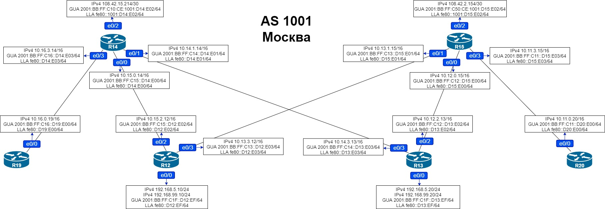
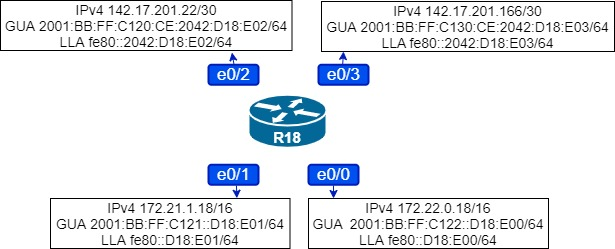

# Домашняя работа: BGP. Фильтрация

### Цель: Настроить фильтрацию для офиса Москва

### Настроить фильтрацию для офисе С.-Петербург


- #### Настроить фильтрацию в офисе Москва так, чтобы не появилось транзитного трафика(As-path)

- #### Настроить фильтрацию в офисе С.-Петербург так, чтобы не появилось транзитного трафика(Prefix-list)

- #### Настроить провайдера Киторн так, чтобы в офис Москва отдавался только маршрут по-умолчанию

- #### Настроить провайдера Ламас так, чтобы в офис Москва отдавался только маршрут по-умолчанию и префикс офиса С.-Петербург


### Настройка фильтрации в офисе Москва (AS-Path)



```
R15(config)#router bgp 1001
R15(config-router)#address-family ipv4
R15(config-router-af)#neighbor 108.42.2.153 filter-list 1 out
R15(config-router)#address-family ipv6
R15(config-router-af)#neighbor 2001:BB:FF:C50:0:301:D21:E00 filter-list 1 out
R15#clear ip bgp * all soft
```

```
R14(config)#router bgp 1001
R14(config-router)#address-family ipv4
R14(config-router-af)#neighbor 108.42.15.213 filter-list 1 out
R14(config-router)#address-family ipv6
R14(config-router-af)#neighbor 2001:BB:FF:C10:0:101:D22:E00 filter-list 1 out
R14#clear ip bgp * all soft
```

**Проверим BGP на R21:**

```
R21#sh ip bgp
BGP table version is 39, local router ID is 21.21.21.21
Status codes: s suppressed, d damped, h history, * valid, > best, i - internal,
              r RIB-failure, S Stale, m multipath, b backup-path, f RT-Filter,
              x best-external, a additional-path, c RIB-compressed,
Origin codes: i - IGP, e - EGP, ? - incomplete
RPKI validation codes: V valid, I invalid, N Not found

     Network          Next Hop            Metric LocPrf Weight Path
 *   108.42.1.100/30  108.42.1.102             0             0 101 i
 *>                   0.0.0.0                  0         32768 i
 *   108.42.1.104/30  108.42.1.106             0             0 520 i
 *>                   0.0.0.0                  0         32768 i
 *   108.42.2.152/30  108.42.2.154             0             0 1001 i
 *>                   0.0.0.0                  0         32768 i
 *   108.42.2.156/32  108.42.1.102                           0 101 1001 i
 *>                   108.42.2.154             0             0 1001 i
 *   108.42.14.8/30   108.42.1.106                           0 520 i
 *>                   108.42.1.102             0             0 101 i
 *   108.42.15.212/30 108.42.1.106                           0 520 101 i
 *>                   108.42.1.102             0             0 101 i
 *   108.42.15.216/32 108.42.1.102                           0 101 1001 i
 *>                   108.42.2.154                           0 1001 i
     Network          Next Hop            Metric LocPrf Weight Path
 *   142.17.201.20/30 108.42.1.102                           0 101 520 i
 *>                   108.42.1.106             0             0 520 i
 *   142.17.201.32/30 108.42.1.102                           0 101 520 i
 *>                   108.42.1.106                           0 520 i
 *   142.17.201.72/30 108.42.1.102                           0 101 520 i
 *>                   108.42.1.106                           0 520 i
 *>  142.17.201.76/30 108.42.1.106                           0 520 i
 *                    108.42.1.102                           0 101 520 i
 *>  142.17.201.80/32 108.42.1.106                           0 520 i
 *                    108.42.1.102                           0 101 520 i
 *   142.17.201.81/32 108.42.1.102                           0 101 520 i
 *>                   108.42.1.106                           0 520 i
 *   142.17.201.164/30
                       108.42.1.102                           0 101 520 i
 *>                   108.42.1.106                           0 520 i
 *   142.17.201.168/32
                       108.42.1.102                           0 101 520 2042 i
 *>                   108.42.1.106                           0 520 2042 i
 *   142.17.201.169/32
                       108.42.1.102                           0 101 520 2042 i
 *>                   108.42.1.106                           0 520 2042 i
 *   142.17.201.170/32
     Network          Next Hop            Metric LocPrf Weight Path
                       108.42.1.102                           0 101 520 2042 i
 *>                   108.42.1.106                           0 520 2042 i
 *   142.17.201.171/32
                       108.42.1.102                           0 101 520 2042 i
 *>                   108.42.1.106                           0 520 2042 i
 *   142.17.201.172/32
                       108.42.1.102                           0 101 520 2042 i
 *>                   108.42.1.106                           0 520 2042 i
```

```
R21#sh bgp ipv6 unicast
BGP table version is 37, local router ID is 21.21.21.21
Status codes: s suppressed, d damped, h history, * valid, > best, i - internal,
              r RIB-failure, S Stale, m multipath, b backup-path, f RT-Filter,
              x best-external, a additional-path, c RIB-compressed,
Origin codes: i - IGP, e - EGP, ? - incomplete
RPKI validation codes: V valid, I invalid, N Not found

     Network          Next Hop            Metric LocPrf Weight Path
 *   2001:BB:FF:E5::/64
                       2001:BB:FF:E5:0:101:D22:E01
                                                0             0 101 i
 *>                   ::                       0         32768 i
 *>  2001:BB:FF:E6::/64
                       2001:BB:FF:E5:0:101:D22:E01
                                                0             0 101 i
 *>  2001:BB:FF:C10::/64
                       2001:BB:FF:E5:0:101:D22:E01
                                                0             0 101 i
 *   2001:BB:FF:C11::/64
                       2001:BB:FF:E5:0:101:D22:E01
                                                              0 101 1001 i
 *>                   2001:BB:FF:C50:CE:1001:D15:E02
     Network          Next Hop            Metric LocPrf Weight Path
                                                0             0 1001 i
 *   2001:BB:FF:C12::/64
                       2001:BB:FF:E5:0:101:D22:E01
                                                              0 101 1001 i
 *>                   2001:BB:FF:C50:CE:1001:D15:E02
                                                0             0 1001 i
 *>  2001:BB:FF:C13::/64
                       2001:BB:FF:C50:CE:1001:D15:E02
                                                0             0 1001 i
 *                    2001:BB:FF:E5:0:101:D22:E01
                                                              0 101 1001 i
 *   2001:BB:FF:C14::/64
                       2001:BB:FF:E5:0:101:D22:E01
                                                              0 101 1001 i
 *>                   2001:BB:FF:C50:CE:1001:D15:E02
                                               35             0 1001 i
 *   2001:BB:FF:C15::/64
                       2001:BB:FF:E5:0:101:D22:E01
                                                              0 101 1001 i
 *>                   2001:BB:FF:C50:CE:1001:D15:E02
                                               35             0 1001 i
 *>  2001:BB:FF:C16::/64
     Network          Next Hop            Metric LocPrf Weight Path
                       2001:BB:FF:C50:CE:1001:D15:E02
                                               45             0 1001 i
 *                    2001:BB:FF:E5:0:101:D22:E01
                                                              0 101 1001 i
 *   2001:BB:FF:C1F::/64
                       2001:BB:FF:E5:0:101:D22:E01
                                                              0 101 1001 i
 *>                   2001:BB:FF:C50:CE:1001:D15:E02
                                               20             0 1001 i
 *   2001:BB:FF:C50::/64
                       2001:BB:FF:C50:CE:1001:D15:E02
                                                0             0 1001 i
 *>                   ::                       0         32768 i
 *   2001:BB:FF:E20::/64
                       2001:BB:FF:E20:0:520:D24:E00
                                                0             0 520 i
 *>                   ::                       0         32768 i
 *   2001:BB:FF:A110::/64
                       2001:BB:FF:E5:0:101:D22:E01
                                                              0 101 520 i
 *>                   2001:BB:FF:E20:0:520:D24:E00
                                                0             0 520 i
     Network          Next Hop            Metric LocPrf Weight Path
 *   2001:BB:FF:A120::/64
                       2001:BB:FF:E5:0:101:D22:E01
                                                              0 101 520 i
 *>                   2001:BB:FF:E20:0:520:D24:E00
                                                0             0 520 i
 *   2001:BB:FF:A130::/64
                       2001:BB:FF:E5:0:101:D22:E01
                                                              0 101 520 i
 *>                   2001:BB:FF:E20:0:520:D24:E00
                                               20             0 520 i
 *   2001:BB:FF:A140::/64
                       2001:BB:FF:E5:0:101:D22:E01
                                                              0 101 520 i
 *>                   2001:BB:FF:E20:0:520:D24:E00
                                               20             0 520 i
 *>  2001:BB:FF:C120::/64
                       2001:BB:FF:E20:0:520:D24:E00
                                                0             0 520 i
 *>  2001:BB:FF:C121::/64
                       2001:BB:FF:E20:0:520:D24:E00
                                                              0 520 2042 i
 *>  2001:BB:FF:C122::/64
     Network          Next Hop            Metric LocPrf Weight Path
                       2001:BB:FF:E20:0:520:D24:E00
                                                              0 520 2042 i
 *>  2001:BB:FF:C123::/64
                       2001:BB:FF:E20:0:520:D24:E00
                                                              0 520 2042 i
 *>  2001:BB:FF:C12F::/64
                       2001:BB:FF:E20:0:520:D24:E00
                                                              0 520 2042 i
 *>  2001:BB:FF:C130::/64
                       2001:BB:FF:E20:0:520:D24:E00
                                                              0 520 2042 i
```

**Маршрутов через AS1001 не проходит.**


### Настройка фильтрации в офисе Санкт-Петербург (Prefix-list)



```
R18(config)#ip prefix-list NO_TRANZIT_1 seq 5 permit 142.17.201.22/30
R18(config)#ip prefix-list NO_TRANZIT_2 seq 5 permit 142.17.201.166/30

R18(config)#ipv6 prefix-list IPV6_NO_TRANZIT_1 seq 5 permit 2001:BB:FF:C120::/64
R18(config)#ipv6 prefix-list IPV6_NO_TRANZIT_1 seq 10 permit 2001:BB:FF:C121::/64
R18(config)#ipv6 prefix-list IPV6_NO_TRANZIT_1 seq 15 permit 2001:BB:FF:C122::/64
R18(config)#ipv6 prefix-list IPV6_NO_TRANZIT_1 seq 20 permit 2001:BB:FF:C123::/64
R18(config)#ipv6 prefix-list IPV6_NO_TRANZIT_1 seq 25 permit 2001:BB:FF:C12F::/64

R18(config)#ipv6 prefix-list IPV6_NO_TRANZIT_2 seq 5 permit 2001:BB:FF:C130::/64
R18(config)#ipv6 prefix-list IPV6_NO_TRANZIT_2 seq 10 permit 2001:BB:FF:C121::/64
R18(config)#ipv6 prefix-list IPV6_NO_TRANZIT_2 seq 15 permit 2001:BB:FF:C122::/64
R18(config)#ipv6 prefix-list IPV6_NO_TRANZIT_2 seq 20 permit 2001:BB:FF:C123::/64
R18(config)#ipv6 prefix-list IPV6_NO_TRANZIT_2 seq 25 permit 2001:BB:FF:C12F::/64
```

```
R18(config)#router bgp 2042
R18(config-router)#address-family ipv4
R18(config-router-af)#neighbor 142.17.201.21 prefix-list NO_TRANZIT_1 out
R18(config-router-af)#neighbor 142.17.201.165 prefix-list NO_TRANZIT_2 out
R18(config-router)#address-family ipv6
R18(config-router-af)#neighbor 2001:BB:FF:C120:0:520:D24:E03 prefix-list IPV6_NO_TRANZIT_1 out
R18(config-router-af)#neighbor 2001:BB:FF:C130:0:520:D26:E03 prefix-list IPV6_NO_TRANZIT_2 out
```

**Проверим:**

```
R26#sh ip bgp
BGP table version is 35, local router ID is 26.26.26.26
Status codes: s suppressed, d damped, h history, * valid, > best, i - internal,
              r RIB-failure, S Stale, m multipath, b backup-path, f RT-Filter,
              x best-external, a additional-path, c RIB-compressed,
Origin codes: i - IGP, e - EGP, ? - incomplete
RPKI validation codes: V valid, I invalid, N Not found

     Network          Next Hop            Metric LocPrf Weight Path
 * i 108.42.1.100/30  108.42.1.105             0    100      0 301 i
 *>i                  108.42.14.9              0    100      0 101 i
 *>i 108.42.1.104/30  10.24.24.24              0    100      0 i
 *>i 108.42.2.152/30  108.42.1.105             0    100      0 301 i
 *>i 108.42.2.156/32  108.42.14.9              0    100      0 101 1001 i
 * i                  108.42.1.105             0    100      0 301 1001 i
 r>i 108.42.14.8/30   10.23.23.23              0    100      0 i
 *>i 108.42.15.212/30 108.42.14.9              0    100      0 101 i
 * i 108.42.15.216/32 108.42.1.105             0    100      0 301 1001 i
 *>i                  108.42.14.9              0    100      0 101 1001 i
 r>i 142.17.201.20/30 10.24.24.24              0    100      0 i
 r>i 142.17.201.32/30 10.25.25.25              0    100      0 i
 r>i 142.17.201.72/30 10.25.25.25              0    100      0 i
 *>  142.17.201.76/30 0.0.0.0                  0         32768 i
     Network          Next Hop            Metric LocPrf Weight Path
 * i 142.17.201.80/32 142.17.201.74            0    100      0 i
 *>                   142.17.201.78            0         32768 i
 * i 142.17.201.81/32 142.17.201.74            0    100      0 i
 *>                   142.17.201.78            0         32768 i
 *   142.17.201.164/30
                       142.17.201.166           0             0 2042 i
 *>                   0.0.0.0                  0         32768 i
```

```
R26#sh bgp ipv6 unicast
BGP table version is 23, local router ID is 26.26.26.26
Status codes: s suppressed, d damped, h history, * valid, > best, i - internal,
              r RIB-failure, S Stale, m multipath, b backup-path, f RT-Filter,
              x best-external, a additional-path, c RIB-compressed,
Origin codes: i - IGP, e - EGP, ? - incomplete
RPKI validation codes: V valid, I invalid, N Not found

     Network          Next Hop            Metric LocPrf Weight Path
 *>  2001:BB:FF:A110::/64
                       FE80::520:D24:E01
                                               20         32768 i
 *>  2001:BB:FF:A120::/64
                       ::                       0         32768 i
 *>  2001:BB:FF:A130::/64
                       ::                       0         32768 i
 *>  2001:BB:FF:A140::/64
                       FE80::520:D25:E02
                                               20         32768 i
 *>  2001:BB:FF:C121::/64
                       2001:BB:FF:C130:CE:2042:D18:E03
                                                0             0 2042 i
 *>  2001:BB:FF:C122::/64
     Network          Next Hop            Metric LocPrf Weight Path
                       2001:BB:FF:C130:CE:2042:D18:E03
                                                0             0 2042 i
 *>  2001:BB:FF:C123::/64
                       2001:BB:FF:C130:CE:2042:D18:E03
                                          1536000             0 2042 i
 *>  2001:BB:FF:C12F::/64
                       2001:BB:FF:C130:CE:2042:D18:E03
                                          1536000             0 2042 i
 *   2001:BB:FF:C130::/64
                       2001:BB:FF:C130:CE:2042:D18:E03
                                                0             0 2042 i
 *>                   ::                       0         32768 i
 *>  2001:BB:FF:C240::/64
                       ::                       0         32768 i
 *>  2001:BB:FF:C241::/64
                       2001:BB:FF:C240:CE:0:D28:E00
                                                0         32768 i
 *>  2001:BB:FF:C242::/64
                       2001:BB:FF:C240:CE:0:D28:E00
                                                0         32768 i
```


### Настроим провайдера Киторн так, чтобы в офис Москва отдавался только маршрут по-умолчанию

```
R22(config)#ip as-path access-list 25 deny .*
R22(config)#router bgp 101
R22(config-router)#address-family ipv4
R22(config-router-af)#neighbor 108.42.15.214 default-originate
R22(config-router-af)#neighbor 108.42.15.214 filter-list 25 out
R22(config-router)#address-family ipv6
R22(config-router-af)#neighbor 2001:BB:FF:C10:CE:1001:D14:E02 default-originate
R22(config-router-af)#neighbor 2001:BB:FF:C10:CE:1001:D14:E02 filter-list 25 out
```

**Проверим на R14:**

```
R14#sh ip bgp
BGP table version is 78, local router ID is 14.14.14.14
Status codes: s suppressed, d damped, h history, * valid, > best, i - internal,
              r RIB-failure, S Stale, m multipath, b backup-path, f RT-Filter,
              x best-external, a additional-path, c RIB-compressed,
Origin codes: i - IGP, e - EGP, ? - incomplete
RPKI validation codes: V valid, I invalid, N Not found

     Network          Next Hop            Metric LocPrf Weight Path
 r>i 0.0.0.0          10.222.222.222           0    200      0 301 i
 r                    108.42.15.213                          0 101 i
 *>i 108.42.2.152/30  10.222.222.222           0    200      0 i
 *>i 108.42.2.156/32  10.222.222.222           0    200      0 i
```

```
R14#sh bgp ipv6 unicast
BGP table version is 43, local router ID is 14.14.14.14
Status codes: s suppressed, d damped, h history, * valid, > best, i - internal,
              r RIB-failure, S Stale, m multipath, b backup-path, f RT-Filter,
              x best-external, a additional-path, c RIB-compressed,
Origin codes: i - IGP, e - EGP, ? - incomplete
RPKI validation codes: V valid, I invalid, N Not found

     Network          Next Hop            Metric LocPrf Weight Path
 r>i ::/0             2001:BB:FF:C20:222:222:222:222
                                                0    200      0 301 i
 r                    2001:BB:FF:C10:0:101:D22:E00
                                                              0 101 i
 *>  2001:BB:FF:C10::/64
                       ::                       0         32768 i
 *>i 2001:BB:FF:C11::/64
                       2001:BB:FF:C20:222:222:222:222
                                                0    200      0 i
 * i 2001:BB:FF:C12::/64
                       2001:BB:FF:C20:222:222:222:222
                                                0    200      0 i
 *>                   FE80::D13:E03           20         32768 i
 * i 2001:BB:FF:C13::/64
                       2001:BB:FF:C20:222:222:222:222
     Network          Next Hop            Metric LocPrf Weight Path
                                                0    200      0 i
 *>                   FE80::D12:E02           20         32768 i
 * i 2001:BB:FF:C14::/64
                       2001:BB:FF:C20:222:222:222:222
                                               35    200      0 i
 *>                   ::                       0         32768 i
 * i 2001:BB:FF:C15::/64
                       2001:BB:FF:C20:222:222:222:222
                                               35    200      0 i
 *>                   ::                       0         32768 i
 * i 2001:BB:FF:C16::/64
                       2001:BB:FF:C20:222:222:222:222
                                               45    200      0 i
 *>                   ::                       0         32768 i
 * i 2001:BB:FF:C1F::/64
                       2001:BB:FF:C20:222:222:222:222
                                               20    200      0 i
 *>                   FE80::D13:E03           20         32768 i
 *>i 2001:BB:FF:C50::/64
                       2001:BB:FF:C20:222:222:222:222
                                                0    200      0 i
 *>i 2001:BB:FF:C121::/64
     Network          Next Hop            Metric LocPrf Weight Path
                       2001:BB:FF:C20:222:222:222:222
                                                0    200      0 301 520 2042 i
 *>i 2001:BB:FF:C122::/64
                       2001:BB:FF:C20:222:222:222:222
                                                0    200      0 301 520 2042 i
 *>i 2001:BB:FF:C123::/64
                       2001:BB:FF:C20:222:222:222:222
                                                0    200      0 301 520 2042 i
 *>i 2001:BB:FF:C12F::/64
                       2001:BB:FF:C20:222:222:222:222
                                                0    200      0 301 520 2042 i
```


### Настроим провайдера Ламас так, чтобы в офис Москва отдавался только маршрут по-умолчанию и префикс офиса С.-Петербург

```
R21(config)#ip as-path access-list 25 permit _2042$
R21(config)#ip as-path access-list 25 deny .*
R21(config)#router bgp 301
R21(config-router)#address-family ipv4
R21(config-router-af)#neighbor 108.42.2.154 default-originate
R21(config-router-af)#neighbor 108.42.2.154 filter-list 25 out
R21(config-router)#address-family ipv6
R21(config-router-af)#neighbor 2001:BB:FF:C50:CE:1001:D15:E02 default-originate
R21(config-router-af)#neighbor 2001:BB:FF:C50:CE:1001:D15:E02 filter-list 25 out
```

**Проверим на R15:**

```
R15#sh ip bgp
BGP table version is 56, local router ID is 15.15.15.15
Status codes: s suppressed, d damped, h history, * valid, > best, i - internal,
              r RIB-failure, S Stale, m multipath, b backup-path, f RT-Filter,
              x best-external, a additional-path, c RIB-compressed,
Origin codes: i - IGP, e - EGP, ? - incomplete
RPKI validation codes: V valid, I invalid, N Not found

     Network          Next Hop            Metric LocPrf Weight Path
 r>  0.0.0.0          108.42.2.153                           0 301 i
 *>  108.42.2.152/30  0.0.0.0                  0         32768 i
 *>  108.42.2.156/32  0.0.0.0                  0         32768 i
 *>i 108.42.15.212/30 10.111.111.111           0    100      0 i
 *>i 108.42.15.216/32 10.111.111.111           0    100      0 i
```

```
R15#show bgp ipv6 unicast
BGP table version is 41, local router ID is 15.15.15.15
Status codes: s suppressed, d damped, h history, * valid, > best, i - internal,
              r RIB-failure, S Stale, m multipath, b backup-path, f RT-Filter,
              x best-external, a additional-path, c RIB-compressed,
Origin codes: i - IGP, e - EGP, ? - incomplete
RPKI validation codes: V valid, I invalid, N Not found

     Network          Next Hop            Metric LocPrf Weight Path
 r>  ::/0             2001:BB:FF:C50:0:301:D21:E00
                                                              0 301 i
 *>i 2001:BB:FF:C10::/64
                       2001:BB:FF:C20:111:111:111:111
                                                0    100      0 i
 *>  2001:BB:FF:C11::/64
                       ::                       0         32768 i
 *>  2001:BB:FF:C12::/64
                       ::                       0         32768 i
 * i                  2001:BB:FF:C20:111:111:111:111
                                               20    100      0 i
 *>  2001:BB:FF:C13::/64
                       ::                       0         32768 i
 * i                  2001:BB:FF:C20:111:111:111:111
     Network          Next Hop            Metric LocPrf Weight Path
                                               20    100      0 i
 *>  2001:BB:FF:C14::/64
                       FE80::D13:E02           35         32768 i
 * i                  2001:BB:FF:C20:111:111:111:111
                                                0    100      0 i
 *>  2001:BB:FF:C15::/64
                       FE80::D12:E03           35         32768 i
 * i                  2001:BB:FF:C20:111:111:111:111
                                                0    100      0 i
 *>  2001:BB:FF:C16::/64
                       FE80::D12:E03           45         32768 i
 * i                  2001:BB:FF:C20:111:111:111:111
                                                0    100      0 i
 *>  2001:BB:FF:C1F::/64
                       FE80::D13:E02           20         32768 i
 * i                  2001:BB:FF:C20:111:111:111:111
                                               20    100      0 i
 *>  2001:BB:FF:C50::/64
                       ::                       0         32768 i
 *>  2001:BB:FF:C121::/64
                       2001:BB:FF:C50:0:301:D21:E00
                                                              0 301 520 2042 i
     Network          Next Hop            Metric LocPrf Weight Path
 *>  2001:BB:FF:C122::/64
                       2001:BB:FF:C50:0:301:D21:E00
                                                              0 301 520 2042 i
 *>  2001:BB:FF:C123::/64
                       2001:BB:FF:C50:0:301:D21:E00
                                                              0 301 520 2042 i
 *>  2001:BB:FF:C12F::/64
                       2001:BB:FF:C50:0:301:D21:E00
                                                              0 301 520 2042 i
```

**Всё работает.**