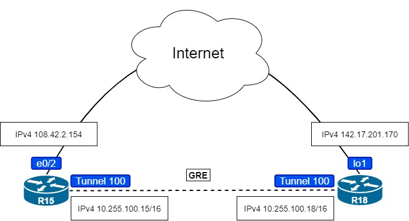
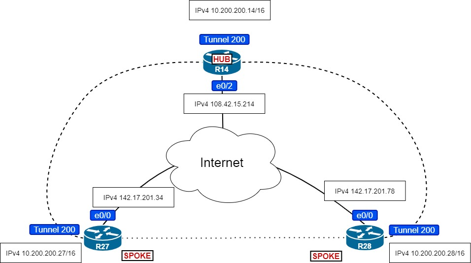

# Домашняя работа: VPN. GRE. DmVPN

### Цель: Настроить GRE между офисами Москва и С.-Петербург
### Настроить DMVPN между офисами Москва и Чокурдах, Лабытнанги


### Настроим GRE между офисами Москва и С.-Петербург

**Настоим на R18 GRE c loopback-интерфейса чтобы не привязываться к физическому интерфейсу.**



```
R15(config)#interface tunnel 100
R15(config-if)#tunnel mode gre ip
R15(config-if)#ip address 10.255.100.15 255.255.0.0
R15(config-if)#tunnel source 108.42.2.154
R15(config-if)#tunnel destination 142.17.201.170
R15(config-if)#ip mtu 1400
R15(config-if)#ip tcp adjust-mss 1360
R15(config-if)#keepalive 3 3
```

```
R18(config)#interface tunnel 100
R18(config-if)#tunnel mode gre ip
R18(config-if)#ip address 10.255.100.18 255.255.0.0
R18(config-if)#tunnel source 142.17.201.170
R18(config-if)#tunnel destination 108.42.2.154
R18(config-if)#ip mtu 1400
R18(config-if)#ip tcp adjust-mss 1360
R18(config-if)#keepalive 3 3
```

**Проверим соединение:**

```
R18#ping 10.255.100.15
Type escape sequence to abort.
Sending 5, 100-byte ICMP Echos to 10.255.100.15, timeout is 2 seconds:
!!!!!
Success rate is 100 percent (5/5), round-trip min/avg/max = 1/1/2 ms
```


### Настроим DMVPN между офисами Москва и Чокурдах, Лабытнанги



**R14 HUB**

```
R14(config)#interface tunnel 200
R14(config-if)#tunnel mode gre multipoint
R14(config-if)#ip address 10.200.200.14 255.255.0.0
R14(config-if)#tunnel source 108.42.15.214
R14(config-if)#ip mtu 1400
R14(config-if)#ip tcp adjust-mss 1360
R14(config-if)#ip nhrp network-id 200
R14(config-if)#ip nhrp map multicast dynamic
R14(config-if)#keepalive 3 3
```

**R28 SPOKE**

```
R28(config)#interface tunnel 200
R28(config-if)#tunnel mode gre multipoint
R28(config-if)#ip address 10.200.200.28 255.255.0.0
R28(config-if)#tunnel source 142.17.201.78
R28(config-if)#ip mtu 1400
R28(config-if)#ip tcp adjust-mss 1360
R28(config-if)#ip nhrp network-id 200
R28(config-if)#ip nhrp map multicast 108.42.15.214
R28(config-if)#keepalive 3 3
R28(config-if)#ip nhrp nhs 10.200.200.14
R28(config-if)#ip nhrp map 10.200.200.14 108.42.15.214
```

**R27 SPOKE**

```
R27(config)#interface tunnel 200
R27(config-if)#tunnel mode gre multipoint
R27(config-if)#ip address 10.200.200.27 255.255.0.0
R27(config-if)#tunnel source 142.17.201.34
R27(config-if)#ip mtu 1400
R27(config-if)#ip tcp adjust-mss 1360
R27(config-if)#ip nhrp network-id 200
R27(config-if)#ip nhrp map multicast 108.42.15.214
R27(config-if)#keepalive 3 3
R27(config-if)#ip nhrp nhs 10.200.200.14
R27(config-if)#ip nhrp map 10.200.200.14 108.42.15.214
```

**Проверим соединения HUB-SPOKE:**

```
R14#ping 10.200.200.28
Type escape sequence to abort.
Sending 5, 100-byte ICMP Echos to 10.200.200.28, timeout is 2 seconds:
!!!!!
Success rate is 100 percent (5/5), round-trip min/avg/max = 1/1/2 ms
R14#ping 10.200.200.27
Type escape sequence to abort.
Sending 5, 100-byte ICMP Echos to 10.200.200.27, timeout is 2 seconds:
!!!!!
Success rate is 100 percent (5/5), round-trip min/avg/max = 1/1/1 ms
```

**Проверим соединения SPOKE-SPOKE:**

```
R27#ping 10.200.200.28
Type escape sequence to abort.
Sending 5, 100-byte ICMP Echos to 10.200.200.28, timeout is 2 seconds:
!!!!!
Success rate is 100 percent (5/5), round-trip min/avg/max = 1/2/4 ms
```

