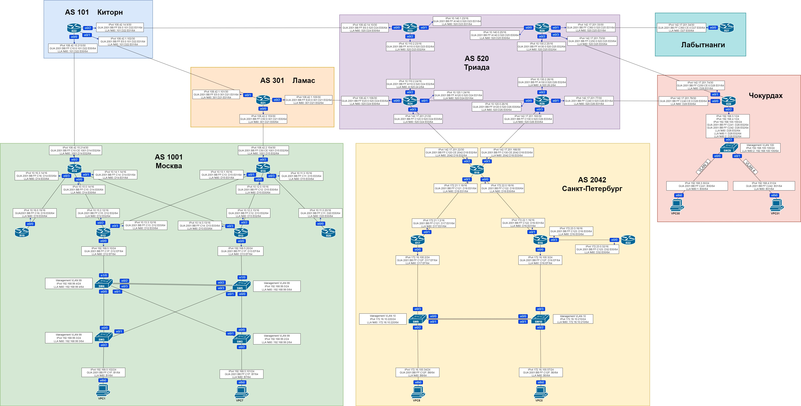

## Топология

## Задание

Цель: В данной самостоятельной работе необходимо распланировать  адресное пространство Настроить IP на всех активных портах для  дальнейшей работы над проектом адресное пространство должно быть  задокументировано

В этой  самостоятельной работе мы ожидаем, что вы самостоятельно:

1. Разработаете и задокументируете адресное пространство для лабораторного стенда.
2. Настроите ip адреса на каждом активном порту
3. Настроите каждый VPC в любом офисе в своем VLAN.
4. Настроите VLAN управления для сетевых устройств
5. Настроите сети офисов так, чтобы не возникало broadcast штормов, а использование линков было максимально оптимизировано
6. Используете ipv4 и ipv6

## Документирование адресного пространства IPv4

### Москва AS 1001

| Устройство | Интерфейс | IP-адрес         | Куда смотрит | IP-адрес соседа  | Примечание   |
| ---------- | --------- | ---------------- | ------------ | ---------------- | ------------ |
| R14        | e0/0      | 10.15.0.14/16    | R12          | 10.15.2.12/16    |              |
| R14        | e0/1      | 10.14.1.14/16    | R13          | 10.14.3.13/16    |              |
| R14        | e0/2      | 108.42.15.214/30 | R22Киторн    | 108.42.15.213/30 | Интернет     |
| R14        | e0/3      | 10.16.3.14/16    | R19          | 10.16.0.19/16    |              |
|            |           |                  |              |                  |              |
| R15        | e0/0      | 10.12.0.15/16    | R13          | 10.12.2.13/16    |              |
| R15        | e0/1      | 10.13.1.15/16    | R12          | 10.13.3.12/16    |              |
| R15        | e0/2      | 108.42.2.154/30  | R21Ламас     | 108.42.2.153/30  | Интернет     |
| R15        | e0/3      | 10.11.3.15/16    | R20          | 10.11.0.20/16    |              |
|            |           |                  |              |                  |              |
| R19        | e0/0      | 10.16.0.19/16    | R14          | 10.16.3.14/16    |              |
|            |           |                  |              |                  |              |
| R12        | e0/0      | 192.168.5.10/24  | SW4          | -                |              |
| R12        | e0/2      | 10.15.2.12/16    | R14          | 10.15.0.14/16    |              |
| R12        | e0/3      | 10.13.3.12/16    | R15          | 10.13.1.15/16    |              |
|            |           |                  |              |                  |              |
| R13        | e0/0      | 192.168.5.20/24  | SW5          | -                |              |
| R13        | e0/2      | 10.12.2.13/16    | R15          | 10.12.0.15/16    |              |
| R13        | e0/3      | 10.14.3.13/16    | R14          | 10.14.1.14/16    |              |
|            |           |                  |              |                  |              |
| R20        | e0/0      | 10.0.0.20/16     | R15          | 10.0.3.15/16     |              |
|            |           |                  |              |                  |              |
| SW4        | e0/0      | -                | SW3          | -                |              |
| SW4        | e0/1      | -                | SW2          | -                |              |
| SW4        | e0/2      | -                | SW5          | -                | Port-Channel |
| SW4        | e0/3      | -                | SW5          | -                | Port-Channel |
| SW4        | e1/0      | -                | R12          | 192.168.5.10/24  |              |
|            |           |                  |              |                  |              |
| SW5        | e0/0      | -                | SW2          |                  |              |
| SW5        | e0/1      | -                | SW3          |                  |              |
| SW5        | e0/2      | -                | SW4          | -                | Port-Channel |
| SW5        | e0/3      | -                | SW4          | -                | Port-Channel |
| SW5        | e1/0      | -                | R13          | 192.168.5.20/24  |              |
|            |           |                  |              |                  |              |
| SW3        | e0/0      | -                | SW4          | -                |              |
| SW3        | e0/1      | -                | SW3          | -                |              |
| SW3        | e0/2      | -                | VPC1         | 192.168.5.102/24 |              |
|            |           |                  |              |                  |              |
| SW2        | e0/0      | -                | SW5          | -                |              |
| SW2        | e0/1      | -                | SW4          | -                |              |
| SW2        | e0/2      | -                | VPC7         | 192.168.5.101/24 |              |
|            |           |                  |              |                  |              |
| VPC1       | eth0      | 192.168.5.102/24 | SW3          | -                |              |
|            |           |                  |              |                  |              |
| VPC7       | eth0      | 192.168.5.101/24 | SW2          | -                |              |

### Санкт-Петербург AS 2042

| Устройство | Интерфейс | IP-адрес          | Куда смотрит | IP-адрес соседа   | Примечание   |
| ---------- | --------- | ----------------- | ------------ | ----------------- | ------------ |
| R18        | e0/0      | 172.22.0.18/16    | R16          | 172.22.1.16/16    |              |
| R18        | e0/1      | 172.21.1.18/16    | R17          | 172.21.1.2/16     |              |
| R18        | e0/2      | 142.17.201.22/30  | R24Триада    | 142.17.201.21/30  | Интернет     |
| R18        | e0/3      | 142.17.201.166/30 | R26Триада    | 142.17.201.165/30 | Интернет     |
|            |           |                   |              |                   |              |
| R17        | e0/0      | 172.16.100.2/24   | SW9          | -                 |              |
| R17        | e0/1      | 172.21.1.2/16     | R18          | 172.21.1.18/16    |              |
|            |           |                   |              |                   |              |
| R16        | e0/0      | 172.16.100.3/24   | SW10         | -                 |              |
| R16        | e0/1      | 172.22.1.16/16    | R18          | 172.22.0.18/16    |              |
| R16        | e0/3      | 172.23.3.16/16    | R32          | 172.23.0.32/16    |              |
|            |           |                   |              |                   |              |
| R32        | e0/0      | 172.23.0.32/16    | R16          | 172.23.3.16/16    |              |
|            |           |                   |              |                   |              |
| SW9        | e0/0      | -                 | SW10         | -                 | Port-Channel |
| SW9        | e0/1      | -                 | SW10         | -                 | Port-Channel |
| SW9        | e0/2      | -                 | VPC8         | 172.16.100.34/24  |              |
| SW9        | e0/3      | -                 | R17          | 172.16.100.2/24   |              |
|            |           |                   |              |                   |              |
| SW10       | e0/0      | -                 | SW9          | -                 | Port-Channel |
| SW10       | e0/1      | -                 | SW9          | -                 | Port-Channel |
| SW10       | e0/2      | -                 | VPC0         | 172.16.100.57/24  |              |
| SW10       | e0/3      | -                 | R16          | 172.16.100.3/24   |              |
|            |           |                   |              |                   |              |
| VPC8       | eth0      | 172.16.100.34/24  | SW9          | -                 |              |
|            |           |                   |              |                   |              |
| VPC0       | eth0      | 172.16.100.57/24  | SW10         | -                 |              |

### Чокурдах

| Устройство | Интерфейс | IP-адрес         | Куда смотрит | IP-адрес соседа  | Примечание |
| ---------- | --------- | ---------------- | ------------ | ---------------- | ---------- |
| R28        | e0/0      | 142.17.201.78/30 | R26Триада    | 142.17.201.77/30 | Интернет   |
| R28        | e0/1      | 142.17.201.74/30 | R25Триада    | 142.17.201.73/30 | Интернет   |
| R28        | e0/2      | 192.168.3.1/24   | SW29         | -                |            |
| R28        | e0/2      | 192.168.4.1/24   | SW29         | -                |            |
|            |           |                  |              |                  |            |
| SW29       | e0/0      | -                | VPC30        | 192.168.3.30/24  |            |
| SW29       | e0/1      | -                | VPC31        | 192.168.4.31/24  |            |
| SW29       | e0/2      | -                | R28          | 192.168.3.1/24   |            |
| SW29       | e0/2      | -                | R28          | 192.168.4.1/24   |            |
|            |           |                  |              |                  |            |
| VPC30      | eth0      | 192.168.3.30/24  | SW29         | -                |            |
|            |           |                  |              |                  |            |
| VPC31      | eth0      | 192.168.4.31/24  | SW29         | -                |            |

### Лабытнанги

| Устройство | Интерфейс | IP-адрес         | Куда смотрит | IP-адрес соседа  | Примечание |
| ---------- | --------- | ---------------- | ------------ | ---------------- | ---------- |
| R27        | e0/0      | 142.17.201.34/30 | R25Триада    | 142.17.201.33.30 | Интернет   |

### Триада AS 520

| Устройство | Интерфейс | IP-адрес          | Куда смотрит | IP-адрес соседа   | Примечание |
| ---------- | --------- | ----------------- | ------------ | ----------------- | ---------- |
| R23        | e0/0      | 108.42.14.10/30   | R22Киторн    | 108.42.14.9/30    |            |
| R23        | e0/1      | 10.140.1.23/16    | R25          | 10.140.0.25/16    |            |
| R23        | e0/2      | 10.110.2.23/16    | R24          | 10.110.2.24/16    |            |
|            |           |                   |              |                   |            |
| R24        | e0/0      | 108.42.1.106/30   | R21Ламас     | 108.42.1.105/30   |            |
| R24        | e0/1      | 10.120.1.24/16    | R26          | 10.120.0.26/16    |            |
| R24        | e0/2      | 10.110.2.24/16    | R23          | 10.110.2.23/16    |            |
| R24        | e0/3      | 142.17.201.21/30  | R18Питер     | 142.17.201.22/30  | Клиент     |
|            |           |                   |              |                   |            |
| R25        | e0/0      | 10.140.0.25/16    | R23          | 10.140.1.23/16    |            |
| R25        | e0/1      | 142.17.201.33/30  | R27Лабыт     | 142.17.201.34/30  | Клиент     |
| R25        | e0/2      | 10.130.2.25/16    | R26          | 10.130.2.26/16    |            |
| R25        | e0/3      | 142.17.201.73/30  | R28Чокур     | 142.17.201.74/30  | Клиент     |
|            |           |                   |              |                   |            |
| R26        | e0/0      | 10.120.0.26/16    | R24          | 10.120.1.24/16    |            |
| R26        | e0/1      | 142.17.201.77/30  | R28Чокур     | 142.17.201.78/30  | Клиент     |
| R26        | e0/2      | 10.130.2.26/16    | R25          | 10.130.2.25/16    |            |
| R26        | e0/3      | 142.17.201.165/30 | R18Питер     | 142.17.201.166/30 | Клиент     |

### Киторн AS 101

| Устройство | Интерфейс | IP-адрес         | Куда смотрит | IP-адрес соседа  | Примечание |
| ---------- | --------- | ---------------- | ------------ | ---------------- | ---------- |
| R22        | e0/0      | 108.42.15.213/30 | R14МСК       | 108.42.15.214/30 | Клиент     |
| R22        | e0/1      | 108.42.1.102/30  | R21Ламас     | 108.42.1.101/30  |            |
| R22        | e0/2      | 108.42.14.9/30   | R23Триада    | 108.42.14.10/30  |            |

### Ламас AS 301

| Устройство | Интерфейс | IP-адрес        | Куда смотрит | IP-адрес соседа | Примечание |
| ---------- | --------- | --------------- | ------------ | --------------- | ---------- |
| R21        | e0/0      | 108.42.2.153/30 | R15МСК       | 108.42.2.154/30 | Клиент     |
| R21        | e0/1      | 108.42.1.101/30 | R21Киторн    | 108.42.1.102/30 |            |
| R21        | e0/2      | 108.42.1.105/30 | R24Триада    | 108.42.1.106/30 |            |

## Документирование адресного пространства IPv6 (Global Unicast Adress)

### Москва AS 1001

| Устройство | Интерфейс | IP-адрес                          | Куда смотрит | IP-адрес соседа                 | Примечание   |
| ---------- | --------- | --------------------------------- | ------------ | ------------------------------- | ------------ |
| R14        | e0/0      | 2001:BB:FF:C15::D14:E00/64        | R12          | 2001:BB:FF:C15::D12:E02/64      |              |
| R14        | e0/1      | 2001:BB:FF:C14::D14:E01/64        | R13          | 2001:BB:FF:C14::D13:E03/64      |              |
| R14        | e0/2      | 2001:BB:FF:C10:CE:1001:D14:E02/64 | R22Киторн    | 2001:BB:FF:C10:0:101:D22:E00/64 | Интернет     |
| R14        | e0/3      | 2001:BB:FF:C16::D14:E03/64        | R19          | 2001:BB:FF:C16::D19:E00/64      |              |
|            |           |                                   |              |                                 |              |
| R15        | e0/0      | 2001:BB:FF:C12::D15:E00/64        | R13          | 2001:BB:FF:C12::D13:E02/64      |              |
| R15        | e0/1      | 2001:BB:FF:C13::D15:E01/64        | R12          | 2001:BB:FF:C13::D12:E03/64      |              |
| R15        | e0/2      | 2001:BB:FF:C50:CE:1001:D15:E02/64 | R21Ламас     | 2001:BB:FF:C50:0:301:D21:E00/64 | Интернет     |
| R15        | e0/3      | 12001:BB:FF:C11::D15:E03/64       | R20          | 2001:BB:FF:C11::D20:E00/64      |              |
|            |           |                                   |              |                                 |              |
| R19        | e0/0      | 2001:BB:FF:C16::D19:E00/64        | R14          | 2001:BB:FF:C16::D14:E03/64      |              |
|            |           |                                   |              |                                 |              |
| R12        | e0/0      | 2001:BB:FF:C1F::D12:EF/64         | SW4          | -                               |              |
| R12        | e0/1      | 2001:BB:FF:C1F::D12:EF/64         | SW5          | -                               |              |
| R12        | e0/2      | 2001:BB:FF:C15::D12:E02/64        | R14          | 2001:BB:FF:C15::D14:E00/64      |              |
| R12        | e0/3      | 2001:BB:FF:C13::D12:E03/64        | R15          | 2001:BB:FF:C13::D15:E00/64      |              |
|            |           |                                   |              |                                 |              |
| R13        | e0/0      | 2001:BB:FF:C1F::D13:EF/64         | SW5          | -                               |              |
| R13        | e0/1      | 2001:BB:FF:C1F::D13:EF/64         | SW4          | -                               |              |
| R13        | e0/2      | 2001:BB:FF:C12::D13:E02/64        | R15          | 2001:BB:FF:C12::D15:E00/64      |              |
| R13        | e0/3      | 2001:BB:FF:C14::D13:E03/64        | R14          | 2001:BB:FF:C14::D14:E01/64      |              |
|            |           |                                   |              |                                 |              |
| R20        | e0/0      | 2001:BB:FF:C11::D20:E00/64        | R15          | 2001:BB:FF:C11::D15:E03/64      |              |
|            |           |                                   |              |                                 |              |
| SW4        | e0/0      | -                                 | SW3          | -                               |              |
| SW4        | e0/1      | -                                 | SW2          | -                               |              |
| SW4        | e0/2      | -                                 | SW5          | -                               | Port-Channel |
| SW4        | e0/3      | -                                 | SW5          | -                               | Port-Channel |
| SW4        | e1/0      | -                                 | R12          | 2001:BB:FF:C1F::D12:EF/64       |              |
| SW4        | e1/1      | -                                 | R13          | 2001:BB:FF:C1F::D13:EF/64       |              |
|            |           |                                   |              |                                 |              |
| SW5        | e0/0      | -                                 | SW2          |                                 |              |
| SW5        | e0/1      | -                                 | SW3          |                                 |              |
| SW5        | e0/2      | -                                 | SW4          | -                               | Port-Channel |
| SW5        | e0/3      | -                                 | SW4          | -                               | Port-Channel |
| SW5        | e1/0      | -                                 | R13          | 2001:BB:FF:C1F::D13:EF/64       |              |
| SW5        | e1/1      | -                                 | R12          | 2001:BB:FF:C1F::D12:EF/64       |              |
|            |           |                                   |              |                                 |              |
| SW3        | e0/0      | -                                 | SW4          | -                               |              |
| SW3        | e0/1      | -                                 | SW3          | -                               |              |
| SW3        | e0/2      | -                                 | VPC1         | 2001:BB:FF:C1F::B1/64           |              |
|            |           |                                   |              |                                 |              |
| SW2        | e0/0      | -                                 | SW5          | -                               |              |
| SW2        | e0/1      | -                                 | SW4          | -                               |              |
| SW2        | e0/2      | -                                 | VPC7         | 2001:BB:FF:C1F::B7/64           |              |
|            |           |                                   |              |                                 |              |
| VPC1       | eth0      | 2001:BB:FF:C1F::B1/64             | SW3          | -                               |              |
|            |           |                                   |              |                                 |              |
| VPC7       | eth0      | 2001:BB:FF:C1F::B7/64             | SW2          | -                               |              |

### Санкт-Петербург AS 2042

| Устройство | Интерфейс | IP-адрес                           | Куда смотрит | IP-адрес соседа                  | Примечание   |
| ---------- | --------- | ---------------------------------- | ------------ | -------------------------------- | ------------ |
| R18        | e0/0      | 2001:BB:FF:C121::D18:E00/64        | R16          | 2001:BB:FF:C121::D16:E01/64      |              |
| R18        | e0/1      | 2001:BB:FF:C121::D18:E01/64        | R17          | 2001:BB:FF:C121::D17:E01/64      |              |
| R18        | e0/2      | 2001:BB:FF:C120:CE:2042:D18:E02/64 | R24Триада    | 2001:BB:FF:C120:0:520:D24:E03/64 | Интернет     |
| R18        | e0/3      | 2001:BB:FF:C130:CE:2042:D18:E03/64 | R26Триада    | 2001:BB:FF:C130:0:520:D26:E03/64 | Интернет     |
|            |           |                                    |              |                                  |              |
| R17        | e0/0      | 2001:BB:FF:C122::D17:EF/64         | SW9          | -                                |              |
| R17        | e0/1      | 2001:BB:FF:C121::D17:E01/64        | R18          | 2001:BB:FF:C121::D18:E01/64      |              |
| R17        | e0/2      | 2001:BB:FF:C122::D17:EF/64         | SW10         | -                                |              |
|            |           |                                    |              |                                  |              |
| R16        | e0/0      | 2001:BB:FF:C122::D16:EF/64         | SW10         | -                                |              |
| R16        | e0/1      | 2001:BB:FF:C121::D16:E01/64        | R18          | 2001:BB:FF:C121::D16:E01/64      |              |
| R16        | e0/2      | 2001:BB:FF:C122::D16:EF/64         | SW9          | -                                |              |
| R16        | e0/3      | 2001:BB:FF:C121::D16:E03/64        | R32          | 2001:BB:FF:C121::D32:E00/64      |              |
|            |           |                                    |              |                                  |              |
| R32        | e0/0      | 2001:BB:FF:C121::D32:E00/64        | R16          | 2001:BB:FF:C121::D16:E03/64      |              |
|            |           |                                    |              |                                  |              |
| SW9        | e0/0      | -                                  | SW10         | -                                | Port-Channel |
| SW9        | e0/1      | -                                  | SW10         | -                                | Port-Channel |
| SW9        | e0/2      | -                                  | VPC8         | 2001:BB:FF:C122::B8/64           |              |
| SW9        | e0/3      | -                                  | R17          | 2001:BB:FF:C122::D17:EF/64       |              |
| SW9        | e1/0      | -                                  | R16          | 2001:BB:FF:C122::D16:EF/64       |              |
|            |           |                                    |              |                                  |              |
| SW10       | e0/0      | -                                  | SW9          | -                                | Port-Channel |
| SW10       | e0/1      | -                                  | SW9          | -                                | Port-Channel |
| SW10       | e0/2      | -                                  | VPC0         | 2001:BB:FF:C122::B0/64           |              |
| SW10       | e0/3      | -                                  | R16          | 2001:BB:FF:C122::D16:EF/64       |              |
| SW10       | e1/0      | -                                  | R17          | 2001:BB:FF:C122::D17:EF/64       |              |
|            |           |                                    |              |                                  |              |
| VPC8       | eth0      | 2001:BB:FF:C122::B8/64             | SW9          | -                                |              |
|            |           |                                    |              |                                  |              |
| VPC0       | eth0      | 2001:BB:FF:C122::B0/64             | SW10         | -                                |              |

### Чокурдах

| Устройство | Интерфейс | IP-адрес                        | Куда смотрит | IP-адрес соседа                  | Примечание |
| ---------- | --------- | ------------------------------- | ------------ | -------------------------------- | ---------- |
| R28        | e0/0      | 2001:BB:FF:C240:CE:0:D28:E00/64 | R26Триада    | 2001:BB:FF:C240:0:520:D26:E01/64 | Интернет   |
| R28        | e0/1      | 2001:BB:FF:C250:CE:0:D28:E01/64 | R25Триада    | 2001:BB:FF:C250:0:520:D25:E03/64 | Интернет   |
| R28        | e0/2.1    | 2001:BB:FF:C241::D28:E02/64     | SW29         | -                                |            |
| R28        | e0/2.2    | 2001:BB:FF:C242::D28:E02/64     | SW29         | -                                |            |
|            |           |                                 |              |                                  |            |
| SW29       | e0/0      | -                               | VPC30        | 2001:BB:FF:C241::B30/64          |            |
| SW29       | e0/1      | -                               | VPC31        | 2001:BB:FF:C242::B31/64          |            |
| SW29       | e0/2      | -                               | R28          | 2001:BB:FF:C241::D28:E02/64      |            |
| SW29       | e0/2      | -                               | R28          | 2001:BB:FF:C242::D28:E02/64      |            |
|            |           |                                 |              |                                  |            |
| VPC30      | eth0      | 2001:BB:FF:C242::B31/64         | SW29         | -                                |            |
|            |           |                                 |              |                                  |            |
| VPC31      | eth0      | 2001:BB:FF:C242::B31/64         | SW29         | -                                |            |

### Лабытнанги

| Устройство | Интерфейс | IP-адрес                        | Куда смотрит | IP-адрес соседа                  | Примечание |
| ---------- | --------- | ------------------------------- | ------------ | -------------------------------- | ---------- |
| R27        | e0/0      | 2001:BB:FF:C360:CE:0:D27:E00/64 | R25Триада    | 2001:BB:FF:C360:0:520:D25:E01/64 | Интернет   |

### Триада AS 520

| Устройство | Интерфейс | IP-адрес                         | Куда смотрит | IP-адрес соседа                    | Примечание |
| ---------- | --------- | -------------------------------- | ------------ | ---------------------------------- | ---------- |
| R23        | e0/0      | 2001:BB:FF:E6:0:520:D23:E00/64   | R22Киторн    | 2001:BB:FF:E6:0:101:D22:E01/64     |            |
| R23        | e0/1      | 2001:BB:FF:A140:0:520:D23:E01/64 | R25          | 2001:BB:FF:A140:0:520:D25:E00/64   |            |
| R23        | e0/2      | 2001:BB:FF:A110:0:520:D23:E02/64 | R24          | 2001:BB:FF:A110:0:520:D24:E02/64   |            |
|            |           |                                  |              |                                    |            |
| R24        | e0/0      | 2001:BB:FF:E20:0:520:D24:E00/64  | R21Ламас     | 2001:BB:FF:E20:0:301:D21:E02/64    |            |
| R24        | e0/1      | 2001:BB:FF:A120:0:520:D24:E01/64 | R26          | 2001:BB:FF:A120:0:520:D26:E00/64   |            |
| R24        | e0/2      | 2001:BB:FF:A110:0:520:D24:E02/64 | R23          | 2001:BB:FF:A110:0:520:D23:E02/64   |            |
| R24        | e0/3      | 2001:BB:FF:C120:0:520:D24:E03/64 | R18Питер     | 2001:BB:FF:C120:CE:2042:D18:E02/64 | Клиент     |
|            |           |                                  |              |                                    |            |
| R25        | e0/0      | 2001:BB:FF:A140:0:520:D25:E00/64 | R23          | 2001:BB:FF:A140:0:520:D23:E01/64   |            |
| R25        | e0/1      | 2001:BB:FF:C360:0:520:D25:E01/64 | R27Лабыт     | 2001:BB:FF:C360:CE:0:D27:E00/64    | Клиент     |
| R25        | e0/2      | 2001:BB:FF:A130:0:520:D25:E02/64 | R26          | 2001:BB:FF:A130:0:520:D26:E02/64   |            |
| R25        | e0/3      | 2001:BB:FF:C250:0:520:D25:E03/64 | R28Чокур     | 2001:BB:FF:C250:CE:0:D28:E01/64    | Клиент     |
|            |           |                                  |              |                                    |            |
| R26        | e0/0      | 2001:BB:FF:A120:0:520:D26:E00/64 | R24          | 2001:BB:FF:A120:0:520:D24:E01/64   |            |
| R26        | e0/1      | 2001:BB:FF:C240:0:520:D26:E01/64 | R28Чокур     | 2001:BB:FF:C240:CE:0:D28:E00/64    | Клиент     |
| R26        | e0/2      | 2001:BB:FF:A130:0:520:D26:E02/64 | R25          | 2001:BB:FF:A130:0:520:D25:E02/64   |            |
| R26        | e0/3      | 2001:BB:FF:C130:0:520:D26:E03/64 | R18Питер     | 2001:BB:FF:C130:CE:2042:D18:E03/64 | Клиент     |

### Киторн AS 101

| Устройство | Интерфейс | IP-адрес                        | Куда смотрит | IP-адрес соседа                   | Примечание |
| ---------- | --------- | ------------------------------- | ------------ | --------------------------------- | ---------- |
| R22        | e0/0      | 2001:BB:FF:C10:0:101:D22:E00/64 | R14МСК       | 2001:BB:FF:C10:CE:1001:D14:E02/64 | Клиент     |
| R22        | e0/1      | 2001:BB:FF:E5:0:101:D22:E01/64  | R21Ламас     | 2001:BB:FF:E5:0:301:D21:E01/64    |            |
| R22        | e0/2      | 2001:BB:FF:E6:0:101:D22:E01/64  | R23Триада    | 2001:BB:FF:E6:0:520:D24:E00/64    |            |

### Ламас AS 301

| Устройство | Интерфейс | IP-адрес                        | Куда смотрит | IP-адрес соседа                   | Примечание |
| ---------- | --------- | ------------------------------- | ------------ | --------------------------------- | ---------- |
| R21        | e0/0      | 2001:BB:FF:C50:0:301:D21:E00/64 | R15МСК       | 2001:BB:FF:C50:CE:1001:D15:E02/64 | Клиент     |
| R21        | e0/1      | 2001:BB:FF:E5:0:301:D21:E01/64  | R21Киторн    | 2001:BB:FF:E5:0:101:D22:E01/64    |            |
| R21        | e0/2      | 2001:BB:FF:E20:0:301:D21:E02/64 | R24Триада    | 2001:BB:FF:E20:0:520:D24:E00/64   |            |

## Документирование адресного пространства IPv6 (Link Local Adress)

### Москва AS 1001

| Устройство | Интерфейс | IP-адрес           | Куда смотрит | IP-адрес соседа   | Примечание   |
| ---------- | --------- | ------------------ | ------------ | ----------------- | ------------ |
| R14        | e0/0      | fe80::D14:E00      | R12          | fe80::D12:E02     |              |
| R14        | e0/1      | fe80::D14:E01      | R13          | fe80::D13:E03     |              |
| R14        | e0/2      | fe80::1001:D14:E02 | R22Киторн    | fe80::101:D22:E00 | Интернет     |
| R14        | e0/3      | fe80::D14:E03      | R19          | fe80::D19:E00     |              |
|            |           |                    |              |                   |              |
| R15        | e0/0      | fe80::D15:E00      | R13          | fe80::D13:E02     |              |
| R15        | e0/1      | fe80::D15:E01      | R12          | fe80::D12:E03     |              |
| R15        | e0/2      | fe80::1001:D15:E02 | R21Ламас     | fe80::301:D21:E00 | Интернет     |
| R15        | e0/3      | 1fe80::D15:E03     | R20          | fe80::D20:E00     |              |
|            |           |                    |              |                   |              |
| R19        | e0/0      | fe80::D19:E00      | R14          | fe80::D14:E03     |              |
|            |           |                    |              |                   |              |
| R12        | e0/0      | fe80::D12:EF       | SW4          | -                 |              |
| R12        | e0/1      | fe80::D12:EF       | SW5          | -                 |              |
| R12        | e0/2      | fe80::D12:E02      | R14          | fe80::D14:E00     |              |
| R12        | e0/3      | fe80::D12:E03      | R15          | fe80::D15:E00     |              |
|            |           |                    |              |                   |              |
| R13        | e0/0      | fe80::D13:EF       | SW5          | -                 |              |
| R13        | e0/1      | fe80::D13:EF       | SW4          | -                 |              |
| R13        | e0/2      | fe80::D13:E02      | R15          | fe80::D15:E00     |              |
| R13        | e0/3      | fe80::D13:E03      | R14          | fe80::D14:E01     |              |
|            |           |                    |              |                   |              |
| R20        | e0/0      | fe80::D20:E00      | R15          | fe80::D15:E03     |              |
|            |           |                    |              |                   |              |
| SW4        | e0/0      | -                  | SW3          | -                 |              |
| SW4        | e0/1      | -                  | SW2          | -                 |              |
| SW4        | e0/2      | -                  | SW5          | -                 | Port-Channel |
| SW4        | e0/3      | -                  | SW5          | -                 | Port-Channel |
| SW4        | e1/0      | -                  | R12          | fe80::D12:EF      |              |
| SW4        | e1/1      | -                  | R13          | fe80::D13:EF      |              |
|            |           |                    |              |                   |              |
| SW5        | e0/0      | -                  | SW2          |                   |              |
| SW5        | e0/1      | -                  | SW3          |                   |              |
| SW5        | e0/2      | -                  | SW4          | -                 | Port-Channel |
| SW5        | e0/3      | -                  | SW4          | -                 | Port-Channel |
| SW5        | e1/0      | -                  | R13          | fe80::D13:EF      |              |
| SW5        | e1/1      | -                  | R12          | fe80::D12:EF      |              |
|            |           |                    |              |                   |              |
| SW3        | e0/0      | -                  | SW4          | -                 |              |
| SW3        | e0/1      | -                  | SW3          | -                 |              |
| SW3        | e0/2      | -                  | VPC1         | fe80::B1          |              |
|            |           |                    |              |                   |              |
| SW2        | e0/0      | -                  | SW5          | -                 |              |
| SW2        | e0/1      | -                  | SW4          | -                 |              |
| SW2        | e0/2      | -                  | VPC7         | fe80::B7          |              |
|            |           |                    |              |                   |              |
| VPC1       | eth0      | fe80::B1           | SW3          | -                 |              |
|            |           |                    |              |                   |              |
| VPC7       | eth0      | fe80::B7           | SW2          | -                 |              |

### Санкт-Петербург AS 2042

| Устройство | Интерфейс | IP-адрес           | Куда смотрит | IP-адрес соседа   | Примечание   |
| ---------- | --------- | ------------------ | ------------ | ----------------- | ------------ |
| R18        | e0/0      | fe80::D18:E00      | R16          | fe80::D16:E01     |              |
| R18        | e0/1      | fe80::D18:E01      | R17          | fe80::D17:E01     |              |
| R18        | e0/2      | fe80::2042:D18:E02 | R24Триада    | fe80::520:D24:E03 | Интернет     |
| R18        | e0/3      | fe80::2042:D18:E03 | R26Триада    | fe80::520:D26:E03 | Интернет     |
|            |           |                    |              |                   |              |
| R17        | e0/0      | fe80::D17:EF       | SW9          | -                 |              |
| R17        | e0/1      | fe80::D17:E01      | R18          | fe80::D18:E01     |              |
| R17        | e0/2      | fe80::D17:EF       | SW10         | -                 |              |
|            |           |                    |              |                   |              |
| R16        | e0/0      | fe80::D16:EF       | SW10         | -                 |              |
| R16        | e0/1      | fe80::D16:E01      | R18          | fe80::D16:E01     |              |
| R16        | e0/2      | fe80::D16:EF       | SW9          | -                 |              |
| R16        | e0/3      | fe80::D16:E03      | R32          | fe80::D32:E00     |              |
|            |           |                    |              |                   |              |
| R32        | e0/0      | fe80::D32:E00      | R16          | fe80::D16:E03     |              |
|            |           |                    |              |                   |              |
| SW9        | e0/0      | -                  | SW10         | -                 | Port-Channel |
| SW9        | e0/1      | -                  | SW10         | -                 | Port-Channel |
| SW9        | e0/2      | -                  | VPC8         | fe80::B8          |              |
| SW9        | e0/3      | -                  | R17          | fe80::D17:EF      |              |
| SW9        | e1/0      | -                  | R16          | fe80::D16:EF      |              |
|            |           |                    |              |                   |              |
| SW10       | e0/0      | -                  | SW9          | -                 | Port-Channel |
| SW10       | e0/1      | -                  | SW9          | -                 | Port-Channel |
| SW10       | e0/2      | -                  | VPC0         | fe80::B0          |              |
| SW10       | e0/3      | -                  | R16          | fe80::D16:EF      |              |
| SW10       | e1/0      | -                  | R17          | fe80::D17:EF      |              |
|            |           |                    |              |                   |              |
| VPC8       | eth0      | fe80::B8           | SW9          | -                 |              |
|            |           |                    |              |                   |              |
| VPC0       | eth0      | fe80::B0           | SW10         | -                 |              |

### Чокурдах

| Устройство | Интерфейс | IP-адрес      | Куда смотрит | IP-адрес соседа   | Примечание |
| ---------- | --------- | ------------- | ------------ | ----------------- | ---------- |
| R28        | e0/0      | fe80::D28:E00 | R26Триада    | fe80::520:D26:E01 | Интернет   |
| R28        | e0/1      | fe80::D28:E01 | R25Триада    | fe80::520:D25:E03 | Интернет   |
| R28        | e0/2.1    | fe80::D28:E02 | SW29         | -                 |            |
| R28        | e0/2.2    | fe80::D28:E02 | SW29         | -                 |            |
| R28        | e0/2.3    | fe80::D28:E02 | SW29         | -                 |            |
|            |           |               |              |                   |            |
| SW29       | e0/0      | -             | VPC30        | fe80:1::B30       |            |
| SW29       | e0/1      | -             | VPC31        | fe80::B31         |            |
| SW29       | e0/2      | -             | R28          | fe80::D28:E02     |            |
| SW29       | e0/2      | -             | R28          | fe80:1::D28:E02   |            |
|            |           |               |              |                   |            |
| VPC30      | eth0      | fe80:1::B30   | SW29         | -                 |            |
|            |           |               |              |                   |            |
| VPC31      | eth0      | fe80::B31     | SW29         | -                 |            |

### Лабытнанги

| Устройство | Интерфейс | IP-адрес      | Куда смотрит | IP-адрес соседа   | Примечание |
| ---------- | --------- | ------------- | ------------ | ----------------- | ---------- |
| R27        | e0/0      | fe80::D27:E00 | R25Триада    | fe80::520:D25:E01 | Интернет   |

### Триада AS 520

| Устройство | Интерфейс | IP-адрес          | Куда смотрит   | IP-адрес соседа    | Примечание |
| ---------- | --------- | ----------------- | -------------- | ------------------ | ---------- |
| R23        | e0/0      | fe80::520:D24:E00 | R22Киторн      | fe80::101:D22:E01  |            |
| R23        | e0/1      | fe80::520:D23:E01 | R25            | fe80::520:D25:E00  |            |
| R23        | e0/2      | fe80::520:D23:E02 | R24            | fe80::520:D24:E02  |            |
|            |           |                   |                |                    |            |
| R24        | e0/0      | fe80::520:D24:E00 | R21Ламас       | fe80::301:D21:E02  |            |
| R24        | e0/1      | fe80::520:D24:E01 | R26            | fe80::520:D26:E00  |            |
| R24        | e0/2      | fe80::520:D24:E02 | R23            | fe80::520:D23:E02  |            |
| R24        | e0/3      | fe80::520:D24:E03 | R18Питер       | fe80::2042:D18:E02 | Клиент     |
|            |           |                   |                |                    |            |
| R25        | e0/0      | fe80::520:D25:E00 | R23            | fe80::520:D23:E01  |            |
| R25        | e0/1      | fe80::520:D25:E01 | R27Лабыт       | fe80::D27:E00      | Клиент     |
| R25        | e0/2      | fe80::520:D25:E02 | R26            | fe80::520:D26:E02  |            |
| R25        | e0/3      | fe80::520:D25:E03 | R28Чокур       | fe80::D28:E01      | Клиент     |
|            |           |                   |                |                    |            |
| R26        | e0/0      | fe80::520:D26:E00 | R24            | fe80::520:D24:E01  |            |
| R26        | e0/1      | fe80::520:D26:E01 | R28Чокурfe80:: | D28:E00            | Клиент     |
| R26        | e0/2      | fe80::520:D26:E02 | R25            | fe80::520:D25:E02  |            |
| R26        | e0/3      | fe80::520:D26:E03 | R18Питер       | fe80::2042:D18:E03 | Клиент     |

### Киторн AS 101

| Устройство | Интерфейс | IP-адрес          | Куда смотрит | IP-адрес соседа    | Примечание |
| ---------- | --------- | ----------------- | ------------ | ------------------ | ---------- |
| R22        | e0/0      | fe80::101:D22:E00 | R14МСК       | fe80::1001:D14:E02 | Клиент     |
| R22        | e0/1      | fe80::101:D22:E01 | R21Ламас     | fe80::301:D21:E01  |            |
| R22        | e0/2      | fe80::101:D22:E01 | R23Триада    | fe80::520:D24:E00  |            |

### Ламас AS 301

| Устройство | Интерфейс | IP-адрес          | Куда смотрит | IP-адрес соседа    | Примечание |
| ---------- | --------- | ----------------- | ------------ | ------------------ | ---------- |
| R21        | e0/0      | fe80::301:D21:E00 | R15МСК       | fe80::1001:D15:E02 | Клиент     |
| R21        | e0/1      | fe80::301:D21:E01 | R21Киторн    | fe80::101:D22:E01  |            |
| R21        | e0/2      | fe80::301:D21:E02 | R24Триада    | fe80::520:D24:E00  |            |

## Документирование VLAN

| Устройство    | Management VLAN | IPv4               | IPv6 LLA                  |
| ------------- | --------------- | ------------------ | ------------------------- |
| SW3 Москва    | 99              | 192.168.99.3/24    | fe80::192:168:99:3/64     |
| SW2 Москва    | 99              | 192.168.99.2/24    | fe80::192:168:99:2/64     |
| SW5 Москва    | 99              | 192.168.99.5/24    | fe80::192:168:99:5/64     |
| SW4 Москва    | 99              | 192.168.99.4/24    | fe80::192:168:99:4/64     |
|               |                 |                    |                           |
| SW9 Питер     | 10              | 172.16.10.220/24   | fe80::172:16:10:220/64    |
| SW10 Питер    | 10              | 172.16.10.210/24   | fe80::172:16:10:210/64    |
|               |                 |                    |                           |
| SW29 Чокурдах | 100             | 192.168.100.100/24 | fe80::192:168:`100:100/64 |

| Устройство    | Интерфейс | VLAN | Сеть IPv4      | Сеть IPv6            |
| ------------- | --------- | ---- | -------------- | -------------------- |
| SW29 Чокурдах | e0/0      | 3    | 192.168.3.0/24 | 2001:BB:FF:C241::/64 |
| SW29 Чокурдах | e0/1      | 4    | 192.168.4.0/24 | 2001:BB:FF:C242::/64 |

