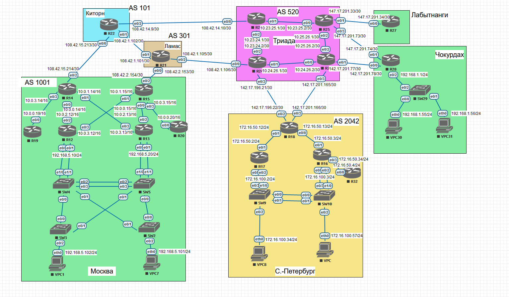

## Топология

## Задание

Цель: В данной самостоятельной работе необходимо распланировать  адресное пространство Настроить IP на всех активных портах для  дальнейшей работы над проектом адресное пространство должно быть  задокументировано

В этой  самостоятельной работе мы ожидаем, что вы самостоятельно:

1. Разработаете и задокументируете адресное пространство для лабораторного стенда.
2. Настроите ip адреса на каждом активном порту
3. Настроите каждый VPC в любом офисе в своем VLAN.
4. Настроите VLAN управления для сетевых устройств
5. Настроите сети офисов так, чтобы не возникало broadcast штормов, а использование линков было максимально оптимизировано
6. Используете ipv4 и ipv6

## Документирование адресного пространства IPv4

### Москва AS 1001

| Устройство | Интерфейс | IP-адрес         | Куда смотрит | IP-адрес соседа  | Примечание   |
| ---------- | --------- | ---------------- | ------------ | ---------------- | ------------ |
| R14        | e0/0      | 10.0.0.14/16     | R12          | 10.0.2.12/16     |              |
| R14        | e0/1      | 10.0.1.14/16     | R13          | 10.0.3.13/16     |              |
| R14        | e0/2      | 108.42.15.214/30 | R22Киторн    | 108.42.15.213/30 | Интернет     |
| R14        | e0/3      | 10.0.3.14/16     | R19          | 10.0.0.19/16     |              |
|            |           |                  |              |                  |              |
| R15        | e0/0      | 10.0.0.15/16     | R13          | 10.0.2.13/16     |              |
| R15        | e0/1      | 10.0.1.15/16     | R12          | 10.0.3.12/16     |              |
| R15        | e0/2      | 108.42.2.154/30  | R21Ламас     | 108.42.2.153/30  | Интернет     |
| R15        | e0/3      | 10.0.3.15/16     | R20          |                  |              |
|            |           |                  |              |                  |              |
| R19        | e0/0      | 10.0.0.19/16     | R14          | 10.0.3.14/16     |              |
|            |           |                  |              |                  |              |
| R12        | e0/0      | 192.168.5.10/24  | SW4          | -                |              |
| R12        | e0/1      | 192.168.5.10/24  | SW5          | -                |              |
| R12        | e0/2      | 10.0.2.12/16     | R14          | 10.0.0.14/16     |              |
| R12        | e0/3      | 10.0.3.12/16     | R15          | 10.0.1.15/16     |              |
|            |           |                  |              |                  |              |
| R13        | e0/0      | 192.168.5.20/24  | SW5          | -                |              |
| R13        | e0/1      | 192.168.5.20/24  | SW4          | -                |              |
| R13        | e0/2      | 10.0.2.13/16     | R15          | 10.0.0.15/16     |              |
| R13        | e0/3      | 10.0.3.13/16     | R14          | 10.0.1.14/16     |              |
|            |           |                  |              |                  |              |
| R20        | e0/0      | 10.0.0.20/16     | R15          | 10.0.3.15/16     |              |
|            |           |                  |              |                  |              |
| SW4        | e0/0      | -                | SW3          | -                |              |
| SW4        | e0/1      | -                | SW2          | -                |              |
| SW4        | e0/2      | -                | SW5          | -                | Port-Channel |
| SW4        | e0/3      | -                | SW5          | -                | Port-Channel |
| SW4        | e1/0      | -                | R12          | 192.168.5.10/24  |              |
| SW4        | e1/1      | -                | R13          | 192.168.5.20/24  |              |
|            |           |                  |              |                  |              |
| SW5        | e0/0      | -                | SW2          |                  |              |
| SW5        | e0/1      | -                | SW3          |                  |              |
| SW5        | e0/2      | -                | SW4          | -                | Port-Channel |
| SW5        | e0/3      | -                | SW4          | -                | Port-Channel |
| SW5        | e1/0      | -                | R13          | 192.168.5.20/24  |              |
| SW5        | e1/1      | -                | R12          | 192.168.5.10/24  |              |
|            |           |                  |              |                  |              |
| SW3        | e0/0      | -                | SW4          | -                |              |
| SW3        | e0/1      | -                | SW3          | -                |              |
| SW3        | e0/2      | -                | VPC1         | 192.168.5.102/24 |              |
|            |           |                  |              |                  |              |
| SW2        | e0/0      | -                | SW5          | -                |              |
| SW2        | e0/1      | -                | SW4          | -                |              |
| SW2        | e0/2      | -                | VPC7         | 192.168.5.101/24 |              |
|            |           |                  |              |                  |              |
| VPC1       | eth0      | 192.168.5.102/24 | SW3          | -                |              |
|            |           |                  |              |                  |              |
| VPC7       | eth0      | 192.168.5.101/24 | SW2          | -                |              |

### Санкт-Петербург AS 2042

| Устройство | Интерфейс | IP-адрес          | Куда смотрит | IP-адрес соседа   | Примечание   |
| ---------- | --------- | ----------------- | ------------ | ----------------- | ------------ |
| R18        | e0/0      | 172.16.50.13/24   | R16          | 172.16.50.3/24    |              |
| R18        | e0/1      | 172.16.50.12/24   | R17          | 172.16.50.2/24    |              |
| R18        | e0/2      | 142.17.201.22/30  | R24Триада    | 142.17.201.21/30  | Интернет     |
| R18        | e0/3      | 142.17.201.166/30 | R26Триада    | 142.17.201.165/30 | Интернет     |
|            |           |                   |              |                   |              |
| R17        | e0/0      | 172.16.100.2/24   | SW9          | -                 |              |
| R17        | e0/1      | 172.162.50.2/24   | R18          | 172.16.50.12/24   |              |
| R17        | e0/2      | 172.16.100.2/24   | SW10         | -                 |              |
|            |           |                   |              |                   |              |
| R16        | e0/0      | 172.16.100.3/24   | SW10         | -                 |              |
| R16        | e0/1      | 172.16.50.3/24    | R18          | 172.16.50.13/24   |              |
| R16        | e0/2      | 172.16.100.3/24   | SW9          | -                 |              |
| R16        | e0/3      | 172.16.50.34/24   | R32          |                   |              |
|            |           |                   |              |                   |              |
| R32        | e0/0      | 172.16.50.4/24    | R16          | 172.16.50.34/24   |              |
|            |           |                   |              |                   |              |
| SW9        | e0/0      | -                 | SW10         | -                 | Port-Channel |
| SW9        | e0/1      | -                 | SW10         | -                 | Port-Channel |
| SW9        | e0/2      | -                 | VPC8         | 172.16.100.34/24  |              |
| SW9        | e0/3      | -                 | R17          | 172.16.100.2/24   |              |
| SW9        | e1/0      | -                 | R16          | 172.16.100.3/24   |              |
|            |           |                   |              |                   |              |
| SW10       | e0/0      | -                 | SW9          | -                 | Port-Channel |
| SW10       | e0/1      | -                 | SW9          | -                 | Port-Channel |
| SW10       | e0/2      | -                 | VPC0         | 172.16.100.57/24  |              |
| SW10       | e0/3      | -                 | R16          | 172.16.100.3/24   |              |
| SW10       | e1/0      | -                 | R17          | 172.16.100.2/24   |              |
|            |           |                   |              |                   |              |
| VPC8       | eth0      | 172.16.100.34/24  | SW9          | -                 |              |
|            |           |                   |              |                   |              |
| VPC0       | eth0      | 172.16.100.57/24  | SW10         | -                 |              |

### Чокурдах

| Устройство | Интерфейс | IP-адрес         | Куда смотрит | IP-адрес соседа  | Примечание |
| ---------- | --------- | ---------------- | ------------ | ---------------- | ---------- |
| R28        | e0/0      | 142.17.201.78/30 | R26Триада    | 142.17.201.77/30 | Интернет   |
| R28        | e0/1      | 142.17.201.74/30 | R25Триада    | 142.17.201.73/30 | Интернет   |
| R28        | e0/2      | 192.168.1.1/24   | SW29         | -                |            |
|            |           |                  |              |                  |            |
| SW29       | e0/0      | -                | VPC30        | 192.168.1.55/24  |            |
| SW29       | e0/1      | -                | VPC31        | 192.168.1.56/24  |            |
| SW29       | e0/2      | -                | R28          | 192.168.1.1/24   |            |
|            |           |                  |              |                  |            |
| VPC30      | eth0      | 192.168.1.55/24  | SW29         | -                |            |
|            |           |                  |              |                  |            |
| VPC31      | eth0      | 192.168.1.56/24  | SW29         | -                |            |

### Лабытнанги

| Устройство | Интерфейс | IP-адрес         | Куда смотрит | IP-адрес соседа  | Примечание |
| ---------- | --------- | ---------------- | ------------ | ---------------- | ---------- |
| R27        | e0/0      | 142.17.201.34/30 | R25Триада    | 142.17.201.33.30 | Интернет   |

### Триада AS 520

| Устройство | Интерфейс | IP-адрес          | Куда смотрит | IP-адрес соседа   | Примечание |
| ---------- | --------- | ----------------- | ------------ | ----------------- | ---------- |
| R23        | e0/0      | 108.42.14.10/30   | R22Киторн    | 108.42.14.9/30    |            |
| R23        | e0/1      | 10.23.25.1/30     | R25          | 10.23.25.2/30     |            |
| R23        | e0/2      | 10.23.24.1/30     | R24          | 10.23.24.2/30     |            |
|            |           |                   |              |                   |            |
| R24        | e0/0      | 108.42.1.106/30   | R21Ламас     | 108.42.1.105/30   |            |
| R24        | e0/1      | 10.24.26.1/30     | R26          | 10.24.26.2/30     |            |
| R24        | e0/2      | 10.23.24.2/30     | R23          | 10.23.24.1/30     |            |
| R24        | e0/3      | 142.17.201.21/30  | R18Питер     | 142.17.201.22/30  | Клиент     |
|            |           |                   |              |                   |            |
| R25        | e0/0      | 10.23.25.2/30     | R23          | 10.23.25.1/30     |            |
| R25        | e0/1      | 142.17.201.33/30  | R27Лабыт     | 142.17.201.34/30  | Клиент     |
| R25        | e0/2      | 10.25.26.1/30     | R26          | 10.25.26.2/30     |            |
| R25        | e0/3      | 142.17.201.73/30  | R28Чокур     | 142.17.201.74/30  | Клиент     |
|            |           |                   |              |                   |            |
| R26        | e0/0      | 10.24.26.2.30     | R24          | 10.24.26.1.30     |            |
| R26        | e0/1      | 142.17.201.77/30  | R28Чокур     | 142.17.201.78/30  | Клиент     |
| R26        | e0/2      | 10.25.26.2/30     | R25          | 10.25.26.1/30     |            |
| R26        | e0/3      | 142.17.201.165/30 | R18Питер     | 142.17.201.166/30 | Клиент     |

### Киторн AS 101

| Устройство | Интерфейс | IP-адрес         | Куда смотрит | IP-адрес соседа  | Примечание |
| ---------- | --------- | ---------------- | ------------ | ---------------- | ---------- |
| R22        | e0/0      | 108.42.15.213/30 | R14МСК       | 108.42.15.214/30 | Клиент     |
| R22        | e0/1      | 108.42.1.102/30  | R21Ламас     | 108.42.1.101/30  |            |
| R22        | e0/2      | 108.42.14.9/30   | R23Триада    | 108.42.14.10/30  |            |

### Ламас AS 301

| Устройство | Интерфейс | IP-адрес        | Куда смотрит | IP-адрес соседа | Примечание |
| ---------- | --------- | --------------- | ------------ | --------------- | ---------- |
| R21        | e0/0      | 108.42.2.153/30 | R15МСК       | 108.42.2.154/30 | Клиент     |
| R21        | e0/1      | 108.42.1.101/30 | R21Киторн    | 108.42.1.102/30 |            |
| R21        | e0/2      | 108.42.1.105/30 | R24Триада    | 108.42.1.106/30 |            |

