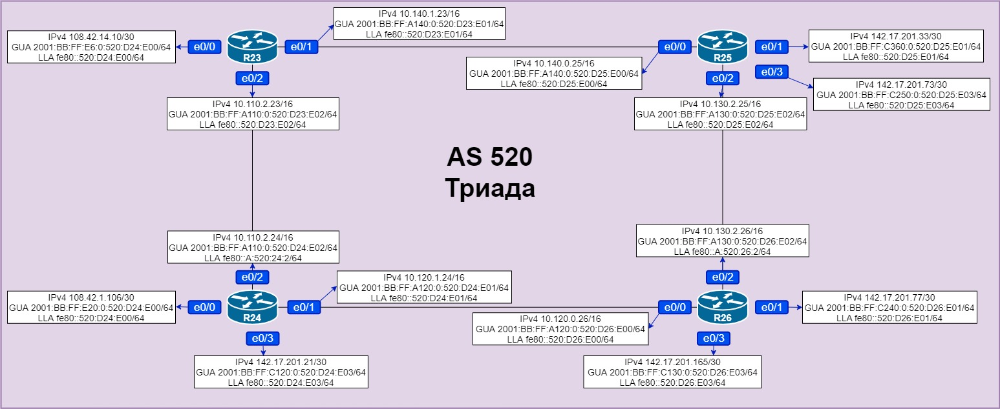
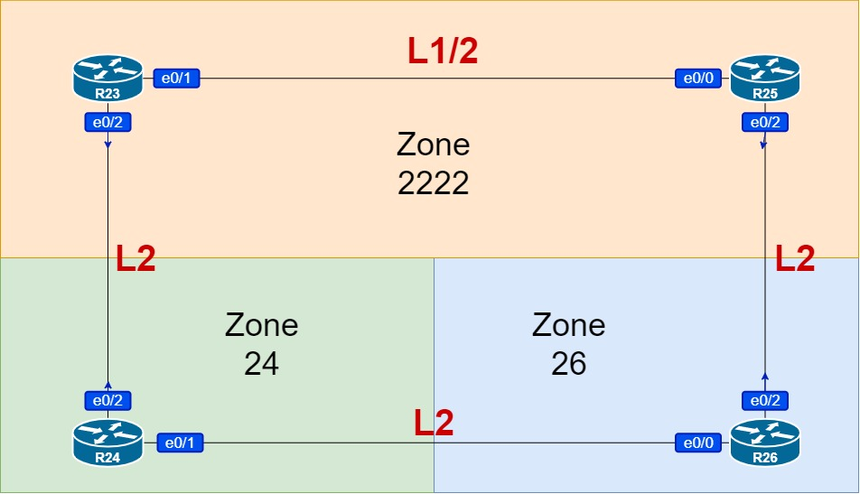

# Домашняя работа: настройка IS-IS

### Цель: Настроить IS-IS офисе Триада

- #### R23 и R25 находятся в зоне 2222

- #### R24 находится в зоне 24

- #### R26 находится в зоне 26


### Схема сети:




### Схема сети с учетом целей задания:




### Настройка:

```
R26(config)#router isis
R26(config-router)#net 49.0026.2626.2626.2626.00
R26(config-if)#int range e0/0-3
R26(config-if-range)#ip router isis
R26(config-if-range)#ipv6 router isis
```

```
R24(config)#router isis
R24(config-router)#net 49.0024.2424.2424.2424.00
R24(config)#int range e0/0-3
R24(config-if-range)#ip router isis
R24(config-if-range)#ipv6 router isis
```

```
R23(config)#router isis
R23(config-router)#net 49.2222.2323.2323.2323.00
R23(config)#int range e0/0-2
R23(config-if-range)#ip router isis
R23(config-if-range)#ipv6 router isis
```

```
R25(config)#router isis
R25(config-router)#net 49.2222.2525.2525.2525.00
R25(config)#int range e0/0-3
R25(config-if-range)#ip router isis
R25(config-if-range)#ipv6 router isis
```

**Проверим топологию и маршруты:**

```
R25#show isis topology

IS-IS TID 0 paths to level-1 routers
System Id            Metric     Next-Hop             Interface   SNPA
R23                  10         R23                  Et0/0       aabb.cc01.7010
R25                  --

IS-IS TID 0 paths to level-2 routers
System Id            Metric     Next-Hop             Interface   SNPA
R23                  10         R23                  Et0/0       aabb.cc01.7010
R24                  20         R23                  Et0/0       aabb.cc01.7010
                                R26                  Et0/2       aabb.cc01.a020
R25                  --
R26                  10         R26                  Et0/2       aabb.cc01.a020
```

```
R25#show ip route isis
Codes: L - local, C - connected, S - static, R - RIP, M - mobile, B - BGP
       D - EIGRP, EX - EIGRP external, O - OSPF, IA - OSPF inter area
       N1 - OSPF NSSA external type 1, N2 - OSPF NSSA external type 2
       E1 - OSPF external type 1, E2 - OSPF external type 2
       i - IS-IS, su - IS-IS summary, L1 - IS-IS level-1, L2 - IS-IS level-2
       ia - IS-IS inter area, * - candidate default, U - per-user static route
       o - ODR, P - periodic downloaded static route, H - NHRP, l - LISP
       a - application route
       + - replicated route, % - next hop override

Gateway of last resort is not set

      10.0.0.0/8 is variably subnetted, 6 subnets, 2 masks
i L1     10.110.0.0/16 [115/20] via 10.140.1.23, 1d09h, Ethernet0/0
i L2     10.120.0.0/16 [115/20] via 10.130.2.26, 00:04:25, Ethernet0/2
      108.0.0.0/30 is subnetted, 2 subnets
i L2     108.42.1.104 [115/30] via 10.140.1.23, 00:00:58, Ethernet0/0
                      [115/30] via 10.130.2.26, 00:00:58, Ethernet0/2
i L1     108.42.14.8 [115/20] via 10.140.1.23, 00:02:50, Ethernet0/0
      142.17.0.0/16 is variably subnetted, 7 subnets, 2 masks
i L2     142.17.201.20/30 [115/30] via 10.140.1.23, 00:00:58, Ethernet0/0
                          [115/30] via 10.130.2.26, 00:00:58, Ethernet0/2
i L2     142.17.201.76/30 [115/20] via 10.130.2.26, 00:04:25, Ethernet0/2
i L2     142.17.201.164/30 [115/20] via 10.130.2.26, 00:04:25, Ethernet0/2
```

```
R25#show ipv6 route isis
IPv6 Routing Table - default - 16 entries
Codes: C - Connected, L - Local, S - Static, U - Per-user Static route
       B - BGP, HA - Home Agent, MR - Mobile Router, R - RIP
       H - NHRP, I1 - ISIS L1, I2 - ISIS L2, IA - ISIS interarea
       IS - ISIS summary, D - EIGRP, EX - EIGRP external, NM - NEMO
       ND - ND Default, NDp - ND Prefix, DCE - Destination, NDr - Redirect
       O - OSPF Intra, OI - OSPF Inter, OE1 - OSPF ext 1, OE2 - OSPF ext 2
       ON1 - OSPF NSSA ext 1, ON2 - OSPF NSSA ext 2, la - LISP alt
       lr - LISP site-registrations, ld - LISP dyn-eid, a - Application
I1  2001:BB:FF:E6::/64 [115/20]
     via FE80::520:D23:E01, Ethernet0/0
I2  2001:BB:FF:E20::/64 [115/30]
     via FE80::520:D23:E01, Ethernet0/0
     via FE80::520:D26:E02, Ethernet0/2
I1  2001:BB:FF:A110::/64 [115/20]
     via FE80::520:D23:E01, Ethernet0/0
I2  2001:BB:FF:A120::/64 [115/20]
     via FE80::520:D26:E02, Ethernet0/2
I2  2001:BB:FF:C120::/64 [115/30]
     via FE80::520:D23:E01, Ethernet0/0
     via FE80::520:D26:E02, Ethernet0/2
I2  2001:BB:FF:C130::/64 [115/20]
     via FE80::520:D26:E02, Ethernet0/2
I2  2001:BB:FF:C240::/64 [115/20]
     via FE80::520:D26:E02, Ethernet0/2
```

```
R24#show isis topology

IS-IS TID 0 paths to level-1 routers
System Id            Metric     Next-Hop             Interface   SNPA
R24                  --

IS-IS TID 0 paths to level-2 routers
System Id            Metric     Next-Hop             Interface   SNPA
R23                  10         R23                  Et0/2       aabb.cc01.7020
R24                  --
R25                  20         R23                  Et0/2       aabb.cc01.7020
                                R26                  Et0/1       aabb.cc01.a000
R26                  10         R26                  Et0/1       aabb.cc01.a000
```

```
R24#show ip route isis
Codes: L - local, C - connected, S - static, R - RIP, M - mobile, B - BGP
       D - EIGRP, EX - EIGRP external, O - OSPF, IA - OSPF inter area
       N1 - OSPF NSSA external type 1, N2 - OSPF NSSA external type 2
       E1 - OSPF external type 1, E2 - OSPF external type 2
       i - IS-IS, su - IS-IS summary, L1 - IS-IS level-1, L2 - IS-IS level-2
       ia - IS-IS inter area, * - candidate default, U - per-user static route
       o - ODR, P - periodic downloaded static route, H - NHRP, l - LISP
       a - application route
       + - replicated route, % - next hop override

Gateway of last resort is not set

      10.0.0.0/8 is variably subnetted, 6 subnets, 2 masks
i L2     10.130.0.0/16 [115/20] via 10.120.0.26, 00:05:43, Ethernet0/1
i L2     10.140.0.0/16 [115/20] via 10.110.2.23, 1d09h, Ethernet0/2
      108.0.0.0/8 is variably subnetted, 3 subnets, 2 masks
i L2     108.42.14.8/30 [115/20] via 10.110.2.23, 00:04:08, Ethernet0/2
      142.17.0.0/16 is variably subnetted, 6 subnets, 2 masks
i L2     142.17.201.32/30 [115/30] via 10.120.0.26, 00:03:05, Ethernet0/1
                          [115/30] via 10.110.2.23, 00:03:05, Ethernet0/2
i L2     142.17.201.72/30 [115/30] via 10.120.0.26, 00:03:05, Ethernet0/1
                          [115/30] via 10.110.2.23, 00:03:05, Ethernet0/2
i L2     142.17.201.76/30 [115/20] via 10.120.0.26, 00:05:43, Ethernet0/1
i L2     142.17.201.164/30 [115/20] via 10.120.0.26, 00:05:43, Ethernet0/1
```

```
R24# show ipv6 route isis
IPv6 Routing Table - default - 16 entries
Codes: C - Connected, L - Local, S - Static, U - Per-user Static route
       B - BGP, HA - Home Agent, MR - Mobile Router, R - RIP
       H - NHRP, I1 - ISIS L1, I2 - ISIS L2, IA - ISIS interarea
       IS - ISIS summary, D - EIGRP, EX - EIGRP external, NM - NEMO
       ND - ND Default, NDp - ND Prefix, DCE - Destination, NDr - Redirect
       O - OSPF Intra, OI - OSPF Inter, OE1 - OSPF ext 1, OE2 - OSPF ext 2
       ON1 - OSPF NSSA ext 1, ON2 - OSPF NSSA ext 2, la - LISP alt
       lr - LISP site-registrations, ld - LISP dyn-eid, a - Application
I2  2001:BB:FF:E6::/64 [115/20]
     via FE80::520:D23:E02, Ethernet0/2
I2  2001:BB:FF:A130::/64 [115/20]
     via FE80::520:D26:E00, Ethernet0/1
I2  2001:BB:FF:A140::/64 [115/20]
     via FE80::520:D23:E02, Ethernet0/2
I2  2001:BB:FF:C130::/64 [115/20]
     via FE80::520:D26:E00, Ethernet0/1
I2  2001:BB:FF:C240::/64 [115/20]
     via FE80::520:D26:E00, Ethernet0/1
I2  2001:BB:FF:C250::/64 [115/30]
     via FE80::520:D23:E02, Ethernet0/2
     via FE80::520:D26:E00, Ethernet0/1
I2  2001:BB:FF:C360::/64 [115/30]
     via FE80::520:D23:E02, Ethernet0/2
     via FE80::520:D26:E00, Ethernet0/1
```

