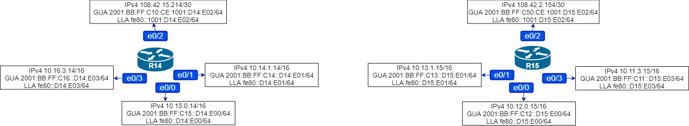
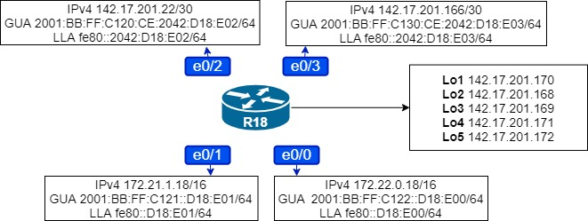
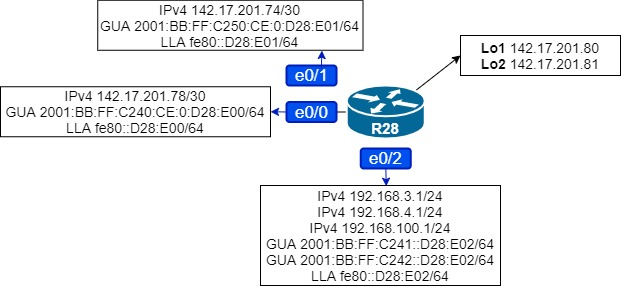
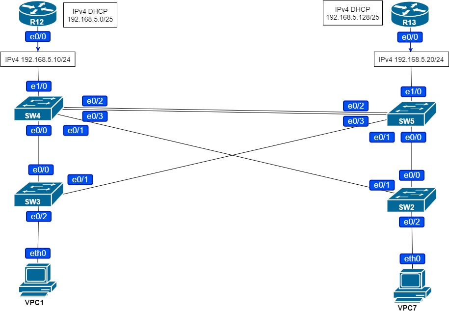

# Домашняя работа: основные протоколы сети интернет

### Цель: Настроить синхронизацию времени в офисе Москва
Настроить NAT в офисе Москва, C.-Петербург и Чокурдах


- #### Настроить NAT(PAT) на R14 и R15. Трансляция должна осуществляться в адрес автономной системы AS1001

- #### Настроить NAT(PAT) на R18. Трансляция должна осуществляться в пул из 5 адресов автономной системы AS2042

- #### Настроить статический NAT для R20

- #### Настроить NAT так, чтобы R19 был доступен с любого узла для удаленного управления

- #### Настроить статический NAT(PAT) для офиса Чокурдах

- #### Настроить для IPv4 DHCP сервер в офисе Москва на маршрутизаторах R12 и  R13. VPC1 и VPC7 должны получать сетевые настройки по DHCP

- #### Настроить NTP сервер на R12 и R13. Все устройства в офисе Москва должны синхронизировать время с R12 и R13


### Настройка PAT на R14 и R15



```
R15(config)#access-list 55 permit 10.0.0.0 0.255.255.255
R15(config)#access-list 55 permit 192.168.5.0 0.0.0.255
R15(config)#access-list 55 permit 192.168.99.0 0.0.0.255
R15(config)#ip nat inside source list 55 interface e0/2 overload
R15(config)#int e0/0
R15(config-if)#ip nat inside
R15(config-if)#int e0/1
R15(config-if)#ip nat inside
R15(config-if)#int e0/3
R15(config-if)#ip nat ins
R15(config-if)#ip nat inside
R15(config-if)#int e0/2
R15(config-if)#ip nat outside
```

```
R14(config)#access-list 55 permit 10.0.0.0 0.255.255.255
R14(config)#access-list 55 permit 192.168.5.0 0.0.0.255
R14(config)#access-list 55 permit 192.168.99.0 0.0.0.255
R14(config)#ip nat inside source list 55 interface e0/2 overload
R14(config)#int e0/0
R14(config-if)#ip nat inside
R14(config-if)#int e0/1
R14(config-if)#ip nat inside
R14(config-if)#int e0/3
R14(config-if)#ip nat ins
R14(config-if)#ip nat inside
R14(config-if)#int e0/2
R14(config-if)#ip nat outside
```

**Проверим** 

```
R20#ping 142.17.201.34
Type escape sequence to abort.
Sending 5, 100-byte ICMP Echos to 142.17.201.34, timeout is 2 seconds:
!!!!!
Success rate is 100 percent (5/5), round-trip min/avg/max = 1/1/3 ms
```

```
R19>trace 142.17.201.78
Type escape sequence to abort.
Tracing the route to 142.17.201.78
VRF info: (vrf in name/id, vrf out name/id)
  1 10.16.3.14 1 msec 0 msec 0 msec
  2 10.14.3.13 0 msec 1 msec 0 msec
  3 10.12.0.15 1 msec 1 msec 0 msec
  4 108.42.2.153 1 msec 1 msec 1 msec
  5 108.42.1.106 2 msec 1 msec 1 msec
  6 10.120.0.26 1 msec 1 msec 1 msec
  7 142.17.201.78 2 msec *  2 msec
```

```
R15#show ip nat statistics
Total active translations: 57 (0 static, 57 dynamic; 57 extended)
Peak translations: 57, occurred 00:01:11 ago
Outside interfaces:
  Ethernet0/2
Inside interfaces:
  Ethernet0/0, Ethernet0/1, Ethernet0/3
Hits: 120  Misses: 0
CEF Translated packets: 67, CEF Punted packets: 53
Expired translations: 1
Dynamic mappings:
-- Inside Source
[Id: 1] access-list 55 interface Ethernet0/2 refcount 57

Total doors: 0
Appl doors: 0
Normal doors: 0
Queued Packets: 0
```

**Всё работает.**


### Настроим PAT на R18



**Создадим loopback-интерфейсы и назначим на них адреса:**

```
R18(config)#int lo1
R18(config-if)#ip address 142.17.201.170 255.255.255.255
R18(config-if)#int lo2
R18(config-if)#ip address 142.17.201.168 255.255.255.255
R18(config-if)#int lo3
R18(config-if)#ip address 142.17.201.169 255.255.255.255
R18(config-if)#int lo4
R18(config-if)#ip address 142.17.201.171 255.255.255.255
R18(config-if)#int lo5
R18(config-if)#ip address 142.17.201.172 255.255.255.255
```

**Добавим адреса loopback-интерфейсов в BGP**

```
R18(config)#router bgp 2042
R18(config-router)#address-family ipv4
R18(config-router-af)#network 142.17.201.168 mask 255.255.255.255
R18(config-router-af)#network 142.17.201.169 mask 255.255.255.255
R18(config-router-af)#network 142.17.201.170 mask 255.255.255.255
R18(config-router-af)#network 142.17.201.171 mask 255.255.255.255
R18(config-router-af)#network 142.17.201.172 mask 255.255.255.255
```

**Настройка PAT:**

```
R18(config)#ip nat pool PAT5 142.17.201.168 142.17.201.172 prefix-length 24
R18(config)#access-list 1 permit 172.21.0.0 0.0.255.255
R18(config)#access-list 1 permit 172.22.0.0 0.0.255.255
R18(config)#access-list 1 permit 172.23.0.0 0.0.255.255
R18(config)#access-list 1 permit 172.16.10.0 0.0.0.255
R18(config)#access-list 1 permit 172.16.100.0 0.0.0.255
R18(config)#ip nat inside source list 1 pool PAT5 overload
R18(config)#int range e0/0-1
R18(config-if-range)#ip nat inside
R18(config-if-range)#int range e0/2-3
R18(config-if-range)#ip nat outside
```

**Проверим:** 

```
R17>ping 108.42.1.102
Type escape sequence to abort.
Sending 5, 100-byte ICMP Echos to 108.42.1.102, timeout is 2 seconds:
!!!!!
Success rate is 100 percent (5/5), round-trip min/avg/max = 1/1/3 ms
```

```
R32>trace 108.42.14.9
Type escape sequence to abort.
Tracing the route to 108.42.14.9
VRF info: (vrf in name/id, vrf out name/id)
  1 172.23.3.16 0 msec 1 msec 0 msec
  2 172.22.0.18 1 msec 0 msec 1 msec
  3 142.17.201.21 1 msec 1 msec 1 msec
  4 10.110.2.23 1 msec 1 msec 1 msec
  5 108.42.14.9 1 msec *  3 msec
```

```
R18#show ip nat statistics
Total active translations: 9 (0 static, 9 dynamic; 9 extended)
Peak translations: 9, occurred 00:00:45 ago
Outside interfaces:
  Ethernet0/2, Ethernet0/3
Inside interfaces:
  Ethernet0/0, Ethernet0/1
Hits: 27  Misses: 0
CEF Translated packets: 19, CEF Punted packets: 8
Expired translations: 1
Dynamic mappings:
-- Inside Source
[Id: 1] access-list 1 pool PAT5 refcount 9
 pool PAT5: netmask 255.255.255.0
        start 142.17.201.168 end 142.17.201.172
        type generic, total addresses 5, allocated 1 (20%), misses 0

Total doors: 0
Appl doors: 0
Normal doors: 0
Queued Packets: 0
```

**Всё работает.**


### Настроим статический NAT для R20

**Поднимем loopback-интерфейсы и назначим на них ip-адреса в которые будет транслироваться адрес R20, также добавим сети в BGP и настроим NAT.**

```
R15(config)#int lo1
R15(config-if)#ip address 108.42.2.156 255.255.255.255
R15(config)#router bgp 1001
R15(config-router)#address-family ipv4
R15(config-router-af)#network 108.42.2.156 mask 255.255.255.255
R15(config)#ip nat inside source static 10.11.0.20 108.42.2.156
```

```
R14(config)#int lo1
R14(config-if)#ip address 108.42.15.216 255.255.255.255
R14(config-if)#router bgp 1001
R14(config-router)#address-family ipv4
R14(config-router-af)#network 108.42.15.216 mask 255.255.255.255
R14(config)#ip nat inside source static 10.11.0.20 108.42.15.216
```

**Проверим:**

```
R15#show ip nat translations
Pro Inside global      Inside local       Outside local      Outside global
--- 108.42.2.156       10.11.0.20         ---                ---
```

```
R14#show ip nat translations
Pro Inside global      Inside local       Outside local      Outside global
--- 108.42.15.216      10.11.0.20         ---                ---
```

**Данные верны.**


### Настроим NAT так, чтобы R19 был доступен с любого узла для удаленного управления.

Настроим проброс 22 порта (так как SSH) на R19

```
R14(config)#ip nat inside source static tcp 10.16.0.19 22 108.42.15.214 6000
```

```
R14#sh ip nat translations
Pro Inside global      Inside local       Outside local      Outside global
--- 108.42.15.216      10.11.0.20         ---                ---
tcp 108.42.15.214:6000 10.16.0.19:22      ---                ---
```

```
R15(config)#ip nat inside source static tcp 10.16.0.19 22 108.42.2.154 6000
```

```
R15#sh ip nat translations
Pro Inside global      Inside local       Outside local      Outside global
--- 108.42.2.156       10.11.0.20         ---                ---
tcp 108.42.2.154:6000  10.16.0.19:22      ---                ---
```

**Данные верны.**


### Настроим статический NAT(PAT) для офиса Чокурдах



**Поднимем loopback-интерфейсы и назначим на них ip-адреса:**

```
R28(config)#int lo1
R28(config-if)#ip address 142.17.201.80 255.255.255.255
R28(config-if)#int lo2
R28(config-if)#ip address 142.17.201.81 255.255.255.255
```

**Настроим статические маршруты и BGP у провайдера:**

```
R25(config)#ip route 142.17.201.80 255.255.255.255 142.17.201.74
R25(config)#ip route 142.17.201.81 255.255.255.255 142.17.201.74
R25(config)#router bgp 520
R25(config-router)#address-family ipv4
R25(config-router-af)#network 142.17.201.80 mask 255.255.255.255
R25(config-router-af)#network 142.17.201.81 mask 255.255.255.255
```

```
R26(config)#ip route 142.17.201.80 255.255.255.255 142.17.201.78
R26(config)#ip route 142.17.201.81 255.255.255.255 142.17.201.78
R26(config)#router bgp 520
R26(config-router)#address-family ipv4
R26(config-router-af)#network 142.17.201.80 mask 255.255.255.255
R26(config-router-af)#network 142.17.201.81 mask 255.255.255.255
```

**Настроим NAT:**

```
R28(config)#ip nat inside source static 192.168.3.30 142.17.201.80
R28(config)#ip nat inside source static 192.168.4.31 142.17.201.81
R28(config)#int range e0/0-1
R28(config-if-range)#ip nat outside
R28(config-if-range)#int e0/2.1
R28(config-subif)#ip nat inside
R28(config-subif)#int e0/2.2
R28(config-subif)#ip nat inside
```

**Проверим:**

```
VPCS> trace 108.42.14.9
trace to 108.42.14.9, 8 hops max, press Ctrl+C to stop
 1   192.168.3.1   1.101 ms  0.501 ms  0.548 ms
 2   142.17.201.77   1.083 ms  0.667 ms  0.747 ms
 3   10.130.2.25   1.007 ms  0.733 ms  0.733 ms
 4   10.140.1.23   1.072 ms  1.042 ms  0.881 ms
 5   *108.42.14.9   1.564 ms (ICMP type:3, code:3, Destination port unreachable)  *
```

```
VPCS> trace 108.42.15.214
trace to 108.42.15.214, 8 hops max, press Ctrl+C to stop
 1   192.168.4.1   0.658 ms  0.437 ms  0.529 ms
 2   142.17.201.73   0.906 ms  0.556 ms  0.799 ms
 3   10.140.1.23   1.060 ms  0.853 ms  0.801 ms
 4   108.42.14.9   1.698 ms  1.200 ms  1.361 ms
 5   *108.42.15.214   2.457 ms (ICMP type:3, code:3, Destination port unreachable)  *
```

```
R28#sh ip nat translations
Pro Inside global      Inside local       Outside local      Outside global
udp 142.17.201.80:31760 192.168.3.30:31760 108.42.14.9:31761 108.42.14.9:31761
udp 142.17.201.80:37761 192.168.3.30:37761 108.42.14.9:37762 108.42.14.9:37762
udp 142.17.201.80:58336 192.168.3.30:58336 108.42.15.214:58337 108.42.15.214:58337
--- 142.17.201.80      192.168.3.30       ---                ---
udp 142.17.201.81:39441 192.168.4.31:39441 108.42.15.214:39442 108.42.15.214:39442
--- 142.17.201.81      192.168.4.31       ---                ---
```

```
R28# sh ip nat statistics
Total active translations: 6 (2 static, 4 dynamic; 4 extended)
Peak translations: 8, occurred 00:01:51 ago
Outside interfaces:
  Ethernet0/0, Ethernet0/1
Inside interfaces:
  Ethernet0/2, Ethernet0/2.1, Ethernet0/2.2
Hits: 104  Misses: 0
CEF Translated packets: 57, CEF Punted packets: 47
Expired translations: 3
Dynamic mappings:

Total doors: 0
Appl doors: 0
Normal doors: 0
Queued Packets: 0
```

**Всё работает.**


### Настроим для IPv4 DHCP сервер в офисе Москва на маршрутизаторах R12 и  R13

**Поделим адреса сети на 2 диапазона и назначим их на R12 и R13, так же исключим из выдачи адреса 192.168.5.1-192.168.5.20 будем считать они зарезервированы.**



```
R12(config)#ip dhcp excluded-address 192.168.5.1 192.168.5.20
R12(config)#ip dhcp pool CLIENT
R12(dhcp-config)#network 192.168.5.0 255.255.255.128
R12(dhcp-config)#default-router 192.168.5.10
```

```
R13(config)#ip dhcp pool CLIENT
R13(dhcp-config)#network 192.168.5.128 255.255.255.128
R13(dhcp-config)#default-router 192.168.5.20
```

**Проверим DHCP на VPC**

```
VPCS> ip dhcp
DDORA IP 192.168.5.21/25 GW 192.168.5.10
```

```
VPCS> ip dhcp
DDORA IP 192.168.5.22/25 GW 192.168.5.10
```

**VPC успешно получили адреса по DHCP**


### Настроим NTP сервер на R12 и R13. Все устройства в офисе Москва должны синхронизировать время с R12 и R13

**Настроим сервера:**

```
R13(config)#ntp master 1
R13(config)#ntp update-calendar
R13(config)#int range e0/0-3
R13(config-if-range)#ntp broadcast
```

```
R12(config)#ntp master 1
R12(config)#ntp update-calendar
R12(config)#int range e0/0-3
R12(config-if-range)#ntp broadcast
```

**Настроим клиентов:**

```
R14(config)#int e0/0
R14(config-if)#ntp broadcast client
R14(config-if)#int e0/1
R14(config-if)#ntp broadcast client
R14(config)#ntp master 2
R14(config)#ntp update-calendar
R14(config)#int e0/3
R14(config-if)#ntp broadcast
```

```
R15(config)#int range e0/0-1
R15(config-if-range)#ntp broadcast client
R15(config)#ntp master 2
RR15(config)#ntp update-calendar
R15(config)#int e0/3
R15(config-if)#ntp broadcast
```

```
R19(config)#int e0/0
R19(config-if)#ntp broadcast client
```

```
R20(config)#int e0/0
R20(config-if)#ntp broadcast client
```

