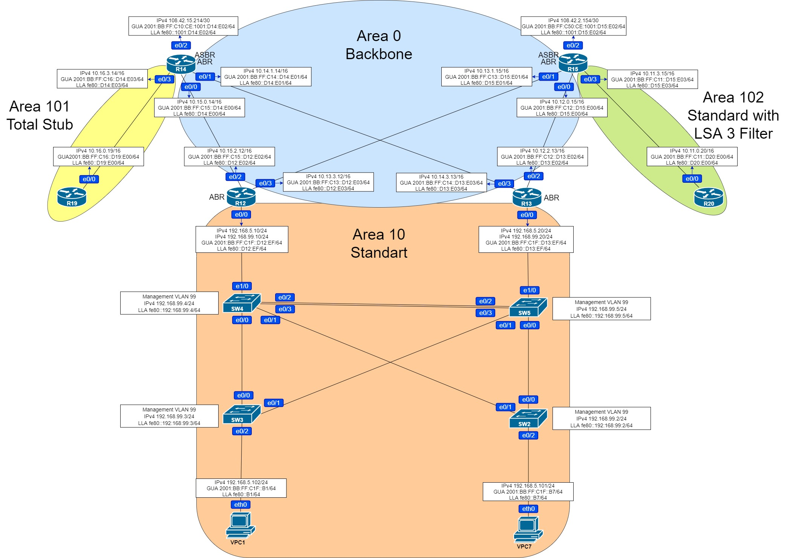

# Домашняя работа: настройка OSPF

### Цель: Настроить OSPF офисе Москва, разделить сеть на зоны, настроить фильтрацию между зонами

### Условия:

1. Маршрутизаторы R14-R15 находятся в зоне 0 - backbone
2. Маршрутизаторы R12-R13 находятся в зоне 10. Дополнительно к маршрутам должны получать маршрут по-умолчанию
3. Маршрутизатор R19 находится в зоне 101 и получает только маршрут по умолчанию
4. Маршрутизатор R20 находится в зоне 102 и получает все маршруты, кроме маршрутов до сетей зоны 101
5. Настройка для IPv6 повторяет логику IPv4


### Карта сети составленная с учетом условий задания: 





### Таблица соответствия интерфейсов зонам:

| Роутер | Интерфейс | Зона     |
| ------ | --------- | -------- |
| R12    | e0/0      | Area 10  |
| R12    | e0/2      | Area 0   |
| R12    | e0/3      | Area 0   |
| R13    | e0/0      | Area 10  |
| R13    | e0/2      | Area 0   |
| R13    | e0/3      | Area 0   |
| R14    | e0/0      | Area 0   |
| R14    | e0/1      | Area 0   |
| R14    | e0/3      | Area 101 |
| R15    | e0/0      | Area 0   |
| R15    | e0/1      | Area 0   |
| R15    | e0/3      | Area 102 |
| R19    | e0/0      | Area 101 |
| R20    | e0/0      | Area 102 |


## Необходимые команды и настройки

### Area 0 Backbone

#### R12

```
R12(config)#router ospf 1
R12(config-router)#router-id 12.12.12.12
R12(config-router)#exit
R12(config)#int range e0/2-3
R12(config-if-range)#ip ospf 1 area 0
R12#copy run start
```

####  R13

```
R13(config)#router ospf 1
R13(config-router)#router-id 13.13.13.13
R13(config-router)#exit
R13(config)#int range e0/2-3
R13(config-if-range)#ip ospf 1 area 0
R13#copy run start
```

####  R14

```
R14(config)#router ospf 1
R14(config-router)#router-id 14.14.14.14
R14(config-router)#exit
R14(config)#int range e0/0-1
R14(config-if-range)#ip ospf 1 area 0
R14#copy run start
```

#### R15

```
R15(config)#router ospf 1
R15(config-router)#router-id 15.15.15.15
R15(config-router)#exit
R15(config)#int range e0/0-1
R15(config-if-range)#ip ospf 1 area 0
R15#copy run start
```

Для проверки корректности настроек посмотрим таблицу соседства и базу данных OSPF на R15 и R13

```
R15#show ip ospf neighbor

Neighbor ID     Pri   State           Dead Time   Address         Interface
13.13.13.13       1   FULL/DR         00:00:34    10.12.2.13      Ethernet0/0
12.12.12.12       1   FULL/DR         00:00:37    10.13.3.12      Ethernet0/1
R15#show ip ospf database

            OSPF Router with ID (15.15.15.15) (Process ID 1)

                Router Link States (Area 0)

Link ID         ADV Router      Age         Seq#       Checksum Link count
12.12.12.12     12.12.12.12     116         0x80000003 0x0058BB 2
13.13.13.13     13.13.13.13     118         0x80000003 0x0044C7 2
14.14.14.14     14.14.14.14     219         0x80000002 0x0008F9 2
15.15.15.15     15.15.15.15     111         0x80000003 0x006D91 2

                Net Link States (Area 0)

Link ID         ADV Router      Age         Seq#       Checksum
10.12.2.13      13.13.13.13     118         0x80000001 0x001957
10.13.3.12      12.12.12.12     116         0x80000001 0x00086F
10.14.3.13      13.13.13.13     221         0x80000001 0x00C3AD
10.15.2.12      12.12.12.12     222         0x80000001 0x00C8B1
```

```

R13#show ip ospf neighbor

Neighbor ID     Pri   State           Dead Time   Address         Interface
15.15.15.15       1   FULL/BDR        00:00:39    10.12.0.15      Ethernet0/2
14.14.14.14       1   FULL/BDR        00:00:35    10.14.1.14      Ethernet0/3
R13#show ip ospf database

            OSPF Router with ID (13.13.13.13) (Process ID 1)

                Router Link States (Area 0)

Link ID         ADV Router      Age         Seq#       Checksum Link count
12.12.12.12     12.12.12.12     211         0x80000003 0x0058BB 2
13.13.13.13     13.13.13.13     211         0x80000003 0x0044C7 2
14.14.14.14     14.14.14.14     312         0x80000002 0x0008F9 2
15.15.15.15     15.15.15.15     206         0x80000003 0x006D91 2

                Net Link States (Area 0)

Link ID         ADV Router      Age         Seq#       Checksum
10.12.2.13      13.13.13.13     211         0x80000001 0x001957
10.13.3.12      12.12.12.12     211         0x80000001 0x00086F
10.14.3.13      13.13.13.13     315         0x80000001 0x00C3AD
10.15.2.12      12.12.12.12     316         0x80000001 0x00C8B1
```

### Area 10 

#### R12

```
R12(config)#int e0/0
R12(config-if-range)#ip ospf 1 area 10
R12#copy run start
```

#### R13

```
R13(config)#int e0/0
R13(config-if-range)#ip ospf 1 area 10
R13#copy run start
```

Проверим базу данных OSPF R12

```
R12(config-router)#do sh ip os da

            OSPF Router with ID (12.12.12.12) (Process ID 1)

                Router Link States (Area 0)

Link ID         ADV Router      Age         Seq#       Checksum Link count
12.12.12.12     12.12.12.12     677         0x80000004 0x0059B8 2
13.13.13.13     13.13.13.13     829         0x80000004 0x0045C4 2
14.14.14.14     14.14.14.14     1400        0x80000002 0x0008F9 2
15.15.15.15     15.15.15.15     1294        0x80000003 0x006D91 2

                Net Link States (Area 0)

Link ID         ADV Router      Age         Seq#       Checksum
10.12.2.13      13.13.13.13     1300        0x80000001 0x001957
10.13.3.12      12.12.12.12     1296        0x80000001 0x00086F
10.14.3.13      13.13.13.13     1404        0x80000001 0x00C3AD
10.15.2.12      12.12.12.12     1402        0x80000001 0x00C8B1

                Summary Net Link States (Area 0)

Link ID         ADV Router      Age         Seq#       Checksum
192.168.5.0     12.12.12.12     53          0x80000003 0x0097FA
192.168.5.0     13.13.13.13     103         0x80000003 0x007915

                Router Link States (Area 10)

Link ID         ADV Router      Age         Seq#       Checksum Link count
12.12.12.12     12.12.12.12     53          0x80000002 0x007A52 1
13.13.13.13     13.13.13.13     54          0x80000002 0x00BAFF 1

                Net Link States (Area 10)

Link ID         ADV Router      Age         Seq#       Checksum
192.168.5.20    13.13.13.13     54          0x80000001 0x007CA2

                Summary Net Link States (Area 10)

Link ID         ADV Router      Age         Seq#       Checksum
10.12.0.0       12.12.12.12     63          0x80000001 0x00D50D
10.12.0.0       13.13.13.13     112         0x80000001 0x005395
10.13.0.0       12.12.12.12     63          0x80000001 0x006586
10.13.0.0       13.13.13.13     112         0x80000001 0x00AB32
10.14.0.0       12.12.12.12     63          0x80000001 0x00BD23
10.14.0.0       13.13.13.13     112         0x80000001 0x003BAB
10.15.0.0       12.12.12.12     63          0x80000001 0x004D9C
10.15.0.0       13.13.13.13     112         0x80000001 0x009348
```

Так как по условию задания требуется чтобы R12  и R13 дополнительно получали маршрут по умолчанию, выполним соответствующую настройку на R14 и R15

#### R15, R14

```
R15(config)#ip route 0.0.0.0 0.0.0.0 108.42.2.153
R15(config)#router ospf 1
R15(config-router)#default-information originate
```

```
R14(config)#ip route 0.0.0.0 0.0.0.0 108.42.15.213
R14(config)#router ospf 1
R14(config-router)#default-information originate
```

Проверим таблицу маршрутизации на R12

```
R12#show ip route
Codes: L - local, C - connected, S - static, R - RIP, M - mobile, B - BGP
       D - EIGRP, EX - EIGRP external, O - OSPF, IA - OSPF inter area
       N1 - OSPF NSSA external type 1, N2 - OSPF NSSA external type 2
       E1 - OSPF external type 1, E2 - OSPF external type 2
       i - IS-IS, su - IS-IS summary, L1 - IS-IS level-1, L2 - IS-IS level-2
       ia - IS-IS inter area, * - candidate default, U - per-user static route
       o - ODR, P - periodic downloaded static route, H - NHRP, l - LISP
       a - application route
       + - replicated route, % - next hop override

Gateway of last resort is 10.15.0.14 to network 0.0.0.0

O*E2  0.0.0.0/0 [110/1] via 10.15.0.14, 00:01:00, Ethernet0/2
                [110/1] via 10.13.1.15, 00:03:15, Ethernet0/3
      10.0.0.0/8 is variably subnetted, 6 subnets, 2 masks
O        10.12.0.0/16 [110/20] via 10.13.1.15, 00:11:59, Ethernet0/3
C        10.13.0.0/16 is directly connected, Ethernet0/3
L        10.13.3.12/32 is directly connected, Ethernet0/3
O        10.14.0.0/16 [110/20] via 10.15.0.14, 00:11:59, Ethernet0/2
C        10.15.0.0/16 is directly connected, Ethernet0/2
L        10.15.2.12/32 is directly connected, Ethernet0/2
      192.168.5.0/24 is variably subnetted, 2 subnets, 2 masks
C        192.168.5.0/24 is directly connected, Ethernet0/0
L        192.168.5.10/32 is directly connected, Ethernet0/0
```

Маршруты по-умолчанию получены.

### Area 101

По условию задания R19 в этой зоне должен получать только маршрут по умолчанию - для данной зоны подходит тип Total Stub Area.

#### R14

```
R14(config)#interface e0/3
R14(config-if)#ip ospf 1 area 101
R14(config-if)#exit
R14(config)#router ospf 1
R14(config-router)#area 101 stub
R14(config-router)#area 101 stub no-summary
```

#### R19

```
R19(config)#router ospf 1
R19(config-router)#router-id 19.19.19.19
R19(config-router)#exit
R19(config)#int e0/0
R19(config-if)#ip ospf 1 area 101
R19(config-if)#exit
R19(config)#router ospf 1
R19(config-router)#area 101 stub
R19#copy run start
```

Проверим базу данных OSPF и таблицу маршрутизации на R19

```
R19#show ip os database

            OSPF Router with ID (19.19.19.19) (Process ID 1)

                Router Link States (Area 101)

Link ID         ADV Router      Age         Seq#       Checksum Link count
14.14.14.14     14.14.14.14     67          0x80000003 0x000959 1
19.19.19.19     19.19.19.19     66          0x80000002 0x00A990 1

                Net Link States (Area 101)

Link ID         ADV Router      Age         Seq#       Checksum
10.16.3.14      14.14.14.14     67          0x80000001 0x00BE95

                Summary Net Link States (Area 101)

Link ID         ADV Router      Age         Seq#       Checksum
0.0.0.0         14.14.14.14     227         0x80000003 0x0008FB
```

```

R19#show ip route
Codes: L - local, C - connected, S - static, R - RIP, M - mobile, B - BGP
       D - EIGRP, EX - EIGRP external, O - OSPF, IA - OSPF inter area
       N1 - OSPF NSSA external type 1, N2 - OSPF NSSA external type 2
       E1 - OSPF external type 1, E2 - OSPF external type 2
       i - IS-IS, su - IS-IS summary, L1 - IS-IS level-1, L2 - IS-IS level-2
       ia - IS-IS inter area, * - candidate default, U - per-user static route
       o - ODR, P - periodic downloaded static route, H - NHRP, l - LISP
       a - application route
       + - replicated route, % - next hop override

Gateway of last resort is 10.16.3.14 to network 0.0.0.0

O*IA  0.0.0.0/0 [110/11] via 10.16.3.14, 00:01:46, Ethernet0/0
      10.0.0.0/8 is variably subnetted, 2 subnets, 2 masks
C        10.16.0.0/16 is directly connected, Ethernet0/0
L        10.16.0.19/32 is directly connected, Ethernet0/0
```

Все настройки верны.

### Area 102

По условию задания в данную зону не должны приходить маршруты из зоны 101, для этого применим фильтрацию по LSA 3 c помощью префикс листа на R15

#### R20

```
R20(config)#router ospf 1
R20(config-router)#router-id 20.20.20.20
R20(config-router)#exit
R20(config)#int e0/0
R20(config-if)#ip ospf 1 area 102
R20#copy run start
```

#### R15

```
R15(config)#int e0/3
R15(config-if)#ip ospf 1 area 102
R15(config-if)#exit
R15(config)#ip prefix-list NO-Area-101 deny 10.16.0.0/16
R15(config)#ip prefix-list NO-Area-101 permit 0.0.0.0/0 le 32
R15(config)#router ospf 1
R15(config-router)#area 102 filter-list prefix NO-Area-101 in
```

Проверим базу данных OSPF и таблицу маршрутизации на R20

```
R20#sh ip os database

            OSPF Router with ID (20.20.20.20) (Process ID 1)

                Router Link States (Area 102)

Link ID         ADV Router      Age         Seq#       Checksum Link count
15.15.15.15     15.15.15.15     248         0x8000002A 0x000A2D 1
20.20.20.20     20.20.20.20     1893        0x80000029 0x00A46C 1

                Net Link States (Area 102)

Link ID         ADV Router      Age         Seq#       Checksum
10.11.3.15      15.15.15.15     248         0x80000029 0x00B869

                Summary Net Link States (Area 102)

Link ID         ADV Router      Age         Seq#       Checksum
10.12.0.0       15.15.15.15     495         0x80000028 0x00C8F0
10.13.0.0       15.15.15.15     495         0x80000028 0x00BCFB
10.14.0.0       15.15.15.15     495         0x80000028 0x001598
10.15.0.0       15.15.15.15     495         0x80000028 0x0009A3
192.168.5.0     15.15.15.15     495         0x80000028 0x0057FF

                Summary ASB Link States (Area 102)

Link ID         ADV Router      Age         Seq#       Checksum
14.14.14.14     15.15.15.15     495         0x80000029 0x00A9E1

                Type-5 AS External Link States

Link ID         ADV Router      Age         Seq#       Checksum Tag
0.0.0.0         14.14.14.14     871         0x8000002A 0x00430E 1
0.0.0.0         15.15.15.15     248         0x8000002A 0x002528 1
```

```
R20#sh ip route
Codes: L - local, C - connected, S - static, R - RIP, M - mobile, B - BGP
       D - EIGRP, EX - EIGRP external, O - OSPF, IA - OSPF inter area
       N1 - OSPF NSSA external type 1, N2 - OSPF NSSA external type 2
       E1 - OSPF external type 1, E2 - OSPF external type 2
       i - IS-IS, su - IS-IS summary, L1 - IS-IS level-1, L2 - IS-IS level-2
       ia - IS-IS inter area, * - candidate default, U - per-user static route
       o - ODR, P - periodic downloaded static route, H - NHRP, l - LISP
       a - application route
       + - replicated route, % - next hop override

Gateway of last resort is 10.11.3.15 to network 0.0.0.0

O*E2  0.0.0.0/0 [110/1] via 10.11.3.15, 22:15:54, Ethernet0/0
      10.0.0.0/8 is variably subnetted, 6 subnets, 2 masks
C        10.11.0.0/16 is directly connected, Ethernet0/0
L        10.11.0.20/32 is directly connected, Ethernet0/0
O IA     10.12.0.0/16 [110/20] via 10.11.3.15, 21:56:10, Ethernet0/0
O IA     10.13.0.0/16 [110/20] via 10.11.3.15, 21:56:10, Ethernet0/0
O IA     10.14.0.0/16 [110/30] via 10.11.3.15, 21:56:10, Ethernet0/0
O IA     10.15.0.0/16 [110/30] via 10.11.3.15, 21:56:10, Ethernet0/0
O IA  192.168.5.0/24 [110/30] via 10.11.3.15, 21:56:10, Ethernet0/0
```

Как видим сети 10.16.0.0/16 из зоны 101 нет, задача выполнена. 


## OSPFv3

Настроим аналогично OSPFv3, будут приведены суммарные настройки для всех роутеров

#### R12

```
R12(config)#ipv6 router ospf 1
R12(config-rtr)#router-id 12.12.12.12
R12(config-rtr)#exit
R12(config)#int range e0/2-3
R12(config-if-range)#ipv6 ospf 1 area 0
R12(config)#int e0/0
R12(config-if-range)#ipv6 ospf 1 area 10
```

#### R13

```
R13(config)#ipv6 router ospf 1
R13(config-rtr)#router-id 13.13.13.13
R13(config-rtr)#exit
R13(config)#int range e0/2-3
R13(config-if-range)#ipv6 ospf 1 area 0
R13(config)#int e0/0
R13(config-if-range)#ipv6 ospf 1 area 10
```

#### R14

```
R14(config)#ipv6 router ospf 1
R14(config-rtr)#router-id 14.14.14.14
R14(config-rtr)#default-information originate
R14(config-rtr)#area 101 stub
R14(config-rtr)#area 101 stub no-summary
R14(config-rtr)#exit
R14(config)#int range e0/0-1
R14(config-if-range)#ipv6 ospf 1 area 0
R14(config)#ipv6 route ::/0 2001:BB:FF:C10:0:101:D22:E00
R14(config)#interface e0/3
R14(config-if)#ipv6 ospf 1 area 101
```

#### R15

```
R15(config)#ipv6 router ospf 1
R15(config-rtr)#router-id 15.15.15.15
R15(config-rtr)#default-information originate
R15(config-rtr)#area 102 filter-list prefix NO-Area-101v6 in
R15(config-rtr)#exit
R15(config)#ipv6 prefix-list NO-Area-101v6 deny 2001:BB:FF:C16::0/64
R15(config)#ipv6 prefix-list NO-Area-101v6 permit ::0/0 le 128
R15(config)#int range e0/0-1
R15(config-if-range)#ipv6 ospf 1 area 0
R15(config)#ipv6 route ::/0 2001:BB:FF:C50:0:301:D21:E00
R15(config)#interface e0/3
R15(config-if)#ipv6 ospf 1 area 102
```

#### R19

```
R19(config)#ipv6 router ospf 1
R19(config-rtr)#router-id 19.19.19.19
R19(config-rtr)#area 101 stub
R19(config-rtr)#exit
R19(config)#int e0/0
R19(config-if)#ipv6 ospf 1 area 101
```

#### R20

```
R20(config)#ipv6 router ospf 1
R20(config-rtr)#router-id 20.20.20.20
R20(config-rtr)#exit
R20(config)#int e0/0
R20(config-if)#ipv6 ospf 1 area 102
```

Для проверки правильности настроек приведём таблицы маршрутизации на R15 R12 R19 R20

```
R15#show ipv6 route
IPv6 Routing Table - default - 16 entries
Codes: C - Connected, L - Local, S - Static, U - Per-user Static route
       B - BGP, HA - Home Agent, MR - Mobile Router, R - RIP
       H - NHRP, I1 - ISIS L1, I2 - ISIS L2, IA - ISIS interarea
       IS - ISIS summary, D - EIGRP, EX - EIGRP external, NM - NEMO
       ND - ND Default, NDp - ND Prefix, DCE - Destination, NDr - Redirect
       O - OSPF Intra, OI - OSPF Inter, OE1 - OSPF ext 1, OE2 - OSPF ext 2
       ON1 - OSPF NSSA ext 1, ON2 - OSPF NSSA ext 2, la - LISP alt
       lr - LISP site-registrations, ld - LISP dyn-eid, a - Application
OE2 ::/0 [110/1], tag 1
     via FE80::D12:E03, Ethernet0/1
     via FE80::D13:E02, Ethernet0/0
C   2001:BB:FF:E5::/64 [0/0]
     via Ethernet0/1, directly connected
L   2001:BB:FF:E5:0:101:D22:E01/128 [0/0]
     via Ethernet0/1, receive
C   2001:BB:FF:E6::/64 [0/0]
     via Ethernet0/2, directly connected
L   2001:BB:FF:E6:0:101:D22:E01/128 [0/0]
     via Ethernet0/2, receive
C   2001:BB:FF:C10::/64 [0/0]
     via Ethernet0/0, directly connected
L   2001:BB:FF:C10:0:101:D22:E00/128 [0/0]
     via Ethernet0/0, receive
O   2001:BB:FF:C11::/64 [110/10]
     via Ethernet0/3, directly connected
O   2001:BB:FF:C12::/64 [110/10]
     via Ethernet0/0, directly connected
C   2001:BB:FF:C13::/64 [0/0]
     via Ethernet0/3, directly connected
L   2001:BB:FF:C13::D12:E03/128 [0/0]
     via Ethernet0/3, receive
O   2001:BB:FF:C14::/64 [110/20]
     via FE80::D13:E02, Ethernet0/0
O   2001:BB:FF:C15::/64 [110/20]
     via FE80::D12:E03, Ethernet0/1
OI  2001:BB:FF:C16::/64 [110/30]
     via FE80::D12:E03, Ethernet0/1
     via FE80::D13:E02, Ethernet0/0
OI  2001:BB:FF:C1F::/64 [110/20]
     via FE80::D13:E02, Ethernet0/0
     via FE80::D12:E03, Ethernet0/1
L   FF00::/8 [0/0]
     via Null0, receive
```

```
R12#show ipv6 route
IPv6 Routing Table - default - 14 entries
Codes: C - Connected, L - Local, S - Static, U - Per-user Static route
       B - BGP, HA - Home Agent, MR - Mobile Router, R - RIP
       H - NHRP, I1 - ISIS L1, I2 - ISIS L2, IA - ISIS interarea
       IS - ISIS summary, D - EIGRP, EX - EIGRP external, NM - NEMO
       ND - ND Default, NDp - ND Prefix, DCE - Destination, NDr - Redirect
       O - OSPF Intra, OI - OSPF Inter, OE1 - OSPF ext 1, OE2 - OSPF ext 2
       ON1 - OSPF NSSA ext 1, ON2 - OSPF NSSA ext 2, la - LISP alt
       lr - LISP site-registrations, ld - LISP dyn-eid, a - Application
OE2 ::/0 [110/1], tag 1
     via FE80::D14:E00, Ethernet0/2
O   2001:BB:FF:E5::/64 [110/10]
     via Ethernet0/3, directly connected
O   2001:BB:FF:C10::/64 [110/20]
     via FE80::D15:E01, Ethernet0/3
OI  2001:BB:FF:C11::/64 [110/20]
     via FE80::D15:E01, Ethernet0/3
O   2001:BB:FF:C12::/64 [110/20]
     via FE80::D15:E01, Ethernet0/3
C   2001:BB:FF:C13::/64 [0/0]
     via Ethernet0/3, directly connected
L   2001:BB:FF:C13::D12:E03/128 [0/0]
     via Ethernet0/3, receive
O   2001:BB:FF:C14::/64 [110/20]
     via FE80::D14:E00, Ethernet0/2
C   2001:BB:FF:C15::/64 [0/0]
     via Ethernet0/2, directly connected
L   2001:BB:FF:C15::D12:E02/128 [0/0]
     via Ethernet0/2, receive
OI  2001:BB:FF:C16::/64 [110/20]
     via FE80::D14:E00, Ethernet0/2
C   2001:BB:FF:C1F::/64 [0/0]
     via Ethernet0/0, directly connected
L   2001:BB:FF:C1F::D12:EF/128 [0/0]
     via Ethernet0/0, receive
L   FF00::/8 [0/0]
     via Null0, receive
```

```
R19#sh ipv6 rout
IPv6 Routing Table - default - 4 entries
Codes: C - Connected, L - Local, S - Static, U - Per-user Static route
       B - BGP, HA - Home Agent, MR - Mobile Router, R - RIP
       H - NHRP, I1 - ISIS L1, I2 - ISIS L2, IA - ISIS interarea
       IS - ISIS summary, D - EIGRP, EX - EIGRP external, NM - NEMO
       ND - ND Default, NDp - ND Prefix, DCE - Destination, NDr - Redirect
       O - OSPF Intra, OI - OSPF Inter, OE1 - OSPF ext 1, OE2 - OSPF ext 2
       ON1 - OSPF NSSA ext 1, ON2 - OSPF NSSA ext 2, la - LISP alt
       lr - LISP site-registrations, ld - LISP dyn-eid, a - Application
OI  ::/0 [110/11]
     via FE80::D14:E03, Ethernet0/0
C   2001:BB:FF:C16::/64 [0/0]
     via Ethernet0/0, directly connected
L   2001:BB:FF:C16::D19:E00/128 [0/0]
     via Ethernet0/0, receive
L   FF00::/8 [0/0]
     via Null0, receive
R19#show ipv6 route
IPv6 Routing Table - default - 4 entries
Codes: C - Connected, L - Local, S - Static, U - Per-user Static route
       B - BGP, HA - Home Agent, MR - Mobile Router, R - RIP
       H - NHRP, I1 - ISIS L1, I2 - ISIS L2, IA - ISIS interarea
       IS - ISIS summary, D - EIGRP, EX - EIGRP external, NM - NEMO
       ND - ND Default, NDp - ND Prefix, DCE - Destination, NDr - Redirect
       O - OSPF Intra, OI - OSPF Inter, OE1 - OSPF ext 1, OE2 - OSPF ext 2
       ON1 - OSPF NSSA ext 1, ON2 - OSPF NSSA ext 2, la - LISP alt
       lr - LISP site-registrations, ld - LISP dyn-eid, a - Application
OI  ::/0 [110/11]
     via FE80::D14:E03, Ethernet0/0
C   2001:BB:FF:C16::/64 [0/0]
     via Ethernet0/0, directly connected
L   2001:BB:FF:C16::D19:E00/128 [0/0]
     via Ethernet0/0, receive
L   FF00::/8 [0/0]
     via Null0, receive
```

```
R20#sh ipv6 route
IPv6 Routing Table - default - 11 entries
Codes: C - Connected, L - Local, S - Static, U - Per-user Static route
       B - BGP, HA - Home Agent, MR - Mobile Router, R - RIP
       H - NHRP, I1 - ISIS L1, I2 - ISIS L2, IA - ISIS interarea
       IS - ISIS summary, D - EIGRP, EX - EIGRP external, NM - NEMO
       ND - ND Default, NDp - ND Prefix, DCE - Destination, NDr - Redirect
       O - OSPF Intra, OI - OSPF Inter, OE1 - OSPF ext 1, OE2 - OSPF ext 2
       ON1 - OSPF NSSA ext 1, ON2 - OSPF NSSA ext 2, la - LISP alt
       lr - LISP site-registrations, ld - LISP dyn-eid, a - Application
OE2 ::/0 [110/1], tag 1
     via FE80::D15:E03, Ethernet0/0
OI  2001:BB:FF:E5::/64 [110/20]
     via FE80::D15:E03, Ethernet0/0
OI  2001:BB:FF:C10::/64 [110/20]
     via FE80::D15:E03, Ethernet0/0
C   2001:BB:FF:C11::/64 [0/0]
     via Ethernet0/0, directly connected
L   2001:BB:FF:C11::D20:E00/128 [0/0]
     via Ethernet0/0, receive
OI  2001:BB:FF:C12::/64 [110/20]
     via FE80::D15:E03, Ethernet0/0
O   2001:BB:FF:C13::/64 [110/10]
     via Ethernet0/0, directly connected
OI  2001:BB:FF:C14::/64 [110/30]
     via FE80::D15:E03, Ethernet0/0
OI  2001:BB:FF:C15::/64 [110/30]
     via FE80::D15:E03, Ethernet0/0
OI  2001:BB:FF:C1F::/64 [110/30]
     via FE80::D15:E03, Ethernet0/0
L   FF00::/8 [0/0]
     via Null0, receive
```

