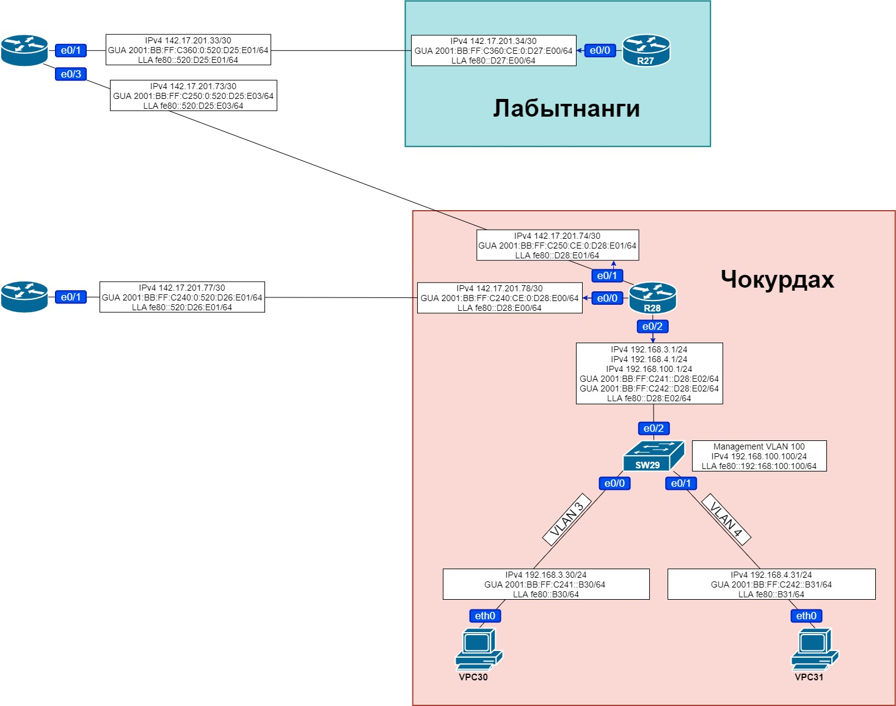
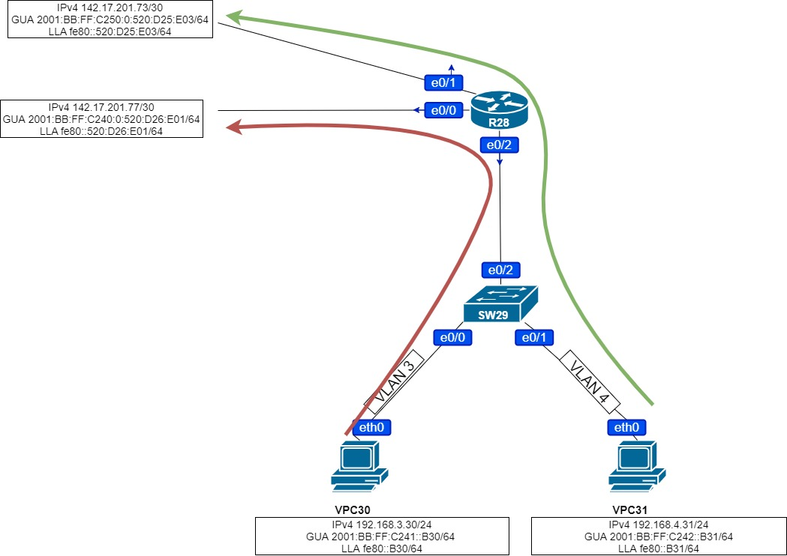

# Домашняя работа: настройка PBR

### Цели Чокурдах: 

#### Настроить политику маршрутизации для сетей офиса

#### Распределить трафик между двумя линками с провайдером

#### Настроить отслеживание линка через технологию IP SLA


### Цели Лабытнанги:

#### Настроить маршрут по-умолчанию


### Схема сети:




### Настройка PBR:




Создадим необходимые для реализации PBR ACL на R28:

```
R28(config)#ip access-list standard VLAN3
R28(config-std-nacl)#permit 192.168.3.0 0.0.0.255
R28(config)#ip access-list standard VLAN4
R28(config-std-nacl)#permit 192.168.4.0 0.0.0.255
```

 Создадим необходимый route-map на R28:

```
R28(config)#route-map PBR permit 10
R28(config-route-map)#match ip address VLAN3
R28(config-route-map)#set ip next-hop 142.17.201.77
R28(config)#route-map PBR permit 20
R28(config-route-map)#match ip address VLAN4
R28(config-route-map)#set ip next-hop 142.17.201.73
R28(config)#route-map PBR permit 30
```

Привяжем route-map к подъинтерфейсам R28:

```
R28(config)#interface Ethernet0/2.1
R28(config-int)#ip policy route-map PBR
R28(config)#interface Ethernet0/2.2
R28(config-int)#ip policy route-map PBR
```

Для проверки будем использовать роутер R27 в Лабытнангах, настроим для этого маршруты и выполним задачу для офиса Лабытнангов:

```
R27(config)#ip route 0.0.0.0 0.0.0.0 142.17.201.33
R27(config)#ipv6 route ::0/0 2001:BB:FF:C360:0:520:D25:E01
```

Так же пропишем маршрут до R27 на роутере провайдера:

```
R26(config)#ip route 142.17.201.32 255.255.255.252 10.130.2.25
R26(config)#ipv6 route 2001:BB:FF:C360::0/64 2001:BB:FF:A130:0:520:D25:E02
```

Так же для проверки пропишем маршруты до сетей хостов VPC30 и VPC31:

```
R26(config)#ip route 192.168.3.0 255.255.255.0 142.17.201.78
R26(config)#ip route 192.168.4.0 255.255.255.0 142.17.201.78
```

```
R25(config)#ip route 192.168.3.0 255.255.255.0 142.17.201.74
R25(config)#ip route 192.168.4.0 255.255.255.0 142.17.201.74
```

Пропишем маршруты по-умолчанию и проверим пинг с роутера R28 на роутер R27:

```
R28(config)#ip route 0.0.0.0 0.0.0.0 142.17.201.73
R28(config)#ip route 0.0.0.0 0.0.0.0 142.17.201.77
```

```
R28#ping 142.17.201.34
Type escape sequence to abort.
Sending 5, 100-byte ICMP Echos to 142.17.201.34, timeout is 2 seconds:
!!!!!
Success rate is 100 percent (5/5), round-trip min/avg/max = 1/1/2 ms
```

Проверим пинг с хостов VPC30 и VPC31:

```
VPCS> ping 142.17.201.34

84 bytes from 142.17.201.34 icmp_seq=1 ttl=253 time=1.793 ms
84 bytes from 142.17.201.34 icmp_seq=2 ttl=253 time=1.549 ms
84 bytes from 142.17.201.34 icmp_seq=3 ttl=253 time=1.180 ms
84 bytes from 142.17.201.34 icmp_seq=4 ttl=253 time=1.084 ms
84 bytes from 142.17.201.34 icmp_seq=5 ttl=253 time=1.190 ms
```

```
VPCS>  ping 142.17.201.34

84 bytes from 142.17.201.34 icmp_seq=1 ttl=253 time=1.780 ms
84 bytes from 142.17.201.34 icmp_seq=2 ttl=253 time=1.760 ms
84 bytes from 142.17.201.34 icmp_seq=3 ttl=253 time=1.110 ms
84 bytes from 142.17.201.34 icmp_seq=4 ttl=253 time=1.538 ms
84 bytes from 142.17.201.34 icmp_seq=5 ttl=253 time=0.989 ms
```

Сделаем трассировку:

```
VPCS> trace 142.17.201.34
trace to 142.17.201.34, 8 hops max, press Ctrl+C to stop
 1   192.168.3.1   1.769 ms  0.520 ms  0.542 ms
 2   142.17.201.77   0.968 ms  0.659 ms  0.729 ms
 3   10.130.2.25   1.130 ms  0.714 ms  0.887 ms
 4   *142.17.201.34   1.482 ms (ICMP type:3, code:3, Destination port unreachable)  *
```

```
VPCS> trace 142.17.201.34
trace to 142.17.201.34, 8 hops max, press Ctrl+C to stop
 1   192.168.4.1   1.393 ms  0.439 ms  0.453 ms
 2   142.17.201.73   1.003 ms  0.567 ms  0.646 ms
 3   *142.17.201.34   1.738 ms (ICMP type:3, code:3, Destination port unreachable)  *
```

Статистика работы route-map:

```
R28#sh route-map PBR
route-map PBR, permit, sequence 10
  Match clauses:
    ip address (access-lists): VLAN3
  Set clauses:
    ip next-hop 142.17.201.77
  Policy routing matches: 17 packets, 1818 bytes
route-map PBR, permit, sequence 20
  Match clauses:
    ip address (access-lists): VLAN4
  Set clauses:
    ip next-hop 142.17.201.73
  Policy routing matches: 32 packets, 3444 bytes
```

**Как мы видим трафик распределяется по линкам так как мы и задумывали.**


#### Настройка IP SLA

Настроим отслеживание линков используя IP SLA:

```
R28(config)#ip sla 1
R28(config-ip-sla)#icmp-echo 142.17.201.73 source-interface e0/1
R28(config-ip-sla-echo)#frequency 5
R28(config-ip-sla-echo)#ip sla schedule 1 life forever start-time now
R28(config)#ip sla 2
R28(config-ip-sla)#icmp-echo 142.17.201.77 source-interface e0/0
R28(config-ip-sla-echo)#frequency 5
R28(config-ip-sla-echo)#ip sla schedule 2 life forever start-time now
```

Проверим работу IP SLA:

```
R28#show Ip sla statistics
IPSLAs Latest Operation Statistics

IPSLA operation id: 1
        Latest RTT: 1 milliseconds
Latest operation start time: 16:55:22 EET Sun Feb 7 2021
Latest operation return code: OK
Number of successes: 34
Number of failures: 0
Operation time to live: Forever

IPSLA operation id: 2
        Latest RTT: 2 milliseconds
Latest operation start time: 16:55:21 EET Sun Feb 7 2021
Latest operation return code: OK
Number of successes: 22
Number of failures: 0
Operation time to live: Forever
```

Линки провайдера отслеживаются.

#### Настройка Track

```
R28(config)#track 1 ip sla 1 reachability
R28(config)#track 2 ip sla 2 reachability
```

Добавим контроль маршрутов по умолчанию:

```
R28(config)#ip route 0.0.0.0 0.0.0.0 142.17.201.73 track 1
R28(config)#ip route 0.0.0.0 0.0.0.0 142.17.201.77 track 2
```

Изменим конфигурацию route-map:

```
R28(config)#route-map PBR permit 10
R28(config-route-map)#no set ip next-hop 142.17.201.77
R28(config-route-map)#set ip next-hop verify-availability 142.17.201.77 10 track 2
R28(config-route-map)#route-map PBR permit 20
R28(config-route-map)#no set ip next-hop 142.17.201.73
R28(config-route-map)#set ip next-hop verify-availability 142.17.201.73 10 track 1
```

Проверим конфигурацию PBR:

```
R28#sh run | s route-map
 ip policy route-map PBR
 ip policy route-map PBR
route-map PBR permit 10
 match ip address VLAN3
 set ip next-hop verify-availability 142.17.201.77 10 track 2
route-map PBR permit 20
 match ip address VLAN4
 set ip next-hop verify-availability 142.17.201.73 20 track 1
route-map PBR permit 30
```

```
R28#sh route-map
route-map PBR, permit, sequence 10
  Match clauses:
    ip address (access-lists): VLAN3
  Set clauses:
    ip next-hop verify-availability 142.17.201.77 10 track 2  [up]
  Policy routing matches: 17 packets, 1818 bytes
route-map PBR, permit, sequence 20
  Match clauses:
    ip address (access-lists): VLAN4
  Set clauses:
    ip next-hop verify-availability 142.17.201.73 20 track 1  [up]
  Policy routing matches: 32 packets, 3444 bytes
route-map PBR, permit, sequence 30
  Match clauses:
  Set clauses:
  Policy routing matches: 0 packets, 0 bytes
```

Выполним трассировку для проверки работоспособности:

**VPC30**

```
VPCS> trace 142.17.201.34
trace to 142.17.201.34, 8 hops max, press Ctrl+C to stop
 1   192.168.3.1   0.510 ms  0.358 ms  0.442 ms
 2   142.17.201.77   0.609 ms  0.691 ms  0.497 ms
 3   10.130.2.25   1.024 ms  0.741 ms  0.592 ms
 4   *142.17.201.34   1.457 ms (ICMP type:3, code:3, Destination port unreachable)  *
```

**VPC31**

```
VPCS> trace 142.17.201.34
trace to 142.17.201.34, 8 hops max, press Ctrl+C to stop
 1   192.168.4.1   0.849 ms  0.584 ms  0.609 ms
 2   142.17.201.73   1.156 ms  0.692 ms  0.714 ms
 3   *142.17.201.34   1.552 ms (ICMP type:3, code:3, Destination port unreachable)  *
```

Отключим один из интерфейсов провайдера: 

```
R26(config)#int e0/1
R26(config-if)#shutdown
```

Проверим трассировку:

**VPC30**

```
VPCS> trace 142.17.201.34
trace to 142.17.201.34, 8 hops max, press Ctrl+C to stop
 1   192.168.3.1   0.503 ms  0.452 ms  0.450 ms
 2   142.17.201.73   0.746 ms  0.537 ms  0.681 ms
 3   *142.17.201.34   1.231 ms (ICMP type:3, code:3, Destination port unreachable)  *
```

**VPC31**

```
VPCS> trace 142.17.201.34
trace to 142.17.201.34, 8 hops max, press Ctrl+C to stop
 1   192.168.4.1   0.477 ms  0.619 ms  0.621 ms
 2   142.17.201.73   0.741 ms  0.551 ms  0.628 ms
 3   *142.17.201.34   1.390 ms (ICMP type:3, code:3, Destination port unreachable)  *
```

Проверим route-map:

```
R28#sh route-map
route-map PBR, permit, sequence 10
  Match clauses:
    ip address (access-lists): VLAN3
  Set clauses:
    ip next-hop verify-availability 142.17.201.77 10 track 2  [down]
  Policy routing matches: 110 packets, 11988 bytes
route-map PBR, permit, sequence 20
  Match clauses:
    ip address (access-lists): VLAN4
  Set clauses:
    ip next-hop verify-availability 142.17.201.73 20 track 1  [up]
  Policy routing matches: 80 packets, 8676 bytes
route-map PBR, permit, sequence 30
  Match clauses:
  Set clauses:
  Policy routing matches: 0 packets, 0 bytes
```

**Переключение трафика при недоступности линка работает.**