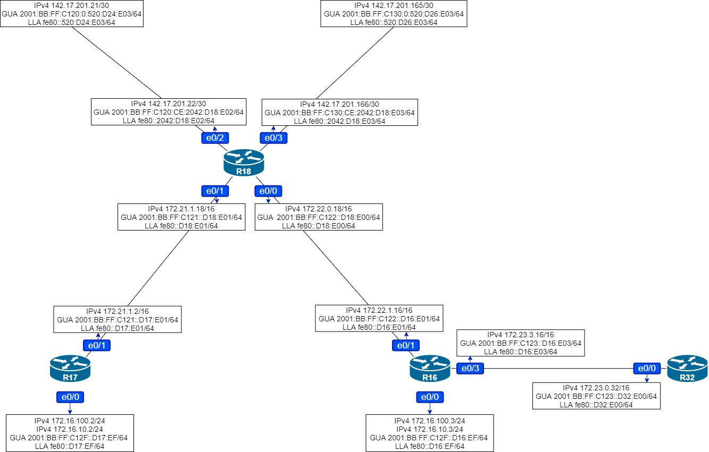

# Домашняя работа: настройка iBGP

### Цель: Настроить iBGP в офисе Москва

### Настроить iBGP в сети провайдера Триада

### Организовать полную IP связанность всех сетей


- #### Настроить iBGP в офисе Москва между маршрутизаторами R14 и R15

- #### Настроить iBGP в провайдере Триада

- #### Настроить офис Москва так, чтобы приоритетным провайдером стал Ламас

- #### Настроить офис С.-Петербург так, чтобы трафик до любого офиса распределялся по двум линкам одновременно

- #### Все сети в лабораторной работе должны иметь IP связность


### Настроим iBGP между маршрутизаторами R14  и R15:


**Поднимем loopback интерфейсы и включим их в процесс OSPF:**

```
R14(config)#int lo0
R14(config-if)#ip address 10.111.111.111 255.255.255.255
R14(config-if)#ip ospf 1 area 0
R14(config-if)#ipv6 address 2001:BB:FF:C20:111:111:111:111/128
R14(config-if)#ipv6 ospf 1 area 0
```

```
R15(config)#int lo0
R15(config-if)#ip address 10.222.222.222 255.255.255.255
R15(config-if)#ip ospf 1 area 0
R15(config-if)#ipv6 address 2001:BB:FF:C20:222:222:222:222/128
R15(config-if)#ipv6 ospf 1 area 0
```

**Настроим iBGP:**

```
R14(config)#router bgp 1001
R14(config-router)#neighbor 10.222.222.222 remote-as 1001
R14(config-router)#neighbor 10.222.222.222 update-source lo0
R14(config-router)#neighbor 2001:BB:FF:C20:222:222:222:222 remote-as 1001
R14(config-router)#neighbor 2001:BB:FF:C20:222:222:222:222 update-source lo0
R14(config-router)#address-family ipv6
R14(config-router-af)#neighbor 2001:BB:FF:C20:222:222:222:222 activate
```

```
R15(config)#router bgp 1001
R15(config-router)#neighbor 10.111.111.111 remote-as 1001
R15(config-router)#neighbor 10.111.111.111 update-source lo0
R15(config-router)#neighbor 2001:BB:FF:C20:111:111:111:111 remote-as 1001
15(config-router)#neighbor 2001:BB:FF:C20:111:111:111:111 update-source lo0
R15(config-router)#address-family ipv6
R15(config-router-af)#neighbor 2001:BB:FF:C20:111:111:111:111 activate
```


### Настроим iBGP в провайдере Триада


```
R24(config)#int lo0
R24(config-if)#ip address 10.24.24.24 255.255.255.255
R24(config-if)#ipv6 address 2001:BB:FF:AA:24:24:24:24/128
R24(config-if)#ip router isis
R24(config)#router bgp 520
R24(config-router)#neighbor 10.23.23.23 remote-as 520
R24(config-router)#neighbor 10.25.25.25 remote-as 520
R24(config-router)#neighbor 10.26.26.26 remote-as 520
R24(config-router)#neighbor 10.23.23.23 update-source lo0
R24(config-router)#neighbor 10.25.25.25 update-source lo0
R24(config-router)#neighbor 10.26.26.26 update-source lo0
R24(config-router)#neighbor 2001:BB:FF:AA:23:23:23:23 remote-as 520
R24(config-router)#neighbor 2001:BB:FF:AA:25:25:25:25 remote-as 520
R24(config-router)#neighbor 2001:BB:FF:AA:26:26:26:26 remote-as 520
R24(config-router)#neighbor 2001:BB:FF:AA:23:23:23:23 update-source lo0
R24(config-router)#neighbor 2001:BB:FF:AA:25:25:25:25 update-source lo0
R24(config-router)#neighbor 2001:BB:FF:AA:26:26:26:26 update-source lo0
R24(config-router)#address-family ipv6
R24(config-router-af)#neighbor 2001:BB:FF:AA:26:26:26:26 activate
R24(config-router-af)#neighbor 2001:BB:FF:AA:25:25:25:25 activate
R24(config-router-af)#neighbor 2001:BB:FF:AA:23:23:23:23 activate
```

```
R23(config)#int lo0
R23(config-if)#ip address 10.23.23.23 255.255.255.255
R23(config-if)#ipv6 address 2001:BB:FF:AA:23:23:23:23/128
R23(config-if)#ip router isis
R23(config)#router bgp 520
R23(config-router)#neighbor 10.24.24.24 remote-as 520
R23(config-router)#neighbor 10.25.25.25 remote-as 520
R23(config-router)#neighbor 10.26.26.26 remote-as 520
R23(config-router)#neighbor 10.24.24.24 update-source lo0
R23(config-router)#neighbor 10.25.25.25 update-source lo0
R23(config-router)#neighbor 10.26.26.26 update-source lo0
R23(config-router)#neighbor 2001:BB:FF:AA:24:24:24:24 remote-as 520
R23(config-router)#neighbor 2001:BB:FF:AA:25:25:25:25 remote-as 520
R23(config-router)#neighbor 2001:BB:FF:AA:26:26:26:26 remote-as 520
R23(config-router)#neighbor 2001:BB:FF:AA:24:24:24:24 update-source lo0
R23(config-router)#neighbor 2001:BB:FF:AA:25:25:25:25 update-source lo0
R23(config-router)#neighbor 2001:BB:FF:AA:26:26:26:26 update-source lo0
R23(config-router)#address-family ipv6
R23(config-router-af)#neighbor 2001:BB:FF:AA:26:26:26:26 activate
R23(config-router-af)#neighbor 2001:BB:FF:AA:25:25:25:25 activate
R23(config-router-af)#neighbor 2001:BB:FF:AA:24:24:24:24 activate
```

```
R25(config)#int lo0
R25(config-if)#ip address 10.25.25.25 255.255.255.255
R25(config-if)#ipv6 address 2001:BB:FF:AA:25:25:25:25/128
R25(config-if)#ip router isis
R25(config)#router bgp 520
R25(config-router)#neighbor 10.23.23.23 remote-as 520
R25(config-router)#neighbor 10.24.24.24 remote-as 520
R25(config-router)#neighbor 10.26.26.26 remote-as 520
R25(config-router)#neighbor 10.23.23.23 update-source lo0
R25(config-router)#neighbor 10.24.24.24 update-source lo0
R25(config-router)#neighbor 10.26.26.26 update-source lo0
R25(config-router)#neighbor 2001:BB:FF:AA:24:24:24:24 remote-as 520
R25(config-router)#neighbor 2001:BB:FF:AA:26:26:26:26 remote-as 520
R25(config-router)#neighbor 2001:BB:FF:AA:23:23:23:23 remote-as 520
R25(config-router)#neighbor 2001:BB:FF:AA:24:24:24:24 update-source lo0
R25(config-router)#neighbor 2001:BB:FF:AA:26:26:26:26 update-source lo0
R25(config-router)#neighbor 2001:BB:FF:AA:23:23:23:23 update-source lo0
R25(config-router)#address-family ipv6
R25(config-router-af)#neighbor 2001:BB:FF:AA:24:24:24:24 activate
R25(config-router-af)#neighbor 2001:BB:FF:AA:23:23:23:23 activate
R25(config-router-af)#neighbor 2001:BB:FF:AA:26:26:26:26 activate
```

```
R26(config)#int lo0
R26(config-if)#ip address 10.26.26.26 255.255.255.255
R26(config-if)#ipv6 address 2001:BB:FF:AA:26:26:26:26/128
R26(config-if)#ip router isis
R26(config)#router bgp 520
R26(config-router)#neighbor 10.23.23.23 remote-as 520
R26(config-router)#neighbor 10.24.24.24 remote-as 520
R26(config-router)#neighbor 10.25.25.25 remote-as 520
R26(config-router)#neighbor 10.23.23.23 update-source lo0
R26(config-router)#neighbor 10.24.24.24 update-source lo0
R26(config-router)#neighbor 10.25.25.25 update-source lo0
R26(config-router)#neighbor 2001:BB:FF:AA:23:23:23:23 remote-as 520
R26(config-router)#neighbor 2001:BB:FF:AA:24:24:24:24 remote-as 520
R26(config-router)#neighbor 2001:BB:FF:AA:25:25:25:25 remote-as 520
R26(config-router)#neighbor 2001:BB:FF:AA:23:23:23:23 update-source lo0
R26(config-router)#neighbor 2001:BB:FF:AA:24:24:24:24 update-source lo0
R26(config-router)#neighbor 2001:BB:FF:AA:25:25:25:25 update-source lo0
R26(config-router)#address-family ipv6
R26(config-router-af)#neighbor 2001:BB:FF:AA:23:23:23:23 activate
R26(config-router-af)#neighbor 2001:BB:FF:AA:24:24:24:24 activate
R26(config-router-af)#neighbor 2001:BB:FF:AA:25:25:25:25 activate
```


### Настроим роутеры в офисе Москва так что бы приоритетным провайдером стал Ламас:


```
R15(config)#router bgp 1001
R15(config-router)# bgp default local-preference 200
R15(config-router)#address-family ipv4
R15(config-router-af)# neighbor 10.111.111.111 next-hop-self
R15(config-router)#address-family ipv6
R15(config-router-af)#neighbor 2001:BB:FF:C20:111:111:111:111 next-hop-self
R15#clear ip bgp * all soft
```

Проверим:

```
R14#trace 142.17.201.34 source 108.42.15.214
Type escape sequence to abort.
Tracing the route to 142.17.201.34
VRF info: (vrf in name/id, vrf out name/id)
  1 10.15.2.12 1 msec
    10.14.3.13 1 msec
    10.15.2.12 0 msec
  2 10.12.0.15 1 msec
    10.13.1.15 1 msec
    10.12.0.15 0 msec
  3 108.42.2.153 1 msec 0 msec 1 msec
  4 108.42.1.106 [AS 301] 0 msec 0 msec 1 msec
  5 10.120.0.26 1 msec 1 msec 1 msec
  6 10.130.2.25 1 msec 0 msec 1 msec
  7 142.17.201.34 [AS 520] 2 msec *  2 msec
```

```
R19>trace 2001:BB:FF:E6:0:520:D24:E00
Type escape sequence to abort.
Tracing the route to 2001:BB:FF:E6:0:520:D24:E00

  1 2001:BB:FF:C16::D14:E03 19 msec 0 msec 0 msec
  2 2001:BB:FF:C14::D13:E03 1 msec 0 msec 0 msec
  3 2001:BB:FF:C12::D15:E00 1 msec 0 msec 1 msec
  4 2001:BB:FF:C50:0:301:D21:E00 1 msec 1 msec 1 msec
  5 2001:BB:FF:E5:0:101:D22:E01 1 msec 1 msec 0 msec
  6 2001:BB:FF:E6:0:520:D24:E00 1 msec 0 msec 1 msec
```


### Настроим офис Санкт-Петербург чтобы трафик распределялся по 2 линкам:



```
R18(config)#router bgp 2042
R18(config-router)#address-family ipv4
R18(config-router-af)#maximum-paths 2 
R18(config-router-af)#address-family ipv6
R18(config-router-af)#maximum-paths 2 
```

**Проверим:**

```
R18#trace 2001:BB:FF:A140:0:520:D25:E00
Type escape sequence to abort.
Tracing the route to 2001:BB:FF:A140:0:520:D25:E00

  1 2001:BB:FF:C120:0:520:D24:E03 1 msec
    2001:BB:FF:C130:0:520:D26:E03 1 msec
    2001:BB:FF:C120:0:520:D24:E03 0 msec
  2 2001:BB:FF:A130:0:520:D25:E02 [AS 520] 1 msec
    2001:BB:FF:A110:0:520:D23:E02 1 msec
    2001:BB:FF:A130:0:520:D25:E02 1 msec
```

```
R18#trace 108.42.14.9
Type escape sequence to abort.
Tracing the route to 108.42.14.9
VRF info: (vrf in name/id, vrf out name/id)
  1 142.17.201.165 1 msec
    142.17.201.21 1 msec
    142.17.201.165 0 msec
  2 10.110.2.23 1 msec
    10.120.1.24 0 msec
    10.110.2.23 0 msec
  3 10.110.2.23 1 msec
    108.42.14.9 [AS 520] 1 msec
    10.110.2.23 0 msec
```

```
R18>trace 2001:BB:FF:C360:CE:0:D27:E00
Type escape sequence to abort.
Tracing the route to 2001:BB:FF:C360:CE:0:D27:E00

  1 2001:BB:FF:C130:0:520:D26:E03 1 msec
    2001:BB:FF:C120:0:520:D24:E03 1 msec
    2001:BB:FF:C130:0:520:D26:E03 0 msec
  2 2001:BB:FF:A120:0:520:D26:E00 [AS 520] 1 msec
    2001:BB:FF:A130:0:520:D25:E02 0 msec
    2001:BB:FF:A120:0:520:D26:E00 10 msec
  3 2001:BB:FF:C360:CE:0:D27:E00 36 msec
    2001:BB:FF:A130:0:520:D25:E02 1 msec
    2001:BB:FF:C360:CE:0:D27:E00 1 msec
```

